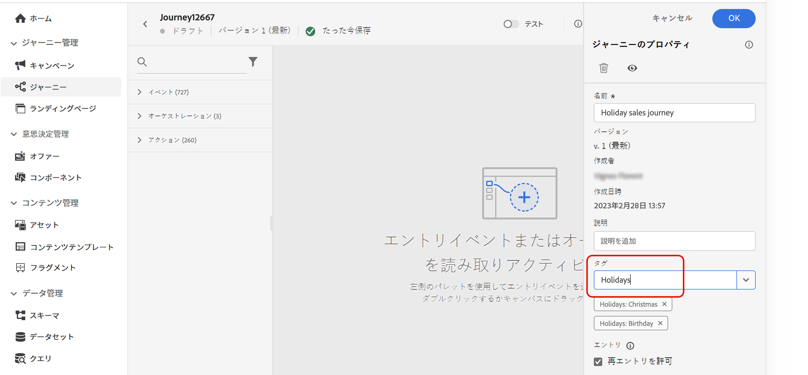
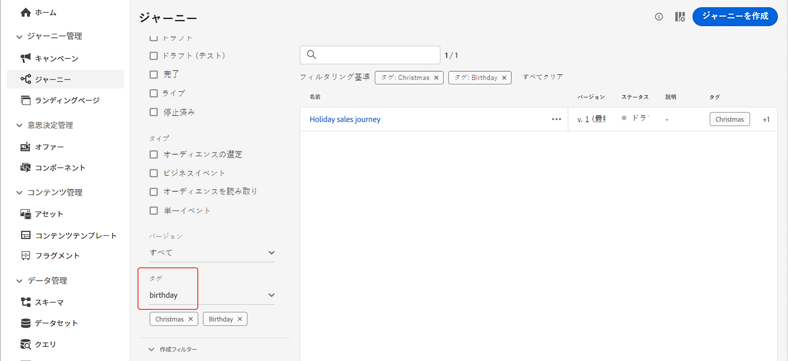
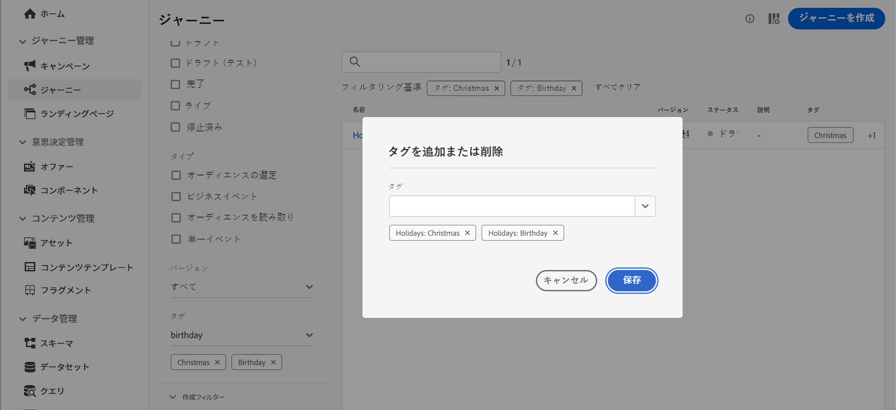

# ジャーニーでのタグの管理 {#journey_tags}

Journey Optimizer の実務担当者は、タグを使用してジャーニーを整理できます。タグを使用すると、オブジェクトをすばやく簡単に分類でき、検索が改善されます。

## タグと命名規則 {#tags-vs-naming}

チームは多くの場合、複雑な命名規則に依存して、メタデータをジャーニー名に直接保存します。例：*ライフサイクルマーケティング – 教育 – カスタマーオンボーディング V2 - アプリ教育 – 2025 年第 3 四半期*。 このアプローチには意図的なものもありますが、主な弱点があります。チームメンバー間で作業が拡大するにつれて、規則が一貫して適用されることはほとんどなく、ジャーニーリストをナビゲートするのが難しくなります。

Journey Optimizerの **タグカテゴリ** の方が、より優れた代替手段となります。 名前にメタデータをエンコードする代わりに、各ジャーニー（チーム、目的、フェーズ、四半期など）に分類されたタグを添付し、フィルターを使用して見つけます。 その後、ジャーニー名は、実際に重要なことに集中することができます。つまり、お客様のマイルストーンが推進されることになります。

タグカテゴリの命名規則よりもメリットは次のとおりです。

* **一貫性** - タグは、自由に入力されるのではなく、制御されたリストから選択されます。
* **フィルタリング可能性** - タグ値の任意の組み合わせを使用して、ジャーニーリストを即座にスライスできます。
* **明確さ** - ジャーニー名は、マイルストーンに焦点を当てた短い名前のままです。
* **スケーラビリティ** – 新しいメタデータディメンションの追加は、命名規則を書き換えるのではなく、新しいタグカテゴリを作成することを意味します。

推奨されるセットアップワークフローについては、以下の [ ジャーニー管理用のタグカテゴリの設定 ](#tags-setup) を参照してください。

## ジャーニーへのタグの追加

「**タグ**」フィールドを使用すると、ジャーニープロパティでジャーニーのタグを定義できます。 既存のタグを選択することも、新しいタグを作成することもできます。目的のタグ名の入力を開始し、リストから選択します。 使用できない場合は、「**作成**」をクリックして、新しいタグを作成し、ジャーニーに追加します。 必要な数だけタグを定義できます。

定義したタグのリストは、「**タグ**」フィールドの下に表示されます。

>[!NOTE]
>
> タグでは大文字と小文字が区別されます
> 
> ジャーニーの新しいバージョンを複製または作成した場合、タグは保持されます。

## タグに関するフィルタリング

ジャーニーリストに専用の列が表示されるので、タグを簡単に視覚化できます。

また、フィルターは、特定のタグを持つジャーニーのみを表示する場合にも使用できます。

任意のタイプのジャーニー（ライブ、ドラフトなど）のタグを追加または削除できます。 ジャーニーの横にある「**その他のアクション**」アイコンをクリックし、「**タグを編集**」を選択します。 

## タグの管理

管理者は、「**管理**」の下の&#x200B;**タグ**&#x200B;メニューを使用して、タグを削除し、カテゴリ別に整理できます。この[ドキュメント](https://experienceleague.adobe.com/docs/experience-platform/administrative-tags/overview.html?lang=ja)を参照してください。

>[!NOTE]
>
> ジャーニーで定義されたタグは、ビルトインの「未分類」カテゴリに追加されます。

## ジャーニー管理のタグカテゴリの設定 {#tags-setup}

次の手順に従って、チーム全体で複雑な命名規則をタグベースのアプローチに置き換えます。

**手順 1 - タグカテゴリの作成（管理者）**

**[!UICONTROL 管理]**/**[!UICONTROL タグ]** で、チームが現在ジャーニー名でエンコードしているメタデータ属性ごとに 1 つのカテゴリを作成します。例：*チーム*、*マーケティング目標*、*キャンペーン*、*フェーズ*、*四半期*。

**手順 2 – 各カテゴリにタグ値を入力する（管理者）**

各カテゴリ内で、可能なすべての値を表すタグを作成します。 例えば、*フェーズ* カテゴリには、*認識*、*オンボーディング*、*定着*、*勝利 – 戻り* が含まれる場合があります。

**手順 3 - ジャーニーを作成する際のタグの適用（実務担当者）**

新しいジャーニーを作成するたびに、ジャーニープロパティの各カテゴリから適切なタグを選択します。 通常、ジャーニーにはカテゴリごとに 1 つのタグが付きます。

**手順 4 - マイルストーンのジャーニーに名前を付け、タグでフィルタリングする**

ジャーニー名は、推進する顧客マイルストーン（*最初のロイヤルティトランザクション* など）に焦点を当ててください。 ジャーニーリストでタグフィルターを使用し、メタデータの任意の組み合わせでジャーニーを見つけます。名前の解析には依存しません。

>[!TIP]
>
>このアプローチとその利点について詳しくは、[Journey Optimizerの高度なジャーニーのベストプラクティス ](https://experienceleague.adobe.com/en/perspectives/best-practices-for-advanced-journeys-in-journey-optimizer){target="_blank"} を参照してください。
