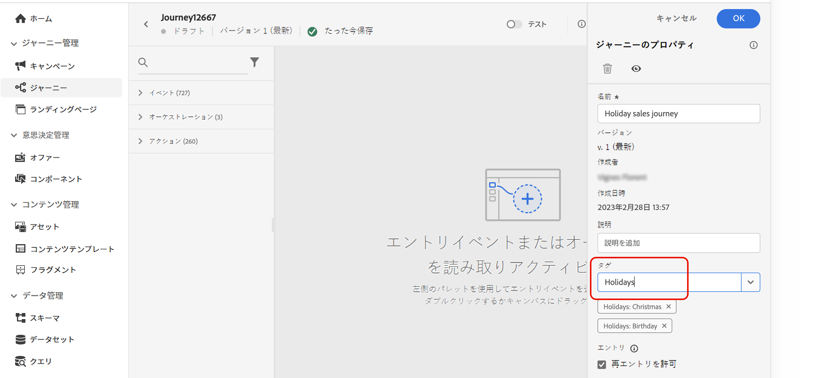
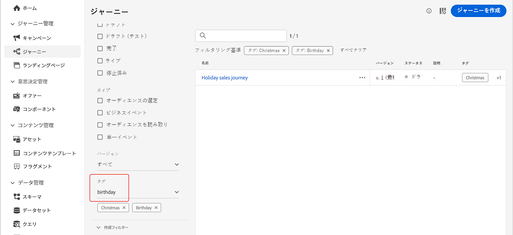
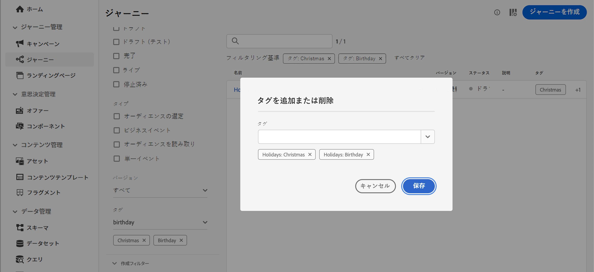

# ジャーニーでのタグの管理 {#journey_tags}

Journey Optimizer の実務担当者は、タグを使用してジャーニーを整理できます。 タグを使用すると、オブジェクトをすばやく簡単に分類でき、検索が改善されます。

## タグと命名規則 {#tags-vs-naming}

チームは、多くの場合、複雑な命名規則にもとづいてメタデータをジャーニー名に直接保存します。例：*ライフサイクルマーケティング – 教育 – 顧客オンボーディング V2 - アプリ教育 – 2025年第3四半期*。 このアプローチには意図的なものがある一方で、重要な欠点もあります。作業がチームメンバー間で拡大するにつれ、規則が一貫して適用されることはほとんどなく、ジャーニーリストがナビゲートしにくくなります。

Journey Optimizerの&#x200B;**タグカテゴリー**&#x200B;は、より優れた選択肢を提供します。 名前にメタデータをエンコードする代わりに、各ジャーニー（チーム、目標、フェーズ、四半期など）に分類されたタグを添付し、フィルターを使用してそれらを検索します。 そして、ジャーニー名は、顧客のマイルストーンの達成という、実際に重要な目標に集中することができます。

命名規則よりもタグカテゴリを使用する利点：

* **一貫性** — タグは制御されたリストから選択され、自由に入力されません。
* **フィルター可能性** — タグ値の任意の組み合わせを使用して、ジャーニーリストを即座にスライスできます。
* **明瞭度** — ジャーニー名は短く、マイルストーンに焦点を当てています。
* **スケーラビリティ** – 新しいメタデータディメンションを追加することは、命名規則を書き換えるのではなく、新しいタグカテゴリを作成することを意味します。

推奨される設定ワークフローについては、以下の「[&#x200B; ジャーニー管理用のタグカテゴリの設定](#tags-setup)」を参照してください。

## ジャーニーへのタグの追加

「**タグ**」フィールドを使用すると、ジャーニープロパティでジャーニーのタグを定義できます。 既存のタグを選択することも、新しいタグを作成することもできます。 目的のタグ名の入力を開始し、リストから選択します。 使用できない場合は、「**作成**」をクリックして、新しいタグを作成し、ジャーニーに追加します。 必要な数だけタグを定義できます。

定義したタグのリストは、「**タグ**」フィールドの下に表示されます。

>[!NOTE]
>
> タグでは大文字と小文字が区別されます
> 
> ジャーニーの新しいバージョンを複製または作成した場合、タグは保持されます。

## タグに関するフィルタリング

ジャーニーリストに専用の列が表示されるので、タグを簡単に視覚化できます。

また、フィルターは、特定のタグを持つジャーニーのみを表示する場合にも使用できます。

任意のタイプのジャーニー（ライブ、ドラフトなど）のタグを追加または削除できます。 ジャーニーの横にある「**その他のアクション**」アイコンをクリックし、「**タグを編集**」を選択します。

## タグの管理

管理者は、「**管理**」の下の&#x200B;**タグ**&#x200B;メニューを使用して、タグを削除し、カテゴリ別に整理できます。 この[ドキュメント](https://experienceleague.adobe.com/docs/experience-platform/administrative-tags/overview.html?lang=ja)を参照してください。

>[!NOTE]
>
> ジャーニーで定義されたタグは、ビルトインの「未分類」カテゴリに追加されます。

## ジャーニー管理用のタグカテゴリの設定 {#tags-setup}

チーム全体でタグベースのアプローチを使用して、複雑な命名規則を置き換えるには、次の手順に従います。

**手順1 — タグカテゴリの作成（管理者）**

**[!UICONTROL 管理]** > **[!UICONTROL タグ]**&#x200B;で、チームがジャーニー名で現在エンコードしているメタデータ属性ごとに1つのカテゴリを作成します（例：*チーム*、*マーケティング目標*、*キャンペーン*、*フェーズ*、*四半期*）。

**ステップ 2 — タグ値を各カテゴリに入力する（管理者）**

各カテゴリ内で、可能なすべての値を表すタグを作成します。 例えば、*フェーズ* カテゴリには、*認知*、*オンボーディング*、*維持*、*ウィンバック*&#x200B;が含まれる場合があります。

**ステップ 3 — ジャーニーの作成時にタグを適用する（実務担当者）**

新しいジャーニーを作成するたびに、ジャーニープロパティの各カテゴリから適切なタグを選択します。 ジャーニーでは通常、カテゴリーごとに1つのタグが付きます。

**ステップ 4 — マイルストーンのジャーニーに名前を付け、タグで絞り込む**

カスタマージャーニー名は、それが促進する顧客のマイルストーンに焦点を当てます（例：*最初のロイヤルティトランザクション*）。 ジャーニーリストでタグフィルターを使用して、名前解析に頼ることなく、メタデータの任意の組み合わせでジャーニーを検索できます。

>[!TIP]
>
>このアプローチとその大規模なメリットについて詳しくは、[Journey Optimizerの高度なジャーニーのベストプラクティス &#x200B;](https://experienceleague.adobe.com/en/perspectives/best-practices-for-advanced-journeys-in-journey-optimizer){target="_blank"}を参照してください。
