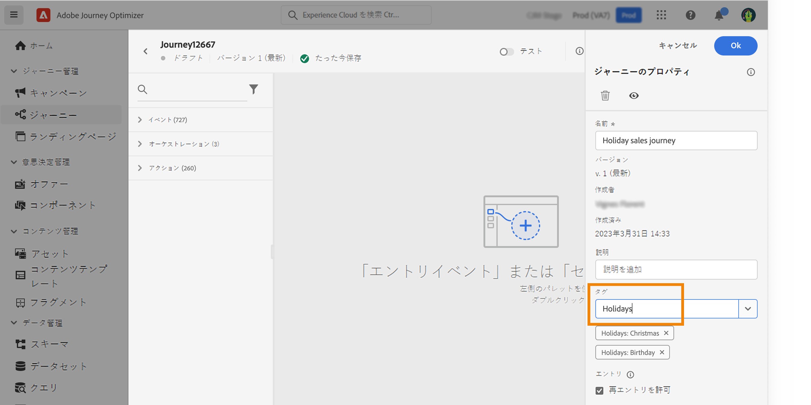

# ジャーニーでのタグの管理 {#journey_tags}

Journey Optimizer の実務担当者は、タグを使用してジャーニーを整理できます。タグを使用すると、オブジェクトをすばやく簡単に分類でき、検索が改善されます。

## ジャーニーへのタグの追加

「**タグ**」フィールドを使用すると、ジャーニープロパティでジャーニーのタグを定義できます。 既存のタグを選択することも、新しいタグを作成することもできます。目的のタグ名の入力を開始し、リストから選択します。 使用できない場合は、「**作成**」をクリックして、新しいタグを作成し、ジャーニーに追加します。 必要な数だけタグを定義できます。

定義したタグのリストは、「**タグ**」フィールドの下に表示されます。

>[!NOTE]
>
> タグでは大文字と小文字が区別されます
> 
> ジャーニーの新しいバージョンを複製または作成した場合、タグは保持されます。

## タグに対するフィルター

ジャーニーリストに専用の列が表示されるので、タグを簡単に視覚化できます。

また、フィルターは、特定のタグを持つジャーニーのみを表示する場合にも使用できます。

任意のタイプのジャーニー（ライブ、ドラフトなど）のタグを追加または削除できます。 ジャーニーの横にある「**その他のアクション**」アイコンをクリックし、「**タグを編集**」を選択します。 

## タグの管理

管理者は、「**管理**」の下の&#x200B;**タグ**&#x200B;メニューを使用して、タグを削除し、カテゴリ別に整理できます。この[ドキュメント](https://experienceleague.adobe.com/docs/experience-platform/administrative-tags/overview.html?lang=ja)を参照してください。

>[!NOTE]
>
> ジャーニーで定義されたタグは、ビルトインの「未分類」カテゴリに追加されます。
