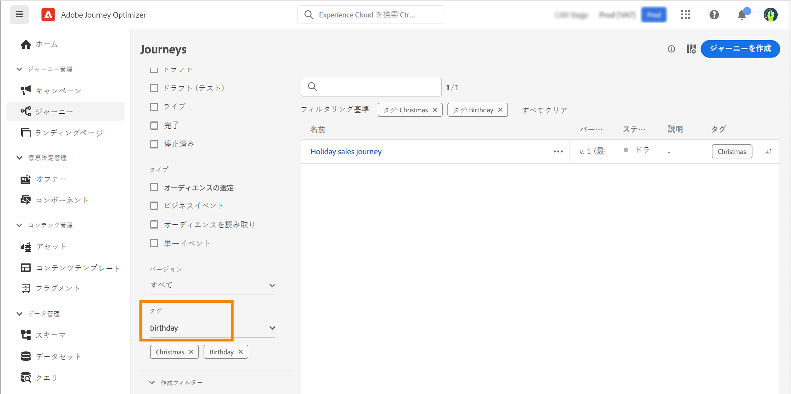
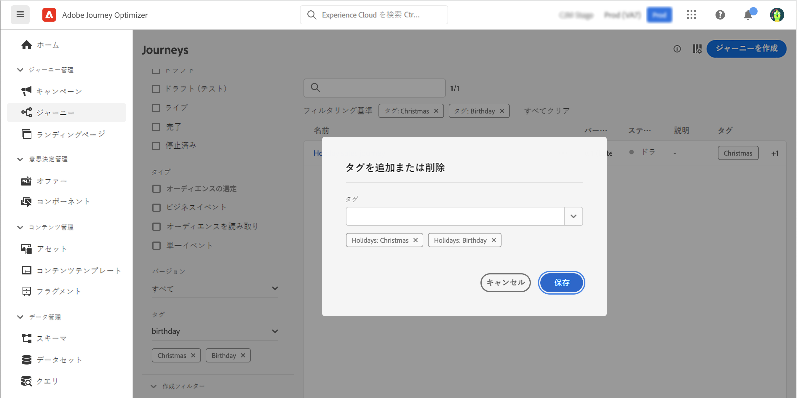

# ジャーニーでのタグの管理 {#journey_tags}

Journey Optimizerの実践者は、タグを使用してジャーニーを整理できます。 タグを使用すると、オブジェクトをすばやく簡単に分類して検索を改善できます。

>[!AVAILABILITY]
>
> 統合タグは現在ベータ版です。 ドキュメントと機能は変更される場合があります。

## ジャーニーへのタグの追加

この **タグ** 「 」フィールドを使用すると、ジャーニープロパティでジャーニーのタグを定義できます。 既存のタグを選択するか、新しいタグを作成できます。 目的のタグの名前の入力を開始し、リストから選択します。 使用できない場合は、 **作成** をクリックして、新しいものを作成し、ジャーニーに追加します。 タグは必要な数だけ定義できます。

定義したタグのリストは、 **タグ** フィールドに入力します。

>[!NOTE]
>
> タグでは大文字と小文字が区別されます
> 
> ジャーニーの新しいバージョンを複製または作成した場合、タグは保持されます。

## タグに対するフィルター

ジャーニーリストに専用の列が表示されるので、タグを簡単に視覚化できます。

また、フィルターは、特定のタグを持つジャーニーのみを表示する場合にも使用できます。

任意のタイプのジャーニー（ライブ、ドラフトなど）にタグを追加または削除できます。 次をクリック： **その他のアクション** ジャーニーの横のアイコンをクリックし、「 」を選択します。 **タグを編集**.

## タグの管理

管理者は、 **タグ** メニュー、[] **管理**. 詳しくは、 [ドキュメント](https://experienceleague.adobe.com/docs/experience-platform/administrative-tags/overview.html).

>[!NOTE]
>
> ジャーニーで定義されたタグは、組み込みの「未分類」カテゴリに追加されます。
