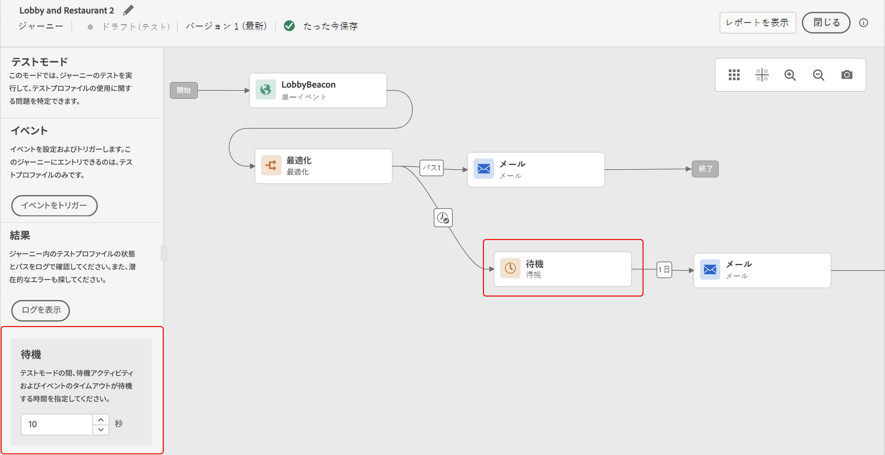
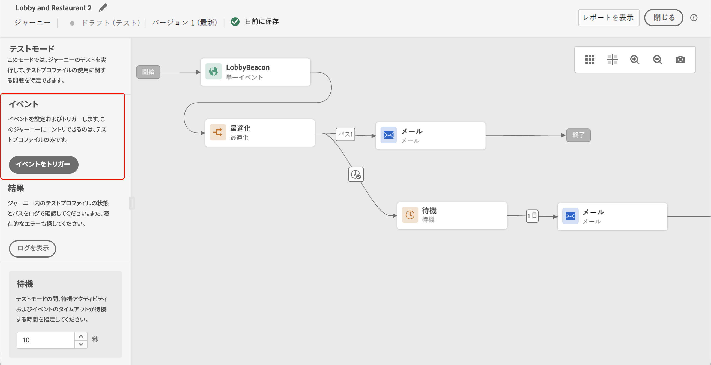
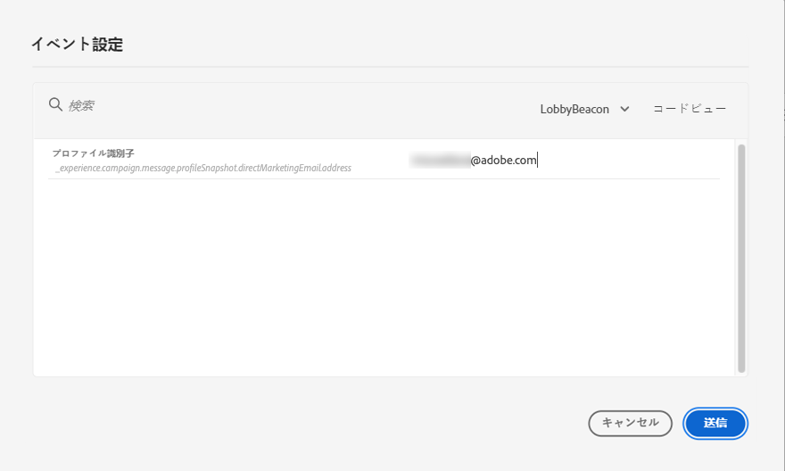
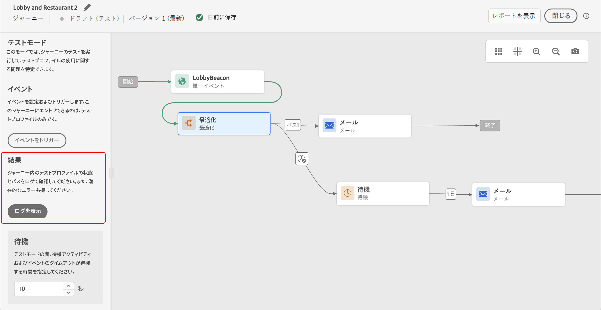
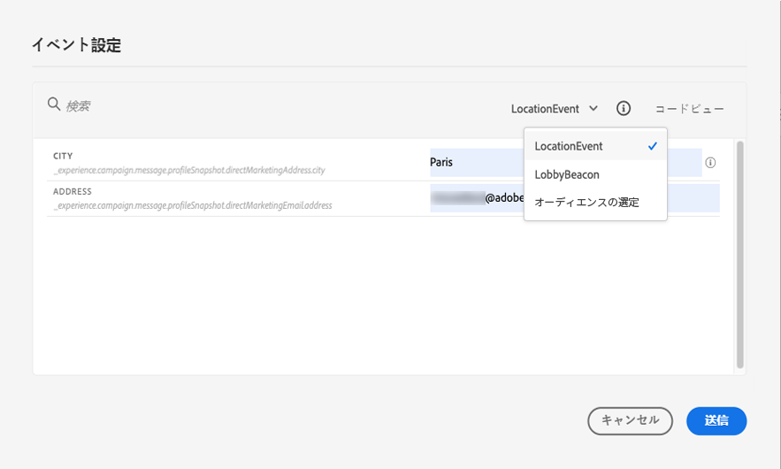
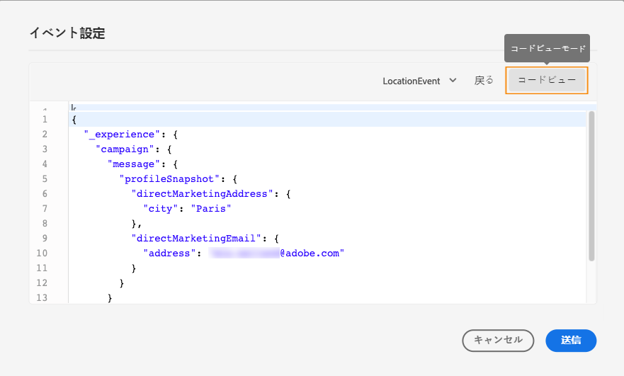
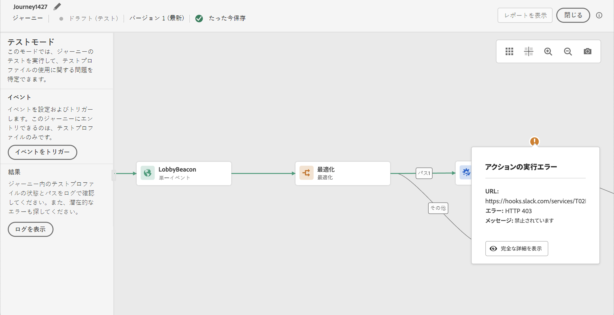
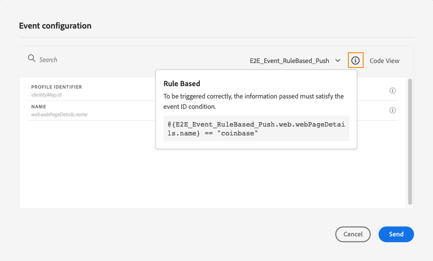
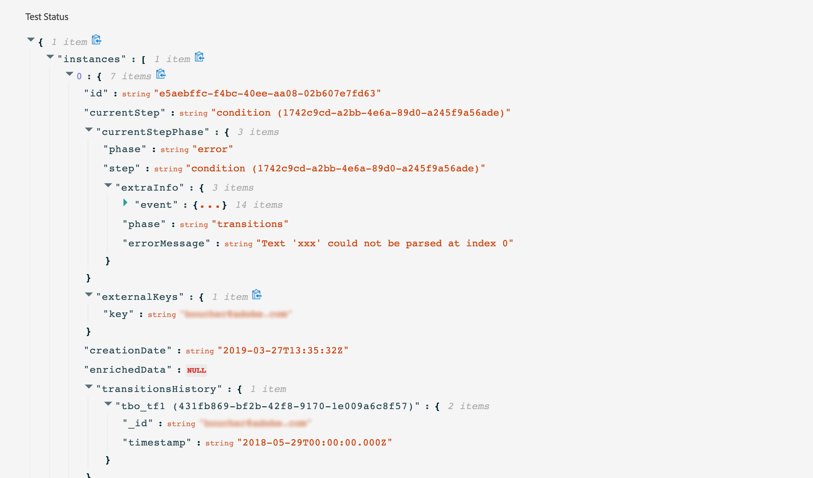

# ジャーニーのテスト{#testing_the_journey}

>[!BEGINSHADEBOX]

**このページ：** シミュレートされたユーザーを使用したシミュレーションや、テストプロファイルを使用したテストモードを使用して、ジャーニーを公開前に検証し、エラーを早期に検出する方法を説明します。

>[!ENDSHADEBOX]

>[!CONTEXTUALHELP]
>id="ajo_journey_test"
>title="ジャーニーをテスト"
>abstract="テストプロファイルを使用すると、公開前にジャーニーをテストできます。 これにより、公開前に、個人がジャーニー内をどのように移動するかを分析し、トラブルシューティングを行うことができます。"
>additional-url="https://experienceleague.adobe.com/ja/docs/journey-optimizer/using/orchestrate-journeys/create-journey/journey-dry-run" text="ジャーニーのドライラン"

ジャーニーを作成したら、公開する前にテストできます。 [!DNL Adobe Journey Optimizer]は、テストプロファイルをジャーニーに沿って移動する際に、アクティブ化する前に潜在的なエラーを検出する方法として、「テストモード」を提供しています。 クイックテストを実行すると、ジャーニーが正しく動作することを確認できるので、自信を持って公開できます。

テストモードでは、テストプロファイルのみがジャーニーにエントリできます。 新しいテストプロファイルを作成するか、既存のプロファイルをテストプロファイルに変換することができます。 テストプロファイルの詳細については、[この節](../audience/creating-test-profiles.md)を参照してください。

Adobeのジャーニーオプティマイザーには、ジャーニーをテストおよび検証する2つの方法があります。

* **[シミュレーション](simulate-journey.md#test-users)**: ジャーニーを&#x200B;**[!UICONTROL シミュレーション]**&#x200B;に設定し、シミュレートされたユーザー（Adobe Experience Platformで事前に作成されたプロファイルを使用せずに、その場で作成または生成できる一時的なプロファイル）を使用します。

* **[テストモード](#test-profiles)**：永続的なプロファイルが、Adobe Experience Platformでテストプロファイルとして明示的にフラグ付けされています。 複数のテストセッションで再利用できます。 この方法は、一貫した事前定義されたプロファイルデータを使用してテストする場合に推奨されます。 [テストプロファイルの作成方法の詳細情報](../audience/creating-test-profiles.md)。

>[!NOTE]
>
>ジャーニーをテストする前に、エラーが発生した場合はすべて解決する必要があります。 テストする前にエラーを確認する方法について詳しくは、[この節](../building-journeys/troubleshooting.md)を参照してください。 テストモードでテストプロファイルの進行に失敗した場合は、[テストモードの移行のトラブルシューティング](troubleshooting-execution.md#troubleshooting-test-transitions)を参照してください。

## 重要な注意事項 {#important_notes}

ジャーニーでテストを実行する前に、これらのメモを確認してください。

### 一般的な制限事項

* **テストプロファイルのみ** - リアルタイム顧客プロファイルサービスで「テストプロファイル」としてフラグ付けされた個人のみがテストモードでジャーニーにエントリできます。 [テストプロファイルの作成方法の詳細情報](../audience/creating-test-profiles.md)。
* **名前空間要件** - テストモードは、名前空間を使用するドラフトジャーニーでのみ使用できます。 テストモードでは、ジャーニーにエントリするユーザーがテストプロファイルであるかどうかを確認する必要があるため、[!DNL Adobe Experience Platform]に到達できる必要があります。
* **プロファイル制限** - 1 回のテストセッション中に最大 100 個のテストプロファイルがジャーニーにエントリできます。
* **イベントトリガー** - イベントは、インターフェイスからのみ実行できます。 API を使用して外部システムからイベントを実行できません。
* **カスタムアップロードオーディエンス** - ジャーニーテストモードでは、[カスタムアップロードオーディエンス](../audience/custom-upload.md)属性のエンリッチメントをサポートしていません。

### テスト中およびテスト後の行動

* **テストモードの無効化** - テストモードを無効にすると、現在ジャーニー内にある、または以前にエントリしたすべてのプロファイルが削除され、レポートがクリアされます。
* **再アクティブ化の柔軟性** - テストモードは、必要であれば何回でも有効または無効にできます。
* **自動非アクティブ化** — **1週間以上** テスト モードで非アクティブのままのジャーニーは、自動的にテスト モードを終了し、ドラフト ステータスに戻ります。 ジャーニーコンテンツは失われません。テストモードセッションのみが終了します。
* **編集と公開** - テストモードがアクティブな間は、ジャーニーを変更できません。 ただし、ジャーニーを直接公開できるので、事前にテストモードを非アクティブ化する必要必要はありません。
* **メッセージ配信** - テストモードでは、メッセージは実稼動環境と同じ配信パイプラインを使用して、テストプロファイルの実際の受信トレイに送信されます。 これは、メッセージを配信したり、実際のチャネルアクションをトリガーしたりせずにジャーニーを実行する[ジャーニードライラン ](journey-dry-run.md)とは異なります。 どちらのメソッドも、ライブ送信のすべての側面を複製しません。完全なエンドツーエンド検証にはステージング環境を使用します。

### 実行

* **分割動作** - ジャーニーが分割に達すると、常にテストモードで最上位ブランチが選択されます。 これは、ライブ実行中に統計的に選択されたパスを反映しません。 別のパスをテストする場合は、分岐を並べ替えます。
* **イベントタイミング** - ジャーニーに複数のイベントが含まれる場合は、各イベントを順番にトリガーします。 イベントの送信が早すぎる（最初の待機ノードが終了する前）または遅すぎる（設定されたタイムアウト後）場合、イベントは破棄されます。 その後、プロファイルはタイムアウトパスに送信されます。 イベントペイロードフィールドへの参照は、定義されたウィンドウ内でペイロードを送信することで、常に有効なままであることを確認してください。
* **アクティブな日付ウィンドウ** - ジャーニーが設定した[開始日と終了日/時間](journey-properties.md#dates) ウィンドウに、テストモードの開始時の現在の時間が含まれていることを確認します。 それ以外の場合、トリガーされたテストイベントは、ログメッセージ `DISPATCHER DISCARD #16 — unqualified on journey version enablements`とともにサイレントに破棄されます。 テスト中にこれを回避するには、ジャーニーの開始日を現在の瞬間より前の時間に一時的に設定してから、公開前に復元します。 この問題のトラブルシューティングについて詳しくは、[このページ](troubleshooting-execution.md#troubleshooting-test-transitions)を参照してください。
* **反応イベント** - タイムアウトのある反応イベントの場合、最小待機時間およびデフォルト待機時間は 40 秒です。
* **テストデータセット** - テストモードでトリガーされたイベントは、`JOtestmode - <schema of your event>` のようにラベル付けされた専用のデータセットに保存されます。
* **共有インフラストラクチャ** - テストモードは、実稼動環境と同じインフラストラクチャで実行されます。 トラフィックが多い期間には、メールの送信やイベント処理に遅延が生じることがあります。 この場合は、プラットフォームのトラフィックダッシュボードを確認するか、ピーク以外の時間にテストを再試行します。

<!--
* Fields from related entities are hidden from the test mode.
-->

## テストモードのアクティブ化

Adobe Experience Platformで既に作成した既存のテストプロファイルを使用してジャーニーをテストする場合は、**[!UICONTROL テストモード]** メソッドを使用します。

1. テストモードを有効にするには、**[!UICONTROL シミュレート]** ボタンをクリックし、**[!UICONTROL テストモード]**&#x200B;を選択します。

   

1. ジャーニーに少なくとも 1 つの&#x200B;**待機**&#x200B;アクティビティがある場合、**[!UICONTROL 待機時間]**&#x200B;パラメーターを使用して、各待機アクティビティとイベントのタイムアウトがテストモードで持続する時間を定義します。 待機とイベントタイムアウトのデフォルト時間は 10 秒です。 これにより、テスト結果を迅速に取得できます。

   

   >[!NOTE]
   >
   >タイムアウトのある反応イベントをジャーニーで使用する場合、待機時間のデフォルト値は最小値の 40 秒になります。 [この節](../building-journeys/reaction-events.md)を参照してください。

1. 「**[!UICONTROL イベントをトリガー]**」ボタンを使用してイベントを設定し、ジャーニーに送信します。

   

1. 必要に応じて、様々なフィールドを設定します。 **プロファイル ID** フィールドに、テストプロファイルの識別に使用するフィールドの値を入力します。 これには、メールアドレスなどを使用できます。 テストプロファイルに関連するイベントを送信します。 [この節](#firing_events)を参照してください。

   

1. イベントを受け取ったら、「**[!UICONTROL ログを表示]**」ボタンをクリックし、テスト結果を表示して確認します。 [この節](#viewing_logs)を参照してください。

   

1. エラーがある場合は、テストモードを無効にし、ジャーニーを修正してから再度テストします。 テストが完了したら、ジャーニーを公開できます。 詳しくは、[このページ](../building-journeys/publish-journey.md)を参照してください。

## 動作する例：単純なジャーニーの検証 {#test-walkthrough}

次の例では、単一イベントから始まるジャーニーをテストし、電子メールを送信し、10分待ってからプッシュ通知を送信する方法を説明します。

ジャーニーをエンドツーエンドで検証するには：

1. 右上隅の&#x200B;**[!UICONTROL テストモード]**&#x200B;をクリックして、テストモードを有効にします。 キャンバスがテストモードに切り替わり、「**[!UICONTROL トリガーイベント]**」ボタンが表示されます。
1. **[!UICONTROL 待機時間]**&#x200B;を&#x200B;**10秒**&#x200B;に設定して、テスト中に待機ノードが迅速に完了するようにします。
1. 「**[!UICONTROL イベントをトリガー]**」をクリックし、イベントを選択して、テストプロファイル ID （例：Adobe Experience Platformでテストプロファイルとしてフラグ付けされたプロファイルのメールアドレス）を入力します。
1. 「**[!UICONTROL 送信]**」をクリックします。 プロファイルが各ステップを進むにつれて、視覚的なフローがキャンバスに表示され、緑色に変わります。
1. 「**[!UICONTROL ログを表示]**」をクリックし、JSON出力で次のことを確認します。
   * `currentstep`は、プロファイルが期待するアクティビティと一致します。
   * プロファイルが待機ノードにある間は`phase`が`running`を表示し、終了に達すると`finished`を表示します。
   * `actionExecutionErrors`個のエントリがありません。
1. 10秒後、ログを更新します。 プロファイルが待機ノードを越えて進み、プッシュアクションをトリガーしている必要があります。
1. すべての手順で`finished`が表示され、エラーが記録されていない場合は、テストモードを無効にしてジャーニーを公開します。

>[!TIP]
>
>プロファイルがログにまったく表示されない場合は、次の点を確認してください。
>* 入力したプロファイル IDは、[!DNL Adobe Experience Platform]でテスト プロファイルとしてフラグ付けされています。
>* ジャーニーで設定された開始日と終了日には、現在の時刻が含まれます。 このウィンドウ外でトリガーされたイベントはサイレントに破棄されます。 [学習を増やす](troubleshooting-execution.md#troubleshooting-test-transitions)。

## テストモードのトラブルシューティング {#troubleshoot-test-mode}

この表は、サポートチケットを開く前に、一般的なテストモードのエラーを自己診断するために使用します。

| 症状 | 考えられる原因 | 解決策 |
| --- | --- | --- |
| イベントは正常に送信されますが、プロファイルはジャーニーログに表示されません | プロファイル識別子の名前空間が一致しません。名前空間値がイベントスキーマで定義された名前空間と一致しません | 識別子の形式を確認してください：`@{<EventName>.identityMap.entry('<NamespaceName>').first().id}`。 `<NamespaceName>`は、イベントスキーマと正確に一致する必要があります（大文字と小文字を区別します）。 [前提条件](#trigger-events-prerequisites)を確認してください。 |
| イベントは受け入れられましたが（応答は200件）、ジャーニーはトリガーしません。ログに`DISPATCHER DISCARD #16 — unqualified on journey version enablements`が表示されます | ジャーニー開始日は将来の日付に設定されます。テストイベントは、アクティブな日付ウィンドウの外でサイレントに破棄されます | ジャーニーの開始日を現在の時刻より前に一時的に設定します。 公開前に復元します。 [ ジャーニーの日付](journey-properties.md#dates)を参照してください。 |
| オーディエンスジャーニーを読み取ると、バッチセグメントの評価ログが表示されますが、プロファイルエントリはありません | バッチセグメントの評価は、個々のプロファイルのエントリとは別にログに記録されます。バッチログでは、プロファイルがジャーニーにエントリしたことが確認されません | バッチ処理ウィンドウが完了するのを待ちます。 リアルタイムのログフィードバックについては、単一イベントジャーニーでテストします。 |
| テストモードを有効にできません。エラー`ERR_MODEL_RULES_16` | このイベントには、ジャーニーでチャネルアクションを使用する場合に必要となるID名前空間が含まれていません | イベント設定に[ID名前空間](../audience/get-started-identity.md)を追加します。 |

## イベントのトリガー {#firing_events}

>[!CONTEXTUALHELP]
>id="ajo_journey_test_configuration"
>title="テストモードを設定"
>abstract="ジャーニーに複数のイベントが含まれる場合は、ドロップダウンリストを使用してイベントを選択します。 各イベントに対して、渡されるフィールドと送信するイベントの実行が設定されます。"

「**[!UICONTROL イベントをトリガー]**」ボタンを使用して、ユーザーがジャーニーにエントリできるようにするイベントを設定します。

### 前提条件 {#trigger-events-prerequisites}

前提条件として、[!DNL Adobe Experience Platform]でどのプロファイルがテストプロファイルとしてフラグ付けされているかを知る必要があります。 実際、テストモードでは、これらのプロファイルのみがジャーニーで許可されます。

イベントには ID を含める必要があります。 必要な ID は、イベント設定に応じて異なります。 この ID には、ECID やメールアドレスなどを使用できます。 このキーの値は、**プロファイル識別子**&#x200B;フィールドに追加する必要があります。

**プロファイル識別子**&#x200B;の値は、イベントスキーマに格納されているIDと正確に一致する必要があります。 イベントペイロードでIDを参照するために使用される形式は次のとおりです。

`@{<EventName>.identityMap.entry('<NamespaceName>').first().id}`

`<NamespaceName>`を、イベントスキーマで定義されたとおりの名前空間に置き換えます（例：`Email`または`Phone`）。 名前空間の不一致により、**サイレント ドロップ**&#x200B;が発生します。イベントは受け入れられ、成功応答を返しますが、プロファイルはジャーニーに入らず、エラーはUIに表示されません。 イベントをトリガーした後にテストログにプロファイルが表示されない場合は、**プロファイル識別子**&#x200B;の名前空間がイベントスキーマ名前空間と正確に一致していることを確認してください。

ジャーニーでエラー `ERR_MODEL_RULES_16` が発生してテストモードを有効にできない場合は、チャネルアクションを使用する際に、使用するイベントに [ID 名前空間](../audience/get-started-identity.md)が含まれていることを確認してください。

ID 名前空間は、テストプロファイルを一意に識別するために使用されます。 例えば、メールを使用してテストプロファイルを識別する場合は、ID 名前空間の&#x200B;**メール**&#x200B;を選択する必要があります。 一意の識別子が電話番号の場合は、ID 名前空間の&#x200B;**電話**&#x200B;を選択する必要があります。

>[!NOTE]
>
>* テストモードでイベントをトリガーすると、実際のイベントが生成されます。つまり、このイベントをリッスンしている他のジャーニーにもヒットします。
>
>* テストモードの各イベントが正しい順序で、設定された待機ウィンドウ内でトリガーされることを確認します。 例えば、60 秒の待機時間がある場合、2 番目のイベントは、その 60 秒の待機時間が経過し、タイムアウト制限が期限切れになる前にのみトリガーする必要があります。
>

### イベント設定 {#trigger-events-configuration}

ジャーニーに複数のイベントが含まれる場合は、ドロップダウンリストを使用してイベントを選択します。 次に、各イベントに対して、渡されるフィールドと送信するイベントの実行を設定します。 このインターフェイスは、イベントペイロードで適切な情報を渡すのに役立ち、情報タイプが正しいことを保証します。 テストモードは、後で使用するために、テストセッションで最後に使用したパラメーターを保存します。

このインターフェイスを使用すると、単純なイベントパラメーターを渡すことができます。 イベント内のコレクションや他の高度なオブジェクトを渡す場合は、「**[!UICONTROL コードビュー]**」を選択して、ペイロードのコード全体を表示し、変更することができます。 例えば、技術ユーザーが作成したイベント情報をコピーして貼り付けることができます。

技術ユーザーは、このインターフェイスを使用してイベントペイロードを作成して、サードパーティのツールを使用せずにイベントをトリガーすることもできます。

「**[!UICONTROL 送信]**」ボタンをクリックすると、テストが開始されます。 ジャーニー内の個人の進行状況は、視覚的なフローで表現されます。 個人がジャーニー間を移動すると、パスは徐々に緑に変わります。 エラーが発生した場合は、対応する手順に警告シンボルが表示されます。 その警告記号上にカーソルを置くと、エラーに関する詳細情報が表示され、（利用可能な場合は）詳細情報にアクセスできます。

イベント設定画面で別のテストプロファイルを選択し、再びテストを実行すると、視覚的なフローが消去され、新しい個人のパスが表示されます。

テストでジャーニーを開くと、最後に実行されたテストに対応するパスが表示されします。

## ルールベースのジャーニーのテストモード {#test-rule-based}

テストモードは、ルールベースのイベントを使用するジャーニーでも使用できます。 ルールベースのイベントについて詳しくは、[このページ](../event/about-events.md)を参照してください。

イベントをトリガーする際、**イベント設定**&#x200B;画面で、テストに合格するイベントパラメーターを定義できます。 イベント ID 条件を表示するには、右上隅のツールチップアイコンをクリックします。 各フィールド（ルール評価の一部）の横にあるツールヒントも利用できます。

## ビジネスイベントのテストモード {#test-business}

[ビジネスイベント](../event/about-events.md)を使用する場合、テストモードを使用して、ジャーニーに 1 つのテストプロファイルエントリをトリガーし、イベントをシミュレートして、適切なプロファイル ID を渡します。 テストでは、イベントパラメーターと、ジャーニーにエントリするテストプロファイルの識別子を渡す必要があります。 テストモードには、ビジネスイベントに基づくジャーニーに使用できる「コードビュー」モードはありません。

初めてビジネスイベントをトリガーするときに、同じテストセッションでビジネスイベントの定義を変更することはできません。 同じ識別子または別の識別子を渡して、同じ人物または別の人物をジャーニーにエントリさせる必要があります。 ビジネスイベントパラメーターを変更する場合は、テストモードを停止して再開する必要があります。

## ログを表示 {#viewing_logs}

>[!CONTEXTUALHELP]
>id="ajo_journey_test_logs"
>title="テストモードログ"
>abstract="「**ログを表示**」ボタンをクリックすると、テスト結果が JSON 形式で表示されます。 この結果では、ジャーニー内の個人の数とそのステータスが表示されます。"

「**[!UICONTROL ログを表示]**」ボタンを使用すると、テスト結果を表示できます。 このページには、ジャーニーの現在の情報が JSON 形式で表示されます。 ボタンを使用すると、ノード全体をコピーできます。 ジャーニーのテスト結果を更新するには、ページを手動で更新する必要があります。

>[!NOTE]
>
>テストログで、サードパーティシステム（データソースまたはアクション）の呼び出し時にエラーが発生した場合は、エラーコードとエラー応答が表示されます。

現在ジャーニー内にある個人（技術的に「インスタンス」と呼ばれます）の数が表示されます。 個々のユーザーに対して、次の情報が表示されます。

* _ID_：ジャーニー内の個人の内部 ID。 デバッグ目的で使用できます。
* _currentstep_：個人がジャーニーにいるステップ。 アクティビティを識別しやすくするために、アクティビティにラベルを追加することをお勧めします。
* _currentstep_ > フェーズ：個人のジャーニーのステータス（実行中、完了、エラーまたはタイムアウト）。 詳しくは、以下を参照してください。
* _currentstep_ > _extraInfo_：エラーの説明と、その他のコンテキスト情報。
* _currentstep_ > _fetchErrors_：この手順中に発生したデータ取得エラーに関する情報。
* _externalKeys_：イベントで定義されているキー式の値。
* _enrichedData_：ジャーニーがデータソースを使用している場合にジャーニーが取得したデータ。
* _transitionHistory_：個人が踏んだ手順のリスト。 イベントの場合、ペイロードが表示されます。
* _actionExecutionErrors_：発生したエラーに関する情報。

>[!NOTE]
>
>テストログには、**単一プロファイルエントリイベント**&#x200B;のエントリのみが表示されます。 オーディエンスの読み取りジャーニーをテストする場合、バッチセグメント評価ログは個々のプロファイルエントリログとは別になります。 バッチセグメントを評価しても、個々のプロファイルがジャーニーのステップを通過したことは確認されません。 オーディエンスの読み取りジャーニーをトリガーした後にプロファイルエントリが表示されない場合は、結論を描画する前に、バッチ処理ウィンドウが完了するのを待ちます。

個人のジャーニーには様々なステータスがあります。

* _実行中_：個人は現在ジャーニーの途中にいます。
* _完了_：個人はジャーニーの最後にいます。
* _エラー_：エラーが発生したため、個人のジャーニーは停止しました。
* _タイムアウト_：時間がかかり過ぎたので、個人のジャーニーは停止しました。

テストモードでイベントをトリガーすると、ソースの名前が付いたデータセットが自動的に生成されます。

テストモードは、エクスペリエンスイベントを自動的に作成し、[!DNL Adobe Experience Platform]に送信します。 このエクスペリエンスイベントのソース名は、「Journey Orchestration テストイベント」です。

+++ AI ナレッジリファレンス

このセクションには、このトピックに関連する解釈、検索、質問への回答をサポートすることを目的とした構造化された知識が含まれています。

理解を深めるには、この情報をこのページのドキュメントと組み合わせる必要があります。 どちらのソースも単独で使用することを意図していません。このページでは、機能について説明しますが、この節では、用語、意図、適用可能性、および制約の曖昧さを解消するのに役立つ追加のコンテキストを提供します。

* **TL;DR:**&#x200B;このページでは、Adobe Journey Optimizerでテストモードを使用して、公開前に永続的なテストプロファイルを使用してジャーニーを検証する方法（テストモードのアクティブ化、イベントのトリガー、ログの読み取り、ビジネスイベントおよびルールベースのイベントの処理など）について説明します。

**インテント：**
* ドラフトジャーニーでテストモードを有効にして、既存のAEP テストプロファイルで検証します
* トリガーとイベントインターフェイスを使用して、テストプロファイルのイベントを設定およびトリガーします
* テストモードで待機アクティビティ期間を上書きして、ジャーニーの進行を加速します
* Show log JSON出力を読み取って解釈し、プロファイルの進行状況を確認し、エラーを特定します
* ルールベースのジャーニーとビジネスイベントジャーニーをテストモードでテストします
* シミュレーションと比較したテストモードの制限事項と行動上の違いを理解する

**用語集：**
* **テストモード**：永続的なAEP テストプロファイルがドラフトジャーニーを公開前にトラバースできるようにするジャーニー検証状態&#x200B;*（製品固有）*
* **テストプロファイル**:Adobe Experience Platform Real-time Customer Profile Serviceでテストプロファイルとして明示的にフラグ付けされたプロファイル。テストモード *（製品固有）*&#x200B;でジャーニーに参加できる唯一のプロファイルタイプ
* **視覚的なフロー**: テストプロファイルがジャーニーを通過したパスを示すために緑色に変わるキャンバス表現
* **ログを表示**: テストプロファイルインスタンス *（製品固有）*&#x200B;ごとに、ジャーニーの実行状態をJSON形式で表示するテストモード機能
* **Journey Orchestration Test Events**: テストモードエクスペリエンスイベントがAdobe Experience Platformに保存されるソース名

**ガードレール：**
* AEPでテストプロファイルとしてフラグ付けされたプロファイルのみが、テストモードでジャーニーに参加できます
* テストモードでは、テストプロファイル IDを検証するために名前空間を使用するジャーニーが必要です
* 1回のテストセッションあたり最大100個のテストプロファイル
* イベントはテストモード UIからのみトリガーできます。外部API トリガーはサポートされていません
* カスタムアップロードオーディエンス属性のエンリッチメントは、テストモードではサポートされていません
* テストモードでトリガーされたイベントは、同じイベントをリッスンしている他のジャーニーもトリガーできる実際のエクスペリエンスイベントを生成します
* テストモードでは、待機アクティビティとほとんどのイベントタイムアウトはデフォルトで10秒に設定されます。リアクションイベントタイムアウトはデフォルトで40秒以上になります
* 自動アクティベート解除：テストモードで1週間以上非アクティブのままのジャーニーは、テストモードを自動的に終了し、ドラフトステータスに戻ります。 ジャーニーコンテンツは失われません。テストモードセッションのみが終了します。
* テストモードがアクティブの間、ジャーニーの編集はブロックされますが、直接公開は許可されます
* 分割では、常に最上位のブランチが選択されます。異なるパスをテストするためにブランチを並べ替えます
* リアクションイベントのタイムアウトの最小値とデフォルトの待機時間は40秒です
* ジャーニーの設定済みの開始日/終了日ウィンドウ以外で送信されたイベントは、サイレントに破棄されます
* テストモードを無効にすると、ジャーニーからすべてのプロファイルが削除され、レポートがクリアされます

**用語：**
* 正規名：テストモード – 頭字語：なし – バリアント：テストモード、ジャーニーテストモード
* 正規名：テストプロファイル —Acronym: none — バリアント：テストユーザー（シミュレーション UI ラベルのみ）
* 同義語：「ログを表示」 = テスト結果のログ、「視覚的なフロー」 = キャンバスパスの視覚化
* 混同しないでください：「テストモード」≠「シミュレーション」 – テストモードでは、永続的なAEP テストプロファイルが使用されます。シミュレーションでは、その場で生成された一時的なシミュレーションユーザーが使用されます

**FAQ:**
* **Q: テストモードでジャーニーを入力できるのは誰ですか？** — Adobe Experience Platform Real-time Customer Profile Serviceでテストプロファイルとして明示的にフラグ付けされたプロファイルのみ。
* **Q: 1回のテストセッションで実行できるテストプロファイルの数は？** — テストセッションごとに最大100個のテストプロファイル。
* **Q: テストモードを無効にするとどうなりますか？** — ジャーニーで現在または以前に入力されたすべてのプロファイルが削除され、レポートがクリアされます。
* **Q: テストモードがアクティブな間、ジャーニーを編集できますか？**  – いいえ。 テストモードがアクティブになっている間はジャーニーを変更できませんが、最初にテストモードを非アクティブにせずに直接公開できます。
* **Q: テストイベントがサイレントに破棄されるのはなぜですか？** — ジャーニーの設定済みのアクティブな日時ウィンドウ外でトリガーされたイベントは、サイレントに破棄されます。 ジャーニーの開始日と終了日に現在の時間が含まれていることを確認します。
* **Q: テスト ログのフェーズ フィールドの内容を教えてください。** - プロファイルの現在のステータスを表示します：実行中（ジャーニーでアクティブ）、完了（終了）、エラー（エラーにより停止）、またはタイムアウト（タイムアウトにより停止）。

+++
