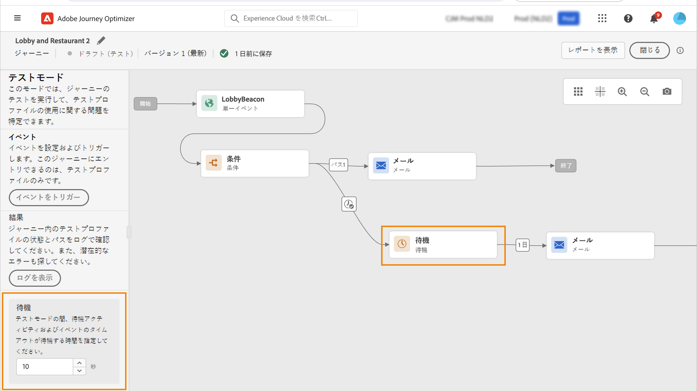
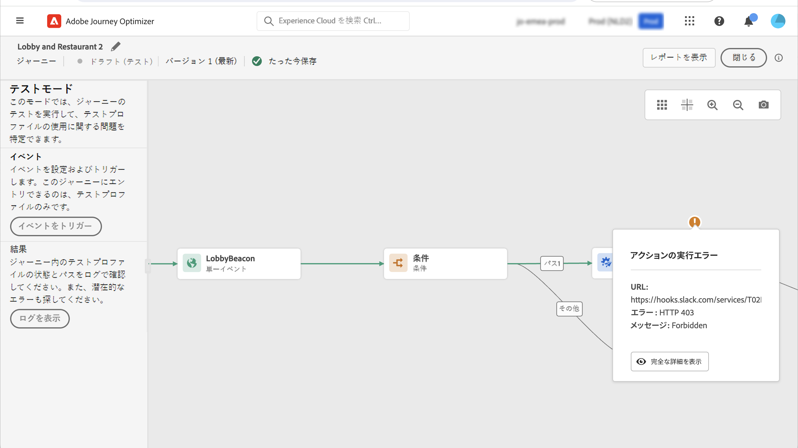

# 旅のテスト{#testing_the_journey}

>[!CONTEXTUALHELP]
>id="ajo_journey_test"
>title="旅のテスト"
>abstract="公開する前に、テストプロファイルを使用して、旅をテストしてください。 これにより、公開前に各ユーザーがどのように旅に流れ、トラブルシューティングを行うかを分析できます。"

公開する前に、テストプロファイルを使用して、旅をテストしてください。 このモードを使用すると、試験的にテストを実行し、テストプロファイルを使用して問題を識別することができます。

テストモードでは、テストプロファイルのみが旅に入ることができます。 テストプロファイルを新しく作成することも、既存のプロファイルをテストプロファイルにすることもできます。 この節 ](../segment/creating-test-profiles.md) では、 [ テストプロファイルについて詳しく説明しています。

>[!NOTE]
>
>旅をテストする前に、すべてのエラーを解決する必要があります。 このセクション ](../building-journeys/troubleshooting.md#checking-for-errors-before-testing) で [ テストする前に、エラーを確認する方法について説明します。

テストモードを使用するには、次の手順に従います。

1. テストモードをアクティブにするには、右上隅にある切り替えボタンをアクティブ **[!UICONTROL Test]** にします。

   

1. 1つ **以上の待機** アクティビティーがある場合は、このパラメーターを設定 **[!UICONTROL Wait time]** して、各待機アクティビティーとイベントタイムアウトが最後にテストモードになる時刻を定義します。 初期設定では、待機時間は10秒、イベントタイムアウト数は秒です。 これにより、テスト結果がすばやく取得されるようになります。

   

   >[!NOTE]
   >
   >タイムアウトが設定された反力イベントを使用している場合は、デフォルトの待機時間が40秒に設定されます。 この項 ](../building-journeys/reaction-events.md) を参照してください [ 。

1. **[!UICONTROL Trigger an event]**&#x200B;ボタンを使用して、旅にイベントを設定して送信します。

   

1. 必要に応じて、様々なフィールドを設定します。 **「プロファイル id** 」フィールドに、テストプロファイルの識別に使用するフィールドの値を入力します。例えば、電子メールアドレスを指定することもできます。 テストプロファイルに関連するイベントを送信していることを確認してください。 この項 ](#firing_events) を参照してください [ 。

   

1. イベントを受信した後で、ボタンをクリック **[!UICONTROL Show log]** してテスト結果を表示し、検証します。 この項 ](#viewing_logs) を参照してください [ 。

   

1. エラーが発生した場合は、テストモードを非アクティブにして、旅に変更を加え、再テストします。 テストが完了したら、旅をパブリッシュすることができます。 このページ ](../building-journeys/publishing-the-journey.md) を参照してください [ 。

## 重要な注意事項 {#important_notes}

* テストした旅にイベントを送出するインターフェイスが用意されていますが、Postman などのサードパーティ製システムでイベントを送信することもできます。
* 試験的な旅に入ることができるのは、リアルタイムカスタマープロファイルサービスにおいて「テストプロファイル」のフラグを設定した人のみです。 この [ 項 ](../segment/creating-test-profiles.md) を参照してください。
* テストモードは、名前空間を使用するドラフト journeys でのみ使用できます。 テストモードでは、旅に移行した人物がテストプロファイルかどうかを確認する必要があります。したがって、Adobe エクスペリエンスプラットフォームにもアクセスできなければなりません。
* テストセッションの実行中に、旅に入ることができるテストプロファイルの最大数は100になります。
* テストモードを無効にすると、以前に入力したすべてのユーザーまたはそのファイルの現在のユーザーから journeys が空になります。 また、レポートもクリアされます。
* テストモードは、必要に応じて何度でも有効または無効にすることができます。
* テストモードがアクティブになったときに、旅の内容を変更することはできません。 テストモードでは、旅を直接パブリッシュすることができますが、テストモードを非アクティブにする必要はありません。
* Split に到達すると、一番上のブランチが常に選択されます。 別のパスを選択してテストする場合は、分岐の位置を変更することができます。
* パフォーマンスを最適化し、古くなったリソースを使用しないようにするために、1週間にトリガーされていないテストモードのすべての journeys は、下書き **状態に** 戻ります。

## イベントをトリガーします。 {#firing_events}

>[!CONTEXTUALHELP]
>id="ajo_journey_test_configuration"
>title="テストモードを設定します。"
>abstract="いくつかのイベントが記録されている場合は、ドロップダウンリストを使用してイベントを選択します。 次に、各イベントに対して、渡されたフィールドと送信イベントの実行を設定します。"

**[!UICONTROL Trigger an event]**&#x200B;ボタンを使用して、人が旅に入るイベントを設定します。

>[!NOTE]
>
>テストモードでイベントをトリガーすると、実際のイベントが生成されます。これにより、このイベントに対するその他の旅が発生します。

前提条件として、Adobe エクスペリエンスプラットフォームでテストプロファイルのフラグが設定されているプロファイルについて理解しておく必要があります。 実際には、テストモードでは、これらのプロファイルを旅に使用できます。また、イベントには ID が含まれている必要があります。 予期される ID は、イベントの構成によって異なります。 このような場合は、d や電子メールアドレスを使用できます。 このキーの値は、 **Profile id** フィールドに追加する必要があります。

いくつかのイベントが記録されている場合は、ドロップダウンリストを使用してイベントを選択します。 次に、各イベントに対して、渡されたフィールドと送信イベントの実行を設定します。 このインターフェイスは、イベントのペイロードにおいて適切な情報を渡し、情報タイプが正しいかどうかを確認するために役立ちます。 テストモードでは、最後に使用したパラメーターが後で使用するために保存されます。

インターフェイスを使用すると、簡単なイベントパラメーターを渡すことができます。 イベントにコレクションやその他の高度なオブジェクトを渡す必要がある場合は、「on **[!UICONTROL Code View]** 」をクリックして、ペイロードのコード全体を表示して変更することができます。 例えば、テクニカルユーザーが準備したイベント情報をコピーしてペーストすることができます。

技術ユーザーは、このインターフェイスを使用して、サードパーティ製ツールを使用することなく、イベントペイロードやトリガーイベントを作成することもできます。

ボタンをクリック **[!UICONTROL Send]** すると、テストが開始されます。 個々の旅の進行は、視覚的な流れによって表されます。 個々のパスが移動中に移動するにつれて、パスは緑色に回転します。 エラーが発生した場合は、対応するステップに警告記号が表示されます。 この上にカーソルを置くと、エラーに関する詳細情報が表示され、必要に応じて完全な詳細情報にアクセスできます。

「イベント設定」画面で別のテストプロファイルを選択してテストを再実行すると、視覚的なフローがクリアされ、新規ユーザーのパスが表示されます。

テスト中に旅を開いたときに、表示されるパスは最後に実行されたテストに対応しています。

視覚的な流れは、イベントがインターフェイス経由でトリガーされるか、外部にトリガーされるか (例えば、Postman を使用して) に作用します。

## ルールベースの journeys のテストモード {#test-rule-based}

テストモードは、ルールベースのイベントを使用する journeys でも使用できます。 ルールに基づいたイベントについて詳しくは、このページ ](../event/about-events.md) を [ 参照してください。

イベントをトリガーする場合は、「イベントの設定 **」画面を** 使用して、テストに渡すイベントパラメーターを定義することができます。イベント ID の状態を表示するには、右上のツールヒントアイコンをクリックします。 ツールヒントは、ルールの評価に含まれる各フィールドの横にも表示されます。

## ビジネスイベントのテストモード {#test-business}

業務イベント ](../event/about-events.md) を使用 [ する場合は、試験的にテストモードを使用して、1つのテストプロファイルの入り口をトリガーし、イベントをシミュレートして適切なプロファイル ID を渡します。テスト中に旅に入るテストプロファイルのイベントパラメーターと識別子を渡す必要があります。 他のセグメントベースの journeys に存在するオプションを使用 **[!UICONTROL Up to 100 profiles at once]** することはできません。 テストモードでは、ビジネスイベントに基づいて journeys に使用できる「コードビュー」モードはありません。

最初にビジネスイベントをトリガーするときは、同じテストセッション内でビジネスイベント定義を変更することはできません。 同じ個人または別の個別の人物を入力して、同じまたは別の識別子に渡すことができます。 ビジネスイベントのパラメーターを変更する場合は、テストモードを停止し、再起動する必要があります。

## ログの表示 {#viewing_logs}

>[!CONTEXTUALHELP]
>id="ajo_journey_test_logs"
>title="テストモードログ"
>abstract="「ログを表示」ボタンをクリックすると、テスト結果が JSON 形式で表示されます。 この結果には、旅内の個々のユーザー数とその状態が表示されます。"

**[!UICONTROL Show log]**&#x200B;このボタンを使用すると、テスト結果を表示できます。このページには、JSON 形式での旅の最新情報が表示されます。 ボタンを使用して、ノード全体をコピーできます。 この場合は、ページを手動で更新して、旅のテスト結果を更新する必要があります。

>[!NOTE]
>
>テストログには、サードパーティシステム (データソースまたはアクション) の呼び出し時にエラーが発生した場合は、エラーコードとエラー応答が表示されます。

現在の旅において、各個人 (技術的にはインスタンスと呼ばれます) の数が表示されます。 各ユーザーに対して表示される便利な情報を次に示します。

* _Id_ : 旅における個人の内部 ID です。 これは、デバッグ目的に使用できます。
* _currentstep_ : 各人が旅にいたステップを示します。 アクティビティにラベルを付けて、より簡単に識別できるようにすることをお勧めします。
* _currentstep_ > phase: 個別の旅 (実行中、終了、エラー、またはタイムアウト) の状態を示します。 詳しくは、以下を参照してください。
* _currentstep_ > _extraInfo_ : エラーの説明およびその他の文脈情報。
* _currentstep_ > _fetcherrors_ : この手順の途中で発生した fetch データエラーに関する情報を取得します。
* _externalKeys_ : イベントに定義されているキー式の値。
* _enrichedData_ : 旅がデータソースを使用している場合に、旅で取得されたデータです。
* __「処理中」: 各ステップが後で実行されたことを示します。イベントの場合は、ペイロードが表示されます。
* _actionExecutionErrors_ : 発生したエラーに関する情報を示します。

次に示すのは、個々の旅の状態です。

* _実行_ 中: 他のユーザーが現在旅にいます。
* _完成_ した人物は、旅の最後になります。
* _エラー_ : エラーにより、各ユーザーは旅中に停止しました。
* __&#x200B;タイムアウト: 時間が経過したので、その人物は旅に停止しました。

テストモードを使用してイベントがトリガーされると、データセットがソースの名前を使用して自動的に生成されます。

テストモードは、自動的にエクスペリエンスイベントを作成し、Adobe エクスペリエンスプラットフォームに送信します。 このエクスペリエンスイベントのソースの名前は、「オーケストレーションテストイベントの旅」です。

