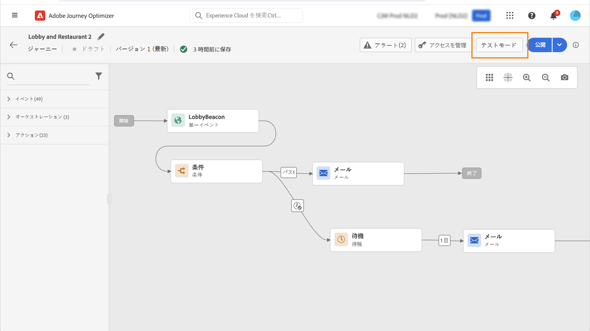
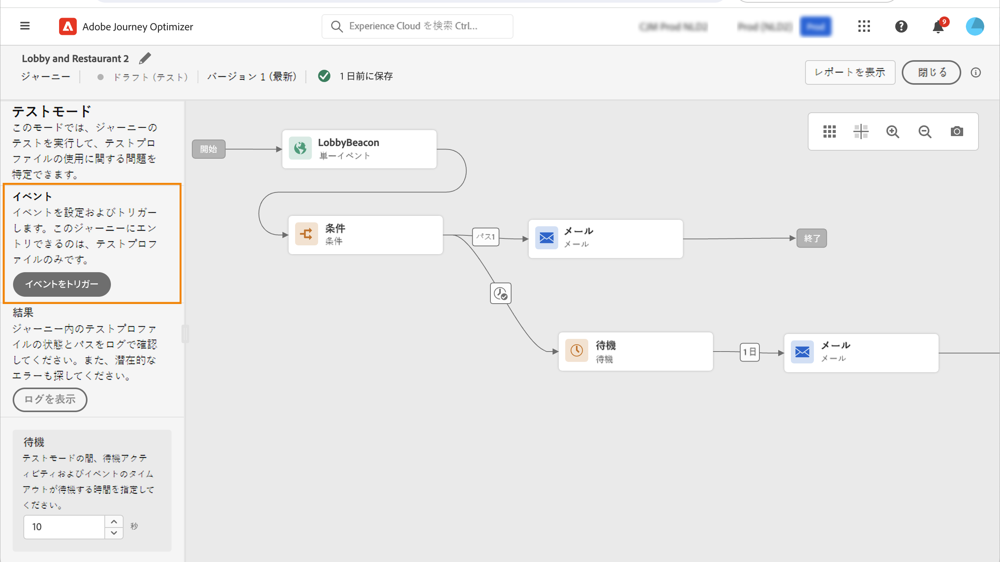
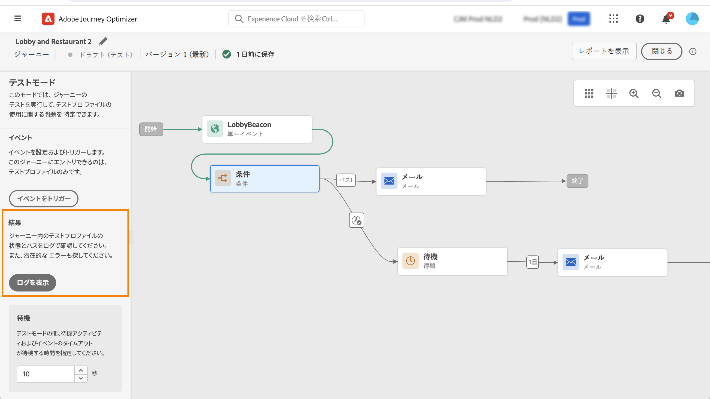

# ジャーニーのテスト{#testing_the_journey}

>[!CONTEXTUALHELP]
>id="ajo_journey_test"
>title="ジャーニーのテスト"
>abstract="公開する前に、テストプロファイルを使用してジャーニーをテストします。これにより、公開前に、個人がジャーニー内をどのように移動するかを分析し、トラブルシューティングを行うことができます。"

ジャーニーを作成したら、公開する前にテストできます。Journey Optimizer では、ジャーニーに沿って進む際にテストプロファイルを表示し、アクティブ化の前に潜在的なエラーを検出する方法として、「テストモード」を提供しています。クイックテストを実行すると、ジャーニーが正しく動作することを確認できるので、自信を持って公開できます。

テストモードでは、テストプロファイルのみがジャーニーにエントリできます。新しいテストプロファイルを作成するか、既存のプロファイルをテストプロファイルに変換することができます。テストプロファイルの詳細については、[この節](../audience/creating-test-profiles.md)を参照してください。

>[!NOTE]
>
>ジャーニーをテストする前に、エラーが発生した場合はすべて解決する必要があります。テストする前にエラーを確認する方法については、[この節](../building-journeys/troubleshooting.md)を参照してください。

## 重要な注意事項 {#important_notes}

### 一般的な制限事項

* **テストプロファイルのみ** - テストモードでジャーニーにエントリできるのは、リアルタイム顧客プロファイルサービスで「テストプロファイル」としてフラグ付けされた個人のみです。 [ テストプロファイルの作成方法を説明します ](../audience/creating-test-profiles.md)。
* **名前空間要件** - テストモードは、名前空間を使用するドラフトジャーニーでのみ使用できます。 テストモードでは、ジャーニーにエントリする人がテストプロファイルであることを確認する必要があるため、Adobe Experience Platform にアクセスできる必要があります。
* **プロファイル制限** - 1 つのテストセッション中に最大 100 個のテストプロファイルが 1 つのジャーニーにエントリできます。
* **イベントトリガー** - イベントは、インターフェイスからのみ発生させることができます。 API を使用して外部システムからイベントを実行することはできません。
* **カスタムアップロードオーディエンス** - ジャーニーテストモードでは、[ カスタムアップロードオーディエンス ](../audience/custom-upload.md) 属性のエンリッチメントをサポートしていません。

### 検査中および検査後の行動

* **テストモードの無効化** - テストモードを無効にすると、現在ジャーニーに含まれているプロファイルや、以前にジャーニーに入力したすべてのプロファイルが削除され、レポートがクリアされます。
* **再アクティブ化の柔軟性** - テストモードは、必要な回数だけ有効または無効にすることができます。
* **自動の非アクティブ化** - テストモードで **1 週間以上** 非アクティブのままになっているジャーニーは、自動的にドラフトステータスに戻ってパフォーマンスを最適化し、古くなったリソースの使用を防ぎます。
* **編集と公開** - テストモードがアクティブな間は、ジャーニーを変更できません。 ただし、ジャーニーを直接公開できるので、事前にテストモードを無効にしておく必要はありません。

### 実行

* **分割動作** - ジャーニーが分割に到達すると、常に上位のブランチが選択されます。 別のパスをテストする場合は、ブランチを並べ替えます。
* **イベントのタイミング** - ジャーニーに*複数のイベントが含まれる場合、各イベントを順番にトリガーします。イベントを送信するのが早すぎる（最初の待機ノードが終了する前）または遅すぎる（設定されたタイムアウトの後）場合、イベントは破棄され、プロファイルがタイムアウトパスに送られます。 定義したウィンドウ内にペイロードを送信して、イベントペイロードフィールドへの参照が有効なままであることを常に確認します。
* **アクティブな日付ウィンドウ** - ジャーニーで設定した [ 開始日と終了日/時間 ](journey-properties.md#dates) ウィンドウに、テストモードを開始するときの現在の時刻が含まれていることを確認します。 それ以外の場合、トリガーしたテストイベントは通知なしで破棄されます。
* **反応イベント** - タイムアウトが設定された反応イベントの場合、最小待機時間およびデフォルト待機時間は 40 秒です。
* **テストデータセット** - テストモードでトリガーされたイベントは、次のラベルが付いた専用のデータセットに保存されます。`JOtestmode - <schema of your event>`

<!--
* Fields from related entities are hidden from the test mode.
-->

## テストモードを有効化

テストモードを使用するには、次の手順に従います。

1. テストモードをアクティブにするには、右上隅にある「**[!UICONTROL テストモード]**」ボタンをクリックします。

   

   >[!NOTE]
   >
   >テストモードを有効にした後、プロファイルエントリをトリガーするまで約 1～2 分待ちます。 これにより、決定パッケージが決定システム全体に伝播します。 テストモードを有効にした直後にプロファイルエントリをトリガーすると、ジャーニーが失敗する場合があります。

1. ジャーニーに少なくとも 1 つの&#x200B;**待機**&#x200B;アクティビティがある場合、**[!UICONTROL 待機時間]**&#x200B;パラメーターを使用して、各待機アクティビティとイベントのタイムアウトがテストモードで持続する時間を定義します。待機とイベントタイムアウトのデフォルト時間は 10 秒です。これにより、テスト結果を迅速に取得できます。

   

   >[!NOTE]
   >
   >タイムアウトのある反応イベントをジャーニーで使用する場合、待機時間のデフォルト値は最小値の 40 秒になります。[この節](../building-journeys/reaction-events.md)を参照してください。

1. 「**[!UICONTROL イベントをトリガー]**」ボタンを使用してイベントを設定し、ジャーニーに送信します。

   

1. 必要に応じて、様々なフィールドを設定します。**プロファイル ID** フィールドに、テストプロファイルの識別に使用するフィールドの値を入力します。これには、メールアドレスなどを使用できます。テストプロファイルに関連するイベントを送信します。[この節](#firing_events)を参照してください。

   

1. イベントを受け取ったら、「**[!UICONTROL ログを表示]**」ボタンをクリックし、テスト結果を表示して確認します。[この節](#viewing_logs)を参照してください。

   

1. エラーがある場合は、テストモードを無効にし、ジャーニーを修正してから再度テストします。テストが完了したら、ジャーニーを公開できます。詳しくは、[このページ](../building-journeys/publishing-the-journey.md)を参照してください。

## イベントのトリガー {#firing_events}

>[!CONTEXTUALHELP]
>id="ajo_journey_test_configuration"
>title="テストモードを設定"
>abstract="ジャーニーに複数のイベントが含まれる場合は、ドロップダウンリストを使用してイベントを選択します。次に、各イベントに対して、渡されるフィールドと送信するイベントの実行を設定します。"

「**[!UICONTROL イベントをトリガー]**」ボタンを使用して、ユーザーがジャーニーにエントリできるようにするイベントを設定します。

### 前提条件 {#trigger-events-prerequisites}

前提条件として、Adobe Experience Platform でテストプロファイルというフラグの付いたプロファイルを把握しておく必要があります。実際、テストモードでは、これらのプロファイルのみがジャーニーで許可されます。

イベントには ID を含める必要があります。必要な ID は、イベント設定に応じて異なります。この ID には、ECID やメールアドレスなどを使用できます。このキーの値は、**プロファイル識別子**&#x200B;フィールドに追加する必要があります。

ジャーニーでエラー `ERR_MODEL_RULES_16` が発生してテストモードを有効にできない場合は、チャネルアクションを使用する際に、使用するイベントに [ID 名前空間](../audience/get-started-identity.md)が含まれていることを確認してください。

ID 名前空間は、テストプロファイルを一意に識別するために使用されます。例えば、メールを使用してテストプロファイルを識別する場合は、ID 名前空間の&#x200B;**メール**&#x200B;を選択する必要があります。一意の識別子が電話番号の場合は、ID 名前空間の&#x200B;**電話**&#x200B;を選択する必要があります。

>[!NOTE]
>
>* テストモードでイベントをトリガーすると、実際のイベントが生成されます。つまり、このイベントをリッスンしている他のジャーニーもヒットします。
>
>* テストモードの各イベントが正しい順序で、設定された待機ウィンドウ内でトリガーされることを確認します。例えば、60 秒の待機時間がある場合、2 番目のイベントは、その 60 秒の待機時間が経過し、タイムアウト制限が期限切れになる前にのみトリガーする必要があります。
>

### イベント設定 {#trigger-events-configuration}

ジャーニーに複数のイベントが含まれる場合は、ドロップダウンリストを使用してイベントを選択します。次に、各イベントに対して、渡されるフィールドと送信するイベントの実行を設定します。インターフェイスは、イベントペイロードに正しい情報を渡し、情報タイプが正しいことを確認するのに役立ちます。テストモードでは、後で使用するために、テストセッションで最後に使用したパラメーターが保存されます。

このインターフェイスを使用すると、単純なイベントパラメーターを渡すことができます。イベント内のコレクションや他の高度なオブジェクトを渡す場合は、「**[!UICONTROL コードビュー]**」を選択して、ペイロードのコード全体を表示し、変更することができます。例えば、技術ユーザーが作成したイベント情報をコピーして貼り付けることができます。

技術ユーザーは、このインターフェイスを使用してイベントペイロードを作成して、サードパーティのツールを使用せずにイベントをトリガーすることもできます。

「**[!UICONTROL 送信]**」ボタンをクリックすると、テストが開始されます。ジャーニー内の個人の進行状況は、視覚的なフローで表現されます。個人がジャーニー間を移動すると、パスは徐々に緑に変わります。エラーが発生した場合は、対応する手順に警告シンボルが表示されます。その警告記号上にカーソルを置くと、エラーに関する詳細情報が表示され、（利用可能な場合は）詳細情報にアクセスできます。

イベント設定画面で別のテストプロファイルを選択し、再びテストを実行すると、視覚的なフローが消去され、新しい個人のパスが表示されます。

テストでジャーニーを開くと、最後に実行されたテストに対応するパスが表示されします。

## ルールベースのジャーニーのテストモード {#test-rule-based}

テストモードは、ルールベースのイベントを使用するジャーニーでも使用できます。ルールベースのイベントについて詳しくは、[このページ](../event/about-events.md)を参照してください。

イベントをトリガーする際、**イベント設定**&#x200B;画面で、テストに合格するイベントパラメーターを定義できます。イベント ID 条件を表示するには、右上隅のツールチップアイコンをクリックします。各フィールド（ルール評価の一部）の横にあるツールヒントも利用できます。

## ビジネスイベントのテストモード {#test-business}

[ビジネスイベント](../event/about-events.md)を使用する場合、テストモードを使用して、ジャーニーに 1 つのテストプロファイルエントリをトリガーし、イベントをシミュレートして、適切なプロファイル ID を渡します。テストでは、イベントパラメーターと、ジャーニーにエントリするテストプロファイルの識別子を渡す必要があります。テストモードには、ビジネスイベントに基づくジャーニーに使用できる「コードビュー」モードはありません。

初めてビジネスイベントをトリガーするときに、同じテストセッションでビジネスイベントの定義を変更することはできません。同じ識別子または別の識別子を渡して、同じ人物または別の人物をジャーニーにエントリさせる必要があります。ビジネスイベントパラメーターを変更する場合は、テストモードを停止して再開する必要があります。

## ログを表示 {#viewing_logs}

>[!CONTEXTUALHELP]
>id="ajo_journey_test_logs"
>title="テストモードログ"
>abstract="「**ログを表示**」ボタンをクリックすると、テスト結果が JSON 形式で表示されます。この結果では、ジャーニー内の個人の数とそのステータスが表示されます。"

「**[!UICONTROL ログを表示]**」ボタンを使用すると、テスト結果を表示できます。このページには、ジャーニーの現在の情報が JSON 形式で表示されます。ボタンを使用すると、ノード全体をコピーできます。ジャーニーのテスト結果を更新するには、ページを手動で更新する必要があります。

>[!NOTE]
>
>テストログで、サードパーティシステム（データソースまたはアクション）の呼び出し時にエラーが発生した場合は、エラーコードとエラー応答が表示されます。

現在、ジャーニー内にいる個人の数（技術的にはインスタンスと呼ばれます）が表示されます。各個人に表示される便利な情報を次に示します。

* _ID_：ジャーニー内の個人の内部 ID。デバッグ目的で使用できます。
* _currentstep_：個人がジャーニーにいるステップ。アクティビティを識別しやすくするために、アクティビティにラベルを追加することをお勧めします。
* _currentstep_ > フェーズ：個人のジャーニーのステータス（実行中、完了、エラーまたはタイムアウト）。詳しくは、以下を参照してください。
* _currentstep_ > _extraInfo_：エラーの説明と、その他のコンテキスト情報。
* _currentstep_ > _fetchErrors_：この手順中に発生したデータ取得エラーに関する情報。
* _externalKeys_：イベントで定義されているキー式の値。
* _enrichedData_：ジャーニーがデータソースを使用している場合にジャーニーが取得したデータ。
* _transitionHistory_：個人が踏んだ手順のリスト。イベントの場合、ペイロードが表示されます。
* _actionExecutionErrors_：発生したエラーに関する情報。

個人のジャーニーには様々なステータスがあります。

* _実行中_：個人は現在ジャーニーの途中にいます。
* _完了_：個人はジャーニーの最後にいます。
* _エラー_：エラーが発生したため、個人のジャーニーは停止しました。
* _タイムアウト_：時間がかかり過ぎたので、個人のジャーニーは停止しました。

テストモードでイベントをトリガーすると、ソースの名前が付いたデータセットが自動的に生成されます。

テストモードでは、エクスペリエンスイベントが自動的に作成され、Adobe Experience Platform に送信されます。このエクスペリエンスイベントのソース名は、「Journey Orchestration テストイベント」です。

