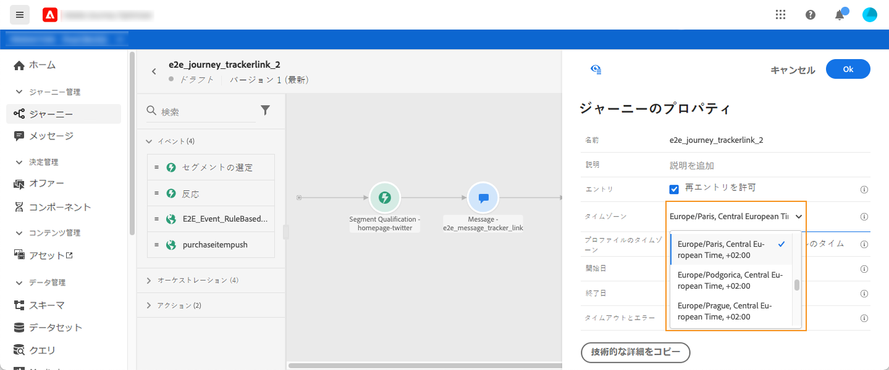
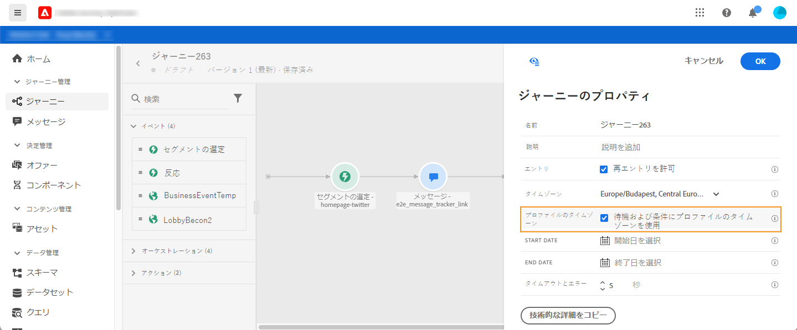

# タイムゾーン管理 {#timezone_management}

タイムゾーンは、ジャーニーの[プロパティ](../building-journeys/journey-gs.md#change-properties)で定義できます。

「プロパティ」にアクセスするには、画面の右上にある鉛筆アイコンをクリックします。

このタイムゾーンは、次のような時間要素を含むジャーニーのすべてのアクティビティで使用されます。

* [時間条件](../building-journeys/condition-activity.md#time_condition)
* [日付条件](../building-journeys/condition-activity.md#date_condition)
* [カスタム待機](../building-journeys/wait-activity.md#custom)
* [固定日待機](../building-journeys/wait-activity.md#fixed_date)

タイムゾーンを選択するか、ユーザープロファイルで定義されたタイムゾーンを使用するかを選択できます。

>[!NOTE]
>
>プロファイルタイムゾーンは、**環境設定詳細** フィールドグループにある **timeZone** フィールドと連携します。

## 固定タイムゾーンの定義 {#fixed-timezone}

タイムゾーンを固定することもできます。定義済みのタイムゾーンをクリアし、ドロップダウンリストからタイムゾーンを選択します。固定タイムゾーンを使用すると、ジャーニーにエントリするすべての個人のタイムゾーンは同じになります。

「**[!UICONTROL ジャーニーのプロパティ]**」ウィンドウで、タイムゾーンを選択します。

## プロファイルを使用したジャーニータイムゾーンの定義 {#timezone-from-profiles}

ジャーニーのエントリイベントに名前空間がある（ジャーニーが Adobe Experience Platform のリアルタイム顧客プロファイルサービスにアクセスする）場合、タイムゾーンは、ジャーニーを進む個人のプロファイルで指定されたタイムゾーンを使用してあらかじめ定義されます。

Adobe Experience Platform プロファイルでタイムゾーンが定義されている場合は、ジャーニーでそのタイムゾーンを取得できます。

個人のプロファイルにタイムゾーンが含まれていない場合、取得されるタイムゾーンはタイムゾーンフィールドに定義されているものになります。

**[!UICONTROL プロパティ]**&#x200B;で、「**[!UICONTROL タイマーと条件でプロファイルのタイムゾーンを使用する]**」のチェックをオンにします。

## タイムゾーン式の使用 {#timezone-in-expressions}

ジャーニーの開始日と終了日を特定のタイムゾーンにリンクすることはできません。これらはインスタンスのタイムゾーンに自動的に関連付けられます。
