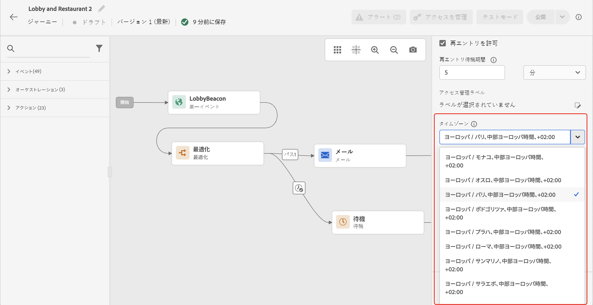
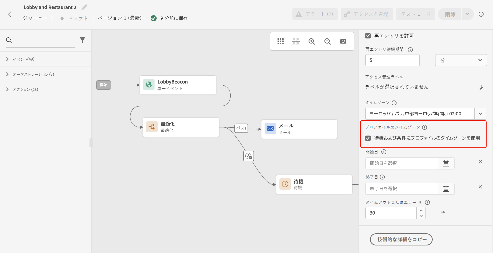

# タイムゾーン管理 {#timezone_management}

>[!CONTEXTUALHELP]
>id="ajo_journey_properties_time_zone"
>title="ジャーニータイムゾーン"
>abstract="ジャーニーのタイムゾーンを選択します。 固定タイムゾーンを使用すると、ジャーニーにエントリするすべての個人のタイムゾーンは同じになります。"

タイムゾーンは、ジャーニーの[プロパティ](../building-journeys/journey-properties.md#timezone)で定義できます。

ジャーニーのプロパティにアクセスするには、画面の右上にある鉛筆アイコンを選択します。

このタイムゾーンは、次のような時間要素を含むジャーニーのすべてのアクティビティで使用されます。

* [時間条件](../building-journeys/conditions.md#time_condition)
* [日付条件](../building-journeys/conditions.md#date_condition)
* [カスタム待機](../building-journeys/wait-activity.md#custom)

<!--
* [Fixed date wait](../building-journeys/wait-activity.md#fixed_date)
-->

[固定タイムゾーン](#fixed-timezone)、または[ユーザープロファイルで定義](#timezone-from-profiles)されたタイムゾーンの使用を選択できます。

## 固定タイムゾーンの定義 {#fixed-timezone}

タイムゾーンを固定できます。定義済みのタイムゾーンをクリアし、ドロップダウンリストからタイムゾーンを選択します。固定タイムゾーンを使用すると、ジャーニーにエントリするすべての個人のタイムゾーンは同じになります。

「**[!UICONTROL ジャーニーのプロパティ]**」ペインで、タイムゾーンを選択します。

## プロファイルのタイムゾーンを使用 {#timezone-from-profiles}

>[!CONTEXTUALHELP]
>id="ajo_journey_properties_profile_time_zone"
>title="プロファイルのタイムゾーンを使用"
>abstract="**待機**&#x200B;および&#x200B;**条件** アクティビティでリアルタイム プロファイル タイム ゾーンを使用するには、このオプションをオンにします。 プロファイルにタイムゾーンが定義されている場合、そのタイムゾーンは取得され、ジャーニーで使用されます。 そうでない場合、タイムゾーンは、上記のタイムゾーンフィールドで定義されたタイムゾーンです。"

ジャーニーのエントリイベントに名前空間がある場合（ジャーニーが[!DNL Adobe Experience Platform]のリアルタイム顧客プロファイルサービスに到達できる場合）、プロファイルレベルで定義されたタイムゾーンを使用できます。 これを行うには、**プロパティ**&#x200B;で、「**タイマーと条件でプロファイルのタイムゾーンを使用する**」のチェックをオンにします。このオプションは、デフォルトではオンになっていません。

プロファイルにタイムゾーンが定義されている場合、そのタイムゾーンが取得され、ジャーニーで使用されます。 そうでない場合は、使用されるタイムゾーンがタイムゾーンフィールドで定義されたタイムゾーンになります。

>[!NOTE]
>
>プロファイルタイムゾーンは、「**環境設定詳細**」フィールドグループにある「**timeZone**」フィールドと連携します。

## 式でタイムゾーンを使用 {#timezone-in-expressions}

ジャーニーの開始日と終了日を特定のタイムゾーンにリンクすることはできません。これらはインスタンスのタイムゾーンに自動的に関連付けられます。
