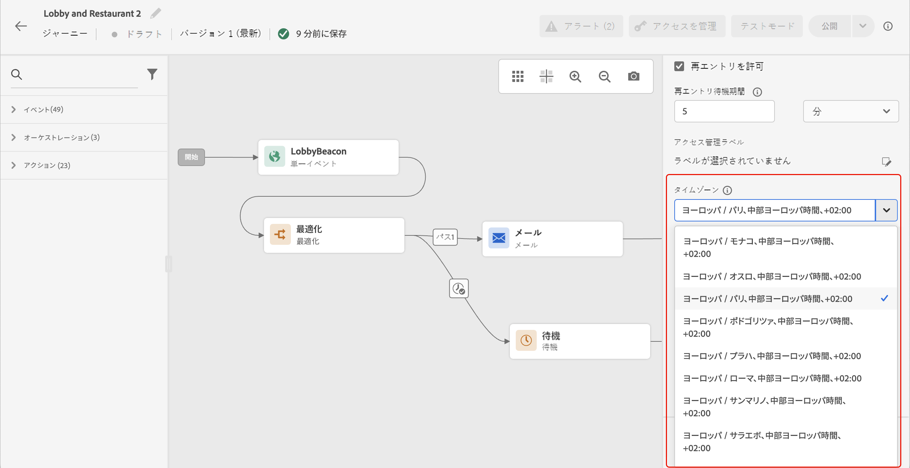
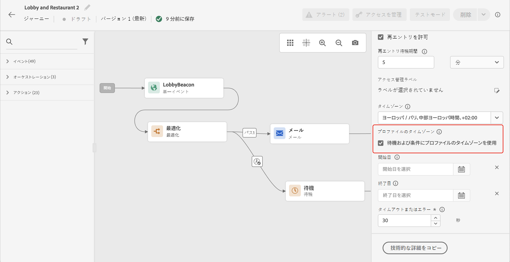

# タイムゾーン管理 {#timezone_management}

>[!BEGINSHADEBOX]

**このページでは、** ジャーニーのタイムゾーン（固定タイムゾーンまたは各プロファイルから取得したタイムゾーン）を設定して、時間条件、日付条件、カスタム待機などの時間ベースのアクティビティを実行するタイミングを制御する方法について説明します。

>[!ENDSHADEBOX]

>[!CONTEXTUALHELP]
>id="ajo_journey_properties_time_zone"
>title="ジャーニーのタイムゾーン"
>abstract="タイムゾーン設定では、ジャーニーのタイムゾーンを定義します。 固定タイムゾーンを使用すると、ジャーニーにエントリするすべての個人のタイムゾーンは同じになります。"

タイムゾーンは、ジャーニーの[プロパティ](../building-journeys/journey-properties.md#timezone)で定義できます。

ジャーニーのプロパティにアクセスするには、画面の右上にある鉛筆アイコンを選択します。

このタイムゾーンは、次のような時間要素を含むジャーニーのすべてのアクティビティで使用されます。

* [時間条件](../building-journeys/conditions.md#time_condition)
* [日付条件](../building-journeys/conditions.md#date_condition)
* [カスタム待機](../building-journeys/wait-activity.md#custom)

<!--
* [Fixed date wait](../building-journeys/wait-activity.md#fixed_date)
-->

[固定タイムゾーン](#fixed-timezone)、または[ユーザープロファイルで定義](#timezone-from-profiles)されたタイムゾーンの使用を選択できます。

## 固定タイムゾーンの定義 {#fixed-timezone}

タイムゾーンを固定できます。 定義済みのタイムゾーンをクリアし、ドロップダウンリストからタイムゾーンを選択します。 固定タイムゾーンを使用すると、ジャーニーにエントリするすべての個人のタイムゾーンは同じになります。

「**[!UICONTROL ジャーニーのプロパティ]**」ペインで、タイムゾーンを選択します。

## プロファイルのタイムゾーンを使用 {#timezone-from-profiles}

>[!CONTEXTUALHELP]
>id="ajo_journey_properties_profile_time_zone"
>title="プロファイルのタイムゾーンを使用"
>abstract="このオプションでは、**待機**&#x200B;および&#x200B;**条件**&#x200B;アクティビティでリアルタイムのプロファイルタイムゾーンを使用します。 プロファイルのタイムゾーンが定義されている場合、そのタイムゾーンが取得され、ジャーニーで使用されます。 そうでない場合、タイムゾーンは上記のタイムゾーンフィールドで定義されたタイムゾーンになります。"

ジャーニーのエントリイベントに名前空間がある場合（ジャーニーが[!DNL Adobe Experience Platform]のリアルタイム顧客プロファイルサービスに到達できる場合）、プロファイルレベルで定義されたタイムゾーンを使用できます。 これを行うには、**プロパティ**&#x200B;で、「**タイマーと条件でプロファイルのタイムゾーンを使用する**」のチェックをオンにします。 このオプションは、デフォルトではオンになっていません。

プロファイルにタイムゾーンが定義されている場合、そのタイムゾーンが取得され、ジャーニーで使用されます。 そうでない場合は、使用されるタイムゾーンがタイムゾーンフィールドで定義されたタイムゾーンになります。

>[!NOTE]
>
>プロファイルタイムゾーンは、「**環境設定詳細**」フィールドグループにある「**timeZone**」フィールドと連携します。

## 式でタイムゾーンを使用 {#timezone-in-expressions}

ジャーニーの開始日と終了日を特定のタイムゾーンにリンクすることはできません。 これらはインスタンスのタイムゾーンに自動的に関連付けられます。

+++ AI ナレッジリファレンス

このセクションには、このトピックに関連する解釈、検索、質問への回答をサポートすることを目的とした構造化された知識が含まれています。

理解を深めるには、この情報をこのページのドキュメントと組み合わせる必要があります。 どちらのソースも単独で使用することを意図していません。このページでは、機能について説明しますが、この節では、用語、意図、適用可能性、および制約の曖昧さを解消するのに役立つ追加のコンテキストを提供します。

* **TL;DR:**&#x200B;このページでは、Adobe Journey Optimizer ジャーニープロパティでタイムゾーン設定を設定する方法について説明します。すべてのプロファイルに適用される固定タイムゾーンか、リアルタイム顧客プロファイルから取得されるプロファイルごとのタイムゾーンかを選択します。

**インテント：**
* ジャーニーに固定タイムゾーンを設定し、すべてのプロファイルが条件と待機に対して同じ時間参照に従うように設定します
* プロファイルごとのタイムゾーンを有効にして、待機アクティビティと条件アクティビティが各個人の保存されたタイムゾーン設定を使用できるようにします
* ジャーニータイムゾーンの設定によって影響を受けるジャーニーアクティビティを把握します
* 個々のタイムゾーン値を格納するプロファイルフィールドグループを特定します

**用語集：**
* **固定タイムゾーン**: ジャーニー&#x200B;*（製品固有）*&#x200B;に入るすべてのジャーニーに一様に適用される、プロファイルのプロパティで選択された1つのタイムゾーン
* **プロファイルタイムゾーン**: 「待機時間と条件でプロファイルタイムゾーンを使用」オプションが有効な場合に使用される、環境設定の詳細フィールドグループの`timeZone` フィールドに保存される個人ごとのタイムゾーン *（製品固有）*
* **環境設定の詳細フィールドグループ**: プロファイルレベルのタイムゾーン解決に使用される`timeZone`属性を含むXDM フィールドグループ

**ガードレール：**
* 「待機と条件でプロファイルタイムゾーンを使用」オプションは、ジャーニーのエントリイベントに名前空間がある場合（ジャーニーがリアルタイム顧客プロファイルサービスに到達できる場合）にのみ使用できます
* このオプションはデフォルトではオンになっていません。固定タイムゾーンは、明示的に有効になっていない限り使用されます
* このオプションが有効になっていても、プロファイルにタイムゾーンが定義されていない場合、ジャーニーはジャーニープロパティで定義された固定タイムゾーンにフォールバックします
* ジャーニーの開始日と終了日は、特定のタイムゾーンにリンクすることはできません。これらは、インスタンスのタイムゾーンに自動的に関連付けられます

**用語：**
* 正規名：タイムゾーン管理 – Acronym: none — バリエーション：タイムゾーン設定、ジャーニータイムゾーン
* 同義語：「固定時間帯」 = 「すべての個人に同じ」、「プロファイルタイムゾーン」 = 「待機と条件にプロファイルタイムゾーンを使用」
* 混同しないでください：「ジャーニータイムゾーン」（アクティビティに適用）≠「インスタンスタイゾーン」（ジャーニーの開始日/終了日に適用、自動設定）

**FAQ:**
* **Q: ジャーニーのタイムゾーンをどこで設定しますか？** — ジャーニーキャンバスの右上にある鉛筆アイコンを介してアクセスできる、ジャーニーのプロパティペインで。
* **Q: ジャーニータイムゾーンを使用するアクティビティはどれですか？**  – 時間条件、日付条件、カスタム待機アクティビティ。
* **Q：各プロファイルをローカルのタイムゾーンに従わせるにはどうすればよいですか？** — 「ジャーニーのプロパティ」で、「待機と条件でプロファイルタイムゾーンを使用」オプションを有効にします。 これには、リアルタイム顧客プロファイルサービスにアクセスできるように、ジャーニーに名前空間が必要です。
* **Q: プロファイルにタイムゾーンが定義されておらず、プロファイルタイムゾーンオプションが有効になっている場合はどうなりますか？** — ジャーニーは、ジャーニーのプロパティの「タイムゾーン」フィールドで定義された固定タイムゾーンにフォールバックします。
* **Q：個人のタイムゾーンを格納するプロファイルフィールドはどれですか？** — プロファイルスキーマの環境設定の詳細フィールドグループ内の`timeZone` フィールド。
* **Q: ジャーニーの開始日と終了日を特定のタイムゾーンに設定できますか？**  – いいえ。 ジャーニーの開始日と終了日は、インスタンスのタイムゾーンに自動的に関連付けられ、カスタムタイムゾーンにリンクすることはできません。

+++
