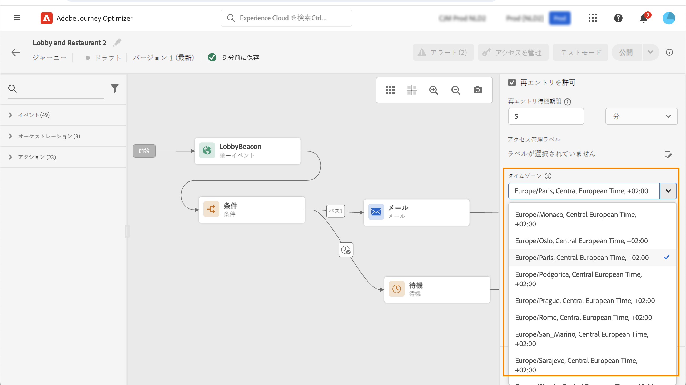
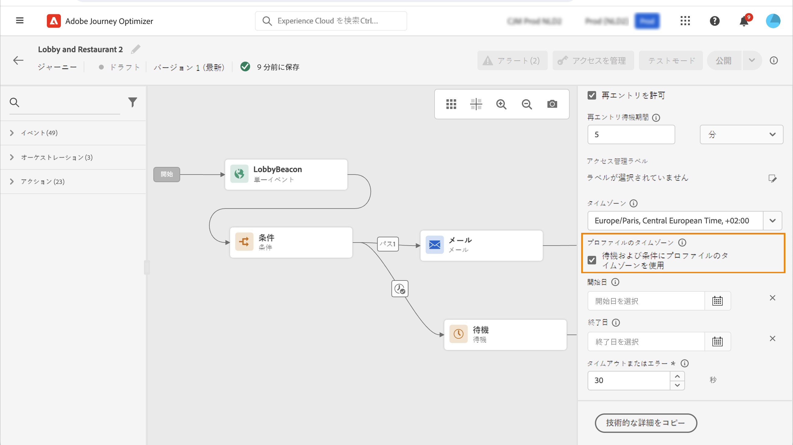

# タイムゾーン管理 {#timezone_management}

>[!CONTEXTUALHELP]
>id="ajo_journey_properties_time_zone"
>title="タイムゾーン"
>abstract="ジャーニーのタイムゾーンを選択します。 固定タイムゾーンを使用すると、ジャーニーにエントリするすべての個人のタイムゾーンは同じになります。"

タイムゾーンは、ジャーニーの[プロパティ](../building-journeys/journey-properties.md#timezone)で定義できます。

ジャーニーのプロパティにアクセスするには、画面の右上にある鉛筆アイコンを選択します。

このタイムゾーンは、次のような時間要素を含むジャーニーのすべてのアクティビティで使用されます。

* [時間条件](../building-journeys/condition-activity.md#time_condition)
* [日付条件](../building-journeys/condition-activity.md#date_condition)
* [カスタム待機](../building-journeys/wait-activity.md#custom)

<!--
* [Fixed date wait](../building-journeys/wait-activity.md#fixed_date)
-->

[固定タイムゾーン](#fixed-timezone)、または[ユーザープロファイルで定義](#timezone-from-profiles)されたタイムゾーンの使用を選択できます。

## 固定タイムゾーンの定義 {#fixed-timezone}

タイムゾーンを固定できます。定義済みのタイムゾーンをクリアし、ドロップダウンリストからタイムゾーンを選択します。固定タイムゾーンを使用すると、ジャーニーにエントリするすべての個人のタイムゾーンは同じになります。

「**[!UICONTROL ジャーニーのプロパティ]**」ペインで、タイムゾーンを選択します。

## プロファイルのタイムゾーンを使用 {#timezone-from-profiles}

>[!CONTEXTUALHELP]
>id="ajo_journey_properties_profile_time_zone"
>title="プロファイルのタイムゾーンを使用"
>abstract="待機および条件アクティビティでリアルタイムプロファイルのタイムゾーンを使用するには、チェックボックスをオンにします。 プロファイルのタイムゾーンが定義されている場合、そのタイムゾーンが取得され、ジャーニーで使用されます。そうでない場合、タイムゾーンは上記のタイムゾーンフィールドで定義されたタイムゾーンになります。"

ジャーニーのエントリイベントに名前空間がある（ジャーニーが Adobe Experience Platform のリアルタイム顧客プロファイルサービスにアクセスする）場合、プロファイルレベルで定義されたタイムゾーンを使用できます。 これを行うには、**プロパティ**&#x200B;で、「**タイマーと条件でプロファイルのタイムゾーンを使用する**」のチェックをオンにします。このオプションは、デフォルトではオンになっていません。

プロファイルのタイムゾーンが定義されている場合、そのタイムゾーンが取得され、ジャーニーで使用されます。タイムゾーンが定義されていない場合、使用されるタイムゾーンは、 タイムゾーンフィールドで定義されたタイムゾーンになります。

>[!NOTE]
>
>プロファイルタイムゾーンは、「**環境設定詳細**」フィールドグループにある「**timeZone**」フィールドと連携します。

## 式でタイムゾーンを使用 {#timezone-in-expressions}

ジャーニーの開始日と終了日を特定のタイムゾーンにリンクすることはできません。これらはインスタンスのタイムゾーンに自動的に関連付けられます。
