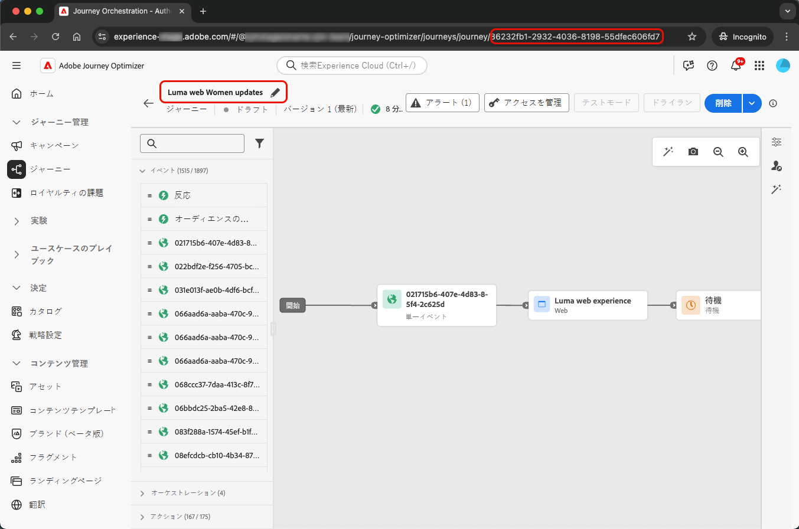
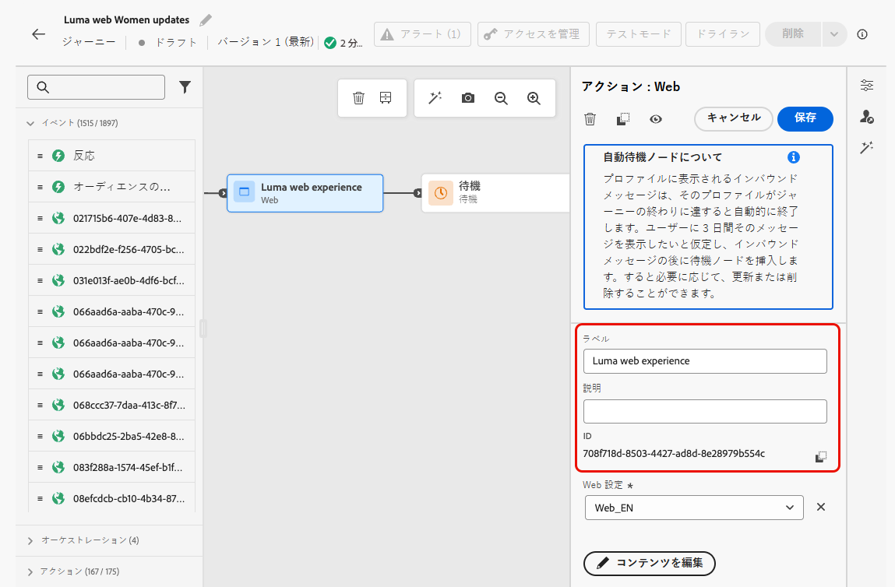
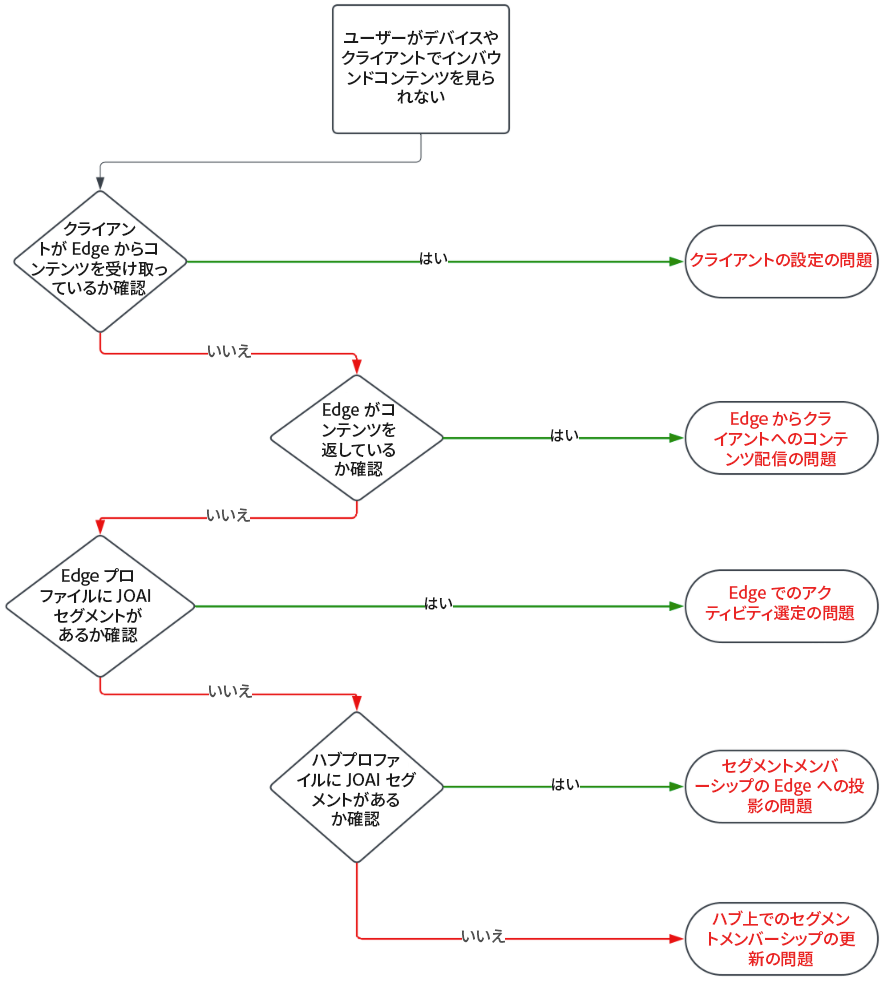
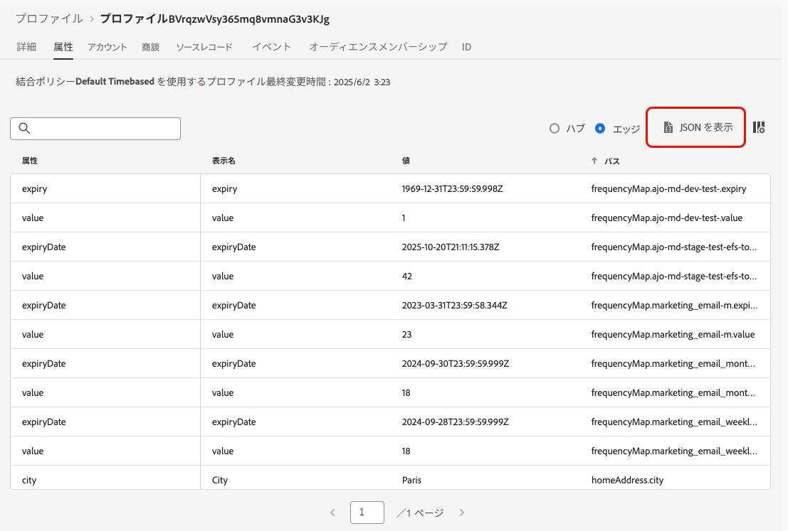
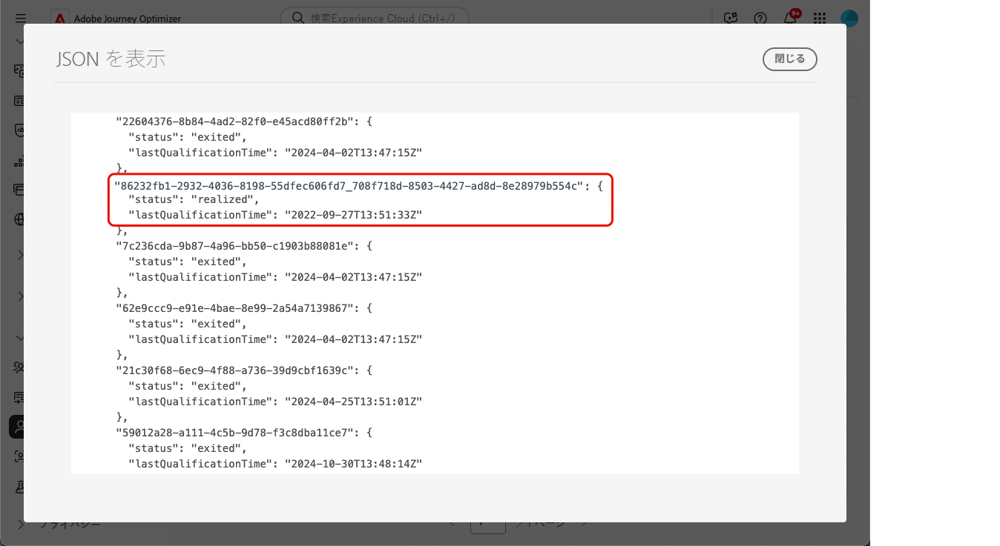

# ジャーニーでのインバウンドアクションのトラブルシューティング {#troubleshooting-inbound-actions}

アプリ内エクスペリエンス、web エクスペリエンス、コードベースのエクスペリエンスなどのインバウンドアクションは、ジャーニー中にユーザーとのパーソナライズされたエンゲージメントを可能にするため、[!DNL Journey Optimizer] の重要なコンポーネントになります。 ただし、インバウンドコンテンツがない、プロファイルがジャーニーから離脱した後に配信が継続するなど、予期しない動作が発生する場合があります。

このガイドでは、サポートに連絡する前にジャーニーでのインバウンドアクションに関連する問題を特定し解決するのに役立つように、問題をデバッグする手順を説明します。

<!--This guide addresses the two most common scenarios with inbound actions in a journey. They are as follows:

* A profile enters the inbound step, but the user does not receive the expected inbound content.
* A user continues to receive inbound content even after the profile exits the journey.

## Benefits {#benefits}

- Faster issue resolution through self-help.
- Reduced dependency on support teams.
- Improved understanding of inbound action functionality.
- Enhanced customer experience and confidence in using AJO.-->

## 前提条件 {#prerequisites}

トラブルシューティングを開始する前に、以下を確認します。

1. **Assurance** セッションを設定します。 方法については、[Adobe Experience Platform Assurance ドキュメント ](https://experienceleague.adobe.com/en/docs/experience-platform/assurance/tutorials/using-assurance){target="_blank"} を参照してください。

1. インバウンドアクションを含むジャーニーに移動して、ジャーニー名とバージョン ID を取得します。

   >[!NOTE]
   >
   >ジャーニーバージョン ID は、URL の *journey/* の後にあります（例：*86232fb1-2932-4036-8198-55dfec606fd7*）。

   

1. インバウンドアクションをクリックして、その詳細を表示します。 インバウンドアクションのラベルと ID を取得します。

   

1. プロファイル名前空間と ID を取得して、問題の発生したプロファイルを識別します。 設定に基づいて、名前空間は ECID、メール、顧客 ID のいずれかになります。 プロファイルを検索する方法については、[Experience Platform ドキュメント ](https://experienceleague.adobe.com/ja/docs/experience-platform/profile/ui/user-guide#browse-identity){target="_blank"} を参照してください。

## シナリオ 1：ユーザーがインバウンドコンテンツを受け取っていない {#scenario-1}

このシナリオでは、プロファイルがジャーニーのインバウンドアクションにエントリしましたが、30 分後でさえ、対応するインバウンドコンテンツがトリガーの設定ステップでデバイス/クライアントに表示されません。

### 事前チェック {#pre-checks}

1. **ジャーニーインバウンドデータセットがプロファイルの取り込みに対して有効になっている**

   インバウンドアクションでは、**ジャーニーインバウンド** データセットを実行時のプロファイル更新に使用します。 現在のサンドボックスのプロファイルに対してデータセットが有効になっていることを確認します。 [データセットの詳細](../data/get-started-datasets.md)

2. platform id **定義された「joai」 id**

   インバウンドアクションは、プロファイル `segmentMembership` で **&#39;joai&#39;** 名前空間を使用して、インバウンドステップ用のプロファイルをアクティブ化します。 サンドボックスの Platform ID で定義されていることを確認します。 [Experience Platform ID サービス ](https://experienceleague.adobe.com/en/docs/experience-platform/identity/home){target="_blank"} の詳細情報

### デバッグ手順 {#debugging-steps}

次のチャートは、実行できるデバッグ手順のシーケンスを示しています。

{width="70%" align="center"}

### 手順 1：デバイスまたはクライアントがEdge Networkからコンテンツを受信しているかどうかを確認する {#step-1}

まず、デバイスまたはクライアントが、期待されるコンテンツを取得しているかどうかを確認します。

>[!BEGINTABS]

>[!TAB アプリ内チャネル]

1. [Assurance](https://experienceleague.adobe.com/en/docs/experience-platform/assurance/tutorials/using-assurance){target="_blank"} セッションに移動し、左パネルから **[!UICONTROL アプリ内メッセージ]** セクションを選択します。

1. **[!UICONTROL デバイス上のメッセージ]** タブで **[!UICONTROL メッセージ]** ドロップダウンリストをクリックし、ジャーニー名の後に「– アプリ内メッセージ」が続くメッセージを確認します。 存在する場合は、アプリ内メッセージがデバイス/クライアントに存在し、問題がアプリ内トリガーに関連している可能性があります。

1. メッセージが見つからない場合、アプリ内メッセージがデバイス/クライアントによって受信されませんでした。 さらに詳細なデバッグを行うには、[ 次の手順 ](#step-2) に移動します。

>[!TAB Web チャネル]

ページにアクセスして「ネットワーク」タブを調べるか、[Assurance} セッションの **[!UICONTROL Edge Delivery]** セクションのEdge応答ペイロードを確認し ](https://experienceleague.adobe.com/en/docs/experience-platform/assurance/tutorials/using-assurance){target="_blank"} す。

>[!TAB  コードベースのエクスペリエンスチャネル ]

[Adobe API を使用して curl リクエストを実行し ](https://developer.adobe.com/data-collection-apis/docs/api/)[Assurance} セッションの **[!UICONTROL Edge Delivery]** セクションでEdge応答ペイロードを確認し ](https://experienceleague.adobe.com/en/docs/experience-platform/assurance/tutorials/using-assurance){target="_blank"} す。

>[!ENDTABS]

#### 手順 2:Edge Networkがコンテンツを返しているかどうかを確認する {#step-2}

この手順は、デバイス/クライアントでレンダリングされる必要のあるインバウンドコンテンツをEdge Networkが返していることを確認することです。

プロファイルがジャーニーにインバウンドアクションにエントリすると、インバウンドジャーニーアクションに対応する特別なオーディエンスセグメント（**joai** 名前空間）に自動的に選定されます。

クライアントが特定のプロファイルとサーフェスについてEdge Networkにリクエストを行うと、プロファイルは、現在、そのプロファイルが対応する **joai** セグメントのメンバーである場合にのみ、そのサーフェスをターゲットにしたインバウンドジャーニーアクションのコンテンツを受け取る資格があります。

Edge Networkの動作をデバッグするには、次の手順に従います。

1. Assurance セッションで **[!UICONTROL Edge Delivery]** ビューを開きます。 このビューには、Edge Network サーバーでのインバウンドアクションの実行に関する情報が表示されます。 詳しくは、[Experience Platform ドキュメント](https://experienceleague.adobe.com/ja/docs/experience-platform/assurance/view/edge-delivery){target="_blank"}を参照してください。

   <!---->

1. インバウンドアクションに対応するEdge アクティビティが、「適格なアクティビティ **[!UICONTROL または**[!UICONTROL  未適格なアクティビティ ]**のセクションに表示されているかどうかを確認し]** す。

   * **選定されたアクティビティ** セクションの場合、インバウンドジャーニーアクションに選定されたプロファイルとコンテンツを返す必要があります。
   * 「**未選定のアクティビティ**」セクションの場合、プロファイルはインバウンドジャーニーアクションに選定されませんでした。 詳しくは、除外理由を参照してください。
   * **どちらのセクションも** の場合は、インバウンドジャーニーアクションをEdge Networkに公開する際に問題があったか、リクエストされたサーフェス URI がインバウンドアクションのチャネル設定に一致していませんでした。

   >[!NOTE]
   >
   >**Assurance** セッションでEdge アクティビティを見つけるには、**[!UICONTROL audienceNamespace]** が **joai** で、**[!UICONTROL audienceSegmentId]** が `<JourneyVersionID>_<JourneyAction ID>` であるアクティビティを探します（例：*86232fb1-2932-4036-8198-55dfec606fd7_708f718d-8503-4427-ad8d-8e28979b554c*）。

1. アクティビティが「**[!UICONTROL 未適合のアクティビティ]**」セクションに含まれ、除外の理由が「セグメントがアクティブではありません *の場合、Edge Network配信サーバーは* プロファイルが関連する **joai** オーディエンスセグメントの一部だとは考えません。

   プロファイルセクションの **segmentsMap** 要素を開いて、**joai** セグメント ID が存在するかどうかを探すことで、Edge Network配信サーバーのプロファイルのビューに **joai** セグメントが存在するかどうかを再確認できます。

1. Edge Network配信サーバーがプロファイルを関連する **joai** セグメントに含まれていると表示しない場合は、次の手順に進みます。<!--use the Platform Profile viewer UI to check if the expected **joai** segment is in a realized state in the Edge profile. Learn more in the [Experience Platform Profile UI documentation](https://experienceleague.adobe.com/en/docs/experience-platform/profile/ui/user-guide){target="_blank"}-->

#### 手順 3:joai オーディエンスメンバーシップがEdge Networkに反映されているかどうかを確認する {#step-3}

この手順では、プロファイルがインバウンドジャーニーアクションにエントリし、プロファイルが対応する **joai** セグメントに選定された際に、Edge プロファイルが正しく更新されたことを確認します。

プロファイルが **joai** セグメントに適合されると、まずプロファイルがハブで更新され、次に、セグメントメンバーシップがEdge プロファイルに投影されてEdge Network配信サーバーで使用できるようになります。

>[!NOTE]
>
>Hub からEdgeへの伝播には、プロファイルが Hub で更新されてから最大 15～30 分かかる場合があります。

Edge プロファイルの `segmentMembership` 属性に **joai** が含まれているかどうかを確認するには、次の手順に従います。

1. [!DNL Journey Optimizer] 左側のナビゲーションパネルで **[!UICONTROL 顧客]**/**[!UICONTROL プロファイル]** メニューに移動し、名前空間と ID を使用してプロファイルを参照します。 [ リアルタイム顧客プロファイル ](../audience/get-started-profiles.md) の詳細情報

1. **[!UICONTROL 属性]** タブを選択し、**[!UICONTROL Edge]** ビューを選択します。
   <!--cannot see Hub/Edge wiews for the profile-->

1. **[!UICONTROL JSON を表示]** をクリックして、プロファイルの JSON 表示を開きます。

   {width="80%"}

1. **[!UICONTROL segmentMembership]** 属性に移動し、セグメント ID `<JourneyVersionID>_<ActionID>` が **joai** 名前空間に存在するかどうか、および **[!UICONTROL realized]** <!--or existing?-->status に存在するかどうかを確認します。

   {width="90%"}

   * 存在する場合は、インバウンドジャーニーアクションに対応する **joai** セグメントがEdge プロファイルに正しく伝播されたことを意味します。

   * Edge Network配信サーバーのプロファイル表示に表示されない場合は、配信サーバーがEdge プロファイルをどのように読み込んでいるかに問題がある可能性があります。

1. **joai** セグメント ID が存在しない場合や **[!UICONTROL exited]** ステートの場合は、Edgeに（まだ）反映されていないことを意味します。

   `segmentMembership` の値がハブからEdgeに反映されるまで、15～30 分待ちます。 まだ表示されない場合は、次の手順に進みます。

<!--The next step is to check whether the audience segment is present in the profile on the Hub.-->

#### 手順 4:Hub のプロファイルに Joai オーディエンスメンバーシップが存在するかどうかを確認する {#step-4}

この手順では、プロファイルがインバウンドジャーニーアクションにエントリし、プロファイルが対応する **joai** セグメントに選定された際に、ハブプロファイルが正しく更新されたことを確認します。

>[!NOTE]
>
>**joai** セグメントメンバーシップのハブプロファイルへの取り込みは、プロファイルがインバウンドジャーニーアクションに入った時点から最大 15～30 分かかる場合があります。

ハブプロファイルの `segmentMembership` 属性に **joai** セグメントが存在するかどうかを確認するには、次の手順に従います。

1. [!DNL Journey Optimizer] 左側のナビゲーションパネルで **[!UICONTROL 顧客]**/**[!UICONTROL プロファイル]** メニューに移動し、名前空間と ID を使用してプロファイルを参照します。 [ リアルタイム顧客プロファイル ](../audience/get-started-profiles.md) の詳細情報

1. 「**[!UICONTROL 属性]**」タブを選択し、「**[!UICONTROL ハブ]**」ビューを選択します。<!--cannot see Hub/Edge wiews for the profile-->

1. **[!UICONTROL JSON を表示]** をクリックして、プロファイルの JSON 表示を開きます。

1. **[!UICONTROL segmentMembership]** 属性に移動し、セグメント ID `<JourneyVersionID>_<ActionID>` が **joai** 名前空間に存在するかどうか、および **[!UICONTROL realized]** <!--or existing?-->status に存在するかどうかを確認します。

   * 存在する場合は、インバウンドジャーニーアクションに対応する **joai** セグメントが Hub プロファイルに正しく取り込まれていることを意味します。

   * 30 分以上経過してもEdge プロファイルに見つからない場合は、Edge プロジェクションシステムに問題がある可能性があります。

1. **joai** セグメント ID が存在しない、または **[!UICONTROL 離脱]** 状態の場合は、対応するインバウンドジャーニーアクションへのエントリ時に、プロファイルが（まだ）特別な **joai** オーディエンスセグメントに正しく選定されていなかったことを意味します。

   `segmentMembership` の値が Hub 上のプロファイルに取り込まれるまで 15～30 分待ちます。 まだ表示されない場合は、次の手順に進みます。

#### 手順 5：クライアント/デバイスがまだ期待どおりのコンテンツを取得していない場合 {#step-5}

上記のすべての手順を実行しても、セグメントメンバーシップがEdge Networkに反映されるまで 30～60 分待っても予期された動作が表示されない場合は、Adobe カスタマーケアまたはAdobe担当者にお問い合わせください。

次のようなデバッグ手順をできるだけ詳しく記述します。

* 予期しない動作が表示されるステップ。
* ジャーニーバージョン ID。
* ジャーニーアクション ID。
* Assuranceの完全なトレース。
* Edge プロファイルの JSON ビュー。
* ハブプロファイルの JSON ビュー。
* 。

## シナリオ 2：プロファイルがジャーニーから離脱した後も、ユーザーはインバウンドコンテンツを引き続き受信します {#scenario-2}

このシナリオは [ シナリオ 1](#scenario-1) の逆です。 プロファイルは、ジャーニーを終了すると、ジャーニーのインバウンドアクションに対応する **joai** オーディエンスセグメントに適格ではなくなります。

[ シナリオ 1](#debugging-steps) と同じデバッグ手順を実行して、ハブプロファイル、Edge プロファイル、Edge Network配信サーバーが関連する **joai** セグメントのセグメントメンバーシップステータスを正しく反映しているかどうか、およびクライアントがインバウンドコンテンツを受信していないかどうかを確認します。

<!--
## Additional Notes {#additional-notes}

- **Propagation Time:** Segment membership updates can take up to 15-30 minutes to propagate from the Hub to the Edge Network.
- **Support:** If issues persist after following the steps, open a support ticket with details such as:
  - Journey Version ID and Journey Action ID.
  - Assurance trace.
  - JSON views of Edge and Hub profiles.
  - Debugging observations.

## Reference Section {#reference-section}

- [Assurance Setup Guide](https://experienceleague.adobe.com/en/docs/experience-platform/assurance/tutorials/using-assurance)
- [Adobe Experience Platform Documentation](https://experienceleague.adobe.com/docs/experience-platform/home.html)
- [Streaming Ingestion APIs Troubleshooting](https://experienceleague.adobe.com/docs/experience-platform/ingestion/streaming/troubleshooting.html)

## Warnings and Notes {#warnings-and-notes}

> **Warning:** Ensure the `joai` namespace is correctly configured in Platform Identities. Misconfiguration can lead to qualification issues for inbound actions.

> **Note:** Segment membership updates may take up to 30 minutes to propagate. Plan debugging sessions accordingly.

## Cross-References {#cross-references}

- [Testing the Journey](../building-journeys/testing-the-journey.md)
- [Using the Journey Designer](../building-journeys/using-the-journey-designer.md#paths)
- [Troubleshooting Custom Actions](../action/troubleshoot-custom-action.md)
-->