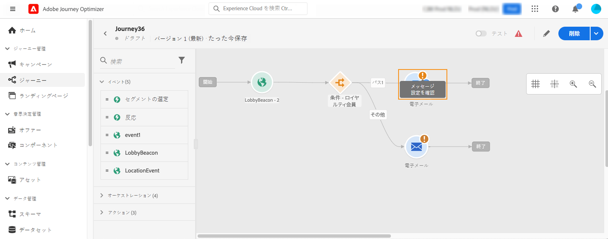
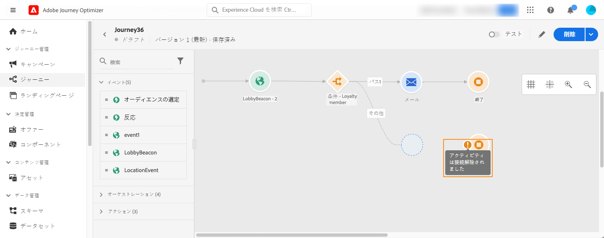
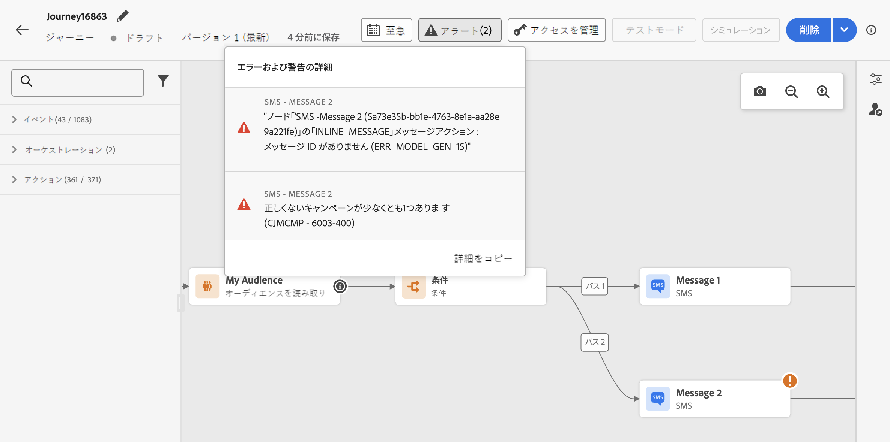

# ジャーニーのトラブルシューティング {#troubleshooting}

この節では、テストまたは公開の前にジャーニーをトラブルシューティングする方法について説明します。以下に示すチェックはすべて、ジャーニーがテストモードの場合、またはジャーニーがライブの場合に実行できます。レコメンデーションは、テストモードで以下のすべてのチェックを行い、公開に進むことです。[このページ](../building-journeys/testing-the-journey.md)を参照してください。

## テスト前のエラーチェック {#checking-for-errors-before-testing}

ジャーニーをテストおよび公開する前に、すべてのアクティビティが正しく設定されていることを確認します。システムでエラーが検出される場合は、テストまたは公開を実行できません。


### アクティビティでのエラー {#activity-errors}

エラーは、キャンバス上のアクティビティ自体に警告記号と共に表示されます。感嘆符にマウスポインターを合わせると、エラーメッセージが表示されます。アクティビティをクリックすると、エラーのある行と警告が表示されます。例：

* 必須フィールドが空の場合は、エラーが表示されます。

  

* キャンバスで 2 つのアクティビティが切断されると、警告が表示されます。

  

### ジャーニーのエラー {#canvas-errors}

エラーは、キャンバスの上にある&#x200B;**[!UICONTROL アラート]**&#x200B;ボタンからも表示されます。このボタンは、システムで検出されたエラーを表示して、テストモードのアクティベーションやジャーニーの公開を防ぎます。

システムは、**エラー**&#x200B;と&#x200B;**警告**&#x200B;の 2 種類の問題を検出します。エラーは、公開とテストアクティベーションをブロックします。警告は、テストのアクティベーションや公開をブロックしない、潜在的な問題を示します。問題の説明と、タイプ ERR_XXX_XXX の問題ログ ID が表示されます。これは問題の特定に役立ちます。



<!--Most of the time, errors detected by the system are linked to errors visible on the activities but they can also relate to other issues. In all cases, check alerts and resolve the issue using to the error description. If you cannot identify the issue, use the **[!UICONTROL Copy details]** button to store the alerts, and send them to your administrator.-->

ジャーニー全体にわたるエラーと警告は、リストの最初に表示されます。特定のアクティビティに関連するエラーと警告はその後に、アクティビティの順序や表示順によって左から右に表示されます。アラートのリストの下部にある「**[!UICONTROL 詳細をコピー]**」ボタンを使用すると、ジャーニーに関する技術情報をコピーでき、問題のトラブルシューティングに役立ちます。

### 代替パスの追加 {#canvas-add-path}

**[!UICONTROL 条件]**&#x200B;および&#x200B;**[!UICONTROL アクション]**&#x200B;のジャーニーアクティビティで、エラーが発生した場合の代替アクションを定義できます。

アクションまたは条件でエラーが発生すると、個人のジャーニーが停止します。続行する唯一の方法は、問題を解決することです。ジャーニーが中断しないように、アクティビティのプロパティで「**[!UICONTROL タイムアウトまたはエラーの場合に代替パスを追加]**」オプションをオンにすることもできます。詳しくは、[この節](../building-journeys/using-the-journey-designer.md#paths)を参照してください。


## イベントが適切に送信されているかを確認 {#checking-that-events-are-properly-sent}

ジャーニーの開始点は常にイベントです。Postman などのツールを使用してテストを実行できます。

これらのツールを介して送信する API 呼び出しが正しく送信されているかどうかを確認できます。エラーが返された場合は、呼び出しに問題があるということです。ペイロード、ヘッダー（特に組織 ID）、宛先の URL を再度確認します。ヒットするのに適した URL を管理者に問い合わせることができます。

イベントは、ソースからジャーニーに直接プッシュされるわけではありません。ジャーニーは、Adobe Experience Platform のストリーミング取得 API に依存しています。結果として、イベントに関する問題が発生した場合は、[Adobe Experience Platform のドキュメント](https://experienceleague.adobe.com/docs/experience-platform/ingestion/streaming/troubleshooting.html?lang=ja){target="_blank"}で Streaming ingestion API のトラブルシューティングを参照してください。

## ジャーニーへのエントリを確認 {#checking-if-people-enter-the-journey}

ジャーニー レポートでは、ジャーニーへのエントリをリアルタイムで測定します。

イベントが正常に送信されたにもかかわらず、ジャーニーへのエントリが確認できない場合は、ジャーニーのイベント送信とイベント受信の間に何か問題があることになります。

次の質問に従って、トラブルシューティングを開始できます。

* イベントを受信するジャーニーが、テストモードまたはライブになっているか。
* ペイロードプレビューからペイロードをコピーする前にイベントを保存したか。
* イベントペイロードにイベント ID が含まれているか。
* 正しい URL をヒットしたか。
* イベント設定ペインのペイロード構造プレビューを使用して、ストリーミング取り込み API のペイロード構造に従ったか。[このページ](../event/about-creating.md#preview-the-payload)を参照してください。
* イベントのヘッダーで正しいキーと値のペアを使用しましたか？

  ```
  X-gw-ims-org-id - your organization's ID
  Content-type - application/json
  ```

## ジャーニーの進行状況を確認 {#checking-how-people-navigate-through-the-journey}

ジャーニーレポートは、ジャーニーでの個人の進行状況を測定します。ユーザーがどこで、なぜ停止したのかを容易に特定できます。

以下に、確認すべき点をいくつか示します。

* 停止の原因が、該当するユーザーを除外する条件であるか。例えば、条件が「性別 = 男性」で、ユーザーが女性の場合。このチェックは、条件が複雑すぎない場合、ビジネスユーザーが実行できます。
* データソースへの呼び出しが応答しないためか。この情報は、ジャーニーのテスト中にテストモードログに表示されます。このジャーニーがライブになると、管理者はデータソースへの直接呼び出しをテストし、受け取った回答を確認できます。管理者は、このジャーニーを複製してテストすることもできます。

## メッセージが正常に送信されたかを確認 {#checking-that-messages-are-sent-successfully}

個人がジャーニーを適切に進んでいるのに、受信すべきメッセージが届いていない場合は、以下の点を確認します。

* [!DNL Journey Optimizer] がメッセージの送信リクエストを正しく認識している。ビジネスユーザーは、送信すべきメッセージにアクセスできます。また、最新の実行時刻がジャーニーの実行時刻と一致するかどうかを確認できます。また、受け取った最新の API 呼び出しやイベントも確認できます。
* [!DNL Journey Optimizer] が正常にメッセージを送信している。ジャーニーレポートを調べ、エラーがないことを確認します。

カスタムアクションを介して送信されたメッセージの場合、ジャーニーテストで確認できるのは、カスタムアクションのシステムを呼び出すことでエラーが発生するかどうかだけです。カスタムアクションに関連付けられた外部システムへの呼び出しがエラーにならず、それでもメッセージが送信されない場合は、外部システム側で調査する必要があります。
