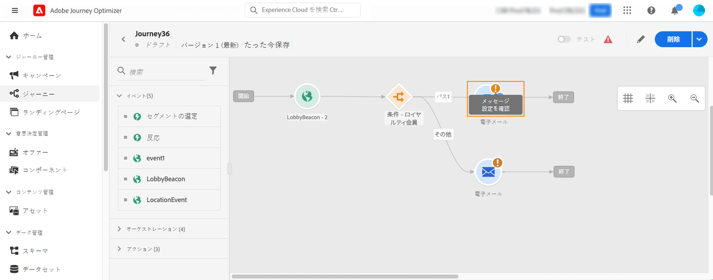
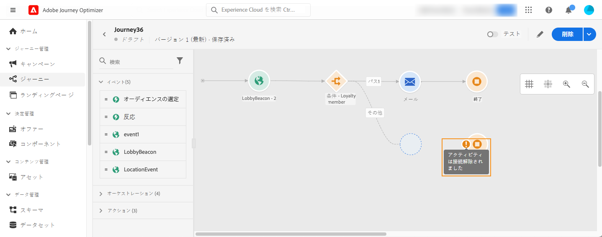
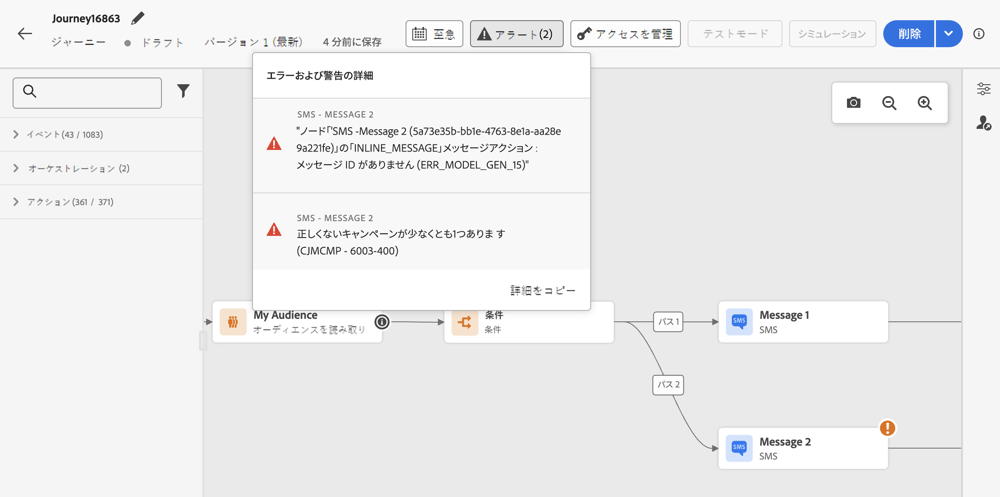

# ジャーニーをテストする前のエラーのトラブルシューティング {#troubleshooting}

>[!BEGINSHADEBOX]

**このページ：** テストまたは公開前にアクティビティとジャーニーの設定エラーを見つけて修正し、ジャーニーを問題なく実行できるようにする方法を説明します。

>[!ENDSHADEBOX]

この節では、テストまたは公開の前にジャーニーをトラブルシューティングする方法について説明します。 以下に示すチェックはすべて、ジャーニーがテストモードの場合、またはジャーニーがライブの場合に実行できます。 レコメンデーションは、テストモードで以下のすべてのチェックを行い、公開に進むことです。 テストモードについて詳しくは、[このページ](../building-journeys/testing-the-journey.md)を参照してください。

ジャーニーイベントのトラブルシューティングを行う方法と、プロファイルがジャーニーにエントリしたかどうか、プロファイルがジャーニーをどのように移動したか、メッセージが送信されたかどうかを確認する方法について詳しくは、[このページ](troubleshooting-execution.md)を参照してください。 イベントが取り込まれているにもかかわらず、イベントベースのジャーニーにプロファイルが入らない場合は、[ イベント条件のデータタイプがイベントスキーマ ](troubleshooting-execution.md#verify-event-identity-and-rule-data-types)と一致していることを確認してください。

インバウンドアクションを使用している場合、トラブルシューティングを行う方法について詳しくは、[このページ](troubleshooting-inbound.md)を参照してください。

## アクティビティでのエラー {#activity-errors}

ジャーニーをテストおよび公開する前に、すべてのアクティビティが正しく設定されていることを確認します。 システムでエラーが検出される場合は、テストまたは公開を実行できません。

エラーは、キャンバス上のアクティビティ自体に警告シンボルと共に表示されます。 感嘆符にマウスポインターを合わせると、エラーメッセージが表示されます。 アクティビティを選択すると、エラーのある行と警告が表示されます。 次に例を示します。

* 必須フィールドが空の場合は、エラーが表示されます。

  

* キャンバスで 2 つのアクティビティが切断されると、警告が表示されます。

  

## ジャーニーのエラー {#canvas-errors}

エラーは、キャンバスの上にある&#x200B;**[!UICONTROL アラート]**&#x200B;ボタンからも表示されます。 このボタンは、システムで検出されたエラーを表示して、テストモードのアクティベーションやジャーニーの公開を防ぎます。

システムは、**エラー**&#x200B;と&#x200B;**警告**&#x200B;の 2 種類の問題を検出します。 エラーは、公開とテストアクティベーションをブロックします。 警告は、テストのアクティベーションや公開をブロックしない、潜在的な問題を示します。 問題の説明と、タイプ ERR_XXX_XXX の問題ログ ID が表示されます。 これは問題の特定に役立ちます。

<!--Most of the time, errors detected by the system are linked to errors visible on the activities but they can also relate to other issues. In all cases, check alerts and resolve the issue using to the error description. If you cannot identify the issue, use the **[!UICONTROL Copy details]** button to store the alerts, and send them to your administrator.-->

ジャーニー全体にわたるエラーと警告は、リストの最初に表示されます。 特定のアクティビティに関連するエラーと警告はその後に、アクティビティの順序や表示順によって左から右に表示されます。 アラートのリストの下部にある「**[!UICONTROL 詳細をコピー]**」ボタンを使用すると、ジャーニーに関する技術情報をコピーでき、問題のトラブルシューティングに役立ちます。 コピーされたフィールドのリスト（一時停止および再開情報を含む）については、ジャーニープロパティの[技術的な詳細のコピー](journey-properties.md#access-properties)を参照してください。

## 代替パスの追加 {#canvas-add-path}

**[!UICONTROL 条件]**&#x200B;および&#x200B;**[!UICONTROL アクション]**&#x200B;のジャーニーアクティビティで、エラーが発生した場合の代替アクションを定義できます。

アクションまたは条件でエラーが発生すると、個人のジャーニーが停止します。 続行する唯一の方法は、問題を解決することです。 ジャーニーが中断しないように、アクティビティのプロパティで「**[!UICONTROL タイムアウトまたはエラーの場合に代替パスを追加]**」オプションをオンにすることもできます。 詳しくは、[こちら](../building-journeys/using-the-journey-designer.md#paths)を参照してください。
