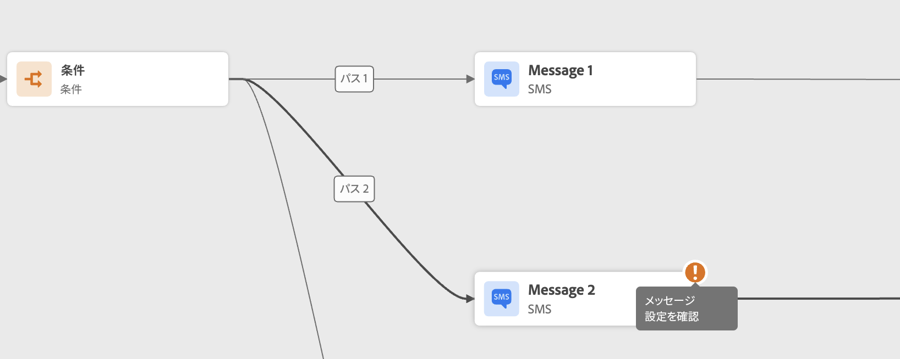

# 旅のトラブルシューティング{#troubleshooting}

この節では、テストまたはパブリッシュを行う前に journeys をトラブルシューティングする方法について説明します。 以下に示すすべてのチェックは、テストモードになっているとき、または、旅がライブ状態のときに実行できます。 以下のすべてのチェックをテストモードで行い、パブリケーションに進みます。 このページ ](../building-journeys/testing-the-journey.md) を参照してください [ 。

## テスト前のエラーの確認{#checking-for-errors-before-testing}

旅をテストしてパブリッシュする前に、すべての操作が正しく設定されていることを確認してください。 システムでエラーが検出された場合、テストやパブリケーションを実行することはできません。

エラーが表示されると、カンバス上のアクティビティに警告シンボルが表示されます。 感嘆符にカーソルを置くと、エラーメッセージが表示されます。 アクティビティをクリックした場合は、警告メッセージが表示されます。 例えば、必 &#39;90&#39;7b フィールドが空の場合は、エラーが表示されます。



例えば、canvas では、2つのアクティビティーが切断されると、警告が表示されます。


切り替え **[!UICONTROL Publish]** ボタンの隣に **[!UICONTROL Test]** は、警告サインが表示されます。この警告サインには、システムによって検出されたエラーが表示され、テストモードのライセンス認証または旅の問題が発生しません。 ほとんどの場合、システムによって検出されるエラーは、アクティビティーに表示されるエラーにリンクされていますが、他の問題にリンクしている場合もあります。 このような場合は、表示することができます。エラーの説明については、問題を確認してください。 問題を特定できない場合は、詳細をコピーして管理者に送信するか、またはサポートする必要があります。 パブリケーションをブロックするテストとエラーをブロックすると、同様のエラーが発生することに注意してください。

システムは、エラーと警告という2種類の問題を検出します。 エラーにより、公開とテストのテストが実行されます。 警告が表示されるのは、テストのアクティブ化やパブリケーションにブロックされていない潜在的な問題を示します。 問題の説明およびタイプ ERR_XXX_XXX の問題ログ ID が表示されます。 これにより、テクニカルサポートが問題を特定できるようになります。

切り替え **[!UICONTROL Publish]** ボタンの隣に **[!UICONTROL Test]** ある記号には、2つの異なる色を表示することができます。この記号は、エラーの場合は赤で表示されます。 警告がある場合は、オレンジ色で表示されます。


この旅に対してグローバルなエラーと警告は、リストの先頭に表示されます。 特定の動作に関するエラーと警告は、その後に、左から右に向かって、アクティビティの順序や外観によって順に表示されます。 **[!UICONTROL Copy details]**&#x200B;ボタンをクリックすると、サポートチームがトラブルシューティングに使用できる旅に関する技術情報がコピーされます。

1つのアクションまたは条件でエラーが発生した場合、個々の個別の旅は停止します。 続行するには、チェックボックス **[!UICONTROL Add an alternative path in case of a timeout or an error]** をオンにする必要があります。 この項 ](../building-journeys/using-the-journey-designer.md#paths) を参照してください [ 。

## イベントが正しく送信されたかどうかをチェックします。{#checking-that-events-are-properly-sent}

旅の開始点は、常にイベントになります。 Postman などのツールを使用してテストを実行することができます。

これらのツールを使用して送信した API 呼び出しが、正しく送信されたかどうかを確認することができます。 エラーが発生した場合は、通話に問題があることを示しています。 この場合、ヘッダー (および特に組織 ID) と宛先 URL の両方をもう一度確認します。 このような場合は、管理者に問い合わせてください。

イベントはソースから journeys に直接プッシュされません。 実際に、journeys は Adobe エクスペリエンスプラットフォームのストリーミング取り込み Api に依存しています。 そのため、イベント関連の問題が発生した場合は、Adobe エクスペリエンスプラットフォームのマニュアル ](https://experienceleague.adobe.com/docs/experience-platform/ingestion/streaming/troubleshooting.html) {target = &quot;_blank&quot;} を [ 参照して、ストリーミングの取り込み時に api をトラブルシューティングすることができます。

## 旅に入る人を確認する{#checking-if-people-enter-the-journey}

このような旅は、リアルタイムでの旅において、人々の入り口になります。

イベントを正常に送信しても、進行中に入り口が表示されない場合は、イベント送信とその旅でのイベントの受信との間で何らかの問題が発生していることを意味しています。

次の点を確認してください。

* 受信したイベントがテストモードになっているか、または稼動していると予想される旅になりますか。
* ペイロードプレビューからペイロードをコピーする前に、イベントを保存しましたか?
* イベントのペイロードにイベント id が含まれていますか?
* 正しい URL にヒットしたかどうかを確認してください。
* イベント設定ペインで、ペイロード構造のプレビューを使用して、ストリーミングインジェスト Api ペイロード構造に従っていますか? このページ ](../event/about-creating.md#preview-the-payload) を参照してください [ 。
* イベントのヘッダーに適切なキーと値のペアを使用しましたか?

   ```
   X-gw-ims-org-id - your organization's ID
   Content-type - application/json
   ```

## 道を通って人々が移動していることを確認します。{#checking-how-people-navigate-through-the-journey}

このような旅については、旅の各人の進行状況を測定します。 誰が停止したかを簡単に識別できます。

以下の点に注意してください。

* 人物を除外した条件によって発生していますか? 例えば、条件として「性別 = 男性」が、人物が女性であるとします。 このチェックは、条件が複雑すぎる場合、ビジネスユーザーによって実行されます。
* これは、データソースへの呼び出しが応答しないためかどうかを確認することができます。 テストが実行されると、この情報はテストモードログに記録されます。 このような旅がライブに実行されると、管理者はデータソースへの直接呼び出しをテストして、受け取った回答を確認することができます。 管理者は、旅について複製してテストすることもできます。

## メッセージが正常に送信されたかどうかをチェックします。{#checking-that-messages-are-sent-successfully}

個々の担当者が、フライト中に適切な方法をフローしますが、受け取るメッセージが表示されない場合は、次の点を確認してください。

* [!DNL Journey Optimizer] では、メッセージ送信の要求が正しく考慮されています。 Business ユーザーは、送信するメッセージにアクセスして、最新の実行時刻が旅の実行時間と一致しているかどうかを確認できます。 また、受信された最新の API 呼び出しやイベントを確認することもできます。
* [!DNL Journey Optimizer] は、メッセージを送信しました。 エラーがないことを確認するには、「道報告」を確認してください。

カスタムアクションによって送信されたメッセージについては、そのカスタムアクションのシステムの呼び出しがエラーにつながるという事実が、旅のテストの実行中にチェックされます。 カスタムアクションに関連付けられた外部システムへの呼び出しでエラーが発生することはありませんが、メッセージを送信することにならない場合は、外部システム側で調査を行う必要があります。
