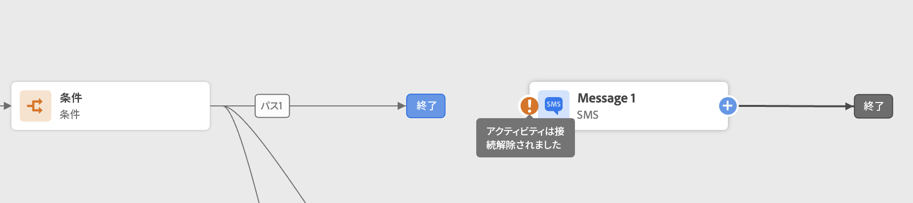

# ジャーニーのトラブルシューティング{#troubleshooting}

この節では、テストまたは公開する前にジャーニーのトラブルシューティングを行う方法を説明します。 以下に示すすべてのチェックは、ジャーニーがテストモードになっているとき、またはジャーニーがライブになっているときに実行できます。 以下のすべてのチェックをテストモードで行ってから、公開に進むことをお勧めします。 [このページ](../building-journeys/testing-the-journey.md)を参照してください。

## テスト前のエラーチェック{#checking-for-errors-before-testing}

ジャーニーをテストして公開する前に、すべてのアクティビティが正しく設定されていることを確認します。 それでもシステムでエラーが検出される場合は、テストやパブリケーションを実行できません。

キャンバス上のアクティビティ自体に警告記号が表示された状態でエラーが表示されます。 感嘆符の上にカーソルを置くと、エラーメッセージが表示されます。 アクティビティをクリックすると、エラーが発生した行に警告が表示されます。 例えば、必須フィールドが空の場合、エラーが表示されます。


例えば、キャンバスで 2 つのアクティビティが切断されると、警告が表示されます。



「」の横 **[!UICONTROL テスト]** と **[!UICONTROL 公開]** ボタンをクリックすると、警告記号が表示されます。 この警告記号は、システムが検出したエラーを表示し、テストモードのアクティベーションやジャーニーの公開を防ぎます。 ほとんどの場合、システムで検出されたエラーは、アクティビティに表示されるエラーにリンクされますが、他の問題にリンクされる場合もあります。 この場合、それらを表示することができ、エラーの説明に使用して問題を識別しようとします。 問題が特定できない場合は、詳細をコピーして管理者またはサポートに送信できます。 テストをブロックするエラーと公開をブロックするエラーは似ています。

システムは、エラーと警告の 2 種類の問題を検出します。 エラーにより、公開がブロックされ、アクティブ化がテストされます。 警告は、テストのアクティベーションまたは公開をブロックしない潜在的な問題を示します。 イシューの説明と、タイプ ERR_XXX_XXX のイシューログ ID が表示されます。 これは、テクニカルサポートが問題を特定するのに役立ちます。

の隣の記号には、2 種類の色が表示されます。 **[!UICONTROL テスト]** と **[!UICONTROL 公開]** ボタン。 エラーの場合、記号は赤で表示されます。 警告が発生した場合はオレンジで表示されます。


ジャーニー全体にわたるエラーと警告は、リストの最初に表示されます。 特定のアクティビティに関連するエラーと警告は、アクティビティの順序またはジャーニーでの左から右への出現順で後に一覧表示されます。 この **[!UICONTROL 詳細をコピー]** ボタンは、ジャーニーに関する技術情報をコピーします。サポートチームはこの情報をトラブルシューティングに使用できます。

アクションまたは条件でエラーが発生すると、個人のジャーニーは停止します。続行するには、「**[!UICONTROL タイムアウトまたはエラーの場合に代替パスを追加]**」チェックボックスをオンにするだけです。[この節](../building-journeys/using-the-journey-designer.md#paths)を参照してください。

## イベントが適切に送信されているかを確認{#checking-that-events-are-properly-sent}

ジャーニーの開始点は常にイベントです。 Postmanなどのツールを使用してテストを実行できます。

これらのツールを通じて送信した API 呼び出しが正しく送信されているかどうかを確認できます。 エラーが返された場合は、呼び出しに問題があることを意味します。 ペイロード、ヘッダー（特に組織 ID）および宛先 URL を再度確認します。 ヒットする適切な URL を管理者に問い合わせることができます。

イベントは、ソースからジャーニーに直接プッシュされるわけではありません。ジャーニーは、Adobe Experience Platform のストリーミング取得 API に依存しています。結果として、イベントに関する問題が発生した場合は、[Adobe Experience Platform のドキュメント](https://experienceleague.adobe.com/docs/experience-platform/ingestion/streaming/troubleshooting.html?lang=ja){target="_blank"}で Streaming ingestion API のトラブルシューティングを参照してください。

## ジャーニーへのエントリを確認{#checking-if-people-enter-the-journey}

ジャーニー レポートでは、ジャーニーへのエントリをリアルタイムで測定します。

イベントが正常に送信されたにもかかわらず、ジャーニーへのエントリが確認できない場合は、ジャーニーのイベント送信とイベント受信の間に何か問題があることになります。

次の質問に従って、トラブルシューティングを開始できます。

* 受信イベントを想定したジャーニーがテストモードまたはライブになっているか確認します。
* ペイロードプレビューからペイロードをコピーする前にイベントを保存しましたか？
* イベントペイロードにはイベント ID が含まれていますか？
* 正しい URL をヒットしましたか？
* イベント設定ペインのペイロード構造プレビューを使用して、ストリーミング取得 API のペイロード構造に従ったか。 [このページ](../event/about-creating.md#preview-the-payload)を参照してください。
* イベントのヘッダーで正しいキーと値のペアを使用しましたか？

  ```
  X-gw-ims-org-id - your organization's ID
  Content-type - application/json
  ```

## ジャーニーの進行状況を確認{#checking-how-people-navigate-through-the-journey}

ジャーニーレポートは、ジャーニーでの個人の進行状況を測定します。人物が職務質問された場所と理由を簡単に特定できます。

次の点に注意してください。

* それは人を除いた条件によるものですか？ 例えば、条件が「性別=男性」で、人物が女性である。 条件が複雑すぎない場合は、ビジネスユーザーがこのチェックを実行できます。
* データソースの呼び出しが応答していないことが原因ですか。 ジャーニーがテスト中の場合、この情報はテストモードのログに表示されます。 ジャーニーがライブの場合、管理者はデータソースへの直接呼び出しをテストし、受け取った回答を確認できます。 また、管理者はジャーニーを複製してテストすることもできます。

## メッセージが正常に送信されたかを確認{#checking-that-messages-are-sent-successfully}

個人がジャーニーを適切に進んでいるのに、受信すべきメッセージが届いていない場合は、以下の点を確認します。

* [!DNL Journey Optimizer] がメッセージの送信リクエストを正しく認識している。ビジネスユーザーは、送信すべきメッセージにアクセスできます。また、最新の実行時刻がジャーニーの実行時刻と一致するかどうかを確認できます。また、受け取った最新の API 呼び出しやイベントも確認できます。
* [!DNL Journey Optimizer] が正常にメッセージを送信している。ジャーニーレポートを調べ、エラーがないことを確認します。

カスタムアクションを介してメッセージが送信された場合、ジャーニーテスト中に確認できるのは、カスタムアクションのシステムの呼び出しでエラーが発生するかどうかだけです。 カスタムアクションに関連付けられた外部システムへの呼び出しがエラーにはつながらないが、メッセージ送信にはつながらない場合、外部システム側でいくつかの調査を行う必要があります。
