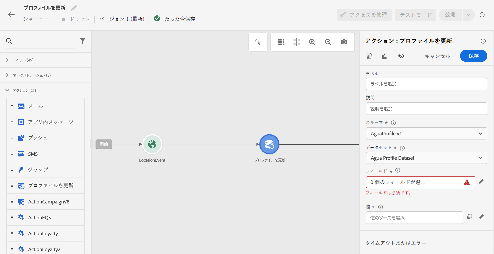
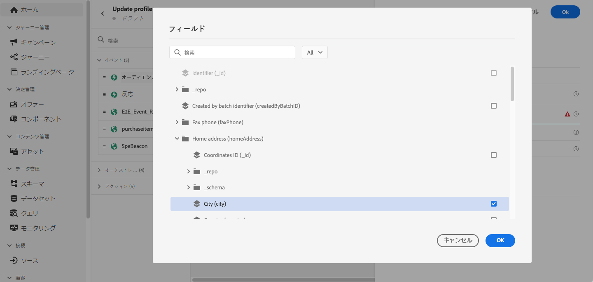
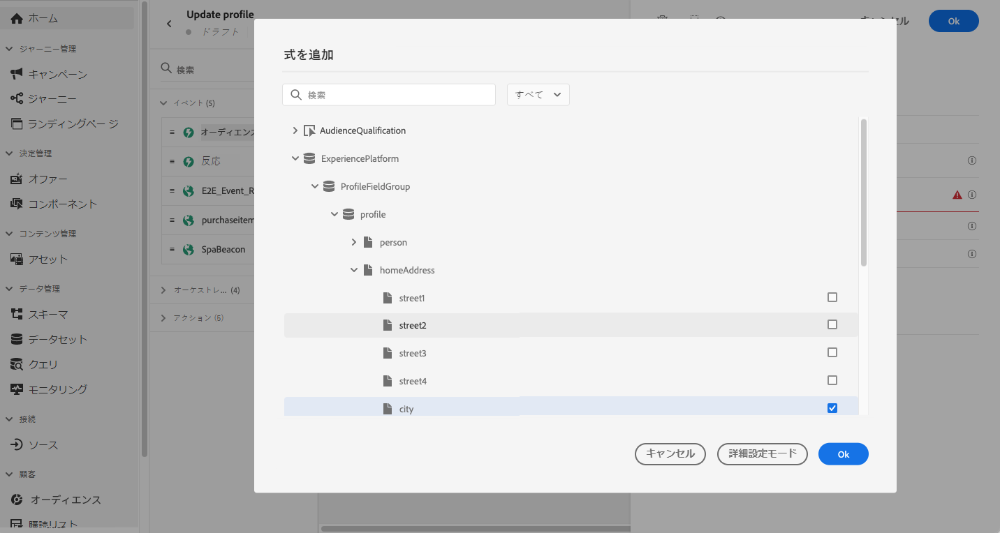
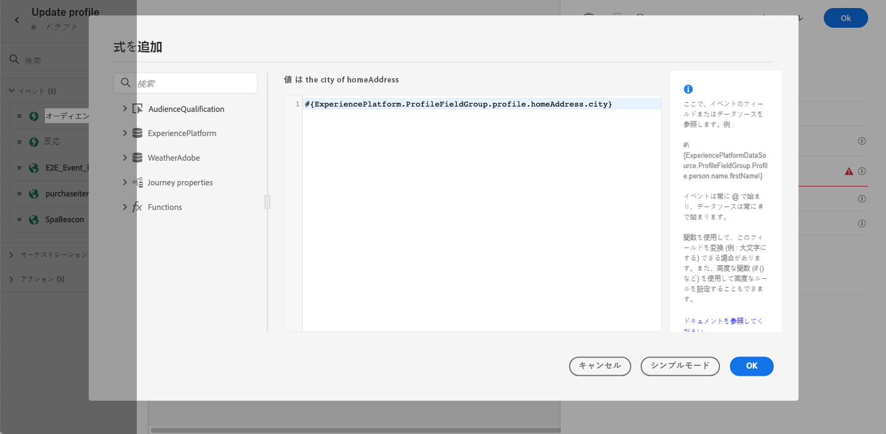
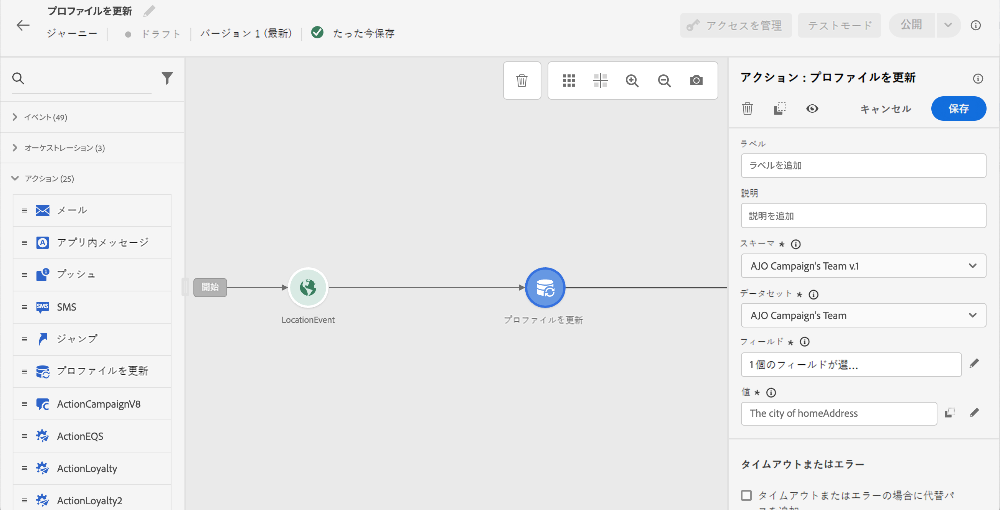

# プロファイルの更新 {#update-profile}

>[!CONTEXTUALHELP]
>id="ajo_journey_update_profiles"
>title="プロファイルアクティビティの更新"
>abstract="プロファイルの更新アクションアクティビティを使用すると、イベントから得られた情報やデータソース、または特定の値を使用して、既存の [!DNL Adobe Experience Platform] のプロファイルを更新できます。"

顧客がジャーニーを進む際に、**[!UICONTROL プロファイルの更新]** アクション アクティビティを使用して、既存の[!DNL Adobe Experience Platform] プロファイルを強化または修正します。 ジャーニーイベント、設定されたデータソース、静的値から取得したフィールド値を設定することで、ジャーニーキャンバスから離れることなく、プロファイルデータを正確かつ実用的に保つことができます。 このアクティビティを設定する前に、適用される[&#x200B; ガードレールと制限](#guardrails)を確認してください。

## データセットの選択 {#dataset-selection}

**[!UICONTROL プロファイルを更新]**&#x200B;アクティビティには、更新を保存する専用のデータセットが必要です。このアクティビティは[&#x200B; プロファイルストア &#x200B;](https://experienceleague.adobe.com/docs/experience-platform/profile/home.html?lang=ja#profile-data-store){target="_blank"} （データレイクではない）のみを更新するため、すべての更新は、[&#x200B; プロファイルの更新](https://experienceleague.adobe.com/ja/docs/experience-platform/catalog/datasets/user-guide#enable-profile){target="_blank"} アクション用に特別に指定された&#x200B;**[!UICONTROL プロファイル対応データセット]**&#x200B;に保存する必要があります。

>[!CAUTION]
>
>バッチまたはストリーミングの取り込みにも使用されるデータセットを使用しないでください。 他の取り込み実行では、**[!UICONTROL プロファイルを更新]** アクションによって行われた変更が上書きされ、プロファイル属性が消えたり、以前の値に戻ったりします。 このビヘイビアーが発生する場合は、Adobe Experience Platformで、他の取り込みが同じデータセットに書き込まれていないことを確認します。 トラブルシューティング手順については、「[Adobe Journey Optimizerでのプロファイル更新エラーの解決](https://experienceleague.adobe.com/ja/docs/experience-cloud-kcs/kbarticles/ka-26352){target="_blank"}」を参照してください。

さらに、**[!UICONTROL プロファイルの更新]** アクティビティ設定には、[ID名前空間](https://experienceleague.adobe.com/ja/docs/experience-platform/identity/features/namespaces){target="_blank"}は必要ありません。 そのため、選択したデータセットには、ジャーニーを開始したアクションで使用した、更新で使用する名前空間と同じ **[!UICONTROL ID 名前空間]**&#x200B;を使用します。また、選択したデータセットで ID マップを使用することもできます。正しいID名前空間またはID マップを使用するデータセットを選択しないと、**[!UICONTROL プロファイルを更新]** アクティビティが失敗します。

## 「プロファイルを更新」アクティビティの設定 {#use-profile-update}

ジャーニーで&#x200B;**[!UICONTROL プロファイルの更新]** アクティビティを設定するには、次の手順に従います。

1. ジャーニーの設計を開始します。 詳しくは、[初めてのジャーニーの作成](../building-journeys/journey-gs.md)を参照してください。

1. パレットの「**[!UICONTROL アクション]**」セクションで、「**[!UICONTROL プロファイルを更新]**」アクティビティをキャンバスにドロップします。

   

1. リストからスキーマを選択します。

   >[!NOTE]
   >
   >選択したXDM プロファイルスキーマに既に存在するフィールドのみが選択できます。 必要なフィールドがリストされていない場合は、最初にAdobe Experience Platformのスキーマに追加します。

1. **[!UICONTROL フィールド]**&#x200B;をクリックして、更新するフィールドを選択します。

   

1. リストからデータセットを選択します。

   >[!NOTE]
   >
   >「**[!UICONTROL プロファイルを更新]**」アクションは、プロファイルデータをリアルタイムで更新しますが、データセットは更新されません。データセットの選択は、プロファイルがデータセットに関連するレコードであるため、必要です。

1. 「**[!UICONTROL 値]**」フィールドをクリックして、使用する値を定義します。

   * 簡単な式エディターを使用して、データソースまたは受信イベントからフィールドを選択できます。

     

   * 特定の値を定義する場合や高度な機能を活用する場合は、「[**[!UICONTROL 詳細設定モード]**](expression/expressionadvanced.md)」を選択します。

     

1. 同じアクションで追加のプロファイル属性を更新するには、**[!UICONTROL 別のフィールドを更新]**&#x200B;をクリックし、フィールドと値の選択を繰り返します。 1回の&#x200B;**[!UICONTROL プロファイルを更新]** アクションで、最大5つのフィールドと値のペアを追加できます。 [&#x200B; ガードレールと制限事項](#guardrails)を参照してください。

「**[!UICONTROL プロファイルを更新]**」アクティビティが設定されました。

## プロファイル更新のテスト {#using-the-test-mode}

[&#x200B; テストモード &#x200B;](testing-the-journey.md)では、プロファイルの更新はテストプロファイルにすぐに反映され、シミュレートされないことに注意してください。

テストモードでは、テストプロファイルのみがジャーニーにエントリできます。新しいテストプロファイルを作成するか、既存のプロファイルをテストプロファイルに変換できます。 [!DNL Adobe Experience Platform]では、プロファイル属性はCSV ファイルの読み込みまたはAPI呼び出しによって更新できます。 より簡単な方法は、ジャーニー自体で&#x200B;**[!UICONTROL プロファイルの更新]** アクティビティを使用して、テストプロファイルブール値フィールドをtrueに設定することです。

既存のプロファイルをテストプロファイルに変換する方法について詳しくは、この[&#x200B; セクション &#x200B;](../audience/creating-test-profiles.md#create-test-profiles-csv)を参照してください。

## ガードレールと制限 {#guardrails}

* **[!UICONTROL プロファイルを更新]** アクションは、[名前空間](../event/about-creating.md#select-the-namespace)を持つジャーニーでのみ使用できます。
* アクションは既存のフィールドのみを更新します。新しいプロファイルフィールドは作成されません。
* アクションは、単純なフィールドタイプ（文字列、数値、ブール値）のみをサポートします。 列挙、推奨値、オブジェクト配列、または複雑なコレクション（製品リストなど）として定義されたXDM フィールドはサポートされていません。
* **[!UICONTROL プロファイルの更新]** アクションを使用して、購入などの[&#x200B; エクスペリエンスイベント &#x200B;](../event/about-events.md)を生成することはできません。
* 他のアクションと同様に、エラーまたはタイムアウトの場合に[代替パスを定義できます](using-the-journey-designer.md#paths)。 2つのアクションを並行して配置することはできません。
* プロファイルの更新は、同じジャーニーのダウンストリームですぐに利用できる保証はありません。 更新された値がまだ反映されていない可能性があるため、フィールドを書き込む&#x200B;**[!UICONTROL プロファイルを更新]** アクションの直後にフィールドを読み込むアクションを配置しないでください。
* **[!UICONTROL プロファイルの更新]** アクティビティは、データレイクではなく、[&#x200B; プロファイルストア &#x200B;](https://experienceleague.adobe.com/docs/experience-platform/profile/home.html?lang=ja#profile-data-store){target="_blank"}のみを更新します。
* 1回の&#x200B;**[!UICONTROL プロファイルを更新]** アクションで、最大5つのフィールド/値のペアを更新できます。 「**[!UICONTROL 別のフィールドを更新]**」ボタンを使用して、さらにペアを追加します。
* パフォーマンスを向上させるには、属性ごとに1つのアクションを使用するのではなく、複数の属性更新を1つの&#x200B;**[!UICONTROL プロファイルを更新]** アクションにグループ化します。
