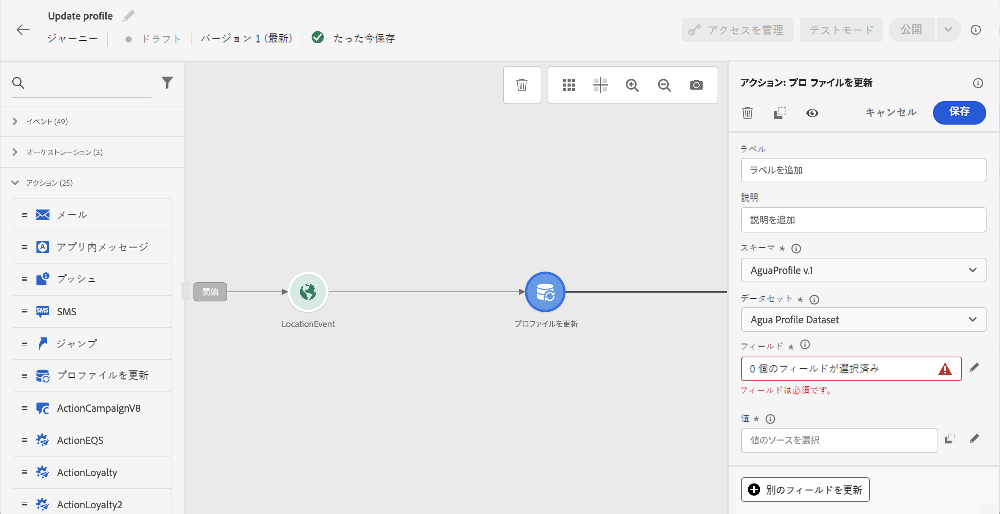
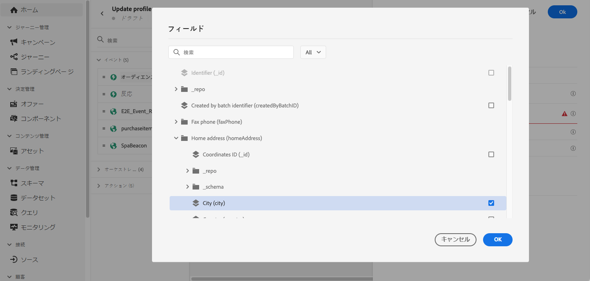
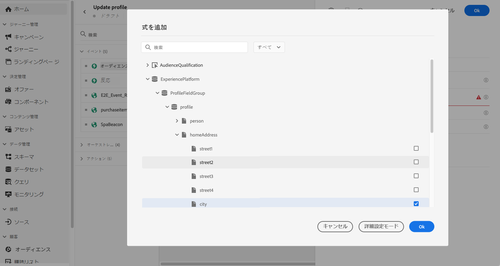
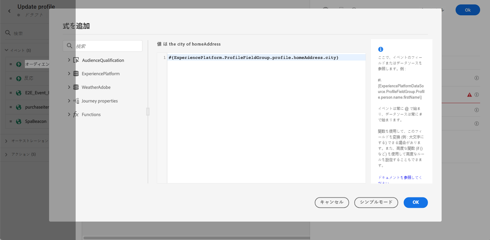
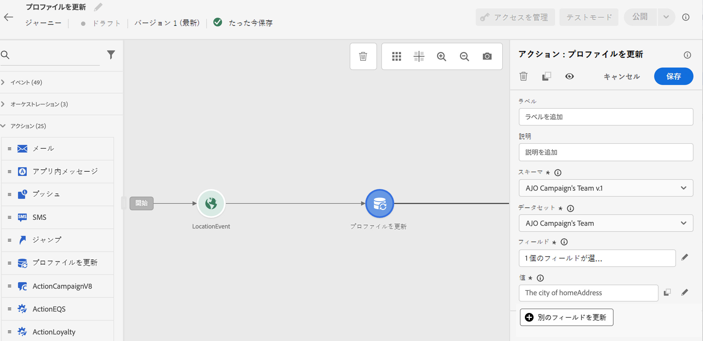

# プロファイルの更新 {#update-profile}

>[!BEGINSHADEBOX]

**このページでは、** 「プロファイルを更新」アクション アクティビティを使用して、お客様がジャーニーを進む際に、既存のAdobe Experience Platform プロファイルを拡充または修正する方法について説明します。

>[!ENDSHADEBOX]

>[!CONTEXTUALHELP]
>id="ajo_journey_update_profiles"
>title="プロファイルアクティビティの更新"
>abstract="プロファイルの更新アクションアクティビティを使用すると、イベントから得られた情報やデータソース、または特定の値を使用して、既存の [!DNL Adobe Experience Platform] のプロファイルを更新できます。"

顧客がジャーニーを進む際に、**[!UICONTROL プロファイルの更新]** アクション アクティビティを使用して、既存の[!DNL Adobe Experience Platform] プロファイルを強化または修正します。 ジャーニーイベント、設定されたデータソース、静的値から取得したフィールド値を設定することで、ジャーニーキャンバスから離れることなく、プロファイルデータを正確かつ実用的に保つことができます。 このアクティビティを設定する前に、適用される[&#x200B; ガードレールと制限](#guardrails)を確認してください。

## データセットの選択 {#dataset-selection}

**[!UICONTROL プロファイルを更新]**&#x200B;アクティビティには、更新を保存する専用のデータセットが必要です。 このアクティビティは[&#x200B; プロファイルストア &#x200B;](https://experienceleague.adobe.com/docs/experience-platform/profile/home.html?lang=ja#profile-data-store){target="_blank"} （データレイクではない）のみを更新するため、すべての更新は、**[!UICONTROL プロファイルの更新]** アクション用に特別に指定された[&#x200B; プロファイル対応データセット &#x200B;](https://experienceleague.adobe.com/ja/docs/experience-platform/catalog/datasets/user-guide#enable-profile){target="_blank"}に保存する必要があります。

>[!CAUTION]
>
>バッチまたはストリーミングの取り込みにも使用されるデータセットを使用しないでください。 他の取り込み実行では、**[!UICONTROL プロファイルを更新]** アクションによって行われた変更が上書きされ、プロファイル属性が消えたり、以前の値に戻ったりします。 このビヘイビアーが発生する場合は、Adobe Experience Platformで、他の取り込みが同じデータセットに書き込まれていないことを確認します。 トラブルシューティング手順については、「[Adobe Journey Optimizerでのプロファイル更新エラーの解決](https://experienceleague.adobe.com/ja/docs/experience-cloud-kcs/kbarticles/ka-26352){target="_blank"}」を参照してください。

さらに、**[!UICONTROL プロファイルの更新]** アクティビティ設定には、[ID名前空間](https://experienceleague.adobe.com/ja/docs/experience-platform/identity/features/namespaces){target="_blank"}は必要ありません。 そのため、選択したデータセットには、ジャーニーを開始したアクションで使用した、更新で使用する名前空間と同じ **[!UICONTROL ID 名前空間]**&#x200B;を使用します。 また、選択したデータセットで ID マップを使用することもできます。 正しいID名前空間またはID マップを使用するデータセットを選択しないと、**[!UICONTROL プロファイルを更新]** アクティビティが失敗します。

## プロファイルの更新アクティビティの設定 {#use-profile-update}

ジャーニーで&#x200B;**[!UICONTROL プロファイルの更新]** アクティビティを設定するには、次の手順に従います。

1. ジャーニーの設計を開始します。 詳しくは、[初めてのジャーニーの作成](../building-journeys/journey-gs.md)を参照してください。

1. パレットの「**[!UICONTROL アクション]**」セクションで、「**[!UICONTROL プロファイルを更新]**」アクティビティをキャンバスにドロップします。

   

1. リストからスキーマを選択します。

   >[!NOTE]
   >
   >選択したXDM プロファイルスキーマに既に存在するフィールドのみが選択できます。 必要なフィールドがリストされていない場合は、最初にAdobe Experience Platformのスキーマに追加します。

1. 「**[!UICONTROL フィールド]**」をクリックして、更新するフィールドを選択します。

   

1. リストからデータセットを選択します。

   >[!NOTE]
   >
   >「**[!UICONTROL プロファイルを更新]**」アクションは、プロファイルデータをリアルタイムで更新しますが、データセットは更新されません。 データセットの選択は、プロファイルがデータセットに関連するレコードであるため、必要です。

1. 「**[!UICONTROL 値]**」フィールドをクリックして、使用する値を定義します。

   * 簡単な式エディターを使用して、データソースまたは受信イベントからフィールドを選択できます。

     

   * 特定の値を定義する場合や高度な機能を活用する場合は、「[**[!UICONTROL 詳細設定モード]**](expression/expressionadvanced.md)」を選択します。

     

1. 同じアクションで追加のプロファイル属性を更新するには、**[!UICONTROL 別のフィールドを更新]**&#x200B;をクリックし、フィールドと値の選択を繰り返します。 1回の&#x200B;**[!UICONTROL プロファイルを更新]** アクションで、最大5つのフィールドと値のペアを追加できます。 [&#x200B; ガードレールと制限事項](#guardrails)を参照してください。

「**[!UICONTROL プロファイルを更新]**」アクティビティが設定されました。

## プロファイル更新のテスト {#using-the-test-mode}

[&#x200B; テストモード &#x200B;](testing-the-journey.md)では、プロファイルの更新はテストプロファイルにすぐに反映され、シミュレートされないことに注意してください。

テストモードでは、テストプロファイルのみがジャーニーにエントリできます。 新しいテストプロファイルを作成するか、既存のプロファイルをテストプロファイルに変換できます。 [!DNL Adobe Experience Platform]では、プロファイル属性はCSV ファイルの読み込みまたはAPI呼び出しによって更新できます。 より簡単な方法は、ジャーニー自体で&#x200B;**[!UICONTROL プロファイルの更新]** アクティビティを使用して、テストプロファイルブール値フィールドをtrueに設定することです。

既存のプロファイルをテストプロファイルに変換する方法について詳しくは、この[&#x200B; セクション &#x200B;](../audience/creating-test-profiles.md#create-test-profiles-csv)を参照してください。

## ガードレールと制限 {#guardrails}

* **[!UICONTROL プロファイルを更新]** アクションは、[名前空間](../event/about-creating.md#select-the-namespace)を持つジャーニーでのみ使用できます。
* アクションは既存のフィールドのみを更新します。新しいプロファイルフィールドは作成されません。
* アクションは、単純なフィールドタイプ（文字列、数値、ブール値）のみをサポートします。 列挙、推奨値、オブジェクト配列、または複雑なコレクション（製品リストなど）として定義されたXDM フィールドはサポートされていません。
* **[!UICONTROL プロファイルの更新]** アクションを使用して、購入などの[&#x200B; エクスペリエンスイベント &#x200B;](../event/about-events.md)を生成することはできません。
* 他のアクションと同様に、エラーまたはタイムアウトの場合に[代替パスを定義できます](using-the-journey-designer.md#paths)。 2つのアクションを並行して配置することはできません。
* プロファイルの更新は、同じジャーニーのダウンストリームですぐに利用できる保証はありません。 更新された値がまだ反映されていない可能性があるため、フィールドを書き込む&#x200B;**[!UICONTROL プロファイルを更新]** アクションの直後にフィールドを読み込むアクションを配置しないでください。
* **[!UICONTROL プロファイルを更新]**&#x200B;アクティビティでは、[プロファイルストア](https://experienceleague.adobe.com/docs/experience-platform/profile/home.html?lang=ja#profile-data-store){target="_blank"}のみが更新され、データレイクは更新されません。
* 1回の&#x200B;**[!UICONTROL プロファイルを更新]** アクションで、最大5つのフィールド/値のペアを更新できます。 「**[!UICONTROL 別のフィールドを更新]**」ボタンを使用して、さらにペアを追加します。
* パフォーマンスを向上させるには、属性ごとに1つのアクションを使用するのではなく、複数の属性更新を1つの&#x200B;**[!UICONTROL プロファイルを更新]** アクションにグループ化します。

+++ AI ナレッジリファレンス

このセクションには、このトピックに関連する解釈、検索、質問への回答をサポートすることを目的とした構造化された知識が含まれています。

理解を深めるには、この情報をこのページのドキュメントと組み合わせる必要があります。 どちらのソースも単独で使用することを意図していません。このページでは、機能について説明しますが、この節では、用語、意図、適用可能性、および制約の曖昧さを解消するのに役立つ追加のコンテキストを提供します。

* **TL;DR:**&#x200B;このページでは、「プロファイルを更新」アクティビティを設定して、カスタマージャーニーの進行状況に合わせて、ジャーニーイベント、データソース、または静的値のデータを使用して、既存のAdobe Experience Platform プロファイルを拡充または修正する方法について説明します。

**インテント：**

* ジャーニー中に既存のプロファイル属性を変更するには、「プロファイルを更新」アクティビティを設定します
* プロファイルの更新アクション専用のプロファイル対応データセットを選択します
* ジャーニーイベント、データソース、静的値のフィールド値をプロファイル属性にマッピングします
* 1つのアクティビティで複数のプロファイル属性（最大5つ）を更新する
* ジャーニーテストモードでのプロファイル更新のテスト

**用語集：**

* **プロファイルアクティビティの更新**: プロファイルがジャーニー&#x200B;*（製品固有）*&#x200B;を移動すると、新しい値をリアルタイムでAdobe Experience Platform プロファイルの既存のフィールドに書き込むアクションアクティビティ
* **Profile Store**: Data Lake *（製品固有）*&#x200B;とは異なる、リアルタイムの顧客プロファイルデータを保持するAdobe Experience Platform ストア
* **ID名前空間**：更新中のプロファイル *（製品固有）*&#x200B;に一致するために使用されるID コンテキスト（電子メール、CRM IDなど）を区別するラベル
* **プロファイル対応データセット**：統合プロファイル *（製品固有）*&#x200B;にレコードを提供するように設定されたAdobe Experience Platform データセット

**ガードレール：**

* 「プロファイルを更新」アクションは、名前空間が定義されているジャーニーでのみ使用できます。
* アクションは既存のXDM フィールドのみを更新します。新しいプロファイルフィールドを作成することはできません。
* 単純なフィールドタイプ（文字列、数値、ブール値）のみがサポートされます。列挙、オブジェクト配列、複雑なコレクションはサポートされていません。
* アクションは、購入などのエクスペリエンスイベントを生成できません。
* 1回の「プロファイルを更新」アクションで、最大5つのフィールド/値のペアを更新できます。
* 他の取り込み実行では「プロファイルの更新」の変更が上書きされるため、専用データセットをバッチまたはストリーミング取り込みプロセスと共有しないでください。
* プロファイルの更新は、同じジャーニー実行のダウンストリームですぐに利用できない場合があります。
* アクティビティは、データレイクではなくプロファイルストアのみを更新します。

**用語：**

* 正規名：プロファイルの更新 – Acronym: none — バリアント：プロファイルアクティビティの更新、プロファイルアクションの更新
* 同義語：「プロファイルストア」 =「リアルタイム顧客プロファイルストア」
* 「プロファイルストア」（このアクティビティによって更新）≠「データレイク」（このアクティビティによって更新されません）は混同しないでください

**FAQ:**

* **Q: プロファイルを更新アクティビティで新しいプロファイルフィールドを作成できますか？**  – いいえ、選択したXDM プロファイルスキーマに既に存在するフィールドのみを更新できます。
* **Q: プロファイルの更新アクションに専用のデータセットを使用する必要があるのはなぜですか？** — データセットをバッチまたはストリーミング取り込みと共有すると、他の取り込み実行で、「プロファイルを更新」アクティビティによって行われた変更が上書きされる場合があります。
* **Q: プロファイルの更新は、同じジャーニー内のダウンストリームアクティビティにすぐに表示されますか？**  – いいえ、更新プロファイル アクティビティが書き込んだ直後にアクションが同じフィールドを読み取った場合、更新された値はまだ反映されません。
* **Q: 1回の「プロファイルを更新」アクションで更新できるフィールド数は？** — 「別のフィールドを更新」ボタンを使用して、1つのアクティビティで最大5つのフィールドと値のペアを設定できます。
* **Q: プロファイルの更新はテストモードで適用されますか？**  – はい、テストモードでは、更新はテストプロファイルにすぐに反映され、シミュレートされません。

+++
