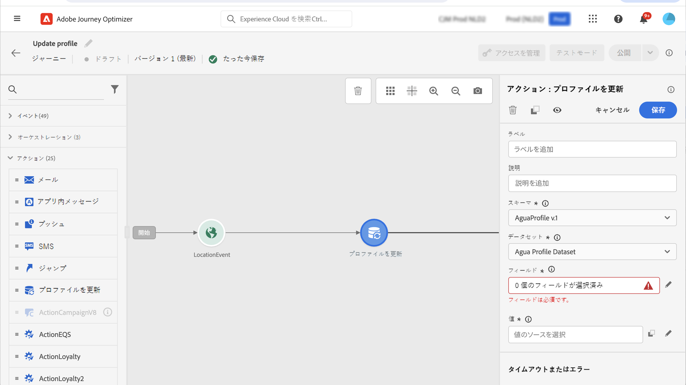
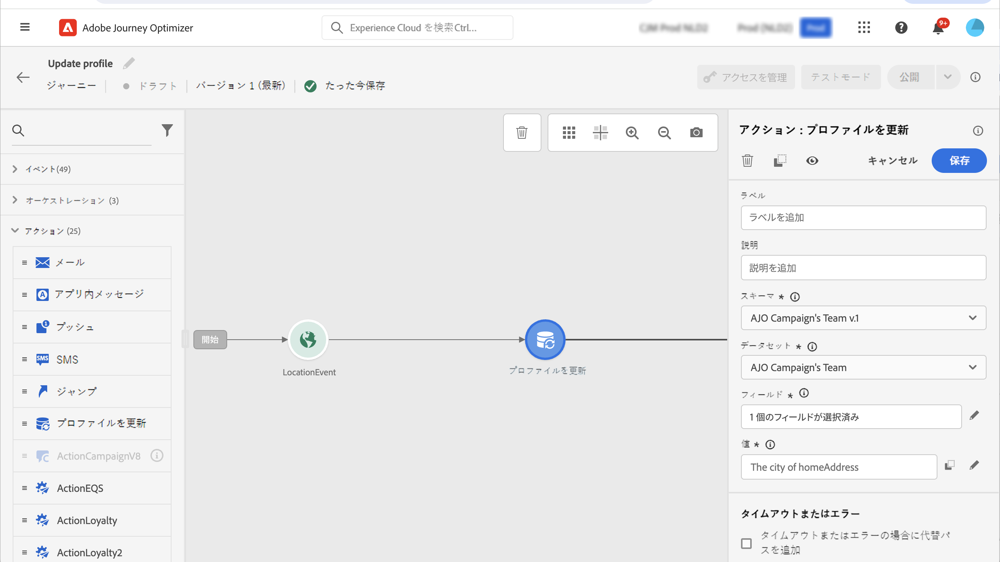

# プロファイルの更新 {#update-profile}

>[!CONTEXTUALHELP]
>id="ajo_journey_update_profiles"
>title="プロファイルアクティビティの更新"
>abstract="「プロファイルを更新」アクションアクティビティを使用すると、イベントやデータソースから得られた情報または特定の値を使用して、既存の Adobe Experience Platform のプロファイルを更新できます。"

「**[!UICONTROL プロファイルを更新]**」アクションアクティビティを使用すると、イベントやデータソースから得られた情報または特定の値を使用して、既存の Adobe Experience Platform のプロファイルを更新できます。

## レコメンデーション

* 「**プロファイルを更新**」アクションは、名前空間を持つイベントで開始されるジャーニーでのみ使用できます。
* このアクションでは、既存のフィールドのみが更新され、新しいプロファイルフィールドは作成されません。
* 「**プロファイルを更新**」アクションを使用して、購入などのエクスペリエンスイベントを生成することはできません。
* 他のアクションのように、エラーやタイムアウトの場合の代替パスを定義できます。また、2 つのアクションを並行して配置することはできません。
* Adobe Experience Platform に送信される更新リクエストは、即時もしくは 1 秒以内です。通常は数秒かかりますが、もっと時間がかかる場合もあり、保証はありません。そのため、例えば、アクションが、その直前に配置された「**プロファイルを更新**」アクションによって更新された「フィールド 1」を使用している場合、「フィールド 1」がアクションで更新されるとは限りません。
* この&#x200B;**プロファイルを更新**&#x200B;アクティビティは、定義済みリストとして定義された XDM フィールドをサポートしていません。
* The **[!UICONTROL プロファイルを更新]** アクティビティは、 [プロファイルストア](https://experienceleague.adobe.com/docs/experience-platform/profile/home.html#profile-data-store){target="_blank"}ではなく、データレイクです。
* データセットを **[!UICONTROL プロファイルを更新]** アクティビティの場合は、データ取り込みフローのターゲットにならないものを使用することをお勧めします。 **[!UICONTROL プロファイルを更新]** 次の場所にのみ保存されている更新 [プロファイルストア](https://experienceleague.adobe.com/docs/experience-platform/profile/home.html#profile-data-store){target="_blank"}の場合、データ取り込みフローでそのような変更が上書きされるリスクがあります。

## プロファイル更新の使用

1. ジャーニーのデザインをイベントから始めます。この[節](../building-journeys/journey.md)を参照してください。

1. パレットの「**アクション**」セクションで、「**プロファイルを更新**」アクティビティをキャンバスにドロップします。

   

1. リストからスキーマを選択します。

1. 「**フィールド**」をクリックして、更新するフィールドを選択します。選択できるフィールドは 1 つだけです。

   

1. リストからデータセットを選択します。

   >[!NOTE]
   >
   >「**プロファイルを更新**」アクションは、プロファイルデータをリアルタイムで更新しますが、データセットは更新されません。データセットの選択は、プロファイルがデータセットに関連するレコードであるため、必要です。

1. 「**値**」フィールドをクリックして、使用する値を定義します。

   * 簡単な式エディターを使用して、データソースまたは受信イベントからフィールドを選択できます。

     

   * 特定の値を定義する場合や高度な機能を利用する場合は、「**詳細設定モード**」をクリックします。

     

これで、「**プロファイルを更新**」を設定できました。

## テストモードの使用 {#using-the-test-mode}

テストモードでは、プロファイルの更新はシミュレートされません。更新はテストプロファイルに対して実行されます。

テストモードでは、テストプロファイルのみがジャーニーにエントリできます。新しいテストプロファイルを作成するか、既存のプロファイルをテストプロファイルに変換します。Adobe Experience Platform では、csv ファイルのインポートまたは API の呼び出しを使用してプロファイル属性を更新できます。さらに簡単な方法として、「**プロファイルを更新**」アクションアクティビティを使用し、テストプロファイルのブール値フィールドを false から true に変更します。

既存のプロファイルをテストプロファイルに変換する方法について詳しくは、[この節](../audience/creating-test-profiles.md#create-test-profiles-csv)を参照してください。
