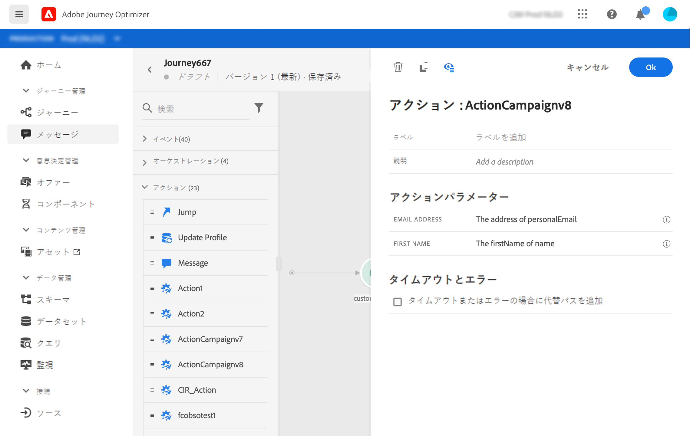

# Adobe Campaign v7／v8 のアクション {#using_campaign_classic}

統合は、Adobe Campaign v7 または v8 がある場合に使用できます。 これにより、Adobe Campaign のトランザクションメッセージ機能を使用して、メール、プッシュ通知、SMS などを送信できるようになります。

Journey Optimizer と Campaign インスタンスとの接続は、プロビジョニング時にアドビによって設定されます。アドビにご連絡ください。

これを機能させるには、専用のアクションを設定する必要があります。 [この節](../action/acc-action.md)を参照してください。

エンドツーエンドのユースケースについては、この[節](../building-journeys/campaign-classic-use-case.md)を参照してください。

1. イベントから始めて、ジャーニーを設計します。 この[節](../building-journeys/journey.md)を参照してください。
1. パレットの「**アクション**」セクションで、Campaign アクションを選択してジャーニーに追加します。
1. **アクションパラメーター**&#x200B;には、メッセージペイロードで想定されるすべてのフィールドが表示されます。 これらの各フィールドを、イベントまたはデータソースのいずれかから使用するフィールドにマッピングする必要があります。これはカスタムアクションと似ています。 [この節](../building-journeys/using-custom-actions.md)を参照してください。

