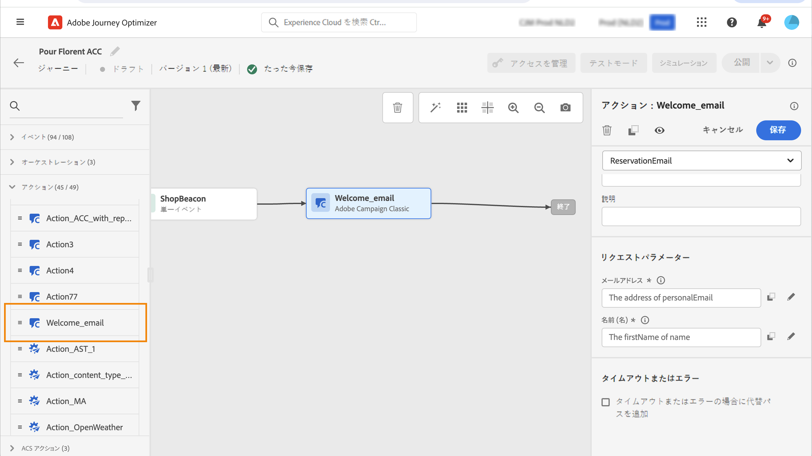

# Adobe キャンペーン v7/v8 アクション {#using_campaign_classic}

Adobe キャンペーン v7 または v8 を使用している場合は、統合されています。 この機能を使用すると、Adobe キャンペーンのトランザクションメッセージ機能を使用して、電子メール、プッシュ通知、SMS を使用して電子メールを送信できます。

このように、旅オプティマイザーとキャンペーンインスタンス間の接続は、準備時にアドビシステムズ社によって設定されています。 アドビシステムズ社の担当者にお問い合わせください。

これを機能させるには、専用のアクションを設定する必要があります。 この [ 項 ](../action/acc-action.md) を参照してください。

この [ 節 ](../building-journeys/ajo-ac.md) では、エンドツーエンドのユースケースについて説明します。

1. イベントから開始して、旅をデザインします。 この [ 項 ](../building-journeys/journey.md) を参照してください。
1. **「パレット」の「アクション** 」セクションで、キャンペーンアクションを選択して、旅に追加します。
1. **アクションパラメーター** では、メッセージペイロードに必要なすべてのフィールドが表示されます。イベントまたはデータソースのいずれかを使用して、使用するフィールドにこれらのフィールドをマップする必要があります。 これは、カスタムアクションに似ています。 この [ 項 ](../building-journeys/using-custom-actions.md) を参照してください。

