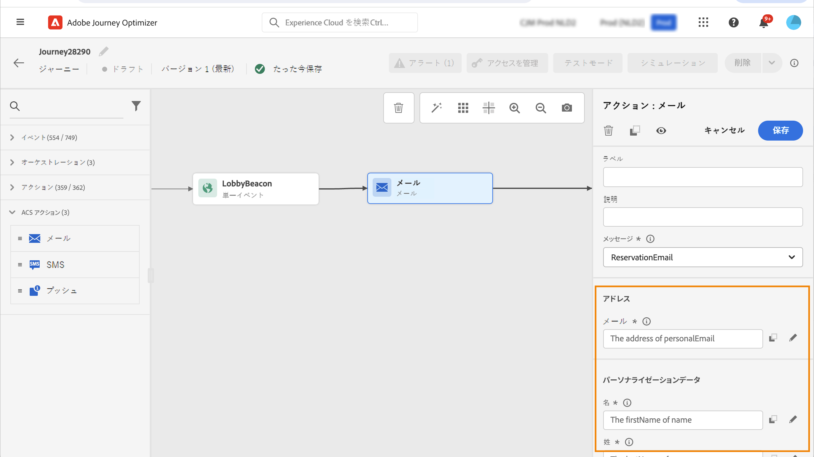
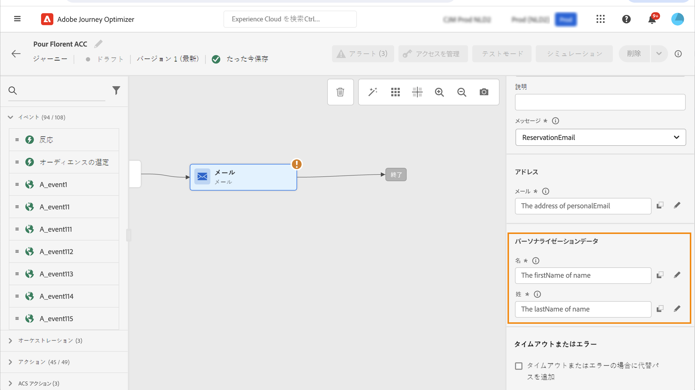

# Adobe Campaign Standard のアクション {#using_campaign_action}

>[!CONTEXTUALHELP]
>id="ajo_journey_action_custom_acs"
>title="カスタムアクション"
>abstract="統合は、Adobe Campaign Standard のユーザーが使用できます。Adobe Campaign のトランザクションメッセージ機能を使用して、メール、プッシュ通知、SMS などを送信できるようになります。"

Adobe Campaign Standard をお使いの場合、**[!UICONTROL メール]**、**[!UICONTROL プッシュ]**&#x200B;および **[!UICONTROL SMS]** の組み込みアクションアクティビティを使用できます。

>[!NOTE]
>
>その場合、組み込みのアクションを設定する必要があります。[このページ](../action/acs-action.md)を参照してください。

これらのチャネルごとに、Adobe Campaign Standard トランザクションメッセージ&#x200B;**テンプレート**&#x200B;を選択します。組み込みのメール、SMS およびプッシュチャネルの場合、メッセージ送信の実行にはトランザクションメッセージを使用します。つまり、ジャーニーで特定のメッセージテンプレートを使用する場合は、Adobe Campaign Standard で公開する必要があります。この機能の使用方法を学ぶには、[このページ](https://experienceleague.adobe.com/docs/campaign-standard/using/communication-channels/transactional-messaging/getting-started-with-transactional-msg.html?lang=ja)を参照してください。

>[!NOTE]
>
>Journey Optimizer で使用するには、Campaign Standard トランザクションメッセージとそれに関連するイベントを公開する必要があります。イベントが公開されてもメッセージが表示されない場合、Journey Optimizer インターフェイスには表示されません。メッセージが公開されても、関連するイベントが公開されなかった場合、Journey Optimizer インターフェイスには表示されますが、使用はできません。


イベント（リアルタイムとも呼ばれます）またはプロファイルトランザクションメッセージテンプレートを使用できます。

>[!NOTE]
>
>リアルタイムトランザクションメッセージ（rtEvent）を送信する場合、またはカスタムアクションによってサードパーティシステムでメッセージをルーティングする場合、疲労、ブロックリスト、購読解除の管理に特定の設定が必要です。例えば、「購読解除」属性がAdobe Experience Platformまたはサードパーティシステムに保存されている場合、メッセージが送信される前に条件を追加して、この条件を確認する必要があります。

テンプレートを選択すると、メッセージペイロードで期待されるすべてのフィールドが、**[!UICONTROL アドレス]**&#x200B;および&#x200B;**[!UICONTROL パーソナライゼーションデータ]**&#x200B;の下のアクティビティ設定ペインに表示されます。これらの各フィールドを、イベントまたはデータソースのいずれかから使用するフィールドにマッピングする必要があります。また、高度な式エディターを使用して、値を手動で渡したり、取得した情報に対してデータ操作（例：文字列を大文字に変換）を実行したり、「if, then, else」などの関数を使用したりできます。[このページ](expression/expressionadvanced.md)を参照してください。



## メールと SMS {#section_asc_51g_nhb}

**[!UICONTROL メール]**&#x200B;および **[!UICONTROL SMS]** の場合、パラメーターは同じです。

>[!NOTE]
>
>プロファイルのメール用トランザクションテンプレートを使用する場合、購読解除メカニズムは Adobe Campaign Standard によって自動的に処理されます。これを実装するために、[トランザクションメールテンプレート](https://experienceleague.adobe.com/docs/campaign-standard/using/communication-channels/transactional-messaging/getting-started-with-transactional-msg.html?lang=ja)内に&#x200B;**[!UICONTROL 購読解除リンク]**&#x200B;コンテンツブロックを簡単に含めることができます。ただし、イベントベースのテンプレート（rtEvent）を使用している場合は、受信者のメールアドレスを URL パラメーターとして渡し、受信者を購読解除ランディングページに誘導するリンクをメッセージに組み込む必要があります。このランディングページを作成し、受信者による登録解除の決定が効果的にアドビに送信されるようにする必要があります。

まず、トランザクションメッセージテンプレートを選択する必要があります。

**[!UICONTROL アドレス]**&#x200B;および&#x200B;**[!UICONTROL パーソナライゼーションデータ]**&#x200B;の 2 つのカテゴリを使用できます。

インターフェイスを使用し、**[!UICONTROL アドレス]**&#x200B;または&#x200B;**[!UICONTROL パーソナライゼーションデータ]**&#x200B;をどこで取得するかを容易に定義できます。イベントや使用可能なデータソースのフィールドを参照できます。 高度な式エディターは、パラメーターを渡し、操作の実行を必要とするデータソースの使用など、より高度な用途にも使用することができます。[このページ](expression/expressionadvanced.md)を参照してください。

**[!UICONTROL アドレス]**

>[!NOTE]
>
>このカテゴリは、「イベント」トランザクションメッセージを選択した場合にのみ表示されます。「プロファイル」メッセージの場合、「**[!UICONTROL アドレス]**」フィールドは、システムによって Adobe Campaign Standard から自動的に取得されます。

これらは、システムがメッセージの送信先を把握するために必要なフィールドです。メールテンプレートの場合は、メールアドレスです。SMS の場合は、携帯電話番号です。


**[!UICONTROL パーソナライゼーションデータ]**

>[!NOTE]
>
>パーソナライゼーションデータでコレクションを渡すことはできません。トランザクションメールまたは SMS でコレクションが必要な場合は、機能しません。また、パーソナライゼーションデータは想定される形式（例：文字列、10 進数など）があります。想定される形式に従うように注意する必要があります。

これらは、Adobe Campaign Standard メッセージで想定されるフィールドです。これらのフィールドを使用して、メッセージのパーソナライズ、条件付き書式設定の適用、特定のメッセージバリアントの選択を行うことができます。



## プッシュ {#section_im3_hvf_nhb}

プッシュアクティビティを使用する前に、プッシュ通知を送信する Campaign Standard と共にモバイルアプリを設定する必要があります。この[記事](https://helpx.adobe.com/jp/campaign/kb/integrate-mobile-sdk.html)を使用してモバイルに必要な実装手順を実行します。

まず、ドロップダウンリストとトランザクションメッセージからモバイルアプリを選択する必要があります。


**[!UICONTROL ターゲット]**&#x200B;および&#x200B;**[!UICONTROL パーソナライゼーションデータ]**&#x200B;の 2 つのカテゴリを使用できます。

**[!UICONTROL ターゲット]**

>[!NOTE]
>
>このカテゴリは、イベントメッセージを選択した場合にのみ表示されます。プロファイルメッセージの場合、「**[!UICONTROL ターゲット]**」フィールドは、Adobe Campaign Standard が実行した紐付けを使用して、システムによって自動的に取得されます。

このセクションでは、**[!UICONTROL プッシュプラットフォーム]**&#x200B;を定義する必要があります。ドロップダウンリストでは、**[!UICONTROL Apple Push Notification Server]**（iOS）または **[!UICONTROL Firebase Cloud Messaging]**（Android）を選択することができます。または、イベントやデータソースから特定のフィールドを選択したり、高度な式を定義したりできます。

また、**[!UICONTROL 登録トークン]**&#x200B;を定義する必要があります。式は、イベントペイロードまたはその他の [!DNL Journey Optimizer] 情報でのトークンの定義方法によって異なります。式は、単純なフィールドまたは、トークンがインスタンスのコレクションに定義されている場合は、より複雑な式にすることができます。

```
@event{Event_push._experience.campaign.message.profileSnapshot.pushNotificationTokens.first().token}
```

**[!UICONTROL パーソナライゼーションデータ]**

>[!NOTE]
>
>パーソナライゼーションデータでコレクションを渡すことはできません。トランザクションプッシュでコレクションが必要な場合は、機能しません。また、パーソナライゼーションデータは想定される形式（例：文字列、10 進数など）があります。想定される形式に従うように注意する必要があります。

これらは、Adobe Campaign Standard メッセージで使用されるトランザクションテンプレートで想定されるフィールドです。これらのフィールドを使用して、メッセージをパーソナライズしたり、条件付き書式を適用したり、特定のメッセージバリアントを選択したりできます。
