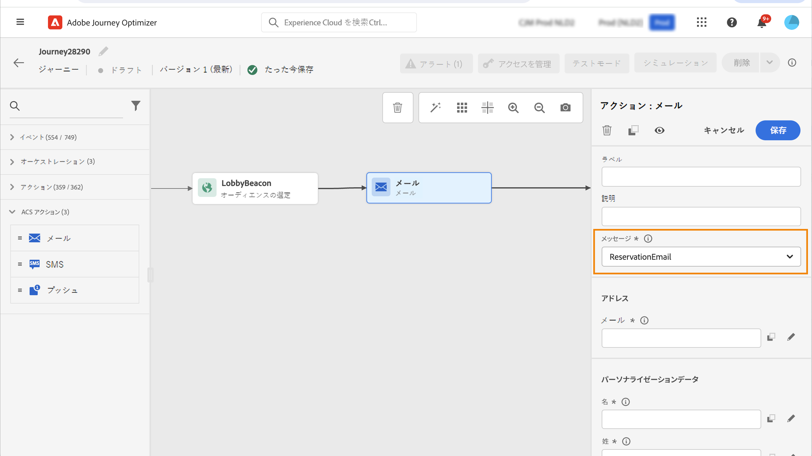
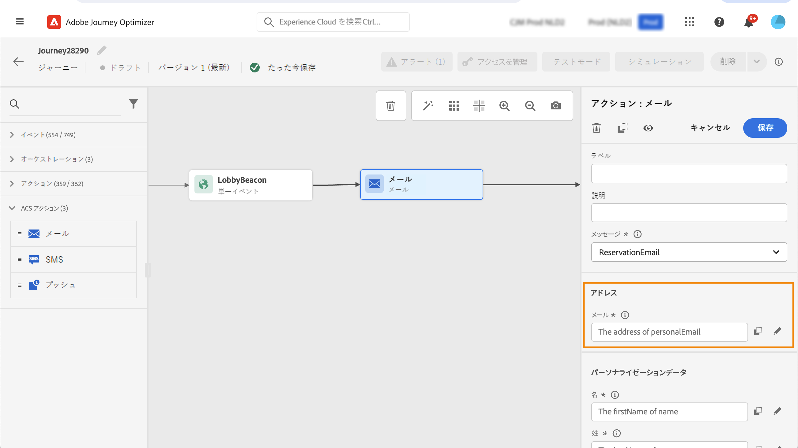
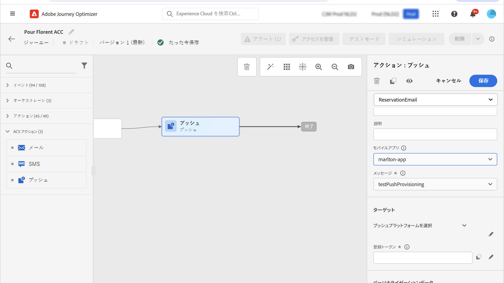

# Adobe キャンペーンの標準的なアクション {#using_campaign_action}

Adobe キャンペーン規格に準拠している場合は、および **[!UICONTROL SMS]** を使用できます。 **[!UICONTROL Email]** **[!UICONTROL Push]**

>[!NOTE]
>
>これを行うには、ビルトインアクションを設定する必要があります。 このページ ](../action/acs-action.md) を [ 参照してください。

これらの各チャネルについて、Adobe キャンペーン規格のトランザクションメッセージ **テンプレート** を選択します。 組み込まれている電子メール、SMS、およびプッシュチャネルについては、メッセージ送信を実行するために、トランザクションメッセージに頼っています。 これは、journeys で特定のメッセージテンプレートを使用する場合は、Adobe キャンペーン規格にパブリッシュする必要があることを意味します。 この機能の使用方法については、このページ ](https://experienceleague.adobe.com/docs/campaign-standard/using/communication-channels/transactional-messaging/getting-started-with-transactional-msg.html) を [ 参照してください。

>[!NOTE]
>
>このため、旅オプティマイザーで使用するためには、キャンペーン標準のトランザクションメッセージとそれに関連付けられたイベントをパブリッシュする必要があります。 イベントはパブリッシュされても、メッセージが表示されない場合は、旅のオプティマイザーインターフェイスには表示されません。 メッセージがパブリッシュされていても、関連するイベントが公開されていない場合、そのメッセージは、旅のオプティマイザーインターフェイスに表示されますが、使用することはできません。



イベント (リアルタイム) またはプロファイルトランザクションメッセージテンプレートを使用することができます。

>[!NOTE]
>
>カスタムアクションによって、リアルタイムのトランザクションメッセージ (rtEvent) を送信する場合や、サードパーティ製システムを使用してメッセージをルーティングする場合は、疲労、ブロックリスト、または unsubscription の管理について特定の設定が必要になります。 例えば、「購読中止」属性が Adobe エクスペリエンスプラットフォームに格納されている場合や、サードパーティ製システムに保存されている場合は、メッセージを送信する前に、この状態を確認するための条件を追加する必要があります。

テンプレートを選択した場合は、メッセージペイロードに必要なすべてのフィールドが and **[!UICONTROL Personalization Data]** のアクティビティ構成ペイン **[!UICONTROL Address]** に表示されます。イベントまたはデータソースのいずれかを使用して、使用するフィールドにこれらのフィールドをマップする必要があります。 また、高度な式エディターを使用して、値を手動で渡したり、取得した情報について (例えば、string の大文字に変換) データ操作を実行したり、「if、else、else」などの関数を使用したりすることもできます。 このページ ](expression/expressionadvanced.md) を参照してください [ 。


## 電子メールと SMS {#section_asc_51g_nhb}

**[!UICONTROL Email]** **[!UICONTROL SMS]** では、パラメーターは同じです。

>[!NOTE]
>
>電子メールの場合、プロファイルトランザクションテンプレートを使用している場合、unsubscription メカニズムはキャンペーン規格によって組み込まれています。 コンテンツブロックをテンプレートに追加するだけで済みます ( [ 詳細 ](https://experienceleague.adobe.com/docs/campaign-standard/using/communication-channels/transactional-messaging/getting-started-with-transactional-msg.html) について詳しくは **[!UICONTROL Unsubscription link]** 、テンプレートを参照してください)。イベントベースのテンプレート (rtEvent) を使用している場合は、このメッセージに、URL パラメーターでユーザーの電子メールを渡し、unsubscription ランディングページをポイントするリンクが追加されている必要があります。 このランディングページを作成する必要があります。この場合は、ユーザーが購読中止を決定したことを確認してください。

最初に、トランザクションメッセージテンプレートを選択する必要があります。

「」と **[!UICONTROL Personalization Data]** 「 **[!UICONTROL Address]** 」の2つのカテゴリがあります。

は、インターフェイスを使用して、また **[!UICONTROL Personalization Data]** はを取得 **[!UICONTROL Address]** する場所を簡単に定義できます。イベントと利用可能なデータソースのフィールドを参照できます。 また、高度な式エディターを使用して、パラメーターの受け渡しや操作の実行が必要なデータソースを使用するなど、より高度な用途に使用することもできます。 このページ ](expression/expressionadvanced.md) を参照してください [ 。

**[!UICONTROL Address]**

>[!NOTE]
>
>このカテゴリーは、「イベント」トランザクションメッセージを選択した場合にのみ表示されます。 「プロフィール」メッセージ **[!UICONTROL Address]** については、システムによって自動的に Adobe キャンペーン標準フィールドが取得されます。

これらのフィールドは、システムがメッセージの送信先を確認するために必要なフィールドです。 電子メールテンプレートの場合は、電子メールアドレスを指定します。 SMS については、携帯電話の番号です。



**[!UICONTROL Personalization Data]**

>[!NOTE]
>
>パーソナル化データにコレクションを渡すことはできません。 トランザクション電子メールまたは SMS がコレクションを要求した場合は機能しません。 さらに、パーソナル化データのフォーマットは予想される形式であることに注意してください (例: string、decimal など)。 このような予想されるフォーマットを使用するには注意が必要です。

Adobe キャンペーン規格メッセージには、次のフィールドが必要です。 これらのフィールドを使用して、メッセージの個人用設定、条件付き書式の適用、特定のメッセージバリアントの選択を行うことができます。


## プル {#section_im3_hvf_nhb}

プッシュ通知を送信するには、プッシュアクティビティーを使用する前に、モバイルアプリケーションをキャンペーン規格と共に設定する必要があります。 この [ 記事 ](https://helpx.adobe.com/campaign/kb/integrate-mobile-sdk.html) では、モバイルの実装に必要な手順を実行します。

最初に、ドロップダウンリストからモバイルアプリケーションを選択し、「トランザクションメッセージ」を選択する必要があります。



「」と **[!UICONTROL Personalization Data]** 「 **[!UICONTROL Target]** 」の2つのカテゴリがあります。

**[!UICONTROL Target]**

>[!NOTE]
>
>このカテゴリーは、イベントメッセージを選択した場合にのみ表示されます。 プロファイルメッセージの場合、 **[!UICONTROL Target]** フィールドは、Adobe キャンペーン規格によって実行される調整を使用して、システムによって自動的に取得されます。

この節では、 **[!UICONTROL Push platform]** を定義する必要があります。 ドロップダウンリストで、「(iOS)」または **[!UICONTROL Firebase Cloud Messaging]** 「(Android)」を選択 **[!UICONTROL Apple Push Notification Server]** できます。イベントまたはデータソースから特定のフィールドを選択することも、アドバンスエクスプレッションを定義することもできます。

また、 **[!UICONTROL Registration Token]** も定義する必要があります。 この式は、イベントのペイロードまたはその他の [!DNL Journey Optimizer] 情報において、どのようにトークンが定義されているかによって異なります。 インスタンスのコレクションにトークンが定義されている場合、次のような単純なフィールドを使用することも、複雑な式を指定することもできます。

```
@{Event_push._experience.campaign.message.profileSnapshot.pushNotificationTokens.first().token}
```

**[!UICONTROL Personalization Data]**

>[!NOTE]
>
>パーソナル化データにコレクションを渡すことはできません。 トランザクションプッシュがコレクションを想定している場合は、機能しません。 さらに、パーソナル化データのフォーマットは予想される形式であることに注意してください (例: string、decimal など)。 このような予想されるフォーマットを使用するには注意が必要です。

Adobe キャンペーン規格メッセージで使用されているトランザクションテンプレートには、これらのフィールドが必要です。 これらのフィールドを使用して、メッセージの宛先を設定したり、条件付き書式を適用したり、特定のメッセージバリアントを選択することができます。
