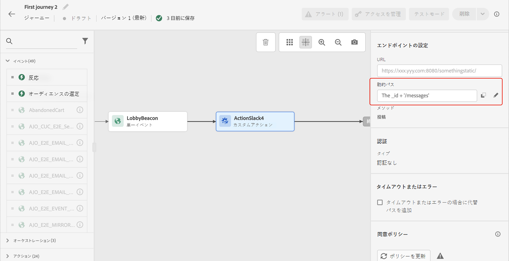
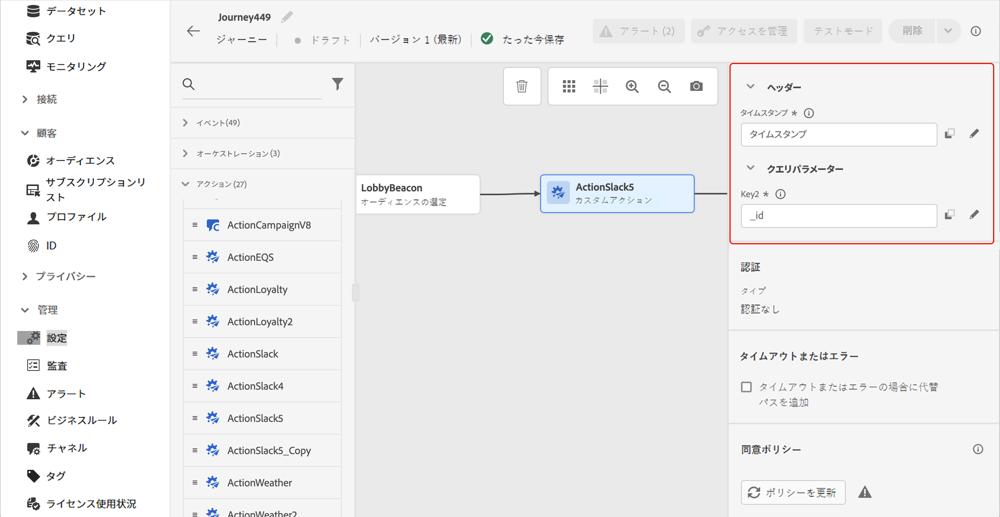

# カスタムアクションの使用 {#use-custom-actions}

>[!CONTEXTUALHELP]
>id="ajo_journey_action_custom"
>title="カスタムアクション"
>abstract="カスタムアクションを使用すると、メッセージや API 呼び出しを送信するサードパーティシステムの接続を設定できます。アクションは、JSON 形式のペイロードを使用した REST API を介して呼び出すことができる、任意のプロバイダーの任意のサービスで設定できます。"

カスタムアクションを使用して、サードパーティシステムへの接続を有効にし、メッセージや API 呼び出しを送信します。アクションは、JSON 形式のペイロードを使用した REST API を介して呼び出すことができる、任意のプロバイダーの任意のサービスで設定できます。

カスタムアクションについて詳しくは、[この節](../action/action.md)を参照してください。

カスタムアクションを作成して設定する方法について詳しくは、[このページ](../action/about-custom-action-configuration.md)を参照してください。

## 同意とデータガバナンス {#privacy}

Journey Optimizer では、カスタムアクションにデータガバナンスポリシーと同意ポリシーを適用して、特定のフィールドがサードパーティシステムにエクスポートされないようにしたり、メール、プッシュまたは SMS 通信の受信に同意しない顧客を除外したりできます。詳しくは、次のページを参照してください。

* [データガバナンス](../action/action-privacy.md)。
* [同意](../action/consent.md)。

## URL 設定

**カスタムアクション**&#x200B;アクティビティの設定ペインには、URL 設定パラメーターと、カスタムアクション用に設定された認証パラメーターが表示されます。ジャーニーでは URL の静的な部分を設定できませんが、カスタムアクションのグローバル設定では設定できます。[詳細情報](../action/about-custom-action-configuration.md)。

### 動的パス

URL に動的パスが含まれる場合は、「**[!UICONTROL パス]**」フィールドでパスを指定します。

フィールドとプレーンテキスト文字列を連結するには、高度な式エディターで文字列関数またはプラス記号（+）を使用します。プレーンテキスト文字列を一重引用符（&#39;）または二重引用符（&quot;）で囲みます。[詳細情報](expression/expressionadvanced.md)。

この表は、設定の例を示しています

| フィールド | 値 |
| --- | --- |
| URL | `https://xxx.yyy.com:8080/somethingstatic/` |
| パス | `The _id + '/messages'` |

連結された URL の形式は次のとおりです。

`https://xxx.yyy.com:8080/somethingstatic/`\&lt;ID>`/messages`

### ヘッダーとクエリパラメーター {#headers}

「**[!UICONTROL URL の設定]**」セクションには、動的ヘッダーフィールドとクエリパラメーターフィールドが表示されますが、定数フィールドは表示されません。動的ヘッダーおよびクエリパラメーターのフィールドは、アクション設定画面で変数として定義されます。[詳細情報](../action/about-custom-action-configuration.md#url-configuration)

動的ヘッダーおよびクエリパラメーターのフィールドの値を指定するには、フィールド内または鉛筆アイコンをクリックして目的のフィールドを選択します。

## アクションパラメーター

「**[!UICONTROL アクションパラメーター]**」セクションには、_「変数」_&#x200B;として定義されたメッセージパラメーターが表示されます。これらのパラメーターについては、この情報の取得先（例：イベント、データソース）を定義したり、値を手動で渡したり、高度なユースケースに高度な式エディターを使用したりできます。高度なユースケースとしては、データ操作などの関数の使用が考えられます。この[ページ](expression/expressionadvanced.md)を参照してください。

