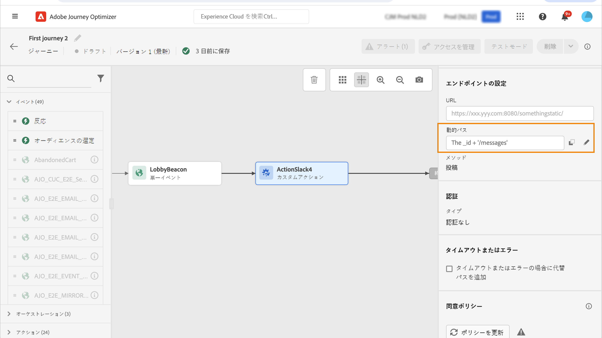

# カスタムアクションの使用 {#use-custom-actions}

>[!CONTEXTUALHELP]
>id="ajo_journey_action_custom"
>title="カスタムアクション"
>abstract="カスタムアクションを使用すると、メッセージまたは API 呼び出しを送信するようにサードパーティシステムの接続を設定することができます。 その他の任意の API を使用して、JSON 形式のペイロードを含むすべてのサービスを使用して、アクションを設定することができます。"

カスタムアクションを使用すると、メッセージまたは API 呼び出しを送信するようにサードパーティシステムの接続を設定することができます。 その他の任意の API を使用して、JSON 形式のペイロードを含むすべてのサービスを使用して、アクションを設定することができます。

## 同意およびデータガバナンス {#privacy}

このような場合、カスタムアクションにはデータガバナンスと同意ポリシーを適用して、特定のフィールドをサードパーティシステムに書き出さないようにすることや、電子メールの受信を consented にしていないユーザーを除外することができます。 詳しくは、次のページを参照してください。

* [データガバナンス ](../action/action-privacy.md)
* [同意 ](../action/consent.md) を得ることができます。

## URL の設定

カスタムアクション **アクティビティの** 設定ペインには、そのカスタムアクション用に設定されている URL 設定パラメーターと認証パラメーターが表示されます。このような場合は、カスタムアクションのグローバル設定において、その過程で URL の静的な部分を設定することはできません。 [詳しく ](../action/about-custom-action-configuration.md) は、こちらを参照してください。

### 動的パス

URL に動的パスが含まれている場合は、フィールド内で **[!UICONTROL Path]** パスを指定します。

フィールドとプレーンテキスト文字列を連結するには、高度な式エディターの String 関数または正符号 (+) を使用します。 プレーンテキスト文字列は一重引用符 (&#39;) または二重引用符 (&quot;) で囲みます。 [詳しく ](expression/expressionadvanced.md) は、こちらを参照してください。

次の表は、設定の例を示しています。

| 名 | 数値 |
| --- | --- |
| URL | `https://xxx.yyy.com:8080/somethingstatic/` |
| パス | `The id of marketingCampaign + '/messages'` |

連結された URL は、次のような形式になります。

`https://xxx.yyy.com:8080/somethingstatic/`\&lt;campaign id\=&quot;&quot;>`/messages`&lt;/campaign>

### ヘッダー

このセクションに **[!UICONTROL URL Configuration]** は、定数ヘッダフィールドは表示されません。 動的ヘッダーフィールドは、値が変数として設定された HTTP ヘッダーフィールドです。 [詳しく ](../action/about-custom-action-configuration.md) は、こちらを参照してください。

必要に応じて、動的ヘッダフィールドの値を指定します。

1. フライト中にカスタムアクションを選択します。
1. コンフィギュレーションペインで、セクションのヘッダフィールド **[!UICONTROL URL Configuration]** の横にある鉛筆アイコンをクリックします。

   

1. フィールドを選択し、をクリック **[!UICONTROL OK]** します。

## アクションパラメーター

**[!UICONTROL Action parameters]**&#x200B;セクションには、&quot;Variable&quot; _とし_ て定義されたメッセージパラメーターが表示されます。このようなパラメーターについては、この情報を取得する場所 (イベント、データソースなど) を定義することも、手動で値を渡したり、高度な使用例については高度な式エディターを使用することもできます。 高度な使用方法には、データ操作などの関数を使用できます。 この [ ページ ](expression/expressionadvanced.md) を参照してください。

**関連トピック**

[アクションを設定します。](../action/about-custom-action-configuration.md)
