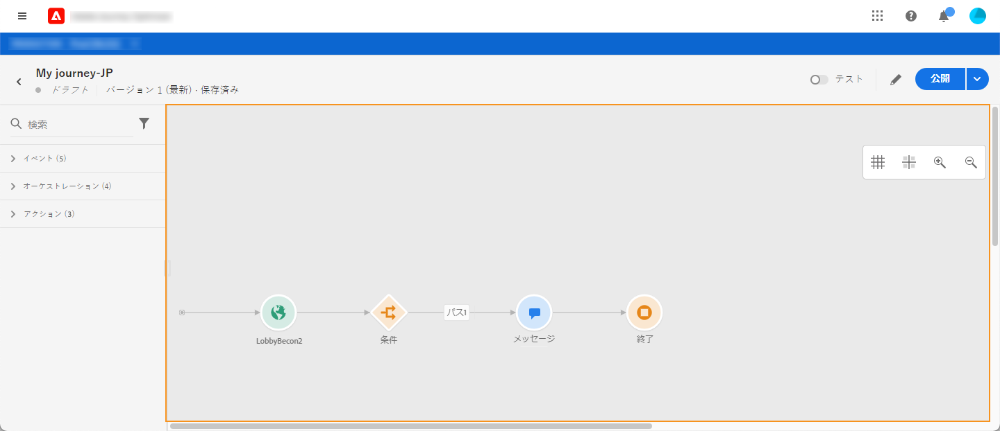
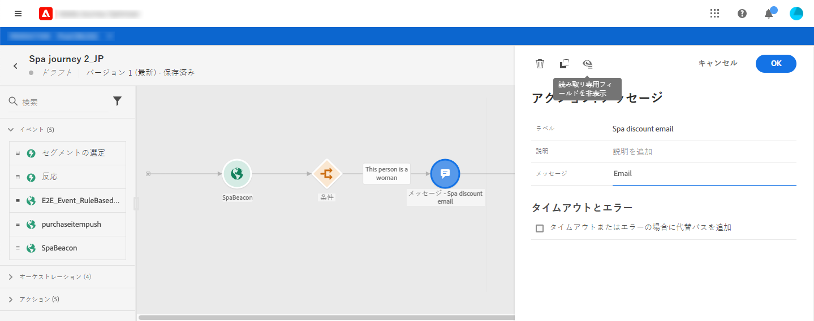
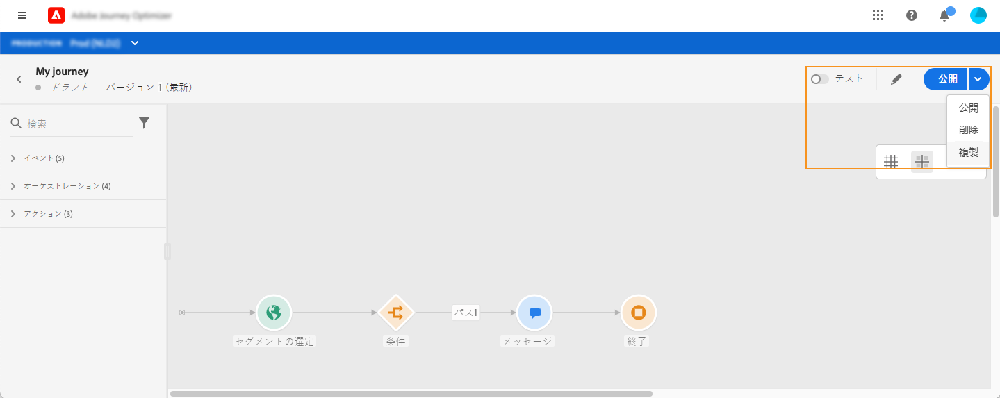
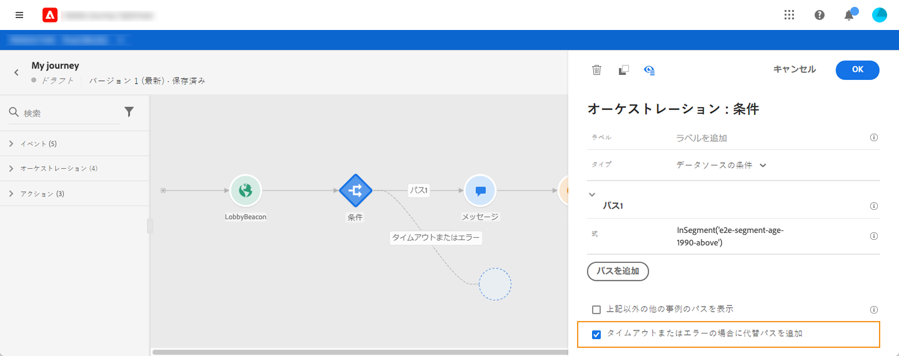
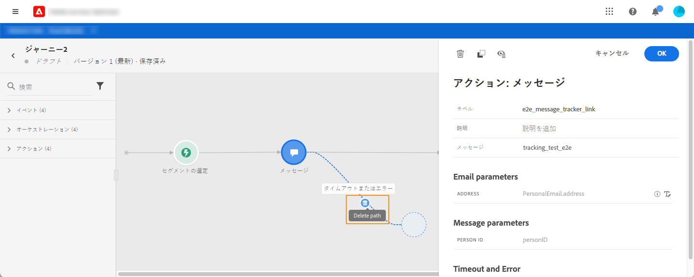
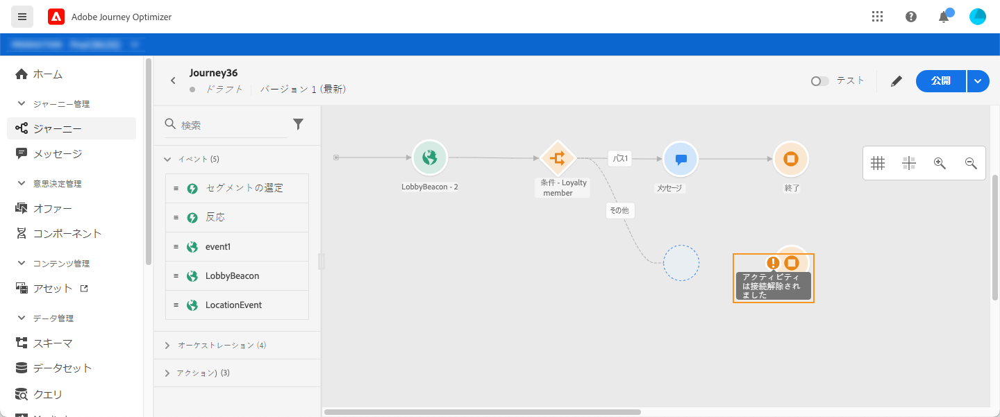
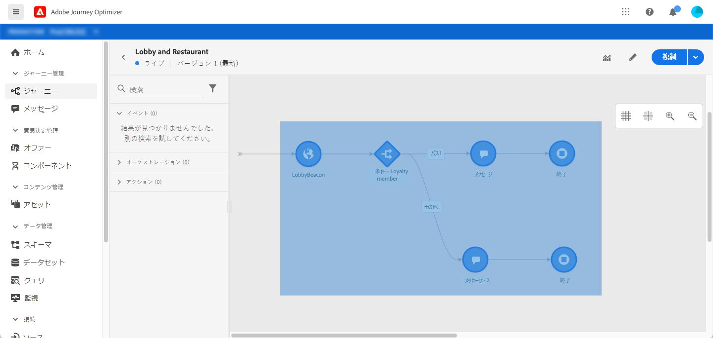
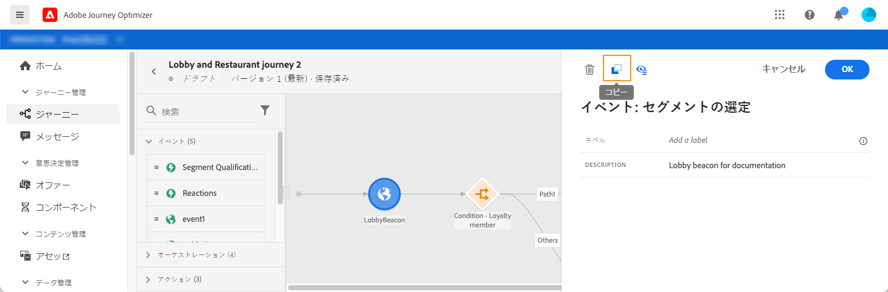

# ジャーニーのデザイン {#design-your-journey}

ジャーニーのインターフェイスを使用すると、パレットからキャンバスにアクティビティを簡単にドラッグ＆ドロップできます。アクティビティをダブルクリックして、以下の手順でキャンバスに追加することもできます。各アクティビティには、プロセス内に固有の役割と配置があります。アクティビティには順序があります。1 つのアクティビティが完了すると、フローを続行して、次のアクティビティを処理します。これを順番に続けます。

## ジャーニーのデザインの概要

**パレット**&#x200B;は画面の左側にあります。すべての使用可能なアクティビティは、複数のカテゴリ（**[!UICONTROL イベント]**、**[!UICONTROL オーケストレーション]**、**[!UICONTROL アクション]**）に分類されます。カテゴリの名前をクリックすると、カテゴリを展開したり、折りたたむことができます。ジャーニーでアクティビティを使用するには、パレットからキャンバスにドラッグ＆ドロップします。

新しいジャーニーを開始した際、最初の手順としてキャンバスにドロップできない要素は非表示になっています。これは、すべてのアクション、条件のアクティビティ、待機、反応が対象です。

左上隅の&#x200B;**[!UICONTROL アイテムをフィルター]**&#x200B;アイコンを使用すると、次のフィルターを表示できます。

* **使用可能な項目のみを表示**：パレットの使用できない要素を表示または非表示にします（ジャーニーと異なる名前空間を使用しているイベントなど）。デフォルトでは、使用できない項目は非表示になっています。表示するよう選択すると、灰色表示になります。

* **最近使用したアイテムのみを表示**：このフィルターでは、既製のイベントやアクションに加え、最近使用した 5 つのイベントやアクションのみを表示できます。この機能は、各ユーザーに固有です。デフォルトでは、すべての項目が表示されます。

また、「**[!UICONTROL 検索]**」フィールドを使用することもできます。イベントとアクションのみフィルタリングされます。

**キャンバス**は、ジャーニーデザイナーの中心にあるゾーンです。アクティビティをこのゾーンにドロップすると設定できます。キャンバスのアクティビティをクリックして設定します。アクティビティ設定ペインが右側に開きます。

パレット内のアクティビティをクリックすると、**アクティビティ設定ペイン**が表示されます。
必須のフィールドに入力します。「**[!UICONTROL 削除]**」アイコンをクリックして、アクティビティを削除します。「**[!UICONTROL キャンセル]** 」をクリックして変更をキャンセルするか、 「**[!UICONTROL OK]**」をクリックして変更を確定します。アクティビティを削除するには、アクティビティ（1 つまたは複数）を選択して BackSpace キーを押します。アクティビティ設定ペインを閉じるには、Esc キーを押します。

デフォルトでは、読み取り専用フィールドは非表示です。読み取り専用フィールド表示するには、アクティビティ設定ペインの左上にある「**読み取り専用フィールドを表示**」アイコンをクリックします。この設定は、すべてのジャーニーのすべてのアクティビティに適用されます。

ジャーニーのステータスに応じ、右上隅のボタン（**[!UICONTROL 公開]**、**[!UICONTROL 複製]**、**[!UICONTROL 削除]**、**[!UICONTROL ジャーニーのプロパティ]**、**[!UICONTROL テスト]**&#x200B;など）を使用して様々な操作を実行できます。これらのボタンは、アクティビティが選択されていないときに表示されます。ボタンの中には文脈に応じて表示されるものもあります。テストモードがアクティブになると、テストモードのログボタンが表示されます。

## ジャーニーの開始

ジャーニーをデザインする際に最初に考えるのは、プロファイルがどのようにしてジャーニーにエントリするかです。次の 2 つの方法が考えらえれます。

**イベントで開始**：イベントをリッスンするようにジャーニーを設定している場合、個人は&#x200B;**単独で**&#x200B;ジャーニーにエントリします。ジャーニーに含まれるメッセージは、現在ジャーニーを開始している人物に送信されます。[イベントの詳細情報](../event/about-events.md)

**読み取りセグメントで開始**：Adobe Experience Platform のセグメントをリッスンするようにジャーニーを設定します。この場合は、指定したセグメントに属するすべての人がジャーニーにエントリします。ジャーニーに含まれるメッセージは、そのセグメントに属する複数の個人に送信されます。[セグメントの読み取りの詳細情報](read-segment.md)。

## 次の手順の定義

最初のイベントまたはセグメントの読み取りの後で、様々なアクティビティを組み合わせて、複数の手順から成るクロスチャネルシナリオを作成できます。パレットから必要な手順を選択します。

**イベント**

イベントでジャーニーを開始する場合は、イベントを受信したときにジャーニーがトリガーされます。その後、ジャーニーで定義された次の手順を個別に実行します。

**複数のイベント**&#x200B;をジャーニーに追加できます（それらが同じ名前空間を使用している場合）。イベントは事前に設定されています。[イベントの詳細情報](about-journey-activities.md#event-activities)

また、メッセージの後に&#x200B;**反応**&#x200B;イベントを追加して、メッセージに関連するトラッキングデータに反応することもできます。これにより、例えば、個人が前のメッセージを開い場合や、メッセージ内をクリックした場合に、別のメッセージを送信できます。詳しくは、この[節](reaction-events.md)を参照してください。

「**セグメントの選定**」イベントアクティビティを使用すると、Adobe Experience Platform のセグメントのエントリと離脱に基づいて、個人のジャーニーを開始したり進めたりすることができます。新しいシルバー顧客全員のジャーニーをエノリさせ、パーソナライズされたメッセージを送信できます。詳しくは、[この節](segment-qualification-events.md)を参照してください。

**オーケストレーション**

オーケストレーションアクティビティには「**セグメントを読み取り**」アクティビティがあり、Adobe Experience Platform のセグメントをリッスンするようジャーニーを設定できます。[セグメントの読み取りアクティビティの詳細](read-segment.md)。

他のアクティビティを使用すると、ジャーニーに条件を追加して、複数のパスを定義、次のアクティビティを実行するまでの待機時間を設定、またはジャーニーを終了できます。詳しくは、[この節](about-journey-activities.md#orchestration-activities)を参照してください。

**アクション**

ここには、[!DNL Journey Optimizer] で設計されたメッセージを含めることができる&#x200B;**メッセージ**&#x200B;アクティビティがあります。[メッセージアクティビティの詳細情報](journeys-message.md)

また、サードパーティ製システムでメッセージを送信するように設定したカスタムアクションもあります。詳しくは、[この節](about-journey-activities.md#action-activities)を参照してください。

## キャンバスでのパスの使用 {#paths}

一部のアクティビティ（**[!UICONTROL 条件]**、**[!UICONTROL アクション]**&#x200B;アクティビティ）では、エラーやタイムアウトが発生した場合に備えて代替アクションを定義できます。アクティビティ設定ペインで、「**[!UICONTROL タイムアウトまたはエラーの場合に代替パスを追加]**」ボックスを選択します。
アクティビティの後に別のパスが追加されます。タイムアウト時間は、ジャーニーのプロパティで定義します（管理者ユーザーは[このページ](../building-journeys/journey-gs.md#change-properties)を参照）。例えば、メールの送信に時間がかかりすぎたり、エラーが発生した場合に、SMS を送信することを決定できます。

様々なアクティビティ（イベント、アクション、待機）を使用して、それらの後に複数のパスを追加できます。これをおこなうには、アクティビティの上にカーソルを置き、「+」記号をクリックします。並行して設定できるのは、イベントと待機アクティビティのみです。複数のイベントを並行して設定した場合は、選択したパスが最初に発生するイベントのパスになります。

イベントをリッスンする場合は、イベントの待機時間を無限にしないことをお勧めします。これは必須ではありません。ただのベストプラクティスです。1 つまたは複数のイベントを一定の時間だけリッスンする場合は、1 つまたは複数のイベントと待機アクティビティを並行して配置します。[この節](../building-journeys/general-events.md#events-specific-time)を参照してください。

パスを削除するには、その上にカーソルを置き、「**[!UICONTROL パスを削除]**」アイコンをクリックします。

キャンバスで 2 つのアクティビティが切断されると、警告が表示されます。警告アイコンにマウスポインターを合わせると、エラーメッセージが表示されます。この問題を修正するには、切断されたアクティビティを移動し、前のアクティビティに接続します。

## アクティビティのコピーと貼り付け {#copy-paste}

ジャーニーの 1 つまたは複数のアクティビティをコピーして、同じジャーニーまたは別のジャーニーに貼り付けることができます。以前のジャーニーで設定済みの多数のアクティビティを再利用する場合は、こうすることで時間を節約できます。

**重要な注意事項**

* 異なるタブやブラウザをまたいでコピー／貼り付けができます。アクティビティは、同じインスタンス内でのみコピー／/貼り付けできます。
* 宛先のジャーニーに別の名前空間を使用するイベントがある場合、イベントのコピー／貼り付けを実行することはできません。
* 貼り付けたアクティビティが、宛先のジャーニーに存在しないデータを参照する場合があります（異なるサンドボックスをまたいでコピー／貼り付けする場合など）。常にエラーをチェックし、必要な調整をおこなってください。
* アクションは取り消すことができません。貼り付けたアクティビティを削除するには、それらを選択して削除する必要があります。そのため、コピーする前に、必要なアクティビティだけを選択するようにしてください。
* どのジャーニーからでもアクティビティをコピーできます（読み取り専用のアクティビティを含む）。
* どのアクティビティでも選択できます（リンクされていないアクティビティを含む）。リンクされているアクティビティは、貼り付けた後もリンクが保持されます。

アクティビティのコピーや貼り付けの手順は次のとおりです。

1. ジャーニーを開きます。
1. マウスをクリックしながら動かし、コピーするアクティビティを選択します。**Ctrl / Command** キーを押しながら各アクティビティをクリックすることもできます。すべてのアクティビティを選択する場合は、**Ctrl / Command + A** を使用します。
   
1. **Ctrl / Command + C** を押します。
1 つのアクティビティのみをコピーする場合は、そのアクティビティをクリックし、設定ペインの左上にある**コピー**アイコンを使用します。

   
1. 任意のジャーニーで、アクティビティを既存のノードにリンクせずに貼り付ける場合は、**Ctrl / Command + V** を押します。貼り付けたアクティビティは同じ順序で配置されます。貼り付け後も、アクティビティは選択されたままなので、簡単に移動できます。空のプレースホルダーにカーソルを置いて、**Ctrl / Command + V** を押すこともできます。貼り付けたアクティビティはそのノードにリンクされます。
   
