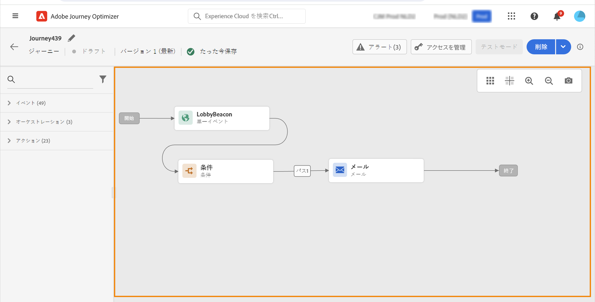
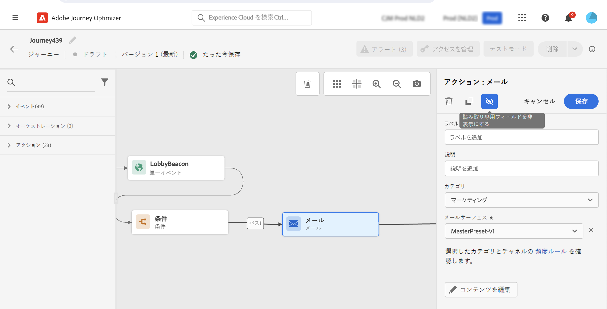
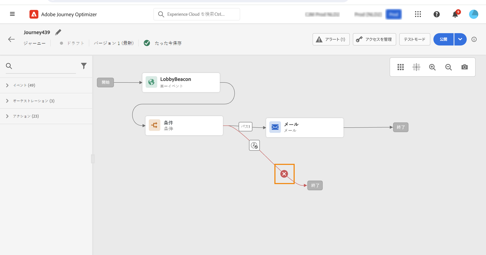
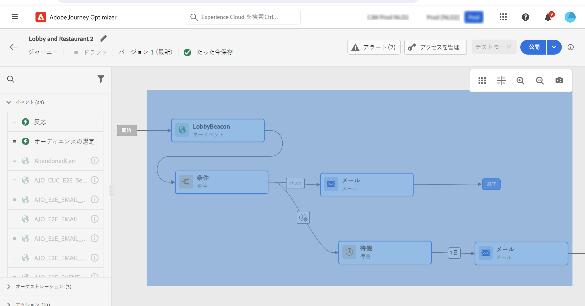
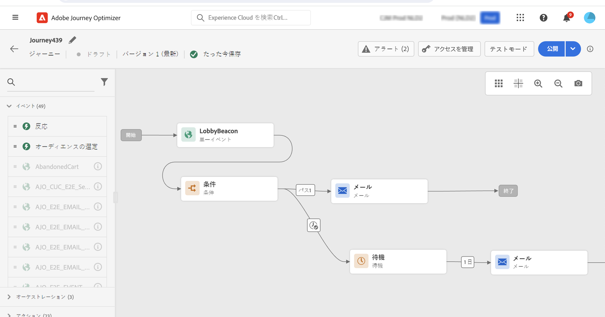

# 旅のデザイン {#design-your-journey}

>[!CONTEXTUALHELP]
>id="ajo_journey_canvas"
>title="旅のデザイン"
>abstract="このようなインターフェイスにより、パレットからキャンバスにアクティビティを簡単にドラッグ &amp; ドロップすることができます。 次の手順に従って、アクティビティをダブルクリックして、キャンバスに追加することもできます。"

Adobe 旅オプティマイザーには、1対1のユーザー取り組みによって harmonize マーケティング広告のマーケティング担当を促進する omnichannel オーケストレーション canvas が含まれています。 ユーザーインターフェイスを使用すると、パレットからキャンバスにアクティビティを簡単にドラッグ &amp; ドロップして、旅を作成することができます。 アクティビティをダブルクリックしてカンバスに追加することもできます。この場合は、次の操作を行います。

イベント、オーケストレーション、およびアクションアクティビティには、特定のロールと、そのプロセス内に配置されます。 アクティビティーのシーケンス: アクティビティーが完了すると、フローは継続され、次の操作を処理します。

## 旅のデザインについて学習します。 {#gs-journey-design}

**パレット** は画面の左側に表示されます。利用可能なすべての操作は、イベント、オーケストレーション、アクションのいくつかのカテゴリに分類 [ されます。 ](#jo-actions)  各カテゴリの名前をクリックすると、そのカテゴリを展開または折りたたむことができます。 フライト中にアクティビティを使用する場合は、パレットから canvas にドラッグ &amp; ドロップします。

新しい旅を開始するときに、最初のステップとして canvas にドロップできないエレメントは非表示になります。 これにより、すべてのアクション、状態アクティビティ、待機と応答が考慮されます。

**[!UICONTROL Filter items]**&#x200B;左上隅のアイコンを使用すると、次のフィルターを表示できます。

* **使用可能なアイテム** のみを表示: 「パレット」では使用できないエレメントを表示または非表示にします。例えば、旅で使用される名前空間とは異なります。 デフォルトでは、使用できないアイテムは非表示になっています。 表示するように選択した場合、グレー表示されます。

* **「最近使用したアイテム** のみを表示」: このフィルターを使用すると、最後の5つのイベント、使用されているアクション (リストに含まれているもの) を表示することができます。 これは、各ユーザーに固有のものです。 初期設定では、すべてのアイテムが表示されます。

また、 **[!UICONTROL Search]** フィールドを使用することもできます。 イベントとアクションのみがフィルタリングされます。

**Canvas** は、旅デザイナーの中央の領域です。アクティビティをドロップして設定することができます。 Canvas 内のアクティビティーをクリックして設定します。 右側のアクティビティ設定ペインが開きます。

アクティビティ設定ペイン **は** 、パレット内のアクティビティをクリックすると表示されます。目的のフィールドに入力します。 **[!UICONTROL Delete]**&#x200B;アイコンをクリックすると、アクティビティが削除されます。をクリック **[!UICONTROL Cancel]** して、変更をキャンセルするか **[!UICONTROL Ok]** 確認します。 アクティビティを削除するには、アクティビティを1つまたは複数選択して、backspace キーを押します。 Esc キーを押すと、アクティビティ設定ペインが閉じます。

初期設定では、読み取り専用フィールドは非表示になっています。 読み取り専用フィールドを表示するには、アクティビティ設定ペインの左上にある「読み取り専用フィールド **の表示」アイコンをクリック** します。この設定は、すべての journeys のすべてのアクティビティに適用されます。

移動の状態によって、右上隅にあるボタンを使用して、次のような操作を行うことができます。 **[!UICONTROL Publish]** **[!UICONTROL Journey properties]** **[!UICONTROL Duplicate]** **[!UICONTROL Delete]** **[!UICONTROL Test]** 、、、、.操作が選択されていない場合は、これらのボタンが表示されます。 一部のボタンは、文脈によって表示されます。 テストモードがアクティブになったときに、「テストモードログ」ボタンが表示されます。

## 旅の開始 {#start-your-journey}

旅をデザインする際、最初に確認しておく必要があるのは、プロファイルが旅にどのように入るかということです。 これには、次の2つの可能性があります。

1. **イベント** を使用して開始: イベントをリスンするように旅を設定した場合、個々のユーザーは、旅 **の unitarily** をリアルタイムに入力します。 あなたの旅に含まれているメッセージは、現在旅に参加している人物に送られます。 [イベントについて詳しくは、](../event/about-events.md)

1. **読み取り可能なセグメント** : Adobe エクスペリエンスプラットフォームセグメントを監視するように、旅を設定することができます。 この場合、指定された区分に属しているすべての個人が、旅に入ります。 旅に含まれるメッセージは、そのセグメントに属している個人に送られます。 [セグメント ](read-segment.md) の読み取りについて詳しくは、こちらを参照してください。

## 次の手順の定義{#define-next-steps}

最初のイベントまたは読み取りセグメントの後に、様々な操作を組み合わせて、マルチステップのクロスチャンネルシナリオを作成できます。 「パレット」で、必要な手順を選択します。

### 発生{#jo-event}

イベントは、オンライン購入のように、パーソナライズされた旅をトリガーするものです。 1人が旅に入ると、そのフライトは個別のメンバーとして移動します。また、同じレートまたは同じパスにある2人が移動することはありません。

イベントを使用して旅を開始すると、イベントの受信時に旅が開始されます。 各参加者は、次に、旅で定義された以下の手順に従います。

同じ名前空間を使用している場合は、複数のイベント **を追加** することができます。イベントは事前に設定されます。 [旅イベントについて詳しくは、](about-journey-activities.md#event-activities)

また、メッセージに関連付けられた追跡データに応答するメッセージの後に、 **反応** イベントを追加することもできます。 これにより、例えば、個人用のメッセージを開いたとき、またはクリックしたときに、別のメッセージを送信することができます。 [反イベント ](reaction-events.md) について詳しく説明します。

セグメント認定 **イベントアクティビティを使用** して、Adobe 体験プラットフォームセグメントの入り口と出口に基づいて、個々のユーザーが旅に出たり、前進したりすることができます。新しいすべてのシルバーユーザーが旅に入り、パーソナライズされたメッセージを送信するように設定することができます。 詳しくは、ここを  参照してください。

### 請求{#jo-orch}

オーケストレーションアクティビティは、次のステップを決定するために役立ちます。

オーケストレーションアクティビティから、「セグメント **の読み取り」アクティビティーを使用して、Adobe 体験プラットフォームセグメントに耳を傾け、その** 過程を設定します。[「セグメントの読み取り」アクティビティ ](read-segment.md) について詳しく説明しています。

他のアクティビティーには、いくつかのパスを定義するための条件を追加したり、次の操作を実行する前に待機時間を設定したり、移動したりすることができます。 [オーケストレーションアクティビティ ](about-journey-activities.md#orchestration-activities) について詳しくは、こちらを参照してください。

### 活動{#jo-actions}

アクションは、ある種のトリガーの結果として発生するものです。これは、メッセージを送信するようなものです。 これは、お客様が経験する旅の1つです。 これには、電子メール、SMS、メッセージがあります。または、余裕期間メッセージなどのサードパーティのアクションを指定することもできます。

チャンネルアクションアクティビティーには、で [!DNL Journey Optimizer] 作成されたメッセージを含めることができます。 [チャンネルアクションの操作について詳しくは、](journeys-message.md)

アクションアクティビティーから、カスタムアクションを使用して、サードパーティシステムのメッセージを送信します。 [カスタムアクション ](about-journey-activities.md#action-activities) について説明します。

## 代替パスの追加{#paths}

このような場合は、次のよう **[!UICONTROL Condition]** な旅のアクティビティについてエラーやタイムアウトが発生したときに、と **[!UICONTROL Action]** を指定することもできます。

アクティビティに対する fallback アクションを追加するには、「アクティビティのプロパティ」のボックスを選択 **[!UICONTROL Add an alternative path in case of a timeout or an error]** します。別のパスがアクティビティの後に追加されます。 タイムアウト期間は、 [ 旅のプロパティ ](../building-journeys/journey-gs.md#change-properties) で管理ユーザーによって定義されます。 例えば、電子メールを送信するのに時間がかかり過ぎたり、エラーが発生した場合は、push 通知を送信することもできます。

様々なアクティビティー (イベント、アクション、待ち) を使用すると、その後ろに複数のパスを追加できます。 これを行うには、アクティビティー上にカーソルを置き、「+」記号をクリックします。 並列に設定できるのは、イベントと待機のアクティビティーのみです。 並列に複数のイベントが設定されている場合は、選択したパスが最初に発生したイベントのうちの1つになります。

イベントを待機する場合は、そのイベントが無期限に再生されないようにすることをお勧めします。 必須ではありません。また、ベストプラクティスでもあります。 1つまたは複数のイベントを特定の時間に再生する場合は、1つまたは複数のイベントと待機アクティビティーを並列的に配置します。 この項 ](../building-journeys/general-events.md#events-specific-time) を参照してください [ 。

パスを削除するには、そのパス上にカーソルを置き、アイコンをクリック **[!UICONTROL Delete path]** します。

この canvas では、2つのアクティビティーが切断されると、警告が表示されます。 警告アイコンにカーソルを置くと、エラーメッセージが表示されます。 この問題を解決するには、切断された操作を移動して、前の動作に接続します。

## アクティビティのコピーとペースト {#copy-paste}

1つまたは複数の操作をコピーして、同じフライトまたは別の操作に貼り付けることができます。 これにより、前の旅で既に設定されている多数の操作を再利用する場合に、時間を節約できます。

**重要な注意事項**

* 様々なタブやブラウザー間でコピー &amp; ペーストすることができます。 コピー/ペーストできるのは、同じインスタンス内に限られます。
* 出力先が別の名前空間を使用するイベントを持っていると、イベントをコピーまたはペーストすることはできません。
* ペーストされたアクティビティは、異なるサンドボックス間でコピー/ペーストを行う場合など、移動先の過程に存在しないデータを参照することがあります。 エラーがないかどうかを常に確認し、必要な調整を行います。
* 操作を取り消すことはできません。 ペーストされた操作を削除するには、それらを選択し、削除する必要があります。 したがって、コピーする前に、必要な操作のみを選択するようにしてください。
* 操作は、どのような旅からも、読み取り専用のものであってもコピーできます。
* リンクされていない任意の操作を選択することもできます。 リンクされたアクティビティは、ペーストされた後もリンクされたままになります。

アクティビティをコピーおよびペーストするには、次の手順を実行します。

1. 旅を開きます。
1. コピーするアクティビティを選択するには、マウスを移動してクリックします。 また、Ctrl キーまたは Command **キーを押しながら、** 各アクティビティをクリックして実行することもできます。**すべての操作を選択する場合は、Ctrl キーまたは Command キーを押しながら A** キーを押します。
   
1. Ctrl キーまたは Command キーを押しながら C **キーを押し** ます。アクティビティを1つだけコピーする場合は、そのアクティビティをクリックして、アクティビティ設定ペインの左上にあるコピー **アイコンを使用** します。
   
1. どのような場合でも、Ctrl キーまたは Command キーを押しながら V **キーを押す** と、既存のノードにリンクせずにアクティビティをペーストできます。ペーストされた操作は、同じ順序で配置されます。 ペーストすると、アクティビティは選択されたままになり、容易に移動できるようになります。 また、空のプレースホルダーにカーソルを置き、Ctrl/Command + V **キーを押す** こともできます。ペーストされた操作は、ノードにリンクされます。
   
