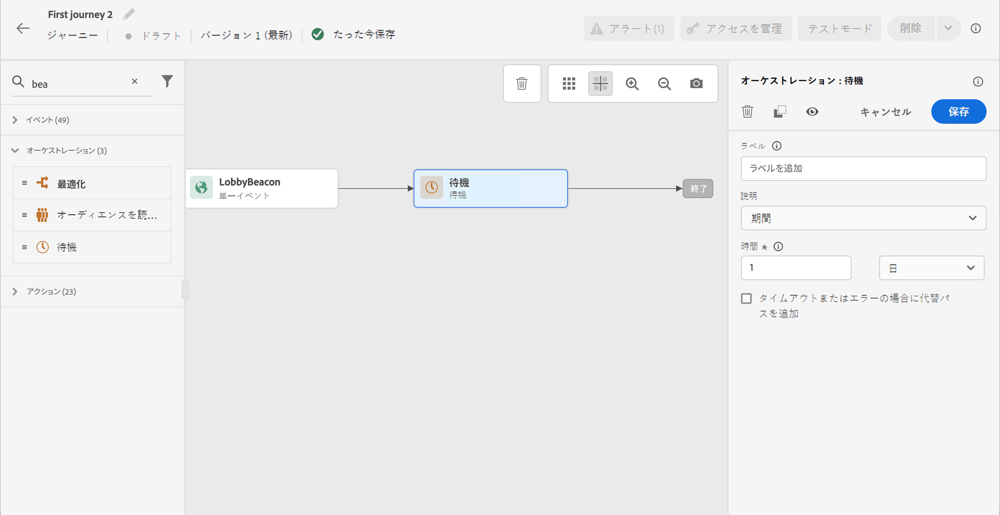
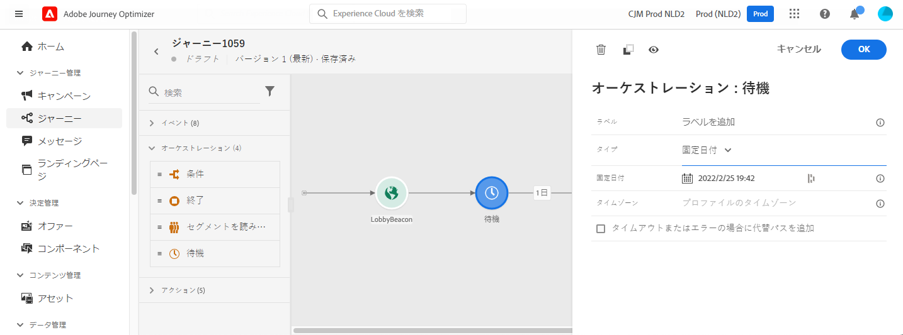
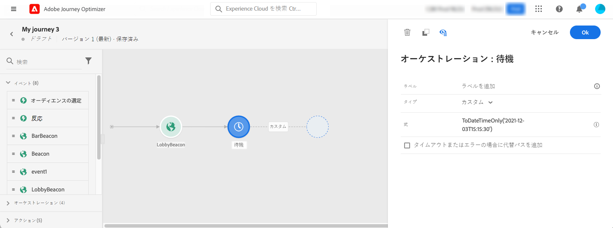
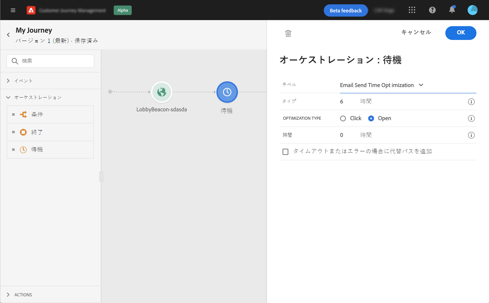

# 待機アクティビティ {#wait-activity}

>[!CONTEXTUALHELP]
>id="ajo_journey_wait"
>title="待機アクティビティ"
>abstract="パス内の次のアクティビティを実行するまで待機する場合は、「待機」アクティビティを使用できます。後に続くアクティビティを実行するタイミングを定義できます。期間とカスタムの 2 つのオプションを使用できます。"

**[!UICONTROL 待機]**&#x200B;アクティビティを使用すると、次のアクティビティを実行するまでの期間を定義できます。最大の待機期間は **90 日**&#x200B;です。

次の 2 種類の&#x200B;**待機**&#x200B;アクティビティを設定できます。

* 相対的な期間に基づく待機。[詳細情報](#duration)
* 関数を使用して計算するカスタム日付。[詳細情報](#custom)

<!--
* [Email send time optimization](#email_send_time_optimization)
* [Fixed date](#fixed_date) 
-->

## レコメンデーション {#wait-recommendations}

### 複数の待機アクティビティ {#multiple-wait-activities}

ジャーニーの[グローバルタイムアウト](journey-properties.md#global_timeout)が 91 日なので（つまり、プロファイルはジャーニーにエントリしてから最大 91 日後に必ずジャーニーからドロップアウトするので）、1 つのジャーニーで複数の&#x200B;**待機**&#x200B;アクティビティを使用する場合は注意が必要です。詳しくは、[このページ](journey-properties.md#global_timeout)を参照してください。

個人が&#x200B;**待機**&#x200B;アクティビティにエントリできるのは、91 日のジャーニータイムアウトより前に待機期間を完了できる、十分な時間がジャーニーに残っている場合のみです。

### 待機して再エントリ {#wait-reentrance}

**待機** アクティビティを使用して再エントリをブロックしないことのベストプラクティス。 代わりに、ジャーニープロパティレベルで **再エントリを許可** オプションを使用します。 詳しくは、[このページ](../building-journeys/journey-properties.md#entrance)を参照してください。

### 待機とテストモード {#wait-test-modd}

テストモードでは、**[!UICONTROL テストの待機時間]**&#x200B;パラメーターを使用して、各&#x200B;**待機**&#x200B;アクティビティの持続時間を定義できます。デフォルト時間は 10 秒です。これにより、テスト結果を迅速に取得できます。詳しくは、[このページ](../building-journeys/testing-the-journey.md)を参照してください。

## 設定 {#wait-configuration}

### 期間待機 {#duration}

**期間**&#x200B;タイプを選択して、次のアクティビティを実行するまでの相対的な待機期間を設定します。最大期間は **90 日**&#x200B;です。

<!--
## Fixed date wait{#fixed_date}

Select the date for the execution of the next activity.

-->

### カスタム待機 {#custom}

**カスタム**&#x200B;タイプを選択し、イベントまたはカスタムアクションの応答からのフィールドに基づく高度な式を使用して、カスタム日付を定義します。相対期間（例：7 日）を直接定義することはできませんが、必要に応じて関数を使用して計算できます（例：購入後 2 日）。

エディターの式は、`dateTimeOnly` 形式にする必要があります。[このページ](expression/expressionadvanced.md)を参照してください。dateTimeOnly 形式について詳しくは、[このページ](expression/data-types.md)を参照してください。

ベストプラクティスは、プロファイルに固有のカスタム日付を使用し、すべてに同じ日付を使用しないことです。例えば、`toDateTimeOnly('2024-01-01T01:11:00Z')` ではなく、各プロファイルに固有の `toDateTimeOnly(@event{Event.productDeliveryDate})` を定義します。固定日付を使用すると、ジャーニーの実行に問題が生じる可能性があります。

>[!NOTE]
>
>`dateTimeOnly` 式を利用するか、関数を使用して `dateTimeOnly` に変換することができます。例えば、`toDateTimeOnly(@event{Event.offerOpened.activity.endTime})` では、イベント内のフィールドが 2023-08-12T09:46:06Z の形式になります。
>
>ジャーニーのプロパティには&#x200B;**タイムゾーン**&#x200B;が必要です。そのため、ユーザーインターフェイスから、時刻とタイムゾーンのオフセットを組み合わせた、完全な ISO-8601 タイムスタンプ（2023-08-12T09:46:06.982-05 など）を直接指定することはできません。[詳細情報](../building-journeys/timezone-management.md)

待機アクティビティが期待どおりに動作することを検証するには、ステップイベントを使用できます。[詳細情報](../reports/query-examples.md#common-queries)

<!--## Email send time optimization{#email_send_time_optimization}

This type of wait uses a score calculated in Adobe Experience Platform. The score calculates the propensity to click or open an email in the future based on past behavior. Note that the algorithm calculating the score needs a certain amount of data to work. As a result, when it does not have enough data, the default wait time will apply. At publication time, you'll be notified that the default time applies.

>[!NOTE]
>
>The first event of your journey must have a namespace.
>
>This capability is only available after an **[!UICONTROL Email]** activity. You need to have Adobe Campaign Standard.

1. In the **[!UICONTROL Amount of time]** field, define the number of hours to consider to optimize email sending.
1. In the **[!UICONTROL Optimization type]** field, choose if the optimization should increase clicks or opens.
1. In the **[!UICONTROL Default time]** field, define the default time to wait if the predictive send time score is not available.

    >[!NOTE]
    >
    >Note that the send time score can be unavailable because there is not enough data to perform the calculation. In this case, you will be informed, at publication time, that the default time applies.

-->

## 自動待機ノード  {#auto-wait-node}

>[!CONTEXTUALHELP]
>id="ajo_journey_auto_wait_node "
>title="自動待機ノードについて"
>abstract="「**待機**」アクティビティは、このアクティビティの後に自動的に追加されます。3 日間に設定されています。必要に応じて削除または設定できます。"

各インバウンドメッセージアクティビティ（アプリ内メッセージ、コードベースのエクスペリエンスまたはカード）には、3 日間 **待機** アクティビティが付属しています。 インバウンドメッセージはプロファイルがジャーニーの終わりに到達すると自動的に終了するので、少なくとも 3 日間はユーザーに表示すると想定しています。 この **待機** アクティビティを削除するか、必要に応じて設定を変更できます。