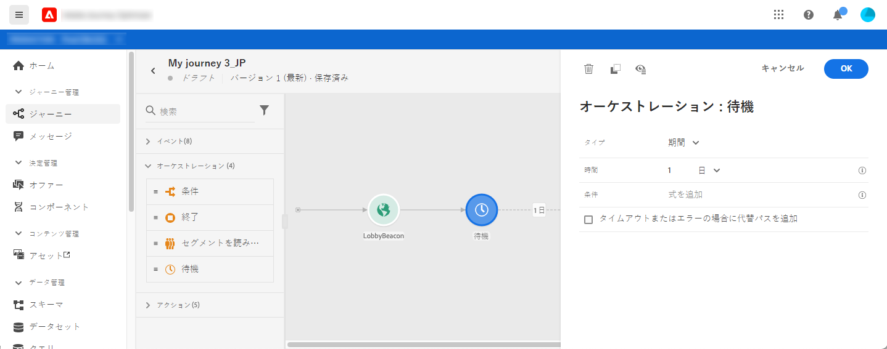
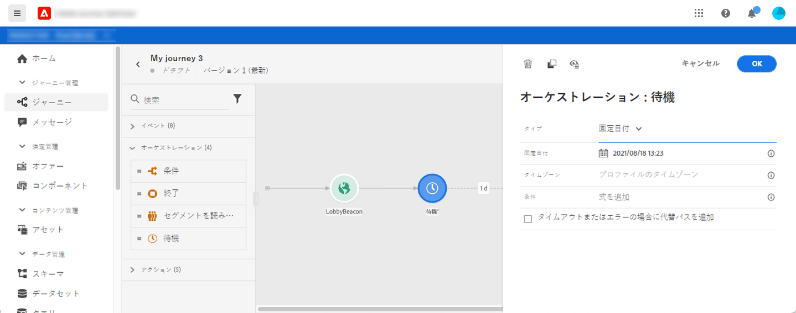
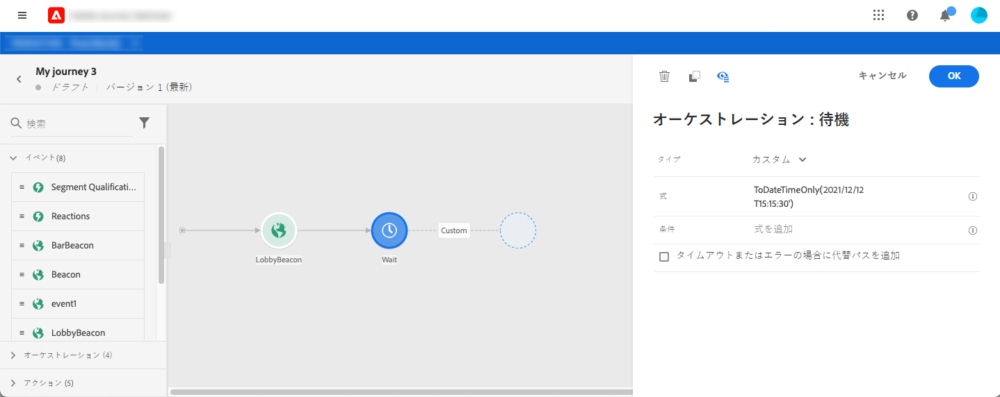
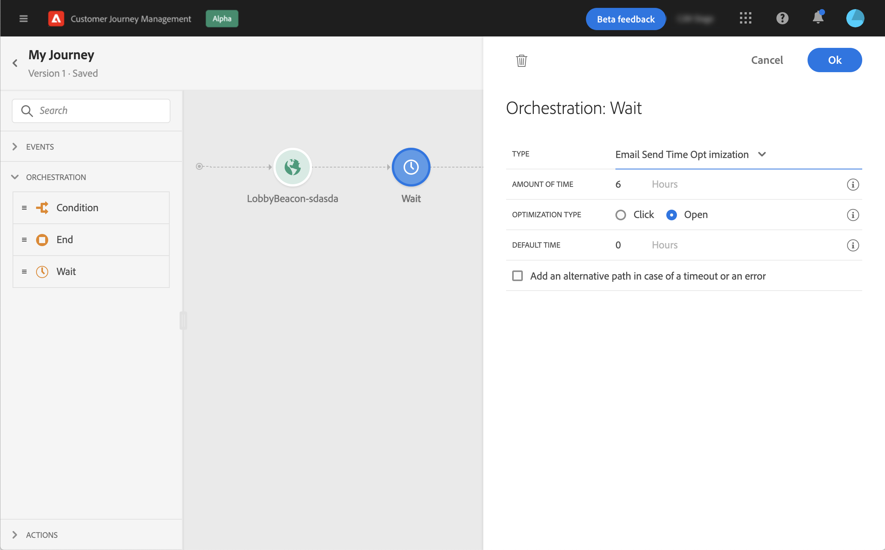

# 待機アクティビティ{#section_rlm_nft_dgb}

パス内で次のアクティビティを実行する前に待機したい場合は、**[!UICONTROL 待機]**&#x200B;アクティビティを使用できます。 後に続くアクティビティを実行するタイミングを定義できます。選択肢が 3 つあります。

* [デュレーション](#duration)
* [固定日付](#fixed_date)
* [カスタム](#custom)

<!--* [Email send time optimization](#email_send_time_optimization)-->

## 待機アクティビティについて{#about_wait}

並行して複数の待機を行う場合、待機の優先順位は次のように設定されます。 設定時間が同じで、重なる条件が異なる場合、上位に配置した待機が優先されます。 例えば、1 つ目の待機条件が「女性である」、並行する 2 つ目の待機条件が「VIP である」などです。 1 つ目の待機アクティビティが優先されます。

また、2 つの異なる待機が並行している場合、上位か下位かに関係なく、最初に発生した待機が優先されます。例えば、1 時間の待機が上位にあり、30 分の待機が下位にある場合、30 分後には 30 分の待機が処理されます。

特定の母集団に対して待機を制限したい場合、条件を定義できます。

>[!NOTE]
>
>最大の待機時間は 30 日です。
>
>テストモードでは、**[!UICONTROL テスト時の待機時間]**&#x200B;パラメーターを使用すると、各待機アクティビティが持続する時間を定義できます。デフォルト時間は 10 秒です。これにより、テスト結果を迅速に取得できます。 [このページ](../building-journeys/testing-the-journey.md)を参照してください。

## デュレーション待機{#duration}

次のアクティビティを実行するまでの待機のデュレーションを選択します。

## 固定日待機{#fixed_date}

次のアクティビティの実行日を選択します。

## カスタム待機{#custom}

このオプションを使用すると、カスタムの日付を定義できます。例えば、イベントやデータソースのフィールドを高度な式で計算して、2020年 7月 12日午後 5時などと定義できます。 カスタムの期間（たとえば 7日など）を定義することはできません。式は、式エディターで dateTimeOnly 形式にする必要があります。[このページ](https://experienceleague.adobe.com/docs/journeys/using/building-advanced-conditions-journeys/expressionadvanced.html?lang=ja)を参照してください。dateTimeOnly 形式の詳細については、[このページ](https://experienceleague.adobe.com/docs/journeys/using/building-advanced-conditions-journeys/syntax/data-types.html?lang=ja)を参照してください。

>[!NOTE]
>
>dateTimeOnly 式を使用するか、関数を使用して dateTimeOnly に変換することもできます。例：toDateTimeOnly(@{Event.offerOpened.activity.endTime}) （2016-08-12T09:46:06Z 形式の場合のフィールド）
>
>**タイムゾーン**&#x200B;は、ジャーニーのプロパティに必要です。 そのため、2016-08-12T09:46:06.982-05 のような完全な ISO-8601 タイムスタンプの混合時間とタイムゾーンのオフセットを、現在、インターフェイスから直接指定することはできません。[このページ](../building-journeys/timezone-management.md)を参照してください。

<!--## Email send time optimization{#email_send_time_optimization}

This type of wait uses a score calculated in Adobe Experience Platform. The score calculates the propensity to click or open an email in the future based on past behavior. Note that the algorithm calculating the score needs a certain amount of data to work. As a result, when it does not have enough data, the default wait time will apply. At publication time, you’ll be notified that the default time applies.

>[!NOTE]
>
>The first event of your journey must have a namespace.
>
>This capability is only available after an **[!UICONTROL Email]** activity. You need to have Adobe Campaign Standard.

1. In the **[!UICONTROL Amount of time]** field, define the number of hours to consider to optimize email sending.
1. In the **[!UICONTROL Optimization type]** field, choose if the optimization should increase clicks or opens.
1. In the **[!UICONTROL Default time]** field, define the default time to wait if the predictive send time score is not available.

    >[!NOTE]
    >
    >Note that the send time score can be unavailable because there is not enough data to perform the calculation. In this case, you will be informed, at publication time, that the default time applies.

-->
