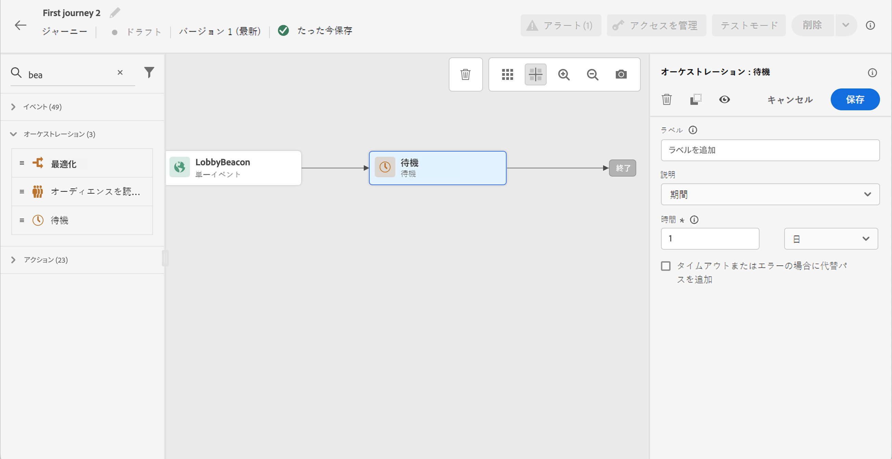
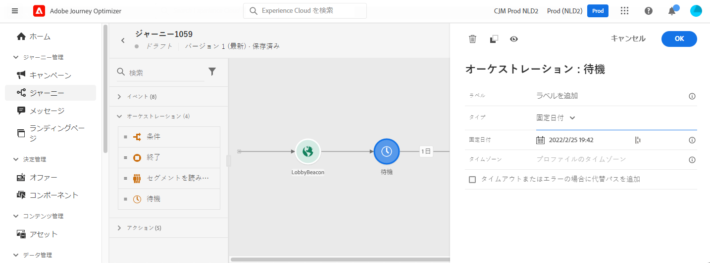
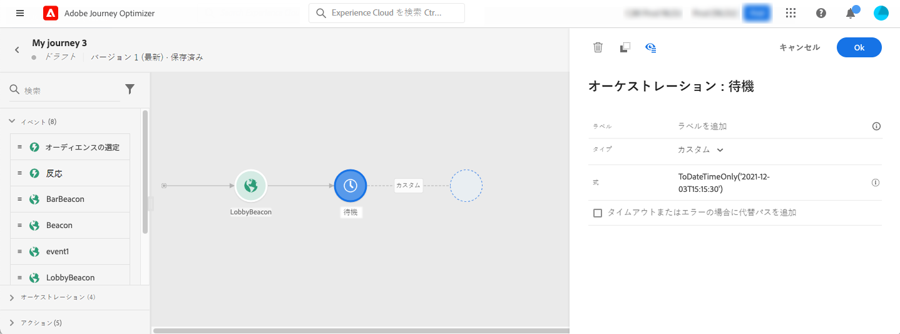

# 待機アクティビティ {#wait-activity}

>[!BEGINSHADEBOX]

**このページ：**&#x200B;では、次のアクティビティが実行される前に、相対期間またはカスタムの計算日までパスを一時停止するように待機アクティビティを設定する方法を説明します。

>[!ENDSHADEBOX]

>[!CONTEXTUALHELP]
>id="ajo_journey_wait"
>title="待機アクティビティ"
>abstract="待機アクティビティを使用すると、パス内の次のアクティビティを実行する前に待機できます。 後に続くアクティビティを実行するタイミングを定義できます。 期間とカスタムの 2 つのオプションを使用できます。"

**[!UICONTROL 待機]**&#x200B;アクティビティを使用すると、次のアクティビティを実行するまでの期間を定義できます。  最大の待機期間は **90 日**&#x200B;です。

次の 2 種類の&#x200B;**待機**&#x200B;アクティビティを設定できます。

* 相対的な期間に基づく待機。 [詳細情報](#duration)
* 関数を使用して計算するカスタム日付。 [詳細情報](#custom)

<!--
* [Email send time optimization](#email_send_time_optimization)
* [Fixed date](#fixed_date) 
-->

## レコメンデーション {#wait-recommendations}

予測可能かつ安全な待機を維持するために、これらの推奨事項を使用してください。

### 複数の待機アクティビティ {#multiple-wait-activities}

ジャーニーの[グローバルタイムアウト](journey-properties.md#global_timeout)が 91 日なので（つまり、プロファイルはジャーニーにエントリしてから最大 91 日後に必ずジャーニーからドロップアウトするので）、1 つのジャーニーで複数の&#x200B;**待機**&#x200B;アクティビティを使用する場合は注意が必要です。 詳しくは、[このページ](journey-properties.md#global_timeout)を参照してください。

個人が&#x200B;**待機**&#x200B;アクティビティにエントリできるのは、91 日のジャーニータイムアウトより前に待機期間を完了できる、十分な時間がジャーニーに残っている場合のみです。

### 待機と再エントリ {#wait-reentrance}

ベストプラクティスとして、**待機**&#x200B;アクティビティを使用して、再エントリをブロックすることは避けてください。 代わりに、ジャーニープロパティレベルで「**再エントリを許可**」オプションを使用します。 詳しくは、[このページ](../building-journeys/journey-properties.md#entrance)を参照してください。

### 待機とテストモード {#wait-test-mode}

テストモードでは、**[!UICONTROL テストの待機時間]**&#x200B;パラメーターを使用して、各&#x200B;**待機**&#x200B;アクティビティの持続時間を定義できます。 デフォルト時間は 10 秒です。 これにより、テスト結果を迅速に取得できます。 詳しくは、[このページ](../building-journeys/testing-the-journey.md)を参照してください。

### 待機とモバイルチャネル {#wait-mobile-channels}

[プッシュ通知](../../rp_landing_pages/push-landing-page.md)を送信した直後に[アプリ内メッセージ](../in-app/create-in-app.md)を表示する場合は、**待機**&#x200B;アクティビティを使用すると、アプリ内メッセージのペイロード時間を確保できます。 通常は 5 ～ 15 分の待機をお勧めしますが、正確な時間はペイロードの複雑さやパーソナライゼーションのニーズに応じて異なる場合があります。

## 設定 {#wait-configuration}

ここで待機時間とタイミングを設定します。

### 期間待機 {#duration}

**期間**&#x200B;タイプを選択して、次のアクティビティを実行するまでの相対的な待機期間を設定します。 最大期間は **90 日**&#x200B;です。

<!--
## Fixed date wait{#fixed_date}

Select the date for the execution of the next activity.

-->

### カスタム待機 {#custom}

**カスタム**&#x200B;タイプを選択し、イベントまたはカスタムアクションの応答からのフィールドに基づく高度な式を使用して、カスタム日付を定義します。 相対期間（例：7 日）を直接定義することはできませんが、必要に応じて関数を使用して計算できます（例：購入後 2 日）。

エディターの式は、`dateTimeOnly` 形式にする必要があります。 詳しくは、[このページ](expression/expressionadvanced.md)を参照してください。 dateTimeOnly 形式について詳しくは、[このページ](expression/data-types.md)を参照してください。

ベストプラクティスは、プロファイルに固有のカスタム日付を使用し、すべてに同じ日付を使用しないことです。 例えば、`toDateTimeOnly('2024-01-01T01:11:00Z')` ではなく、各プロファイルに固有の `toDateTimeOnly(@event{Event.productDeliveryDate})` を定義します。 固定日付を使用すると、ジャーニーの実行に問題が生じる可能性があります。 待機アクティビティがジャーニーの処理率に与える影響について詳しくは、[この節](entry-management.md#wait-activities-impact)を参照してください。

>[!CAUTION]
>
>`dateTimeOnly`式を使用する場合は、次の点に注意してください。
>
>* `dateTimeOnly`式を直接使用するか、関数を使用して変換できます。例：`toDateTimeOnly(@event{Event.offerOpened.activity.endTime})`。フィールド値は`2023-08-12T09:46:06Z`形式です。
>* **タイムゾーン**&#x200B;は、ジャーニープロパティで定義されています。 その結果、時間とタイムゾーンのオフセットを組み合わせた完全なISO-8601 タイムスタンプ（`2023-08-12T09:46:06.982-05`など）をUIからポイントすることはできません。 [詳細情報](../building-journeys/timezone-management.md)
>* `toDateTimeOnly()`でカスタム待機式を作成する場合、**not**&#x200B;に`Z`またはタイムゾーンオフセット（例：`-05:00`）を追加しないでください。 エクスプレッションは、明示的なタイムゾーン指定子なしでジャーニーの設定されたタイムゾーンを参照する必要があります。そうしないと、プロファイルが待機アクティビティで停止する可能性があります。
>
>| | 例 |
>| --- | --- |
>| **正解** | `toDateTimeOnly(concat(toString(toDateOnly(nowWithDelta(2, "days"))),"T10:00:00"))` |
>| **正しくない** | `toDateTimeOnly(concat(toString(toDateOnly(nowWithDelta(2, "days"))),"T10:00:00Z"))` ❌ （`Z`を含む） |

待機アクティビティが期待どおりに動作することを検証するには、ステップイベントを使用できます。 [学習を増やす](../reports/query-examples.md#common-queries)。

## 待機後のプロファイルの更新 {#profile-refresh}

**オーディエンスを読み取り**&#x200B;アクティビティから始まるジャーニーのプロファイルを&#x200B;**待機**&#x200B;アクティビティで一時停止すると、ジャーニーは統合プロファイルサービス（UPS）からプロファイルの属性を自動的に更新し、使用可能な最新のデータを取得します。

* **ジャーニーエントリ時**：プロファイルは、ジャーニーの開始時に評価されたオーディエンススナップショットの属性値を使用します。
* **待機ノードの後**：ジャーニーは、古いスナップショットデータではなく、UPS から最新のプロファイルデータを取得するために参照を実行します。 つまり、ジャーニーの開始以降にプロファイル属性が変更された可能性があります。

この動作により、ダウンストリームアクティビティは待機期間後に現在のプロファイル情報を使用することになります。 ただし、実行を通じてジャーニーで元のスナップショットデータのみを使用する予定の場合は、予期しない結果が生じる可能性があります。

例：プロファイルがジャーニー開始時に「シルバー顧客」オーディエンスを選定していても、3 日間の待機中に「ゴールド顧客」にアップグレードされた場合、待機後のアクティビティでは更新された「ゴールド顧客」ステータスが表示されます。

## 自動待機ノード  {#auto-wait-node}

>[!CONTEXTUALHELP]
>id="ajo_journey_auto_wait_node"
>title="自動待機ノードについて"
>abstract="このインバウンドアクションの後、**Wait** ノードが自動的に挿入されます。 デフォルトでは3日間に設定されており、メッセージやエクスペリエンスを表示できるだけのプロファイルがジャーニーに残るようにします。 ユースケースで必要な場合は、待機時間を更新するか、ノードを削除できます。"

各インバウンドエクスペリエンスアクティビティ（アプリ内メッセージ、コードベースのエクスペリエンスまたはカード）には、3 日間の&#x200B;**待機**&#x200B;アクティビティが付随しています。 プロファイルがジャーニーの終わりに到達するとインバウンドメッセージは自動的に終了するので、最低 3 日間はユーザーにそのメッセージを表示するとします。 この&#x200B;**待機**&#x200B;アクティビティを削除するか、必要に応じて設定を変更できます。

+++ AI ナレッジリファレンス

このセクションには、このトピックに関連する解釈、検索、質問への回答をサポートすることを目的とした構造化された知識が含まれています。

理解を深めるには、この情報をこのページのドキュメントと組み合わせる必要があります。 どちらのソースも単独で使用することを意図していません。このページでは、機能について説明しますが、この節では、用語、意図、適用可能性、および制約の曖昧さを解消するのに役立つ追加のコンテキストを提供します。

* **TL;DR:**&#x200B;このページでは、ジャーニーで待機アクティビティを設定して、プロファイルの進行を相対期間で一時停止するか、次の手順を実行する前にカスタムの計算日まで待機する方法について説明します。

**インテント：**

* 固定された相対期間（最大90日間）のジャーニーを一時停止する待機アクティビティを追加します
* 高度な式を使用してカスタム待機を設定し、プロファイル固有の計算日まで遅延させます
* 待機アクティビティがジャーニーのグローバルタイムアウト（91日間）とどのように相互作用するかを理解する
* テストパラメーターの待機時間を使用して、テストモードの検証を高速化します
* オーディエンスの読み取りジャーニーで待機ノードの後にプロファイル属性がどのように更新されるかを理解します

**用語集：**

* **アクティビティを待つ**：次のアクティビティが&#x200B;*（製品固有）を実行する前に、プロファイルの進行を指定した期間または計算された日付まで一時停止するジャーニーオーケストレーションアクティビティ*
* **Duration wait**：一時停止する相対期間を設定する待機タイプ。最大90日&#x200B;*（製品固有）*
* **カスタム待機**: プロファイルまたはイベントデータから派生した`dateTimeOnly`式を使用して、再開&#x200B;*（製品固有）*&#x200B;の特定の将来の日時を定義する待機タイプ
* **自動待機ノード**: インバウンドエクスペリエンスアクティビティ（アプリ内、コードベース、カード）の後に3日間の待機アクティビティが自動的に挿入され、コンテンツ *（製品固有）*&#x200B;を表示するのに十分な長さでプロファイルをジャーニーに保持します
* **テストでの待機時間**：実際の待機時間（デフォルトは10秒）を上書きするジャーニーテストモードパラメーターで、テスト結果はすぐに返されます&#x200B;*（製品固有）*

**ガードレール：**

* 最大待機期間は90日です。
* 保留中の待機アクティビティにかかわらず、プロファイルは91日後（グローバルタイムアウト）にジャーニーから削除されます。
* プロファイルが待機アクティビティを入力できるのは、ジャーニーに91日のタイムアウトまでに待機を完了するのに十分な時間が残っている場合のみです。
* 待機アクティビティを使用して再エントリをブロックしないでください。代わりに、ジャーニープロパティの「再エントリを許可」オプションを使用してください。
* カスタム待機式は`dateTimeOnly`形式を使用する必要があり、`Z`接尾辞または明示的なタイムゾーンオフセットを含めることはできません。
* カスタム待機で固定静的な日付（例：`toDateTimeOnly('2024-01-01T01:11:00Z')`）を使用すると、問題が発生する可能性があります。代わりに、プロファイル固有の動的な日付を使用してください。
* プロファイル属性は、オーディエンスの読み取りジャーニーの待機ノードの後に統合プロファイルサービスから更新されます。スナップショットの一貫性が期待される場合、予期しない結果が生じる可能性があります。

**用語：**

* 正規名：待機アクティビティ – 頭字語：なし – バリアント：待機ノード、待機ステップ
* 同義語：&quot;Duration wait&quot; = &quot;relative wait&quot;; &quot;Custom wait&quot; = &quot;expression-based wait&quot;
* 混同しないでください。「デュレーション待機」（相対的な場合：3日後など）≠「カスタム待機」（プロファイルデータからの絶対計算日）

**FAQ:**

* **Q：待機アクティビティの最大期間を教えてください。**  – 最大待機期間は90日です。プロファイルには、91日間のグローバルジャーニータイムアウトも適用されます。
* **Q: テストモードは待機アクティビティをどのように処理しますか？** — テストモードでは、「テスト中の待機時間」パラメーターが実際の待機時間を上書きします。デフォルトは10秒なので、テストはすぐに完了します。
* **Q: カスタム待機式にZを追加することを避けるべきですか？** — Zまたはタイムゾーンオフセットを`toDateTimeOnly()`式に追加すると、プロファイルが待機アクティビティで停止する可能性があります。式は、ジャーニーで設定されたタイムゾーンに依存する必要があります。
* **Q: プロファイル属性は待機ノードの後に更新されますか？**  – はい、オーディエンスの読み取りで始まるジャーニーでは、ジャーニーは待機後に統合プロファイルサービスからプロファイル属性を更新するので、ダウンストリームアクティビティは元のオーディエンススナップショットデータではなく更新された値を表示する場合があります。
* **Q：自動待機ノードとは何ですか？** — インバウンドエクスペリエンスアクティビティ（アプリ内、コードベース、カード）の後に3日間の待機アクティビティが自動的に挿入され、プロファイルがメッセージを表示するのに十分な時間ジャーニーに残ることを確認します。必要に応じて削除または再設定できます。

+++
