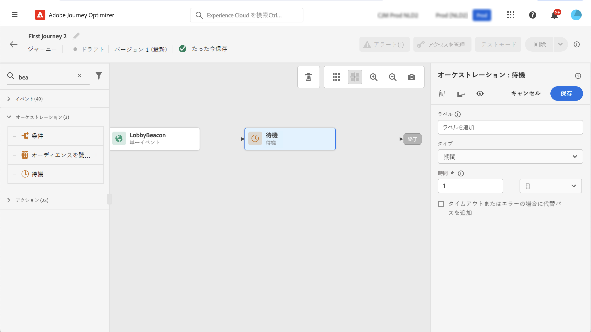

# 待機アクティビティ {#wait-activity}

>[!CONTEXTUALHELP]
>id="ajo_journey_wait"
>title="待機アクティビティ"
>abstract="パス内の次のアクティビティを実行するまで待機する場合は、「待機」アクティビティを使用できます。後に続くアクティビティを実行するタイミングを定義できます。期間とカスタムの 2 つのオプションを使用できます。"

を使用できます。 **[!UICONTROL 待機]** アクティビティ：次のアクティビティを実行するまでの期間を定義します。  最大待ち時間はです **29 日間**.

次の 2 種類を設定できます **待機** アクティビティ：

* 固定期間に基づく待機。 [詳細情報](#duration)
* 関数を使用して計算するカスタム待機。 [詳細情報](#custom)

<!--
* [Email send time optimization](#email_send_time_optimization)
* [Fixed date](#fixed_date) 
-->

## レコメンデーション {#wait-recommendations}

### 複数の待機アクティビティ {#multiple-wait-activities}

複数のを使用する場合 **待機** ジャーニーのアクティビティについては、グローバルジャーニーのタイムアウトは 30 日です。つまり、プロファイルは常に、ジャーニーに入って最大 30 日後にジャーニーからドロップアウトします。 詳しくは、[このページ](../building-journeys/journey-gs.md#global_timeout)を参照してください。

個人は、 **待機** ジャーニーに十分な時間が残り、30 日のジャーニータイムアウトより前に待機期間を完了した場合にのみアクティビティを実行します。 例えば、次の 2 つを追加した場合 **待機** アクティビティが各 20 日に設定されると、システムは次の 2 番目のものを検出します **待機** アクティビティは、30 日のタイムアウトの後に終了します。 2 番目 **待機** したがって、アクティビティは無視され、個人は開始前にジャーニーから離脱します。 この例では、顧客はジャーニーに合計 20 日間滞在します。

### 待機して再エントリ {#wait-re-entrance}

使用しないベストプラクティス **待機** 再エントリをブロックするアクティビティ。 代わりに、ジャーニープロパティレベルで「**再エントリを許可**」オプションを使用します。詳しくは、[このページ](../building-journeys/journey-gs.md#entrance)を参照してください。

### 待機とテストモード {#wait-test-modd}

テストモードでは、 **[!UICONTROL テストの待機時間]** パラメーターを使用すると、各 **待機** アクティビティは持続します。 デフォルト時間は 10 秒です。これにより、テスト結果を迅速に取得できます。詳しくは、[このページ](../building-journeys/testing-the-journey.md)を参照してください。

## 設定 {#wait-configuration}

### 期間待機 {#duration}

「」を選択します **期間** 次のアクティビティを実行するまでの待機期間を入力して設定します。 最大期間はです **29 日間**.

<!--
## Fixed date wait{#fixed_date}

Select the date for the execution of the next activity.

-->

### カスタム待機 {#custom}

「」を選択します **カスタム** イベントまたはカスタムアクションの応答から取得したフィールドに基づく高度な式を使用して、カスタムの期間を定義する場合に入力します。 相対期間（例：7 日）を直接定義することはできませんが、必要に応じて関数を使用して計算できます（例：購入後 2 日）。

エディターの式は、次を提供する必要があります `dateTimeOnly` 形式。 [このページ](expression/expressionadvanced.md)を参照してください。dateTimeOnly 形式の詳細については、次を参照してください [このページ](expression/data-types.md).

ベストプラクティスは、プロファイルに固有のカスタム日付を使用し、すべてに同じ日付を使用しないようにすることです。 例えば、を定義しないでください `toDateTimeOnly('2024-01-01T01:11:00Z')` むしろ `toDateTimeOnly(@event{Event.productDeliveryDate})` （各プロファイルに固有）。 固定日付を使用すると、ジャーニーの実行に問題が生じる可能性があることに注意してください。

>[!NOTE]
>
>を利用できます `dateTimeOnly` 式または関数を使用してに変換 `dateTimeOnly`. 例： `toDateTimeOnly(@event{Event.offerOpened.activity.endTime})`、イベント内のフィールドは「2023-08-12T09」の形式である:46:06Z。
>
>ジャーニーのプロパティには&#x200B;**タイムゾーン**&#x200B;が必要です。その結果、時間とタイムゾーンオフセットを組み合わせた、2023-08-12T09 のような完全な ISO-8601 タイムスタンプをユーザーインターフェイスから直接指定することはできません:46:06.982-05。 [詳細情報](../building-journeys/timezone-management.md)

待機アクティビティが期待どおりに動作することを検証するには、ステップイベントを使用できます。[詳細情報](../reports/query-examples.md#common-queries)

<!--## Email send time optimization{#email_send_time_optimization}

This type of wait uses a score calculated in Adobe Experience Platform. The score calculates the propensity to click or open an email in the future based on past behavior. Note that the algorithm calculating the score needs a certain amount of data to work. As a result, when it does not have enough data, the default wait time will apply. At publication time, you'll be notified that the default time applies.

>[!NOTE]
>
>The first event of your journey must have a namespace.
>
>This capability is only available after an **[!UICONTROL Email]** activity. You need to have Adobe Campaign Standard.

1. In the **[!UICONTROL Amount of time]** field, define the number of hours to consider to optimize email sending.
1. In the **[!UICONTROL Optimization type]** field, choose if the optimization should increase clicks or opens.
1. In the **[!UICONTROL Default time]** field, define the default time to wait if the predictive send time score is not available.

    >[!NOTE]
    >
    >Note that the send time score can be unavailable because there is not enough data to perform the calculation. In this case, you will be informed, at publication time, that the default time applies.

-->
