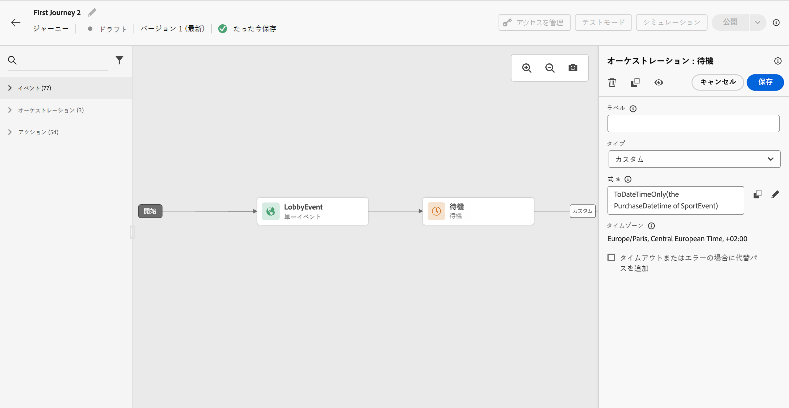

# 待機アクティビティ {#wait-activity}

>[!CONTEXTUALHELP]
>id="ajo_journey_wait"
>title="待機アクティビティ"
>abstract="パス内の次のアクティビティを実行するまで待機する場合は、「待機」アクティビティを使用できます。後に続くアクティビティを実行するタイミングを定義できます。期間とカスタムの 2 つのオプションを使用できます。"

**[!UICONTROL 待機]**&#x200B;アクティビティを使用すると、次のアクティビティを実行するまでの期間を定義できます。最大の待機期間は **90 日**&#x200B;です。

次の 2 種類の&#x200B;**待機**&#x200B;アクティビティを設定できます。

* 相対的な期間に基づく待機。[詳細情報](#duration)
* 関数を使用して計算するカスタム日付。[詳細情報](#custom)

<!--
* [Email send time optimization](#email_send_time_optimization)
* [Fixed date](#fixed_date) 
-->

## レコメンデーション {#wait-recommendations}

### 複数の待機アクティビティ {#multiple-wait-activities}

ジャーニーの[グローバルタイムアウト](journey-properties.md#global_timeout)が 91 日なので（つまり、プロファイルはジャーニーにエントリしてから最大 91 日後に必ずジャーニーからドロップアウトするので）、1 つのジャーニーで複数の&#x200B;**待機**&#x200B;アクティビティを使用する場合は注意が必要です。詳しくは、[ このページ ](journey-properties.md#global_timeout) を参照してください。

個人が&#x200B;**待機**&#x200B;アクティビティにエントリできるのは、91 日のジャーニータイムアウトより前に待機期間を完了できる、十分な時間がジャーニーに残っている場合のみです。

### 待機と再エントリ {#wait-reentrance}

ベストプラクティスとして、**待機**&#x200B;アクティビティを使用して、再エントリをブロックすることは避けてください。代わりに、ジャーニープロパティレベルで「**再エントリを許可**」オプションを使用します。詳しくは、[ このページ ](../building-journeys/journey-properties.md#entrance) を参照してください。

### 待機とテストモード {#wait-test-mode}

テストモードでは、**[!UICONTROL テストの待機時間]**&#x200B;パラメーターを使用して、各&#x200B;**待機**&#x200B;アクティビティの持続時間を定義できます。デフォルト時間は 10 秒です。これにより、テスト結果を迅速に取得できます。詳しくは、[ このページ ](../building-journeys/testing-the-journey.md) を参照してください。

### 待機チャネルとモバイルチャネル {#wait-mobile-channels}

[ プッシュ通知 ](../push/get-started-push.md) を送信した直後に [ アプリ内メッセージ ](../in-app/create-in-app.md) を表示する場合は、**待機** アクティビティを使用して、アプリ内メッセージのペイロード時間を反映させます。 通常は 5～15 分の待機をお勧めしますが、正確な時間はペイロードの複雑さやパーソナライゼーションのニーズに応じて異なる場合があります。

## 設定 {#wait-configuration}

### 期間待機 {#duration}

**期間**&#x200B;タイプを選択して、次のアクティビティを実行するまでの相対的な待機期間を設定します。最大期間は **90 日**&#x200B;です。

<!--
## Fixed date wait{#fixed_date}

Select the date for the execution of the next activity.

-->

### カスタム待機 {#custom}

**カスタム**&#x200B;タイプを選択し、イベントまたはカスタムアクションの応答からのフィールドに基づく高度な式を使用して、カスタム日付を定義します。相対期間（例：7 日）を直接定義することはできませんが、必要に応じて関数を使用して計算できます（例：購入後 2 日）。

エディターの式は、`dateTimeOnly` 形式にする必要があります。[このページ](expression/expressionadvanced.md)を参照してください。dateTimeOnly 形式について詳しくは、[このページ](expression/data-types.md)を参照してください。

ベストプラクティスは、プロファイルに固有のカスタム日付を使用し、すべてに同じ日付を使用しないことです。例えば、`toDateTimeOnly('2024-01-01T01:11:00Z')` ではなく、各プロファイルに固有の `toDateTimeOnly(@event{Event.productDeliveryDate})` を定義します。固定日付を使用すると、ジャーニーの実行に問題が生じる可能性があります。

>[!NOTE]
>
>`dateTimeOnly` 式を利用するか、関数を使用して `dateTimeOnly` に変換することができます。例えば、`toDateTimeOnly(@event{Event.offerOpened.activity.endTime})` では、イベント内のフィールドが 2023-08-12T09:46:06Z の形式になります。
>
>ジャーニーのプロパティには&#x200B;**タイムゾーン**&#x200B;が必要です。そのため、ユーザーインターフェイスから、時刻とタイムゾーンのオフセットを組み合わせた、完全な ISO-8601 タイムスタンプ（2023-08-12T09:46:06.982-05 など）を直接指定することはできません。[詳細情報](../building-journeys/timezone-management.md)

待機アクティビティが期待どおりに動作することを検証するには、ステップイベントを使用できます。[詳細情報](../reports/query-examples.md#common-queries)

## 自動待機ノード  {#auto-wait-node}

>[!CONTEXTUALHELP]
>id="ajo_journey_auto_wait_node "
>title="自動待機ノードについて"
>abstract="**待機**&#x200B;アクティビティは、このアクティビティの後に自動的に追加されます。3 日間に設定されますが、必要に応じて、削除または設定できます。"

各インバウンドメッセージアクティビティ（アプリ内メッセージ、コードベースのエクスペリエンスまたはカード）には、3 日間の&#x200B;**待機**&#x200B;アクティビティが付随しています。プロファイルがジャーニーの終わりに到達するとインバウンドメッセージは自動的に終了するので、最低 3 日間はユーザーにそのメッセージを表示するとします。この&#x200B;**待機**&#x200B;アクティビティを削除するか、必要に応じて設定を変更できます。