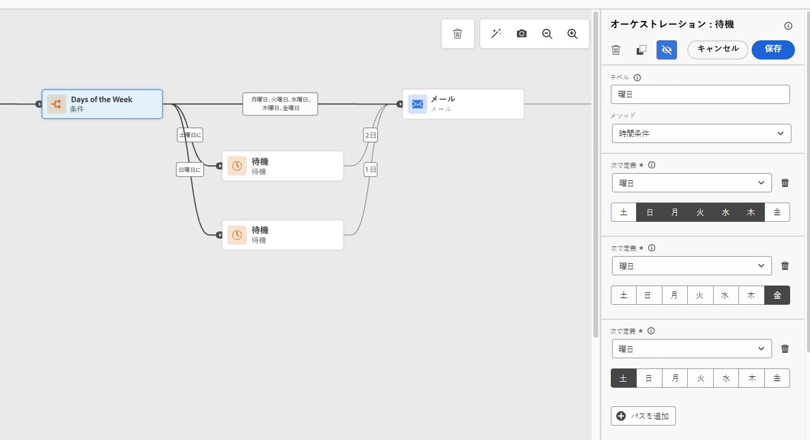
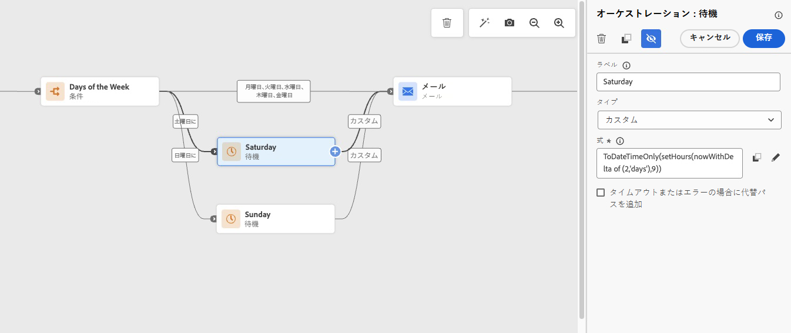

# 平日にのみメールを送信 {#send-emails-only-on-weekdays}

このユースケースでは、平日（月曜日から金曜日）にのみメールを送信するジャーニーをAdobe Journey Optimizerで設定する方法を示します。 週末（土曜日または日曜日）にジャーニーにエントリするプロファイルの場合、メールは自動的にキューに入り、指定した時間に月曜日に送信されます。 これにより、平日にメッセージを配信することで、最適なエンゲージメントを確保できます。

## ユースケースの概要

**課題**：プロファイルが週末にジャーニーにエントリする場合でも、メールが平日にのみ送信されるようにすることです。 週末のエントリの場合は、メールをキューに入れ、特定の時間に月曜日に送信する必要があります。

**解決策**：条件アクティビティを使用して、曜日を特定します。 週末のエントリの場合、カスタム式を使用してアクティビティを待機すると、メールは月曜日まで遅れます。 平日のエントリは、メール送信手順に直接進みます。

このアプローチでは、次の方法を示します。

* 条件アクティビティを使用すると、現在の日付が土曜日か日曜日かを確認できます
* 週末エントリのカスタム数式を使用して待機アクティビティを実装します
* 特定の時間に月曜日に配信する週末のメールをキューに入れます
* 平日のエントリに対して直ちにメールを送信（月曜日から金曜日）

このアプローチは、次の場合に最適です。

* B2B メールキャンペーン
* プロ向けのニュースレターとコミュニケーション
* ビジネス関連のお知らせ
* 作業に関する製品アップデート
* 週末の配信が望ましくないマーケティングキャンペーン

完全な実装については、このページの下部にある詳細な手順 [&#x200B; ビデオチュートリアル &#x200B;](#how-to-video) をご覧ください。

## 前提条件

このユースケースを実装するには、次が必要です。

* アクティブなAdobe Journey Optimizer インスタンス
* 設定済みの [&#x200B; メールチャネルサーフェス &#x200B;](../configuration/channel-surfaces.md)
* ジャーニーをトリガーにする [&#x200B; オーディエンス &#x200B;](../audience/about-audiences.md) または [&#x200B; イベント &#x200B;](../event/about-events.md)
* [&#x200B; ジャーニー条件 &#x200B;](condition-activity.md) および [&#x200B; 式 &#x200B;](expression/expressionadvanced.md) の基本的な理解

## 実装手順

### 手順 1：ジャーニーの作成

1. Adobe Journey Optimizerの **[!UICONTROL ジャーニー管理]** / **[!UICONTROL ジャーニー]** に移動します。

1. **[!UICONTROL ジャーニーを作成]** をクリックして、新規のジャーニーを作成します。 [&#x200B; ジャーニー作成の詳細情報 &#x200B;](journey-gs.md)

1. ジャーニーのプロパティを設定します。
   * **名前**：平日のメールキャンペーン
   * **説明**：平日（月曜日から金曜日）にのみメールを送信します
   * ユースケースに適した名前空間の設定

[ジャーニーのプロパティの詳細を学ぶ](journey-properties.md)

1. ジャーニーのエントリポイントを選択：
   * **[オーディエンスを読み取り](read-audience.md)**：特定のオーディエンスをターゲティングするバッチキャンペーンの場合
   * **[イベント](../event/about-events.md)**：顧客の行動に基づいてリアルタイムトリガーされるジャーニーの場合

### 手順 2：条件アクティビティを追加して、曜日を確認する

ジャーニーが開始された直後に、**[!UICONTROL 条件]** アクティビティを追加して、現在の日付が土曜日か日曜日かを確認します。 これにより、それに応じてワークフローが分岐されます。

1. **[!UICONTROL 条件]** アクティビティを、エントリポイントの後のキャンバスにドラッグ&amp;ドロップします。 [&#x200B; 条件アクティビティの詳細はこちらを参照 &#x200B;](condition-activity.md)

1. 条件アクティビティをクリックして、設定パネルを開きます。

1. 「**[!UICONTROL 条件タイプ]**」セクションで、「**[!UICONTROL データSource条件]**」を選択します。 [&#x200B; 条件タイプの詳細情報 &#x200B;](condition-activity.md#data_source_condition)

### 手順 3：土曜日を識別する条件の設定

土曜日のエントリを識別する最初の条件パスを作成します。

1. **[!UICONTROL 詳細設定モード]** をクリックして、式エディターを開きます。 [&#x200B; 式エディターの詳細情報 &#x200B;](expression/expressionadvanced.md)

1. 次の式を入力して、現在の日付が土曜日かどうかを確認します。

   ```javascript
   dayOfWeek(now()) == 7
   ```

   `dayOfWeek()` 関数と `now()` を使用して、現在の日付を取得します。 [&#x200B; 日付関数の詳細については、こちらを参照してください &#x200B;](functions/date-functions.md)

   

1. 「**[!UICONTROL OK]**」をクリックして、条件を保存します。

1. このパスに「Saturday」というラベルを付けます。

### 手順 4：日曜日の 2 番目の条件パスを追加

1. 条件アクティビティで、「**[!UICONTROL パスを追加]**」をクリックして、2 番目の条件を作成します。

1. 2 番目のパスの式エディターに、次のように入力します。

   ```javascript
   dayOfWeek(now()) == 1
   ```

   現在の日付が日曜日かどうかを確認します。

1. このパスに「Sunday」というラベルを付けます。

1. **[!UICONTROL 上記以外の事例のパスを表示]** にチェックを入れて、平日（月曜日～金曜日）のエントリのパスを作成します。

   **曜日の値：**
   * 1 =日曜日
   * 2 =月曜日
   * 3 =火曜日
   * 4 =水曜日
   * 5 =木曜日
   * 6 =金曜日
   * 7 =土曜日

>[!NOTE]
>
>`dayOfWeek()` 関数は、曜日（1 は日曜日、7 は土曜日）を表す整数を返します。 これは、日番号の ISO-8601 規格に従います。

### 手順 4：週末のエントリに対する待機アクティビティの設定

土曜日または日曜日に入力するプロファイルの場合、カスタム式を使用した待機アクティビティを使用して、希望する時間に月曜日までメールを遅らせます。



**土曜日のパスの場合：**

1. **[!UICONTROL 待機]** アクティビティを追加します。 [&#x200B; 待機アクティビティの詳細 &#x200B;](wait-activity.md)

1. 待機タイプとして **[!UICONTROL 期間]** を選択します。

1. **[!UICONTROL 詳細設定モード]** をクリックして、カスタム式を入力します。

1. 月曜日の午前 9 時まで待機する場合は、次の式を入力します：

   ```javascript
   toDuration("PT" + (48 - getHourOfDay(now())) + "H")
   ```

   または、次の代替式を使用します：

   ```javascript
   setHours(nowWithDelta(2, "days"), 9)
   ```

   **説明**：この式では、土曜日から月曜日の午前 9 時までの待機時間が計算されます。 X=2 は、2 日後（土曜日+ 2 日=月曜日）を表します。 [&#x200B; 日付関数の詳細については、こちらを参照してください &#x200B;](functions/date-functions.md#nowWithDelta)

**日曜パスの場合：**

1. **[!UICONTROL 待機]** アクティビティを追加します。

1. 待機タイプとして **[!UICONTROL 期間]** を選択します。

1. **[!UICONTROL 詳細設定モード]** をクリックして、カスタム式を入力します。

1. 月曜日の午前 9 時まで待機する場合は、次の式を入力します：

   ```javascript
   setHours(nowWithDelta(1, "days"), 9)
   ```

   **説明**：この式では、1 日（日曜日+ 1 日=月曜日）が待機され、時間が午前 9 時に設定されます。 値 X=1 は 1 日後を表し、H=9 は午前 9 時を表します。

>[!TIP]
>
>時間（H）パラメーターは、月曜日にメールを送信する任意の時間にカスタマイズできます。 例えば、午前 10 時の場合は 9 から 10 に、午後 2 時の場合は 14 に変更します。

### 手順 5：平日のパスの設定

**平日パス** （月曜日～金曜日）の場合：

1. **[!UICONTROL メール]** アクションアクティビティを追加します。 平日のエントリには、待機アクティビティは必要ありません。 [&#x200B; メールアクションの詳細情報 &#x200B;](journeys-message.md)

1. メールメッセージの設定：
   * [&#x200B; メールコンテンツ &#x200B;](../email/get-started-email-design.md) を選択または作成
   * [&#x200B; メールパラメーター &#x200B;](../email/email-settings.md) を設定します
   * 必要に応じて [&#x200B; パーソナライズ機能 &#x200B;](../personalization/personalize.md) を設定します

1. メールの後に **[!UICONTROL 終了]** アクティビティを追加します。

### 手順 6：週末のパスを E メールに結合する

土曜日と日曜日の両方のパスの待機アクティビティの後、それらを同じメール アクションアクティビティに結合します。

1. 土曜待機アクティビティから、**[!UICONTROL メール]** アクションを追加します。

1. 日曜待機アクティビティから、同じメールアクションに接続します。

1. 平日のパスも、このメールのアクションに送られます。


### 手順 7：ジャーニーのテスト

公開する前に、Adobe Journey Optimizerのテストモードでジャーニーロジックを十分にテストして、すべてが期待どおりに動作することを確認します。

1. 右上隅の **[!UICONTROL テスト]** ボタンをクリックします。

1. テストモードを有効にします。 [&#x200B; ジャーニーのテスト方法を学ぶ &#x200B;](testing-the-journey.md)

1. 様々な曜日のシミュレーションエントリ時間を使用して [&#x200B; テストプロファイル &#x200B;](../audience/creating-test-profiles.md) を作成します。
   * **土曜日エントリ**：プロファイルが土曜日のパスに従い、待機し、指定した時間に月曜日にメールを受信することを確認します
   * **日曜日のエントリ**：プロファイルが日曜日のパスに従い、待機し、指定した時間に月曜日にメールを受信することを確認します
   * **月曜日から金曜日のエントリ**：待機せずにメールがすぐに送信されることを確認します

1. ジャーニーのビジュアライゼーションを確認し、プロファイルが正しい条件付きパス（土曜日、日曜日または平日）に従っていることを確認します。

1. ジャーニー内のエラーや警告を確認します。 [&#x200B; ジャーニーのトラブルシューティングについて説明します &#x200B;](troubleshooting.md)

1. 待機の数式で、希望する月曜日の配信時間の正しい期間が計算されていることを確認します。

>[!IMPORTANT]
>
>実稼動環境に公開する前に、常にジャーニーロジックを十分にテストします。 テストモードを使用して様々なエントリシナリオをシミュレートし、週末のエントリが月曜の配信のキューに正しく入っていることを検証します。 [&#x200B; ジャーニーテストのベストプラクティスについて詳しくは、こちらを参照してください &#x200B;](testing-the-journey.md)

### 手順 8：ジャーニーの公開

テストが完了したら、次の手順を実行します。

1. 右上隅の **[!UICONTROL 公開]** をクリックします。

1. 公開を確認します。 [&#x200B; ジャーニーの公開の詳細情報 &#x200B;](publish-journey.md)

1. [ジャーニーレポート &#x200B;](report-journey.md) および [&#x200B; ライブレポート &#x200B;](../reports/journey-live-report.md) を使用して、ジャーニーのパフォーマンスを監視します。

## ベストプラクティスと考慮事項

### 数式を強化してワークフローを最適化

ワークフローを強化し、より複雑なビジネス要件に対応するには：

* **複雑な営業時間**：休日、タイムゾーン、または基本的な平日のチェック以外の特定の営業時間を考慮して、数式を拡張します。

* **カスタム配信時間**：最適な送信時間に一致するように、待機式の時間パラメーター（H）を調整します。 例えば、午前 10 時の方がエンゲージメント率が高いと表示される場合、時間 10 を使用するように数式を変更します。

* **複数のタイムゾーンのサポート**：各受信者のローカルタイムゾーンで月曜日に配信されるように、異なる地域に対して個別のジャーニーを作成することを検討してください。

### タイムゾーン管理

`now()` 関数とジャーニーの実行では、ジャーニーレベルで設定されたタイムゾーンを使用します。 次の点に留意してください。

* **ジャーニーのタイムゾーン**: ジャーニーのタイムゾーンがニーズに合っていることを確認します。 公開する前に、ジャーニープロパティでこれを設定します。 [&#x200B; タイムゾーン管理の詳細情報 &#x200B;](timezone-management.md)。

* **グローバルオーディエンス**：オーディエンスが複数のタイムゾーンにまたがる場合、曜日のチェックは、受信者のローカルタイムゾーンではなく、ジャーニーで設定されたタイムゾーンで行われます。

* **ローカライズされたスケジュール**：タイムゾーン固有の配信の場合、異なる地域に対して個別のジャーニーを作成するか、オーディエンスを読み取りアクティビティのタイムゾーン設定を使用します。

### ジャーニーのエントリとタイミング

* **オーディエンスの読み取りジャーニー**：バッチジャーニーの場合は、オーディエンスに適したタイミングでトリガーに対して [&#x200B; オーディエンスを読み取りのスケジュールを設定 &#x200B;](read-audience.md#schedule) します。 早朝の実行（例：午前 6:00）は、ビジネスコミュニケーションで一般的です。

* **イベントベースのジャーニー**：条件は、イベントを受信するとすぐに評価されます。 週末に入るプロファイルは、自動的に月曜日まで待ちます。 [イベントの詳細情報](../event/about-events.md)

* **待機タイムアウトに関する考慮事項**:[&#x200B; ジャーニーのタイムアウト設定 &#x200B;](journey-properties.md#timeout) に、最大待機期間（土曜日から月曜日までの最大 2 日間）が収まっていることを確認します。

### 検査が不可欠である

実装ガイドで強調しているように、常にジャーニーロジックをテストして、すべてが期待どおりに動作することを確認します。

* **テストモード** を使用すると、実際のメールを送信せずに、様々な入力シナリオをシミュレートできます
* 土曜日のエントリ、日曜日のエントリ、平日のエントリの 3 つのパスをすべてテストします
* 待機期間の計算が正しいことを確認します
* 指定した時間に行われる月曜の配信を確認する
* ジャーニーのビジュアライゼーションを確認して、適切なパスルーティングを確認する

### 再入国と再入国の頻度

* 繰り返しキャンペーンの場合は、「**[!UICONTROL 再エントリ]**」設定を適切に設定します。 [&#x200B; 再エントリ設定の詳細情報 &#x200B;](entry-management.md)

* プロファイルをジャーニーに再エントリできる場合、プロファイルは毎回の曜日チェックの対象となり、週末のエントリは常に月曜日のキューに入れられます。

* プロファイルが頻繁に再入力できる場合に過剰なメッセージが表示されるのを避けるために、[&#x200B; フリークエンシーキャッピングルール &#x200B;](../conflict-prioritization/journey-capping.md) を追加することを検討します。

## 高度なバリエーション

### 特定の日のターゲティング

特定の日（火曜日や木曜日など）にのみメールを送信するには、条件を変更します。

```javascript
dayOfWeek(now()) == 3 or dayOfWeek(now()) == 5
```

それ以外の日については、次の火曜日または木曜日までの日数を計算する待機アクティビティを追加します。

### 日ごとに異なる送信時間

週末の動作ごとに異なる待機式を使用して、複数のパスを作成できます。

* **土曜日→水曜日の配信**：使用 `nowWithDelta(4, "days")`
* **日曜日→火曜配信**:`nowWithDelta(2, "days")` を使用する

これにより、送信スケジュールをより柔軟に設定できます。

### 営業時間内の配信

営業時間内に確実に配信されるように、待機式で時間パラメーターを調整してください。 例えば、午前 9 時ではなく午後 2 時に配信する場合は、次のようになります。

```javascript
setHours(nowWithDelta(1, "days"), 14)
```

また、待機の後に 2 番目の条件を追加して、現在の時刻が送信前の営業時間以内であるかどうかを確認することもできます。

### 休日の除外

休日を除外するには、特定の日付を確認する条件パスを追加します。

```javascript
toDateTimeOnly(now()) == toDateTimeOnly("2024-12-25T00:00:00")
```

条件が休日に一致する場合は、待機アクティビティを追加して、次の営業日まで遅延します。 [&#x200B; 日付比較関数の詳細については、こちらを参照してください &#x200B;](functions/date-functions.md)

## 関連トピック

* [&#x200B; 条件アクティビティについて &#x200B;](condition-activity.md) - ジャーニーで様々なパスを作成する方法を説明します
* [&#x200B; ジャーニーでの条件の使用 &#x200B;](conditions.md) - ジャーニー条件の詳細ガイド
* [&#x200B; 待機アクティビティ &#x200B;](wait-activity.md) – 待機時間と数式を設定します
* [&#x200B; 日付関数 &#x200B;](functions/date-functions.md) – 日付と時刻の関数の完全なリファレンス
* [&#x200B; 式エディター &#x200B;](expression/expressionadvanced.md) – 複雑な式の作成
* [&#x200B; ジャーニーのテスト &#x200B;](testing-the-journey.md) – 公開前にジャーニーのロジックを検証します
* [&#x200B; タイムゾーン管理 &#x200B;](timezone-management.md) - ジャーニー内の様々なタイムゾーンを処理します
* [ジャーニーのベストプラクティス &#x200B;](journey-gs.md#best-practices) - ジャーニーデザインの推奨アプローチ

## チュートリアルビデオ

Adobe Journey Optimizerを使用して、平日にのみメールを送信する方法を説明します。 このビデオでは、条件アクティビティと待機の数式を実装して、月曜配信の週末のエントリをキューに入れる手順を順を追って説明します。

>[!VIDEO](https://video.tv.adobe.com/v/3469330?quality=12&learn=on)

## その他のリソース

* [&#x200B; 式エディターのドキュメント &#x200B;](expression/expressionadvanced.md) - ジャーニー式の作成と検証
* [ジャーニーデザイナーガイド &#x200B;](using-the-journey-designer.md) - ジャーニーキャンバスのマスター
* [ジャーニーのユースケースの概要 &#x200B;](jo-use-cases.md) – その他のジャーニーパターンおよび例を調べる
* [&#x200B; コミュニティブログ投稿：平日のみメールを送信する方法 &#x200B;](https://experienceleaguecommunities.adobe.com/t5/journey-optimizer-blogs/how-to-send-emails-only-on-weekdays-in-adobe-journey-optimizer/ba-p/760400?profile.language=ja){target="_blank"} – 詳細な例を含む元のブログ投稿

