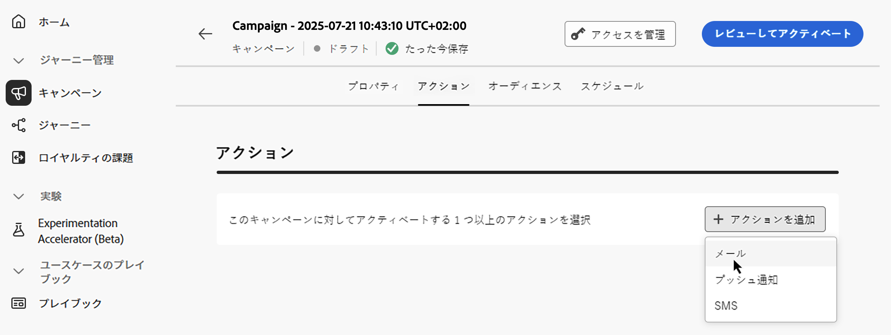
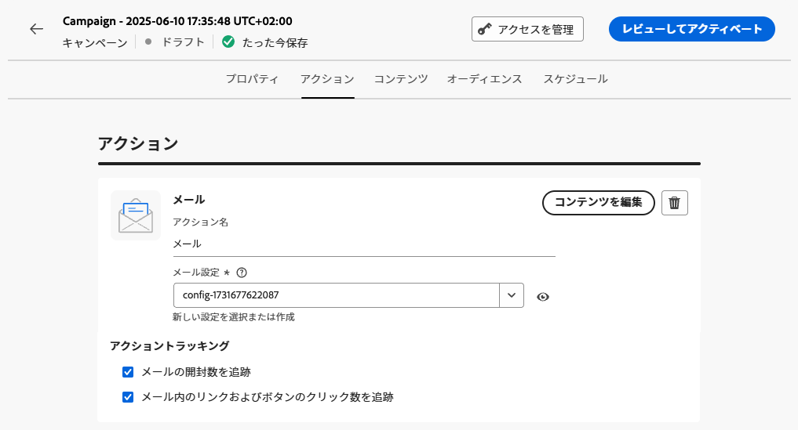

# API トリガーキャンペーンアクションの設定 {#api-action}

「**[!UICONTROL アクション]**」タブを使用すると、メッセージのチャネル設定を選択し、トラッキング、コンテンツ実験、多言語コンテンツなどの追加設定を指定できます。

1. **チャネルを選択します**。

   「**[!UICONTROL アクション]**」タブに移動し、「**[!UICONTROL アクションを追加]**」ボタンをクリックして、通信チャネルを選択します。

   

   >[!NOTE]
   >
   >サポートされるチャネルについて詳しくは、[ジャーニーとキャンペーンのチャネル](../channels/gs-channels.md#channels)の節にある表を参照してください。 使用できるチャネルは、ライセンスモデルとアドオンによって異なります。
   >
   >High Throughput API トリガーキャンペーンは現在、メールチャネルのみをサポートしています。

1. **チャネル設定を選択**

   設定は、[システム管理者](../start/path/administrator.md)によって定義されます。 ヘッダーパラメーター、サブドメイン、モバイルアプリなど、メッセージを送信するためのすべての技術的なパラメーターが含まれます。[ チャネル設定の設定方法を説明します](../configuration/channel-surfaces.md)

   

1. **最適化を活用**

   「**[!UICONTROL メッセージの最適化]**」セクションを使用すると、コンテンツ実験を実行したり、ターゲティングルールを活用したり、実験とターゲティングの両方の高度な組み合わせを使用したりすることができます。 これらの様々なオプションと実行する手順について詳しくは、[キャンペーンの最適化](../content-management/gs-message-optimization.md)の節を参照してください。
<!--
1. **Create a content experiment**

    Use the **[!UICONTROL Content experiment]** section to define multiple delivery treatments in order to measure which one performs best for your target audience. Click the **[!UICONTROL Create experiment]** button then follow the steps detailed in this section: [Create a content experiment](../content-management/content-experiment.md).
-->

1. **多言語コンテンツを追加**

   「**[!UICONTROL 言語]**」セクションを使用すると、キャンペーン内の複数の言語でコンテンツを作成できます。 これを行うには、「**[!UICONTROL 言語を追加]**」ボタンをクリックし、目的の&#x200B;**[!UICONTROL 言語設定]**&#x200B;を選択します。 多言語機能の設定と使用方法について詳しくは、[多言語コンテンツの基本を学ぶ](../content-management/multilingual-gs.md)の節を参照してください。

選択した通信チャネルに応じて、追加の設定を使用できます。 詳しくは、以下の節を展開してください。

+++**キャッピングルールの適用**（メール、プッシュ、SMS）

**[!UICONTROL ビジネスルール]**&#x200B;ドロップダウンリストで、キャッピングルールをキャンペーンに適用するルールセットを選択します。 チャネルルールセットを活用すると、通信タイプ別のフリークエンシーキャップを設定し、類似したメッセージで顧客に過剰な負荷がかかるのを防ぐことができます。 [ルールセットの使用方法を学ぶ](../conflict-prioritization/rule-sets.md)

+++

+++**エンゲージメントのトラッキング**（メール、SMS）。

「**[!UICONTROL アクショントラッキング]**」セクションを使用すると、受信者がメールや SMS の配信にどのように反応したかを追跡できます。 キャンペーンが実行されると、キャンペーンレポートからトラッキング結果にアクセスできるようになります。 [詳しくは、キャンペーンレポートを参照してください](../reports/campaign-global-report-cja.md)

+++

+++**迅速配信モードを有効にする**（プッシュ）。

迅速配信モードは、キャンペーンを通じて大量のプッシュメッセージを非常に高速に送信できるようにする [!DNL Journey Optimizer] アドオンです。 迅速配信は、メッセージ配信の遅延がビジネス上の重要な問題になる状況で、携帯電話に緊急のプッシュアラートを送信するときに使用します（ニュースチャネルアプリをインストールしたユーザーにニュース速報を配信するなど）。 プッシュ通知の迅速配信モードを有効にする方法について詳しくは、[このページ](../push/create-push.md#rapid-delivery)を参照してください。

迅速配信モードを使用する際のパフォーマンスについて詳しくは、[Adobe Journey Optimizer 製品説明](https://helpx.adobe.com/jp/legal/product-descriptions/adobe-journey-optimizer.html){target="_blank"}を参照してください。

+++

## 次の手順 {#next}

キャンペーンの設定とコンテンツの準備が整ったら、このコンテンツをデザインできます。 [詳細情報](api-triggered-campaign-content.md)
