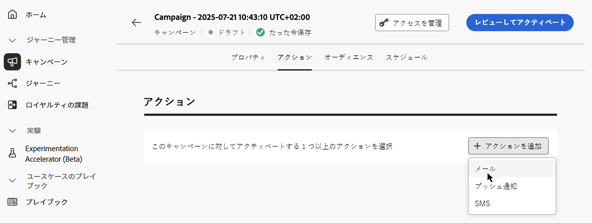

# API トリガーキャンペーンアクションの設定 {#api-action}

「**[!UICONTROL アクション]**」タブを使用すると、メッセージのチャネル設定を選択し、トラッキング、コンテンツ実験、多言語コンテンツなどの追加設定を指定できます。

1. **チャネルを選択します**。

   「**[!UICONTROL アクション]**」タブに移動し、「**[!UICONTROL アクションを追加]**」ボタンをクリックして、通信チャネルを選択します。

   

   >[!NOTE]
   >
   >使用できるチャネルは、ライセンスモデルとアドオンによって異なります。
   >
   >API トリガーキャンペーンの場合は、メール、SMS、プッシュ通知の各チャネルのみを使用できます。

1. **チャネル設定を選択**

   設定は、[システム管理者](../start/path/administrator.md)によって定義されます。ヘッダーパラメーター、サブドメイン、モバイルアプリなど、メッセージを送信するすべての技術的なパラメーターが含まれています。[詳しくは、チャネル設定の指定方法を参照してください](../configuration/channel-surfaces.md)。

   

1. **最適化の活用**

   「**[!UICONTROL メッセージの最適化]**」セクションを使用して、コンテンツ実験を実行したり、ターゲティングルールを活用したり、実験とターゲティングの両方の詳細な組み合わせを使用したりします。 様々なオプションと手順について詳しくは、この節 [ キャンペーンでの最適化 ](campaigns-message-optimization.md) を参照してください。
<!--
1. **Create a content experiment**

    Use the **[!UICONTROL Content experiment]** section to define multiple delivery treatments in order to measure which one performs best for your target audience. Click the **[!UICONTROL Create experiment]** button then follow the steps detailed in this section: [Create a content experiment](../content-management/content-experiment.md).-->

1. **多言語コンテンツを追加**

   「**[!UICONTROL 言語]**」セクションを使用すると、キャンペーン内の複数の言語でコンテンツを作成できます。これを行うには、「**[!UICONTROL 言語を追加]**」ボタンをクリックし、目的の&#x200B;**[!UICONTROL 言語設定]**&#x200B;を選択します。多言語機能の設定と使用方法について詳しくは、[多言語コンテンツの基本を学ぶ](../content-management/multilingual-gs.md)の節を参照してください。

選択した通信チャネルに応じて、追加の設定を使用できます。詳しくは、以下の節を展開してください。

+++**キャッピングルールの適用**（メール、プッシュ、SMS）

**[!UICONTROL ビジネスルール]**&#x200B;ドロップダウンリストで、キャッピングルールをキャンペーンに適用するルールセットを選択します。チャネルルールセットを活用すると、通信タイプ別のフリークエンシーキャップを設定し、類似したメッセージで顧客に過剰な負荷がかかるのを防ぐことができます。[詳しくは、ルールセットの操作方法を参照してください](../conflict-prioritization/rule-sets.md)。

+++

+++**エンゲージメントのトラッキング**（メール、SMS）。

「**[!UICONTROL アクショントラッキング]**」セクションを使用すると、受信者がメールや SMS の配信にどのように反応したかを追跡できます。キャンペーンが実行されると、キャンペーンレポートからトラッキング結果にアクセスできるようになります。[詳しくは、キャンペーンレポートを参照してください](../reports/campaign-global-report-cja.md)

+++

+++**迅速配信モードを有効にする**（プッシュ）。

迅速配信モードは、キャンペーンを通じて大量のプッシュメッセージを非常に高速に送信できるようにする [!DNL Journey Optimizer] アドオンです。迅速配信は、メッセージ配信の遅延がビジネス上の重要な問題になる状況で、携帯電話に緊急のプッシュアラートを送信するときに使用します（ニュースチャネルアプリをインストールしたユーザーにニュース速報を流すなど）。迅速配信モードを使用する際のパフォーマンスについて詳しくは、[Adobe Journey Optimizer 製品の説明](https://helpx.adobe.com/jp/legal/product-descriptions/adobe-journey-optimizer.html)を参照してください。

+++

## 次の手順 {#next}

キャンペーンの設定とコンテンツの準備が整ったら、このコンテンツをデザインできます。[詳細情報](api-triggered-campaign-content.md)
