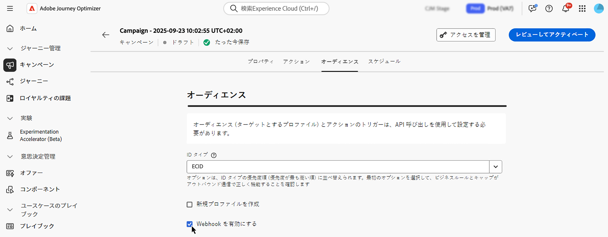

# API トリガーキャンペーンのオーディエンスの定義 {#api-audience}

「**[!UICONTROL オーディエンス]**」タブを使用して、キャンペーンオーディエンスを定義します。

## オーディエンスの選択

**Marketing API トリガーキャンペーンの場合は**、「**[!UICONTROL オーディエンスを選択]**」ボタンをクリックして、使用できる Adobe Experience Platform オーディエンスのリストを表示します。[詳しくは、オーディエンスを参照してください](../audience/about-audiences.md)。

>[!IMPORTANT]
>
>[オーディエンス構成](../audience/get-started-audience-orchestration.md)からのオーディエンスおよび属性は現在、Healthcare Shield または Privacy and Security Shield では使用できません。

**トランザクション API トリガーキャンペーンの場合は**、API 呼び出しでターゲットプロファイルを定義する必要があります。1 回の API 呼び出しで最大 20 人のユニーク受信者をサポートできます。各受信者は一意のユーザー ID を持つ必要があり、重複するユーザー ID は許可されていません。詳しくは、[Interactive Message Execution API ドキュメント](https://developer.adobe.com/journey-optimizer-apis/references/messaging/#tag/execution/operation/postIMUnitaryMessageExecution){target="_blank"}を参照してください。

## ID タイプの選択

「**[!UICONTROL ID タイプ]**」フィールドで、選択したオーディエンスから個人を識別するために使用するキーのタイプを選択します。既存の ID タイプを使用することも、Adobe Experience Platform ID サービスを使用して新しい ID タイプを作成することもできます。標準 ID 名前空間について詳しくは、[このページ](https://experienceleague.adobe.com/ja/docs/experience-platform/identity/features/namespaces#standard){target="_blank"}を参照してください。

1 つのキャンペーンで使用できる ID タイプは 1 つだけです。様々な ID の中から選択した ID タイプを持たないセグメントに属する個人は、キャンペーンのターゲットにすることができません。ID タイプと名前空間について詳しくは、[Adobe Experience Platform ドキュメント](https://experienceleague.adobe.com/docs/experience-platform/identity/home.html?lang=ja){target="_blank"}を参照してください。

## キャンペーン実行時のプロファイル作成のアクティブ化

場合によっては、システムに存在しないプロファイルにトランザクションメッセージを送信する必要があります。例えば、不明なユーザーが web サイトでパスワードをリセットしようとした場合などです。データベースにプロファイルが存在しない場合、Journey Optimizer では、キャンペーンの実行時にプロファイルを自動的に作成して、このプロファイルにメッセージを送信できるようにします。

キャンペーン実行時のプロファイル作成をアクティブ化するには、「**[!UICONTROL 新規プロファイルを作成]**」オプションをオンに切り替えます。このオプションを無効にした場合、不明なプロファイルの送信は拒否され、API 呼び出しは失敗します。

>[!IMPORTANT]
>
>このオプションは、大量のトランザクションを送信するユースケースにおいて、既にプラットフォーム上に大量のプロファイルが存在する場合に、**少量のプロファイルを作成**&#x200B;する目的で提供されます。
>
>**AJO インタラクティブメッセージングプロファイルデータセット**&#x200B;の、3 つのアウトバウンドチャネル（メール、SMS、プッシュ）に対応するそれぞれのデフォルト名前空間（メール、電話、ECID）で、不明なプロファイルが作成されます。ただし、カスタム名前空間を使用している場合、ID は同じカスタム名前空間で作成されます。
>
>[&#x200B; ハイスループットキャンペーン &#x200B;](../campaigns/api-triggered-high-throughput.md) では、Adobe プロファイルに依存しないので、実行時にプロファイルを作成することはできません。 プロファイルが存在するかどうかは確認されません。

## Webhook を有効にする {#webhook}

トランザクション API トリガーキャンペーンの場合は、Webhook を有効にして、メッセージの実行ステータスに関するフィードバックをリアルタイムで受け取ることができます。 これを行うには、「**[!UICONTROL Webhook を有効にする]**」オプションに切り替えて、配信ステータスイベントを設定済みの Webhook に送信します。

Webhook 設定は、**[!UICONTROL 管理]**／**[!UICONTROL チャネル]**／**[!UICONTROL フィードバック Webhook]** メニューで一元的に管理されます。管理者はここで Webhook エンドポイントを作成および編集できます。 [フィードバック Webhook の作成方法を学ぶ](../configuration/feedback-webhooks.md)

## 次の手順 {#next}

キャンペーンの設定とコンテンツの準備が整ったら、この実行をスケジュールできます。[詳細情報](api-triggered-campaign-schedule.md)
