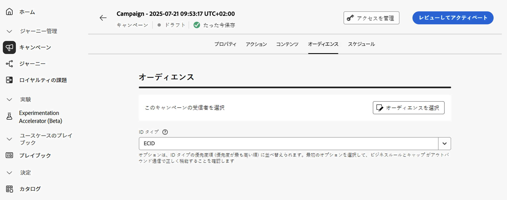

# API トリガーキャンペーンオーディエンスの定義 {#api-audience}

「**[!UICONTROL オーディエンス]** タブを使用して、キャンペーンオーディエンスを定義します。

1. **オーディエンスの選択**

   * マーケティング API トリガーキャンペーンの場合は、「**[!UICONTROL オーディエンスを選択]**」ボタンをクリックして、使用可能なAdobe Experience Platform オーディエンスのリストを表示します。 [ オーディエンスの詳細情報 ](../audience/about-audiences.md)。

     >[!IMPORTANT]
     >
     >[オーディエンス構成](../audience/get-started-audience-orchestration.md)からのオーディエンスおよび属性は現在、Healthcare Shield または Privacy and Security Shield では使用できません。

   * トランザクション API トリガーキャンペーンの場合は、API 呼び出しでターゲットプロファイルを定義する必要があります。 1 回の API 呼び出しで最大 20 人のユニーク受信者をサポートできます。各受信者は一意のユーザー ID を持つ必要があり、重複するユーザー ID は許可されていません。詳しくは、[Interactive Message Execution API ドキュメント ](https://developer.adobe.com/journey-optimizer-apis/references/messaging/#tag/execution/operation/postIMUnitaryMessageExecution){target="_blank"} を参照してください。

1. **ID タイプの選択**

   「**[!UICONTROL ID タイプ]**」フィールドで、選択したオーディエンスから個人を識別するために使用するキーのタイプを選択します。既存の ID タイプを使用することも、Adobe Experience Platform ID サービスを使用して新しい ID タイプを作成することもできます。標準 ID 名前空間について詳しくは、[このページ](https://experienceleague.adobe.com/ja/docs/experience-platform/identity/features/namespaces#standard){target="_blank"}を参照してください。

   1 つのキャンペーンで使用できる ID タイプは 1 つだけです。様々な ID の中から選択した ID タイプを持たないセグメントに属する個人は、キャンペーンのターゲットにすることはできません。 ID タイプと名前空間について詳しくは、[Adobe Experience Platform ドキュメント](https://experienceleague.adobe.com/docs/experience-platform/identity/home.html?lang=ja){target="_blank"}を参照してください。

1. **キャンペーン実行時にプロファイル作成を有効化**

   場合によっては、システムに存在しないプロファイルにトランザクションメッセージを送信する必要があります。例えば、不明なユーザーが web サイトでパスワードのリセットを試みた場合などです。 データベースにプロファイルが存在しない場合、Journey Optimizer では、キャンペーンの実行時にプロファイルを自動的に作成して、このプロファイルにメッセージを送信できるようにします。

   キャンペーンの実行時にプロファイルの作成を有効にするには、「**[!UICONTROL 新しいプロファイルの作成]** オプションをオンにします。 このオプションを無効にした場合、不明なプロファイルの送信は拒否され、API 呼び出しは失敗します。

   

   >[!IMPORTANT]
   >
   >このオプションは、大量のトランザクションを送信するユースケースにおいて、既にプラットフォーム上に存在するプロファイルの大半を使用して、**非常に小さいボリュームプロファイルの作成** を目的として提供されます。
   >
   >**AJO インタラクティブメッセージングプロファイルデータセット**&#x200B;の、3 つのアウトバウンドチャネル（メール、SMS、プッシュ）に対応するそれぞれのデフォルト名前空間（メール、電話、ECID）で、不明なプロファイルが作成されます。ただし、カスタム名前空間を使用している場合、ID は同じカスタム名前空間で作成されます。

## 次の手順 {#next}

キャンペーンの設定とコンテンツの準備が整ったら、その実行をスケジュールできます。 [詳細情報](api-triggered-campaign-schedule.md)
