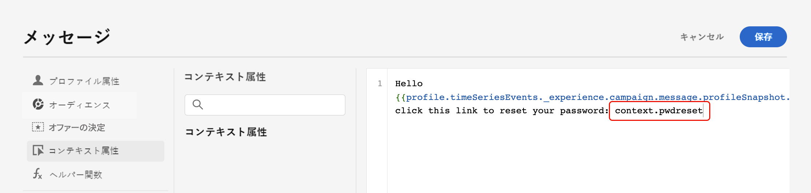

# API トリガーキャンペーンコンテンツの編集 {#api-content}

メッセージコンテンツを設定するには、「**[!UICONTROL コンテンツ]**」タブに移動するか、「**[!UICONTROL コンテンツを編集]**」ボタンをクリックします。

## コンテンツのデザイン {#design}

コンテンツの作成プロセスは、選択したチャネルによって異なります。メッセージコンテンツを作成する詳細な手順については、次のページを参照してください。

<table style="table-layout:fixed"><tr style="border: 0;">
<td>

<a href="../email/create-email.md"><strong>メール</strong></a>
</td>
<td>

<a href="../sms/create-sms.md"><strong>SMS</strong></a>
</td>
<td>

<a href="../push/create-push.md"><strong>プッシュ通知</strong></a>
</td>
</tr></table>

>[!IMPORTANT]
>
>[ ハイスループットキャンペーン ](../campaigns/api-triggered-high-throughput.md) は、Adobe プロファイルに依存しません。以下に説明するように、すべてのパーソナライゼーションをコンテキストデータとして API ペイロードに含める必要があります。 このモードは、メールチャネルと米国地域でのみ使用できます。

## コンテキストデータを使用したコンテンツのパーソナライズ {#contextual}

メッセージをパーソナライズするのに活用できる追加データを API ペイロードに渡すことができます。

この例では、パスワードのリセットを希望する顧客に、サードパーティツールで生成されるパスワードリセット URL を送信するとします。API トリガーキャンペーンを使用すると、生成されたこの URL を API ペイロードに渡し、キャンペーンに活用してメッセージに追加できます。

それには、これらのデータを API ペイロードに渡し、パーソナライゼーションエディターを使用してメッセージに追加する必要があります。`{{context.<contextualAttribute>}}` 構文を使用します。ここで、`<contextualAttribute>` は、渡すデータを含んだ API ペイロード内の変数の名前と一致する必要があります。

なお、現時点では、左側のパネルメニューで使用できるコンテキスト属性はありません。 属性はパーソナライゼーション式に直接入力する必要がありますが、[!DNL Journey Optimizer] によるチェックは行われません。

**必読**

* リクエストに渡すコンテキスト属性は 200 KB を超えることはできず、常に文字列タイプと見なされます。
* `context.system` 構文はアドビ内部での使用のみに制限されているので、コンテキスト属性を渡すには使用しないでください。
* プロファイル対応のイベントとは異なり、REST API で渡されるコンテキストデータは、1 回限りの通信に使用され、プロファイルに対しては保存されません。プロファイルが見つからなかった場合、名前空間の詳細を最大限に使用してプロファイルが作成されます。
* コンテンツで多数または大量のコンテキストデータを使用すると、パフォーマンスに影響を与える可能性があります。

## コンテンツのテストとチェック

コンテンツを定義したら、「**[!UICONTROL コンテンツをシミュレート]**」ボタンを使用して、CSV／JSON ファイルからアップロードした、または手動で追加したテストプロファイルやサンプル入力データを使用して、そのコンテンツをプレビューおよびテストします。[詳しくは、コンテンツのプレビューとテストの方法を参照してください](../content-management/preview-test.md)。キャンペーン作成画面に戻るには、左向き矢印をクリックします。

## 次の手順 {#next}

キャンペーンの設定とコンテンツの準備が整ったら、キャンペーンオーディエンスを定義できます。[詳細情報](api-triggered-campaign-audience.md)
