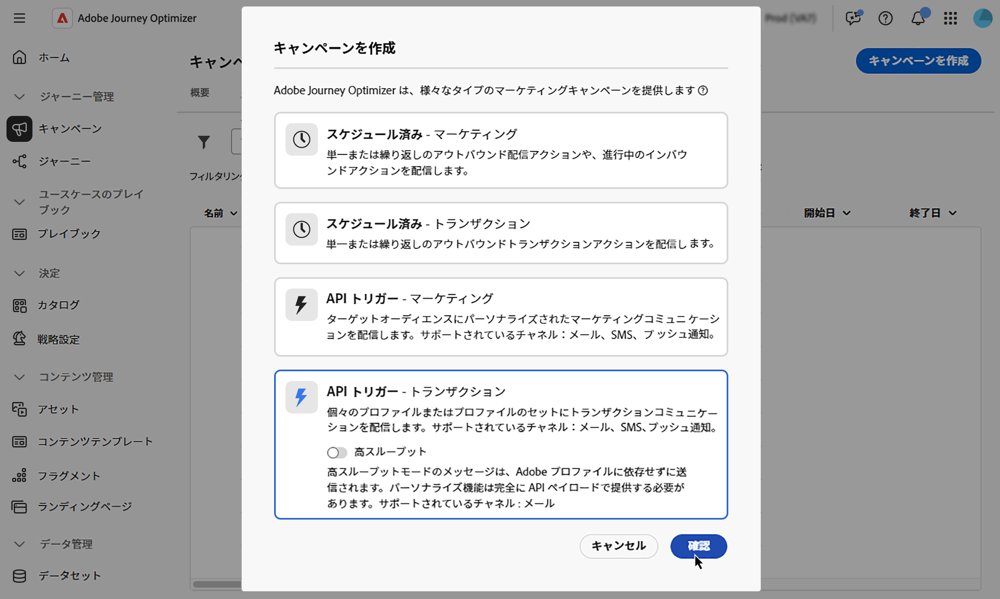
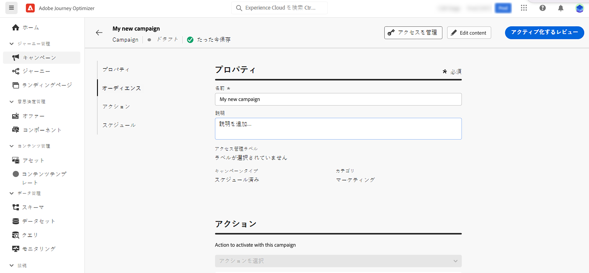

# API トリガーキャンペーンのプロパティの定義 {#api-properties}

新しい API トリガーキャンペーンを作成するには、次の手順に従います。

1. **[!UICONTROL キャンペーン]**&#x200B;メニューに移動し、「**[!UICONTROL API トリガー]**」タブを選択します。

1. 「**[!UICONTROL キャンペーンを作成]**」ボタンをクリックし、キャンペーンのタイプを選択します。

   * **[!UICONTROL API トリガー - マーケティング]** - ターゲットオーディエンスにパーソナライズされたマーケティングコミュニケーションを送信するには、この API トリガーキャンペーンのタイプを選択します。

   * **[!UICONTROL API トリガー – トランザクション]** - トランザクションキャンペーンは、トランザクションメッセージ、つまり、個人が実行したアクション（パスワードのリセットリクエスト、買い物かごの購入など）に続いて送信されるメッセージを送信することを目的としています。

     +++ハイスループットモード

     トランザクション API トリガーキャンペーンの場合は、**[!UICONTROL 高スループット]** モードを有効にできます。 このモードは、大規模なリアルタイムメッセージ（1 秒あたり最大 5000 トランザクション）向けに設計されており、より高い可用性とより低い待ち時間を提供します。 [ 高スループット モードの操作方法を学ぶ ](../campaigns/api-triggered-high-throughput.md)

     >[!AVAILABILITY]
     >
     >現在、高スループット モードは、メールチャネルと米国地域でのみ使用できます。
     >
     >この機能は、Adobe **ハイスループットトランザクションメッセージ** アドオン機能を購入した組織でのみ利用できます。 詳しくは、アドビ担当者にお問い合わせください。

     +++

   

1. 「**[!UICONTROL プロパティ]**」タブで、キャンペーンの名前と説明を入力します。

   

1. 「**タグ**」フィールドを使用して、Adobe Experience Platform 統合タグをキャンペーンに割り当てます。これにより、キャンペーンを簡単に分類し、キャンペーンリストからの検索を改善できます。[詳しくは、タグの操作方法を参照してください](../start/search-filter-categorize.md#tags)。

1. アクセスラベルに基づいて、このキャンペーンへのアクセスを制限できます。アクセス制限を追加するには、このページの上部にある「**[!UICONTROL アクセスを管理]**」ボタンを参照します。権限のあるラベルのみを選択します。[詳しくは、オブジェクトレベルのアクセス制御を参照してください](../administration/object-based-access.md)。

## 次の手順 {#next}

キャンペーンの設定とコンテンツの準備が整ったら、このアクションを設定できます。[詳細情報](api-triggered-campaign-action.md)
