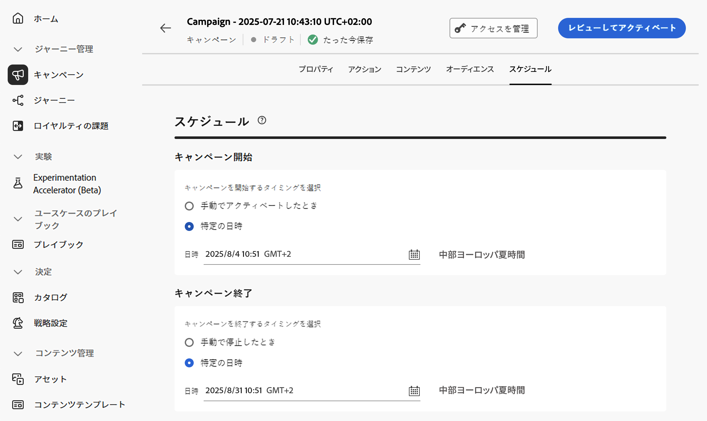

# API トリガーキャンペーンのスケジュール {#api-schedule}

「**[!UICONTROL スケジュール]**」タブを使用して、キャンペーンオーディエンスを定義します。

## 開始日と終了日を設定

デフォルトでは、API トリガーキャンペーンはトリガーした後に開始され、メッセージが 1 回送信された直後に終了します。トリガー直後にキャンペーンを実行しない場合は、「**[!UICONTROL キャンペーン開始]**」オプションを使用して、メッセージを送信する日時を指定できます。

「**[!UICONTROL キャンペーン終了]**」オプションを使用すると、キャンペーンの実行を停止するタイミングを指定できます。指定した日付以外では、キャンペーンは実行されません。

>[!NOTE]
>
>[!DNL Adobe Journey Optimizer] でキャンペーンをスケジュールする場合は、開始日時が目的の最初の配信に合っていることを確認します。

## レート制御の設定

[!DNL Journey Optimizer] では、アウトバウンドアクション（メール、SMS、プッシュ通知）のレート制御を有効にできます。

この機能は、ランディングページやカスタマーケアプラットフォームなどのダウンストリームシステムで過負荷が発生するのを防ぐために特に役立ちます。 例えば、1 秒あたり 165 メッセージのレート制限を設定すると、ダウンストリームのシステムに圧倒されずに安定した配信を確保できます。

レート制御を設定するには、「**&#x200B;** 配信設定 **[!UICONTROL セクションの「配信をスロットル]**」オプションを有効にし、目的の **[!UICONTROL 配信率]** を指定します。

## 次の手順 {#next}

キャンペーンの設定とコンテンツの準備が整ったら、レビューしてアクティブ化できます。[詳細情報](review-activate-campaign.md)
