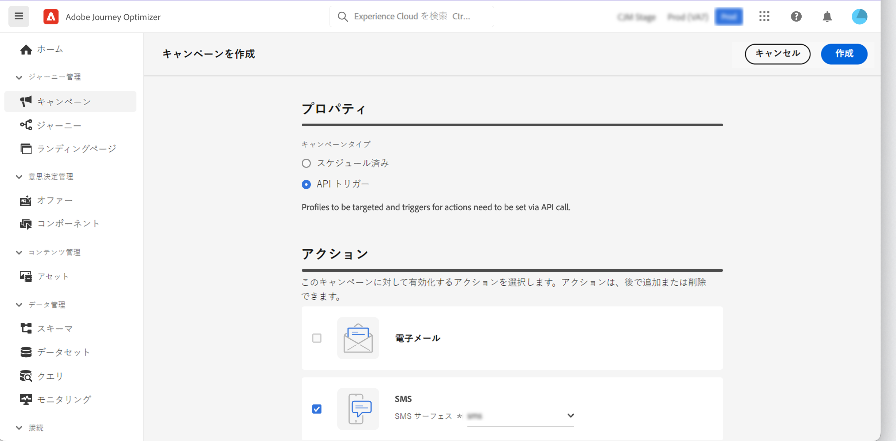
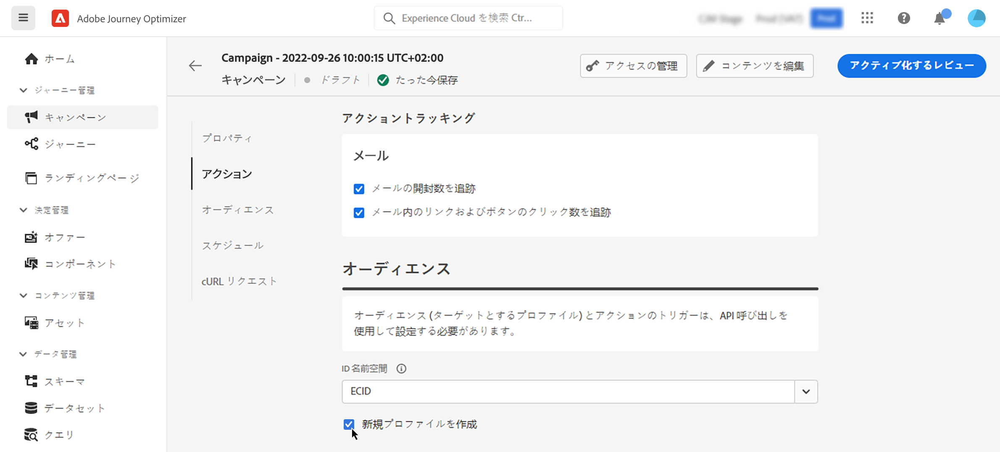

# API を使用したキャンペーンのトリガー {#trigger-campaigns}

## API トリガー型キャンペーンについて {#about}

[!DNL Journey Optimizer] を使用すると、キャンペーンを作成したあと、[インタラクティブメッセージ実行 REST API](https://developer.adobe.com/journey-optimizer-apis/references/messaging/#tag/execution) を使用して、ユーザートリガーに基づいて外部システムからそれらのキャンペーンを呼び出すことができます。これにより、パスワードのリセットや OTP トークンなど、マーケティングメッセージおよびトランザクションメッセージの様々なニーズに対応できます。

それには、まず Journey Optimizer で API トリガー型キャンペーンを作成し、次に API 呼び出しを通じてその実行を開始する必要があります。

API トリガー型キャンペーンで使用できるチャネルは、メール、SMS およびプッシュメッセージです。

>[!NOTE]
>
>現時点で、プッシュ通知の API トリガーキャンペーンでは迅速配信モードはサポートされていません。

➡️ [この機能をビデオで確認](#video)

## API トリガーキャンペーンの作成 {#create}

### キャンペーンの設定とアクティブ化 {#create-activate}

API トリガーキャンペーンを作成するには、次の手順に従います。キャンペーンの作成方法について詳しくは、[この節](create-campaign.md)を参照してください。

1. **[!UICONTROL API トリガー]**&#x200B;タイプの新しいキャンペーンを作成します。

1. 送信する通信のタイプに応じて、**[!UICONTROL マーケティング]**&#x200B;カテゴリまたは&#x200B;**[!UICONTROL トランザクション]**&#x200B;カテゴリを選択します。

1. メッセージの送信に使用するサポート対象チャネルの 1 つとそれに関連するチャネルサーフェスを選択し、「**[!UICONTROL 作成]**」をクリックします。

   

1. キャンペーンのタイトルと説明を指定し、「**[!UICONTROL コンテンツを編集]**」をクリックして送信するメッセージを設定します。

   >[!NOTE]
   >
   >追加のデータを API ペイロードに渡して、メッセージのパーソナライズに利用できます。[詳細情報](#contextual)
   >
   >コンテンツで多数または大量のコンテキストデータを使用すると、パフォーマンスに影響を与える可能性があります。

1. 「**[!UICONTROL オーディエンス]**」セクションで、個人の識別に使用する名前空間を指定します。

   * **トランザクション**&#x200B;タイプのキャンペーンを作成している場合は、API 呼び出しでターゲットプロファイルを定義する必要があります。「**[!UICONTROL 新規プロファイルを作成]**」オプションを使用すると、データベースに存在しないプロファイルを自動的に作成できます。[キャンペーン実行時のプロファイル作成について詳しくはこちらから](#profile-creation)

   * **マーケティング**&#x200B;タイプのキャンペーンの場合は、「**[!UICONTROL オーディエンス]**」ボタンをクリックして、ターゲットにするオーディエンスを選択します。

1. キャンペーンの開始日と終了日を設定します。

   キャンペーンの開始日や終了日を特定の日付に設定した場合、そのキャンペーンはこれらの日付以外では実行されず、キャンペーンが API によってトリガーされると API 呼び出しは失敗します。

1. 「**[!UICONTROL レビューしてアクティベート]**」をクリックして、キャンペーンが正しく設定されていることを確認してからアクティブ化します。

これで、API からキャンペーンを実行する準備が整いました。 [詳細情報](#execute)

### キャンペーンの実行 {#execute}

キャンペーンがアクティブ化されたら、生成されたサンプル cURL リクエストを取得、それを API で使用してペイロードを作成し、キャンペーンをトリガーする必要があります。

1. キャンペーンを開き、「**[!UICONTROL cURL リクエスト]**」セクションからペイロードリクエストをコピー＆ペーストします。このペイロードには、メッセージで使用されるすべてのパーソナライゼーション（プロファイルとコンテキスト）変数が含まれます。キャンペーンがライブになったら使用できます。

   

1. この API への cURL リクエストを使用して、ペイロードを作成し、キャンペーンをトリガーします。詳しくは、 [Interactive Message Execution API ドキュメント](https://developer.adobe.com/journey-optimizer-apis/references/messaging/#tag/execution)を参照してください。

   API 呼び出しの例については、[こちらのページ](https://developer.adobe.com/journey-optimizer-apis/references/messaging-samples/)も参照してください。

   >[!NOTE]
   >
   >キャンペーンを作成する際に特定の開始日や終了日を設定している場合、そのキャンペーンはこれらの日付以外では実行されず、API 呼び出しは失敗します。

## API トリガー型キャンペーンでのコンテキスト属性の使用 {#contextual}

API トリガー型キャンペーンを使用すると、追加のデータを API ペイロードに渡し、キャンペーン内で使用してメッセージをパーソナライズできます。

この例では、パスワードのリセットを希望する顧客に、サードパーティツールで生成されるパスワードリセット URL を送信するとします。API トリガー型キャンペーンを使用すると、生成されたこの URL を API ペイロードに渡し、キャンペーンに活用してメッセージに追加できます。

>[!NOTE]
>
>プロファイル対応のイベントとは異なり、REST API で渡されるコンテキストデータは、1 回限りの通信に使用され、プロファイルに対しては保存されません。プロファイルが見つからなかった場合、名前空間の詳細を最大限に使用してプロファイルが作成されます。

これらのデータをキャンペーンで使用するには、データを API ペイロードに渡し、式エディターを使用してメッセージに追加する必要があります。それには、`{{context.<contextualAttribute>}}` 構文を使用します。ここで、`<contextualAttribute>` は、渡すデータを含んだ API ペイロード内の変数の名前と一致する必要があります。

この `{{context.<contextualAttribute>}}` 構文は String データタイプにのみマッピングされます。

>[!IMPORTANT]
>
>リクエストに渡すコンテキスト属性は 50 KB を超えることはできず、常に文字列タイプと見なされます。
>
>`context.system` 構文はアドビ内部での使用のみに制限されているので、コンテキスト属性を渡すために使用しないでください。

なお、現時点では、左側のパネルメニューで使用できるコンテキスト属性はありません。 属性はパーソナライゼーション式に直接入力する必要がありますが、[!DNL Journey Optimizer] によるチェックは行われません。

## キャンペーン実行時のプロファイル作成 {#profile-creation}

場合によっては、システムに存在しないプロファイルにトランザクションメッセージを送信する必要があります。例えば、不明なユーザーが web サイトにログインしようとした場合などです。

データベースにプロファイルが存在しない場合、Journey Optimizer では、キャンペーンの実行時にプロファイルを自動的に作成して、このプロファイルにメッセージを送信できるようにします。

>[!IMPORTANT]
>
>トランザクションメッセージの場合、この機能は、大量のトランザクションを送信するユースケースにおいて、既にプラットフォームに存在するプロファイルの大半を使用して、**非常に小さいボリュームのプロファイルを作成**&#x200B;する目的で提供されます。

キャンペーンの実行時にプロファイルの作成を有効にするには、「**[!UICONTROL オーディエンス]**」セクションで、「**[!UICONTROL 新規プロファイルを作成]**」オプションを有効にします。このオプションを無効にした場合、不明なプロファイルの送信は拒否され、API 呼び出しは失敗します。

>[!NOTE]
>
>で不明なプロファイルが作成される **AJO インタラクティブメッセージングプロファイルデータセット** データセット：3 つのアウトバウンドチャネル（メール、SMS、プッシュ）に対応するデフォルト名前空間（メール、電話、ECID）。 ただし、カスタム名前空間を使用している場合、ID は同じカスタム名前空間で作成されます。

## チュートリアルビデオ {#video}

インタラクティブメッセージ実行 REST API を使用して、キャンペーンを作成し、ユーザーインタラクションに基づいて外部システムからキャンペーンをトリガーする方法について説明します。

>[!VIDEO](https://video.tv.adobe.com/v/3425358?quality=12)
