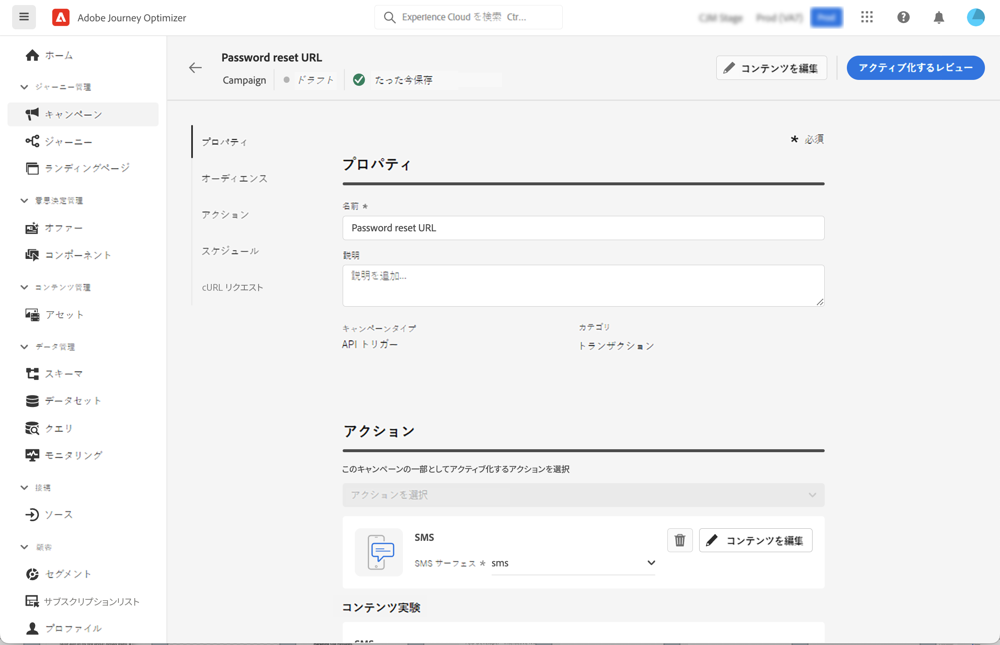

# API を使用したトリガーキャンペーン {#trigger-campaigns}

## API トリガーキャンペーンについて {#about}

を使用 [!DNL Journey Optimizer]を使用すると、キャンペーンを作成してから、 [インタラクティブメッセージ実行 REST API](https://developer.adobe.com/journey-optimizer-apis/references/messaging/#tag/execution). これにより、運用上およびトランザクション上の様々なニーズに対応できます。例えば、パスワードのリセットや OTP トークンなどです。

これをおこなうには、まずJourney Optimizerで API トリガーキャンペーンを作成し、次に API 呼び出しを通じて実行を開始する必要があります。

API トリガーキャンペーンで使用できるチャネルは、E メール、SMS、プッシュメッセージです。

>[!NOTE]
>
>インタラクティブメッセージ実行 API は現在ベータ版です。通知なしに頻繁に更新される可能性があります。

## API トリガーキャンペーンの作成 {#create}

API トリガーキャンペーンを作成するプロセスは、API ペイロードで実行されるオーディエンスの選択を除き、スケジュール済みキャンペーンと同じです。 キャンペーンの作成方法について詳しくは、 [この節](create-campaign.md).

API トリガーキャンペーンを作成するには、次の手順に従います。

1. 新しいキャンペーンを作成し、 **[!UICONTROL API トリガー]** タイプ。

1. メッセージの送信に使用するチャネルとメッセージ表面を選択し、「 **[!UICONTROL 作成]**.

   

1. キャンペーンのタイトルと説明を指定し、送信するメッセージを設定します。

   

   >[!NOTE]
   >
   >追加のデータを API ペイロードに渡して、メッセージをパーソナライズする際に利用できます。 [詳細情報](#contextual)

1. セグメントから個人を識別するために使用する名前空間を指定します。

1. キャンペーンの開始日と終了日を設定します。

   キャンペーンの特定の開始日や終了日を設定した場合、そのキャンペーンはこれらの日付以外では実行されず、キャンペーンが API によってトリガーされると API 呼び出しは失敗します。

1. 内 **[!UICONTROL cURL リクエスト]** セクション、 **[!UICONTROL キャンペーン ID]** API ペイロードで使用する場合。

   

1. クリック **[!UICONTROL 有効化するレビュー]** キャンペーンが正しく設定されていることを確認するには、キャンペーンを有効化します。

## API でトリガーされるキャンペーンでのコンテキスト属性の使用 {#contextual}

API トリガーキャンペーンを使用すると、追加のデータを API ペイロードに渡し、キャンペーン内で使用してメッセージをパーソナライズできます。

この例では、顧客がパスワードをリセットし、サードパーティのツールで生成されるパスワードリセット URL を送信するとします。 API トリガーキャンペーンを使用すると、生成された URL を API ペイロードに渡し、キャンペーンに活用してメッセージに追加できます。

>[!NOTE]
>
>プロファイル対応のイベントとは異なり、REST API で渡されるコンテキストデータは、1 回限りの通信に使用され、プロファイルに対しては保存されません。 見つからなかった場合、最大で、プロファイルは名前空間の詳細を使用して作成されます。

これらのデータをキャンペーンで使用するには、API ペイロードに渡し、式エディターを使用してメッセージに追加する必要があります。 これをおこなうには、 `{{context.<contextualAttribute>}}` 構文、ここで `<contextualAttribute>` は、渡すデータを含む API ペイロード内の変数の名前と一致する必要があります。

この `{{context.<contextualAttribute>}}` 構文は String データ型にのみマッピングされます。

>[!IMPORTANT]
>
>この `context.system` 構文は、Adobe内部での使用のみに制限され、コンテキスト属性を渡すためには使用しないでください。
現時点では、左側のパネルメニューで使用できるコンテキスト属性はありません。 属性はパーソナライゼーション式に直接入力する必要がありますが、による確認はおこなわれません [!DNL Journey Optimizer].

## キャンペーンの実行 {#execute}

API トリガーキャンペーンを実行するには、まずその ID を取得し、それを API ペイロードに渡す必要があります。 これをおこなうには、キャンペーンを開き、 **[!UICONTROL cURL リクエスト]** 」セクションに入力します。

その後、この ID を API ペイロードに使用して、キャンペーンをトリガー化できます。 詳しくは、 [インタラクティブなメッセージ実行 API ドキュメント](https://developer.adobe.com/journey-optimizer-apis/references/messaging/#tag/execution) を参照してください。

>[!NOTE]
>
>キャンペーンの作成時に特定の開始日や終了日を設定している場合、これらの日付以外ではキャンペーンが実行されず、API 呼び出しは失敗します。

## その他のリソース

* [キャンペーンの基本を学ぶ](get-started-with-campaigns.md)
* [キャンペーンの作成](create-campaign.md)
* [キャンペーンの変更または停止](modify-stop-campaign.md)
* [キャンペーンのライブレポート](campaign-live-report.md)
* [キャンペーンのグローバルレポート](campaign-global-report.md)
