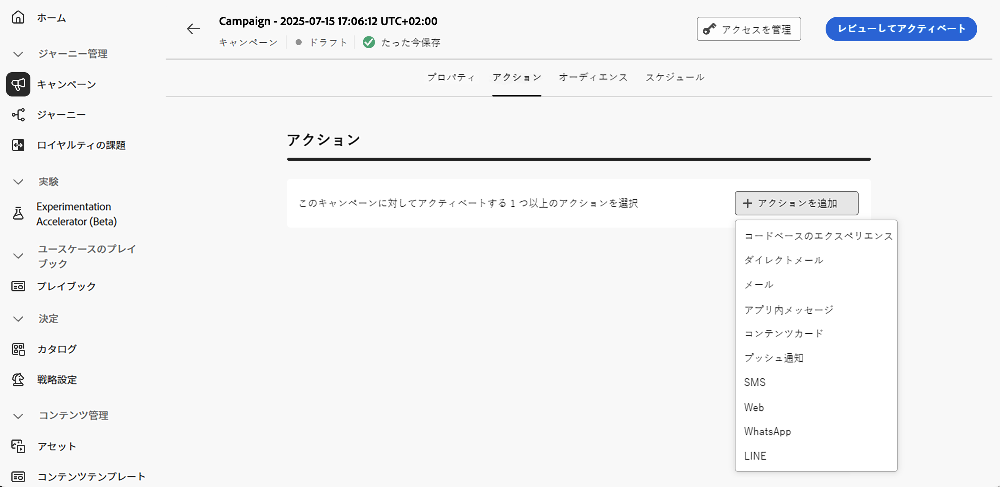
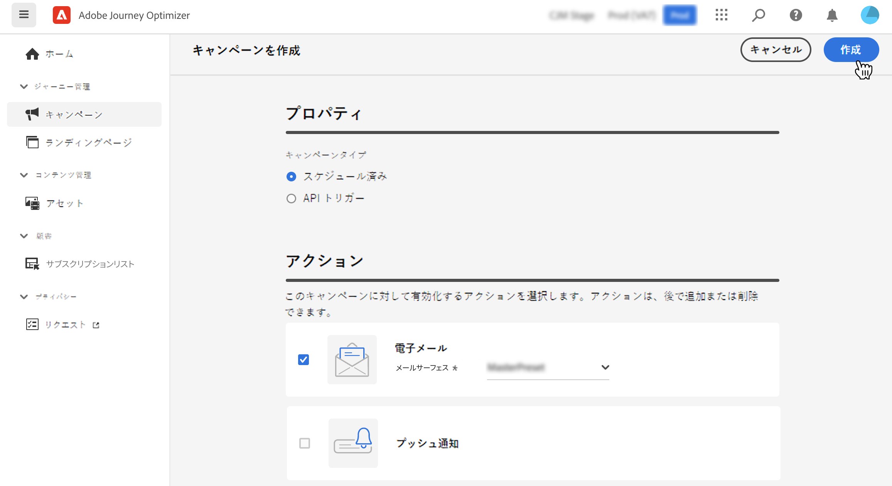
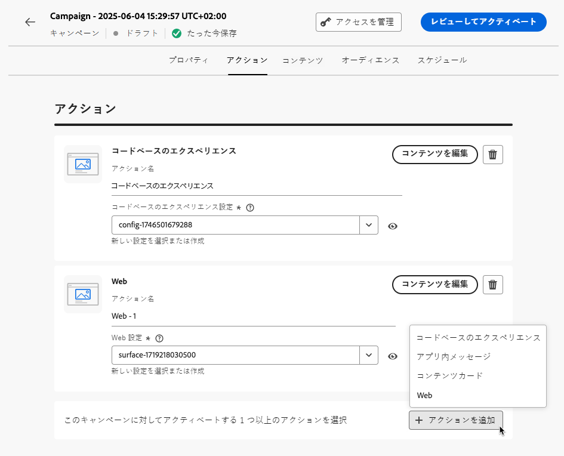

# キャンペーンアクションの設定 {#action-campaign-action}

「**[!UICONTROL アクション]**」タブを使用すると、メッセージのチャネル設定を選択し、トラッキング、コンテンツ実験、多言語コンテンツなどの追加設定を指定できます。

1. **チャネルを選択**

   「**[!UICONTROL アクション]**」タブに移動し、「**[!UICONTROL アクションを追加]**」ボタンをクリックして、通信チャネルを選択します。

   

   >[!NOTE]
   >
   >サポートされるチャネルの詳細については、この節の表 [ ジャーニーとキャンペーンのチャネル ](../channels/gs-channels.md#channels) を参照してください。
   >
   >使用できるチャネルは、ライセンスモデルとアドオンによって異なります。

   インバウンドチャネル（コードベースのエクスペリエンス、アプリ内メッセージ、コンテンツカードまたは web アクション）を選択した場合は、さらにインバウンドアクションを追加できます（1 つのキャンペーンで合計最大 10 個のアクションを追加できます）。[詳細情報](#multi-action)

1. **チャネル設定を選択**

   設定は、[システム管理者](../start/path/administrator.md)によって定義されます。ヘッダーパラメーター、サブドメイン、モバイルアプリなど、メッセージを送信するすべての技術的なパラメーターが含まれています。[詳しくは、チャネル設定の指定方法を参照してください](../configuration/channel-surfaces.md)。

   

1. **最適化を活用**

   「**[!UICONTROL 最適化]**」セクションを使用すると、コンテンツ実験を実行したり、ターゲティングルールを活用したり、実験とターゲティングの両方の高度な組み合わせを使用したりすることができます。これらの様々なオプションと実行する手順について詳しくは、[この節](campaigns-message-optimization.md)を参照してください。
<!--
1. **Create a content experiment**

    Use the **[!UICONTROL Content experiment]** section to define multiple delivery treatments in order to measure which one performs best for your target audience. Click the **[!UICONTROL Create experiment]** button then follow the steps detailed in this section: [Create a content experiment](../content-management/content-experiment.md).-->

1. **多言語コンテンツを追加**

   「**[!UICONTROL 言語]**」セクションを使用すると、キャンペーン内の複数の言語でコンテンツを作成できます。これを行うには、「**[!UICONTROL 言語を追加]**」ボタンをクリックし、目的の&#x200B;**[!UICONTROL 言語設定]**&#x200B;を選択します。多言語機能の設定方法と使用方法について詳しくは、[この節](../content-management/multilingual-gs.md)を参照してください。

選択した通信チャネルに応じて、追加の設定を使用できます。詳しくは、以下の節を展開してください。

+++**キャッピングルールの適用**（メール、ダイレクトメール、プッシュ、SMS）

**[!UICONTROL ビジネスルール]**&#x200B;ドロップダウンリストで、キャッピングルールをキャンペーンに適用するルールセットを選択します。チャネルルールセットを活用すると、通信タイプ別のフリークエンシーキャップを設定し、類似したメッセージで顧客に過剰な負荷がかかるのを防ぐことができます。[詳しくは、ルールセットの操作方法を参照してください](../conflict-prioritization/rule-sets.md)。

+++

+++**エンゲージメントのトラッキング**（メール、SMS）。

「**[!UICONTROL アクショントラッキング]**」セクションを使用すると、受信者がメールや SMS の配信にどのように反応したかを追跡できます。キャンペーンが実行されると、キャンペーンレポートからトラッキング結果にアクセスできるようになります。[詳しくは、キャンペーンレポートを参照してください](../reports/campaign-global-report-cja.md)

+++

+++**迅速配信モードを有効にする**（プッシュ）。

迅速配信モードは、キャンペーンを通じて大量のプッシュメッセージを非常に高速に送信できるようにする [!DNL Journey Optimizer] アドオンです。迅速配信は、メッセージ配信の遅延がビジネス上の重要な問題になる状況で、携帯電話に緊急のプッシュアラートを送信するときに使用します（ニュースチャネルアプリをインストールしたユーザーにニュース速報を配信するなど）。プッシュ通知の迅速配信モードを有効にする方法について詳しくは、[このページ](../push/create-push.md#rapid-delivery)を参照してください。

迅速配信モードを使用する際のパフォーマンスについて詳しくは、[Adobe Journey Optimizer 製品説明](https://helpx.adobe.com/jp/legal/product-descriptions/adobe-journey-optimizer.html){target="_blank"}を参照してください。

+++

+++**優先度スコアの割り当て**（Web、アプリ内、コードベース）

キャンペーンに優先度スコアを割り当てると、フリークエンシーキャップなどの強制的な制約がある場合に、インバウンドキャンペーンを優先順位付けできます。数値（0～100）を入力します。数値が大きいほど優先度が高くなります。[詳しくは、ジャーニーとキャンペーンに優先度スコアを割り当てる方法を参照してください](../conflict-prioritization/priority-scores.md)。

+++

+++**追加の配信ルールの設定**（コンテンツカード）

コンテンツカードキャンペーンの場合は、追加の配信ルールを有効にして、メッセージをトリガーするイベントと条件を選択できます。[詳しくは、コンテンツカードの作成方法を参照してください](../content-card/create-content-card.md)。

+++

+++**トリガーの定義**（アプリ内）

アプリ内メッセージの場合は、「**[!UICONTROL トリガーを編集]**」ボタンを使用して、メッセージをトリガーするイベントと条件を選択できます。[アプリ内メッセージの作成方法の詳細情報](../in-app/create-in-app.md)

+++

## 複数のインバウンドアクションを追加 {#multi-action}

>[!CONTEXTUALHELP]
>id="ajo_multi_action"
>title="複数のインバウンドアクションを追加"
>abstract="1 つのキャンペーン内で複数のインバウンドアクションを選択できます。この機能により、複数のコードベースのエクスペリエンス、アプリ内メッセージ、コンテンツカード、web アクションを、各アクションに特定のコンテンツを含めて、同時に異なる場所に配信できます。"

キャンペーンオーケストレーションの簡素化に、1 つのキャンペーン内に複数のインバウンドアクションを定義し、各アクションに特定のコンテンツを含めることができます。

>[!NOTE]
>
>この処理能力は、インバウンドチャネルでのみ使用できます。現在、メールなどのアウトバウンドチャネルはサポートされていません。

この処理能力により、複数のキャンペーンを作成する必要なく、様々なコードベースのエクスペリエンス、アプリ内メッセージ、コンテンツカード、web アクションを同時に異なる場所に配信できます。これにより、すべてのデータが 1 つのキャンペーンに統合されるので、キャンペーンのデプロイメントが容易になり、レポートをよりスムーズに行うことができます。

例えば、コンテンツが少し異なる複数のエンドポイントに、コードベースのエクスペリエンスを送信できます。これを行うには、同じキャンペーン内に、それぞれ異なるエンドポイント設定を持つ複数のコードベースのアクションを作成します。

キャンペーンで複数のインバウンドアクションを定義するには、次の手順に従います。

1. 「**[!UICONTROL アクション]**」セクションからインバウンドアクション（**コードベースのエクスペリエンス**、**アプリ内メッセージ**、**コンテンツカード**、または **web**）を選択します。

1. チャネル設定を選択し、そのアクションの特定のコンテンツを定義します。

1. 「**[!UICONTROL アクションを追加]**」ボタンを使用して、ドロップダウンリストから別のインバウンドアクションを選択します。

   {width="80%"}

1. 同様の手順を実行して、さらにアクションを追加します。キャンペーンには、最大 10 個のインバウンドアクションを追加できます。

キャンペーンが[ライブ](review-activate-campaign.md)になると、すべてのアクションが同時にアクティブ化されます。

## 次の手順 {#next}

キャンペーンアクションの準備が整ったら、このコンテンツを設計できます。[詳細情報](campaign-content.md)
