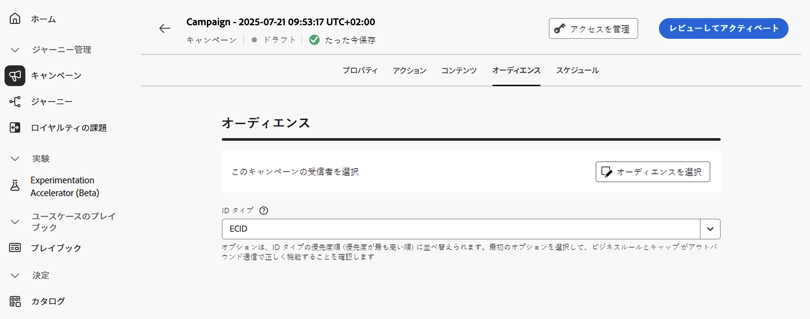

# アクションキャンペーンオーディエンスの定義 {#action-campaign-audience}

「**[!UICONTROL オーディエンス]**」タブを使用して、キャンペーンオーディエンスを定義します。

1. **オーディエンスを選択**

   マーケティングキャンペーンの場合は、「**[!UICONTROL オーディエンスを選択]**」ボタンをクリックして、使用できる Adobe Experience Platform オーディエンスのリストを表示します。[詳しくは、オーディエンスについて参照してください](../audience/about-audiences.md)。

   >[!IMPORTANT]
   >
   >[オーディエンス構成](../audience/get-started-audience-orchestration.md)からのオーディエンスおよび属性は現在、Healthcare Shield または Privacy and Security Shield では使用できません。

1. **ID タイプを選択**

   「**[!UICONTROL ID タイプ]**」フィールドで、選択したオーディエンスから個人を識別するために使用するキーのタイプを選択します。既存の ID タイプを使用することも、Adobe Experience Platform ID サービスを使用して新しい ID タイプを作成することもできます。標準 ID 名前空間について詳しくは、[このページ](https://experienceleague.adobe.com/ja/docs/experience-platform/identity/features/namespaces#standard){target="_blank"}を参照してください。

   1 つのキャンペーンで使用できる ID タイプは 1 つだけです。様々な ID の中から選択した ID タイプを持たないセグメントに属する個人は、キャンペーンのターゲットにすることができません。ID タイプと名前空間について詳しくは、[Adobe Experience Platform ドキュメント](https://experienceleague.adobe.com/docs/experience-platform/identity/home.html?lang=ja){target="_blank"}を参照してください。

## 次の手順 {#next}

アクションキャンペーンのオーディエンスの準備が整ったら、キャンペーンをスケジュールできます。[詳細情報](campaign-schedule.md)
