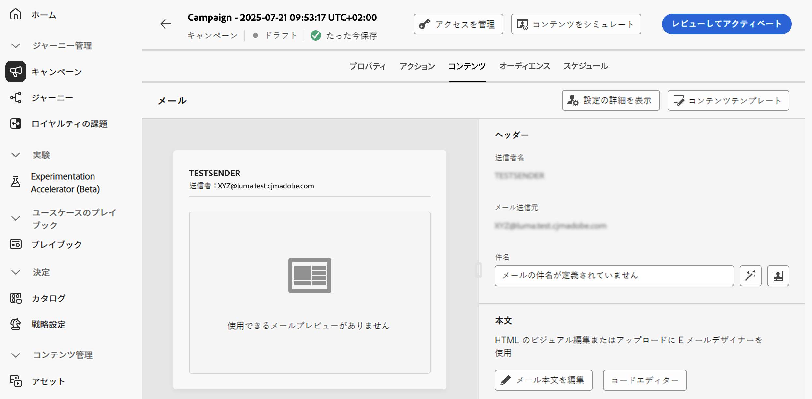
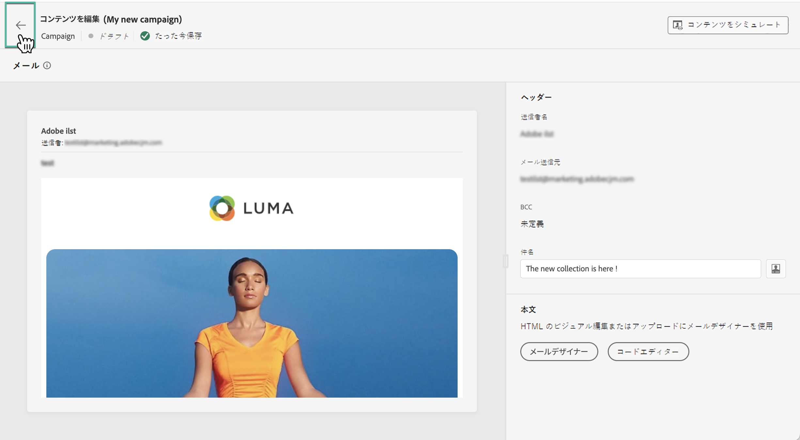

# アクションキャンペーンコンテンツの編集 {#action-campaign-content}

メッセージコンテンツを設定するには、「**[!UICONTROL コンテンツ]**」タブに移動するか、「**[!UICONTROL コンテンツを編集]**」ボタンをクリックします。

## コンテンツのデザイン

コンテンツの作成プロセスは、選択したチャネルによって異なります。 メッセージコンテンツを作成する詳細な手順については、次のページを参照してください。

<table style="table-layout:fixed"><tr style="border: 0;">
<td>

<a href="../email/create-email.md"><strong>メール</strong></a>
</td>
<td>

<a href="../sms/create-sms.md"><strong>SMS</strong></a>
</td>
<td>

<a href="../push/create-push.md"><strong>プッシュ通知</strong></a>
</td>
<td>

<a href="../direct-mail/create-direct-mail.md"><strong>ダイレクトメール</strong></a>
</td>
</tr></table>

<table style="table-layout:fixed"><tr style="border: 0;">
<td>

<a href="../in-app/create-in-app.md"><strong>アプリ内</strong></a>
</td>
<td>

<a href="../web/create-web.md"><strong>Web</strong></a>
</td>
<td>

<a href="../code-based/create-code-based.md"><strong>コードベースのエクスペリエンス</strong></a>
</td>
<td>

<a href="../content-card/create-content-card.md"><strong>コンテンツカード</strong></a>
</td>
</tr></table>

## コンテンツのテストとチェック

コンテンツを定義したら、「**[!UICONTROL コンテンツをシミュレート]**」ボタンを使用して、CSV／JSON ファイルからアップロードした、または手動で追加したテストプロファイルやサンプル入力データを使用して、そのコンテンツをプレビューおよびテストします。[コンテンツのプレビューとテストの方法について学ぶ](../content-management/preview-test.md)

キャンペーン作成画面に戻るには、左向き矢印をクリックします。

## 次の手順 {#next}

アクションキャンペーンのコンテンツの準備が整ったら、キャンペーンオーディエンスを定義できます。 [詳細情報](campaign-audience.md)
