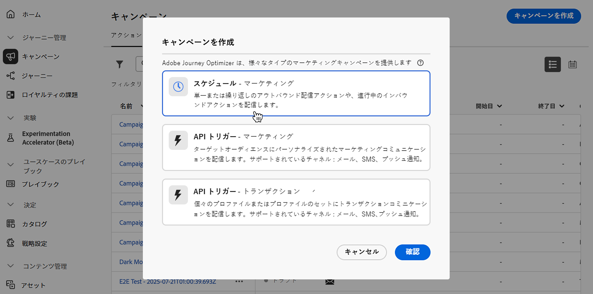

# アクションキャンペーンのプロパティの定義 {#action-campaign-properties}

>[!BEGINSHADEBOX]

**このページ：** アクション キャンペーンを作成し、名前、説明、タグ、アクセス ラベルなどのコア プロパティを定義して、キャンペーンを設定する前にキャンペーンへのアクセスを識別、整理、制御できるようにします。

>[!ENDSHADEBOX]

アクションキャンペーンを作成してプロパティを定義するには、次の手順に従います。

1. **[!UICONTROL キャンペーン]**&#x200B;メニューに移動し、「**[!UICONTROL アクション]**」タブを選択します。

1. 「**[!UICONTROL キャンペーンを作成]**」ボタンをクリックし、「**[!UICONTROL スケジュール済み - マーケティング]**」キャンペーンタイプを選択します。

   

1. 「**[!UICONTROL プロパティ]**」タブで、キャンペーンの名前と説明を入力します。

   

1. 「**タグ**」フィールドを使用して、Adobe Experience Platform 統合タグをキャンペーンに割り当てます。 これにより、キャンペーンを簡単に分類し、キャンペーンリストからの検索を改善できます。 [詳しくは、タグの操作方法を参照してください](../start/search-filter-categorize.md#tags)。

1. アクセスラベルに基づいて、このキャンペーンへのアクセスを制限できます。 アクセス制限を追加するには、このページの上部にある「**[!UICONTROL アクセスを管理]**」ボタンを参照します。 権限のあるラベルのみを選択します。 [詳しくは、オブジェクトレベルのアクセス制御を参照してください](../administration/object-based-access.md)。

## 次の手順 {#next}

アクションキャンペーンを作成および設定したら、このアクションを設定できます。 [詳細情報](campaign-action.md)
