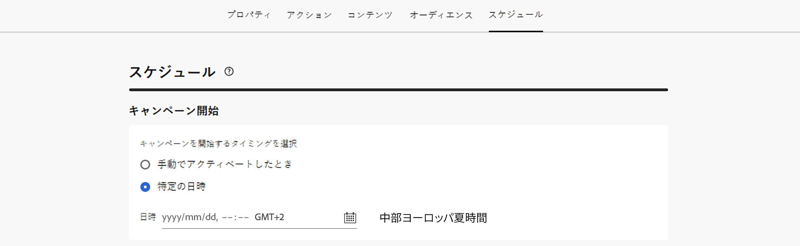
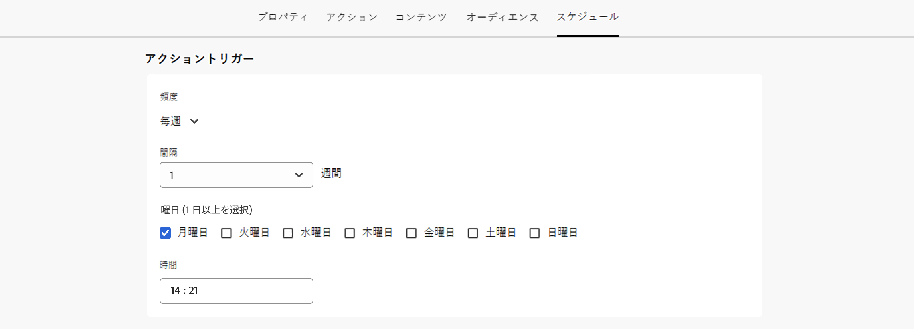
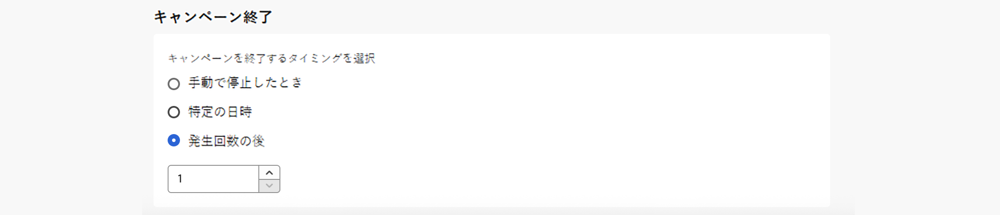
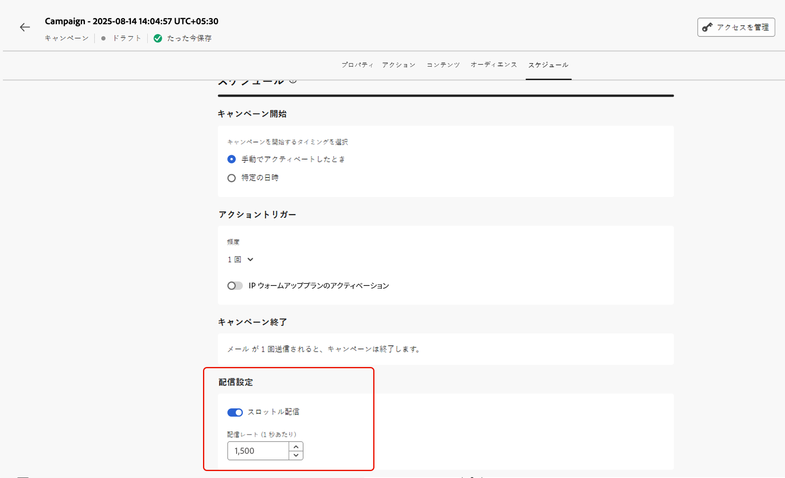

# アクションキャンペーンのスケジュール {#action-campaign-schedule}

「**[!UICONTROL スケジュール]**」タブを使用して、キャンペーンオーディエンスを定義します。

## キャンペーン開始日を設定

デフォルトでは、アクションキャンペーンは手動でアクティブ化すると開始され、メッセージが 1 回送信されるとすぐに終了します。

アクティブ化直後にキャンペーンを実行しない場合は、「**[!UICONTROL キャンペーン開始]**」セクションでメッセージを送信する日時を指定することができます。

>[!NOTE]
>
>[!DNL Adobe Journey Optimizer] でキャンペーンをスケジュールする場合は、開始日時が目的の最初の配信に合っていることを確認します。繰り返しキャンペーンで、最初にスケジュールした時間が既に過ぎている場合、キャンペーンは繰り返しルールに従って、次に使用可能な時間スロットに繰り越されます。

## 実行頻度の設定

**メール**、**SMS** および **プッシュ通知** アクションの場合、キャンペーンのメッセージを送信する頻度を定義できます。 これを行うには、キャンペーン作成画面にある「**[!UICONTROL アクショントリガー]**」オプションを使用して、キャンペーンの実行頻度を日単位、週単位または月単位のいずれにするかを指定します。

>[!NOTE]
>
>**メール** アクションの場合は、特定の IP ウォームアッププランのアクティベーションキャンペーンを作成できます。 キャンペーンスケジュールが、関連付けられる IP ウォームアッププランによって実行されます。つまり、スケジュールはキャンペーン自体で定義されなくなります。[詳しくは、IP ウォームアップキャンペーンの作成方法を参照してください](../configuration/ip-warmup-campaign.md)。

## 終了日を設定

「**[!UICONTROL キャンペーン終了]**」セクションでは、キャンペーンの実行を停止するタイミングを指定できます。 指定した日付以外では、キャンペーンは実行されません。

## レート制御の設定

[!DNL Journey Optimizer] を使用すると、アウトバウンドアクション（メール、SMS、プッシュ通知）のレート制御を有効にすることができます。

この機能は、ランディングページやカスタマーケアプラットフォームなどのダウンストリームシステムの過負荷を防ぐのに特に役立ちます。例えば、ダウンストリームシステムに負担をかけずに安定した配信を確保するために、1 秒あたり 165 メッセージのレート制限を設定できます。

レート制御を設定するには、「**[!UICONTROL 配信設定]**」セクションで「**[!UICONTROL 配信をスロットル]**」オプションを有効にし、1 秒あたりの目的の&#x200B;**[!UICONTROL 配信レート]**&#x200B;を指定します。

* サポートされる最小配信レート：1 秒あたり 1 件。
* サポートされる最大配信レート：「配信をスロットル」オプションが有効になっている場合、1 秒あたり 2000 件。

>[!IMPORTANT]
>
>配信レートを設定する場合、キャンペーンオーディエンスが実行できる最大期間は 12 時間です。配信レートが 12 時間以内にすべてのオーディエンスにメッセージを送信できない値に設定されている場合、残りのプロファイルはキャンペーンから除外されます。これらの除外されたプロファイルの数は、キャンペーンレポートで確認できます。

## 次の手順 {#next}

キャンペーンスケジュールの準備が整ったら、キャンペーンをレビューしてアクティブ化できます。[詳細情報](review-activate-campaign.md)
