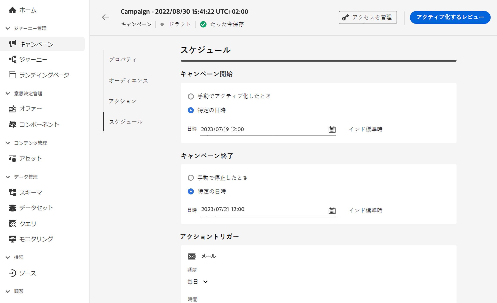

# アクションキャンペーンのスケジュール {#action-campaign-schedule}

「**[!UICONTROL スケジュール]**」タブを使用して、キャンペーンオーディエンスを定義します。

デフォルトでは、アクションキャンペーンは手動でアクティブ化した後に開始され、メッセージが 1 回送信された直後に終了します。アクティブ化直後にキャンペーンを実行しない場合は、「**[!UICONTROL キャンペーン開始]**」オプションを使用して、メッセージを送信する日時を指定できます。

「**[!UICONTROL キャンペーン終了]**」オプションを使用すると、キャンペーンの実行を停止するタイミングを指定できます。指定した日付以外では、キャンペーンは実行されません。

>[!NOTE]
>
>[!DNL Adobe Journey Optimizer] でキャンペーンをスケジュールする場合は、開始日時が目的の最初の配信に合っていることを確認します。繰り返しキャンペーンで、最初にスケジュールした時間が既に過ぎている場合、キャンペーンは繰り返しルールに従って、次に使用可能な時間スロットに繰り越されます。

キャンペーンチャネルに基づいて、追加のスケジュールオプションを使用できます。

* **頻度**（メール、SMS、プッシュアクション）

  キャンペーンのメッセージを送信する頻度を定義できます。これを行うには、キャンペーンの作成画面にある「**[!UICONTROL アクショントリガー]**」オプションを使用して、キャンペーンの実行頻度を日単位、週単位または月単位のいずれにするかを指定します。

* **IP ウォームアッププランのアクティベーション**（メール）

  メールキャンペーンの場合は、特定の IP ウォームアッププランのアクティベーションキャンペーンを作成できます。キャンペーンスケジュールが、関連付けられる IP ウォームアッププランによって実行されます。つまり、スケジュールはキャンペーン自体で定義されなくなります。[詳しくは、IP ウォームアップキャンペーンの作成方法を参照してください](../configuration/ip-warmup-campaign.md)。

## 次の手順 {#next}

キャンペーンスケジュールの準備が整ったら、キャンペーンをレビューしてアクティブ化できます。[詳細情報](review-activate-campaign.md)
