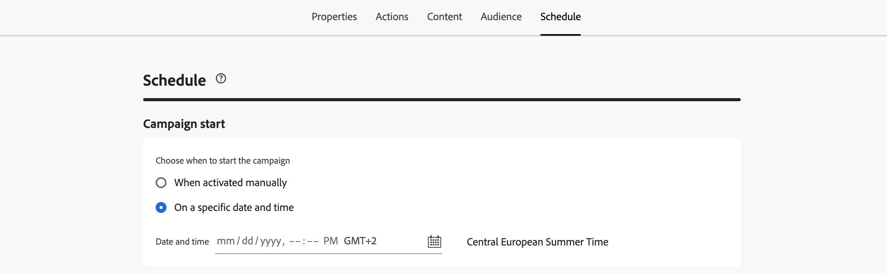

# アクションキャンペーンのスケジュール {#action-campaign-schedule}

「**[!UICONTROL スケジュール]**」タブを使用して、キャンペーンオーディエンスを定義します。

## キャンペーン開始日の設定

デフォルトでは、アクションキャンペーンは手動でアクティブ化した後に開始され、メッセージが 1 回送信された直後に終了します。アクティブ化直後にキャンペーンを実行しない場合は、「**[!UICONTROL キャンペーン開始]**」セクションで、メッセージを送信する日時を指定できます。

[!DNL Adobe Journey Optimizer] でキャンペーンをスケジュールする場合は、開始日時が目的の最初の配信に合っていることを確認します。繰り返しキャンペーンで、最初にスケジュールした時間が既に過ぎている場合、キャンペーンは繰り返しルールに従って、次に使用可能な時間スロットに繰り越されます。

## 受信者の現地時間に送信 {#profile-timezone}

>[!CONTEXTUALHELP]
>id="ajo_campaigns_schedule_profile_timezone"
>title="Use profile timezone"
>abstract="各受信者のプロファイルタイムゾーンに基づいてメッセージを送信します。 すべての受信者は、地理的な場所に関係なく、同じローカル時間にメッセージを受信します。 システムはAdobe Experience Platform プロファイルの「timeZone」フィールドを使用し、キャンペーン作成者のタイムゾーンをフォールバックとして使用します。"

キャンペーンを特定の日時にスケジュールする場合に、各受信者のプロファイルのタイムゾーンに基づいてメッセージを送信するように選択できます。 これにより、地理的な場所に関係なく、すべての受信者が同じローカル時間にメッセージを受信するようになります。

例えば、プロファイルタイムゾーンを使用して午前 9 時に送信するようにキャンペーンをスケジュールした場合、ニューヨーク（ET）の受信者は午前 9 時（ET）にキャンペーンを受信し、ロサンゼルス（PT）の受信者は午前 9 時（PT）にキャンペーンを受信します。

>[!AVAILABILITY]
>
>この機能は限定提供（LA）です。 アクセス権を取得するには、アドビ担当者にお問い合わせください。
>
>プロファイルタイムゾーンを使用したスケジュールは、メール、プッシュ、SMS、WhatsApp、LINE のアウトバウンドチャネルでのみ使用できます。

プロファイルタイムゾーンスケジュールを有効にするには：

1. 「**[!UICONTROL キャンペーン開始]**」セクションで、メッセージを送信する日時を指定します。

1. 「**[!UICONTROL プロファイルタイムゾーンを使用]**」オプションを有効にします。

   

**仕組み：**

システムは、各受信者のAdobe Experience Platform プロファイルの `profile.timeZone` フィールドを使用して、受信者のローカルタイムゾーンを決定します。 プロファイルにタイムゾーン値がない場合、システムはキャンペーンが作成されたタイムゾーンをフォールバックとして使用します。

メッセージがすべてのタイムゾーンで配信されている間、キャンペーンは **ライブ** ステータスのままです。 すべてのタイムゾーンが処理されると、キャンペーンのステータスが **完了** に変わります。

**サポートされるタイムゾーン識別子：**

Journey Optimizerは、標準の IANA タイムゾーン識別子に対して `profile.timeZone` 値を検証します。 識別子は大文字と小文字が区別され、公式の IANA 命名に一致する必要があります。 オフセットは、夏時間の規則と更新履歴により、時間の経過とともに変化する場合があります。 識別子の公式リストについては、[IANA タイムゾーンデータベース &#x200B;](https://www.iana.org/time-zones){_blank} を参照してください。

## 実行頻度の設定

**メール**、**SMS**、**プッシュ通知**&#x200B;の各アクションでは、キャンペーンのメッセージを送信する頻度を定義できます。これを行うには、キャンペーン作成画面にある「**[!UICONTROL アクショントリガー]**」オプションを使用して、キャンペーンの実行頻度を日単位、週単位または月単位のいずれにするかを指定します。

>[!NOTE]
>
>**メール**&#x200B;アクションの場合は、特定の IP ウォームアッププランのアクティベーションキャンペーンを作成できます。キャンペーンスケジュールが、関連付けられる IP ウォームアッププランによって実行されます。つまり、スケジュールはキャンペーン自体で定義されなくなります。[詳しくは、IP ウォームアップキャンペーンの作成方法を参照してください](../configuration/ip-warmup-campaign.md)。

## 終了日の設定

「**[!UICONTROL キャンペーン終了]**」オプションを使用すると、キャンペーンの実行を停止するタイミングを指定できます。指定した日付以外では、キャンペーンは実行されません。

## レート制御の設定

[!DNL Journey Optimizer] を使用すると、アウトバウンドアクション（メール、SMS、プッシュ通知）のレート制御を有効にすることができます。

この機能は、ランディングページやカスタマーケアプラットフォームなどのダウンストリームシステムの過負荷を防ぐのに特に役立ちます。例えば、ダウンストリームシステムに負担をかけずに安定した配信を確保するために、1 秒あたり 165 メッセージのレート制限を設定できます。

レート制御を設定するには、「**[!UICONTROL 配信設定]**」セクションで「**[!UICONTROL 配信をスロットル]**」オプションを有効にし、1 秒あたりの目的の&#x200B;**[!UICONTROL 配信レート]**&#x200B;を指定します。

* サポートされる最小配信レート：1 秒あたり 1 件。
* サポートされる最大配信レート：「配信をスロットル」オプションが有効になっている場合、1 秒あたり 2000 件。

>[!IMPORTANT]
>
>配信レートを設定する場合、キャンペーンオーディエンスが実行できる最大期間は 12 時間です。配信レートが 12 時間以内にすべてのオーディエンスにメッセージを送信できない値に設定されている場合、残りのプロファイルはキャンペーンから除外されます。これらの除外されたプロファイルの数は、キャンペーンレポートで確認できます。

## 次の手順 {#next}

キャンペーンスケジュールの準備が整ったら、キャンペーンをレビューしてアクティブ化できます。[詳細情報](review-activate-campaign.md)
