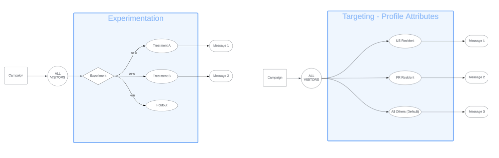

# キャンペーンとジャーニーの最適化 {#message-optimization}

最適化により、パーソナライズおよび最適化されたコンテンツをオーディエンスに配信するためのツールが提供され、非常に<!--based on marketer-defined advanced decision configurations. This ensures that the right message reaches the right audience at the right time in order to maximize the effectiveness of your campaigns. (Removed for now as Decisioning is not yet supported)-->効果的なジャーニーとキャンペーンにつながる最大限のエンゲージメントと成功を確保<!--customized and -->できます。

最適化では、次のことができます。

* [ターゲティング](#targeting)ルールを活用
* [コンテンツ実験](#experimentation)を実行
* 1 つのキャンペーン内で実験とターゲティングの両方の[高度な組み合わせ](#combination)を使用

ジャーニーやキャンペーンがライブになると、プロファイルは定義済みの条件に照らして評価され、一致条件に基づいて、ジャーニー／キャンペーンからの適切なエクスペリエンスまたはコンテンツが配信されます。

実験とターゲティングの違いの概要を次に示します。

* 実験は、トラフィックの配分に基づいてコンテンツを配信する際に、ランダムな分割で構成されます。
* ターゲティングでは、決定論的な手法を使用して、ユーザープロファイル、オーディエンスメンバーシップ、コンテキストベースのルールに基づいてコンテンツを配信します。

{width="110%" zoomable="yes"}

➡️ [キャンペーンでの最適化について詳しくは、このビデオをご覧ください](#video)

## ターゲティングを活用 {#targeting}

>[!CONTEXTUALHELP]
>id="ajo_content_targeting_fallback"
>title="フォールバックコンテンツとは"
>abstract="フォールバックコンテンツを使用すると、ターゲティングルールが選定されていない場合に、オーディエンスはデフォルトコンテンツを受信できます。 このオプションを選択しない場合、上記で定義したターゲティングルールに選定されていないオーディエンスはコンテンツを受信しません。"

ターゲティングでは、ユーザープロファイル属性またはコンテキスト属性に基づいて、特定のオーディエンスセグメントにパーソナライズされたコンテンツを配信します。

メッセージのコンテンツをランダムに割り当てる実験とは異なり、ターゲティングは、コンテンツを適切なオーディエンスに配信するという点で決定論的です。

ターゲティングでは、次に基づいて特定のルールを定義できます。

* **ユーザープロファイル属性**：場所（例：ジオターゲティング）、年齢、好みなど。例えば、米国のユーザーには「ゴールデンゲート」のプロモーションが表示され、フランスのユーザーには「エッフェル塔」のプロモーションが表示されます。

* **コンテキストデータ**：デバイスタイプ（例：デバイスターゲティング）、時間帯、セッションの詳細など。例えば、デスクトップユーザーはデスクトップ向けに最適化されたコンテンツを受信しますが、モバイルユーザーはモバイル向けに最適化されたコンテンツを受信します。

* **オーディエンス**：特定のオーディエンスメンバーシップを持つプロファイルを含めたり除外したりするために使用できます。

ターゲティングを設定するには、次の手順に従います。

1. [ジャーニー](../building-journeys/journey-gs.md#jo-build)または[キャンペーン](../campaigns/create-campaign.md)を作成します。

   >[!NOTE]
   >
   >ジャーニー中の場合は、**[!UICONTROL アクション]**&#x200B;アクティビティを追加し、チャネルアクティビティを選択して、「**[!UICONTROL アクションを設定]**」を選択します。[詳細情報](../building-journeys/journey-action.md#add-action)

1. 「**[!UICONTROL アクション]**」タブから、1 つ以上のアクションを選択します。

1. 「**[!UICONTROL 最適化]**」セクションで、「**[!UICONTROL ターゲティングルールを作成]**」を選択します。

   {width=85%}

1. **[!UICONTROL ルールを作成]**／**[!UICONTROL 新規作成]**&#x200B;をクリックし、ルールビルダーを使用して外出先で条件を定義します。

   {width=100%}

   例えば、米国居住者向けのルール、フランス居住者向けのルール、インド居住者向けのルールを定義します。

   {width=85%}

1. また、**[!UICONTROL ルールを作成]**／**[!UICONTROL ルールを選択]**&#x200B;をクリックして、**[!UICONTROL ルール]**&#x200B;メニューから作成した既存のターゲティングルールを選択することもできます。[詳細情報](../experience-decisioning/rules.md)

   {width=70%}

   この場合、ルールを構成する数式がジャーニーやキャンペーンにシンプルにコピーされます。その後、**[!UICONTROL ルール]**&#x200B;メニューからそのルールを変更しても、ジャーニーやキャンペーンのコピーには影響しません。

   >[!AVAILABILITY]
   >
   >専用の [!DNL Journey Optimizer] メニューから[ターゲティングルールを作成](../experience-decisioning/rules.md#create)できるのは、現在、決定アドオン機能を購入した組織で、他の組織ではオンデマンドで使用できます（限定提供）。
   >
   >この機能は、すべての顧客に段階的にロールアウトされる予定です。それまでの間、アクセス権を取得するには、アドビ担当者にお問い合わせください。

1. ルールを追加したら、引き続き変更できます。 ルールビルダーを使用して外出先で更新するには「**[!UICONTROL インラインで編集]**」を選択し、別の既存のルールを選択するには「**[!UICONTROL ルールを選択]**」を選択します。

   {width=100%}

   >[!NOTE]
   >
   >ルールをインラインで編集しても、そのルールの元となる既存のルールには影響しません。

1. 必要に応じて、「**[!UICONTROL フォールバックコンテンツを有効にする]**」オプションを選択します。フォールバックコンテンツを使用すると、ターゲティングルールが選定されていない場合に、オーディエンスはデフォルトコンテンツを受信できます。

   >[!NOTE]
   >
   >このオプションを選択しない場合、上記で定義したターゲティングルールに選定されていないオーディエンスはコンテンツを受信しません。

1. ターゲティングルールの設定を保存します。

1. 「**[!UICONTROL アクション]**」タブに戻り、「**[!UICONTROL コンテンツを編集]**」を選択します。

1. ターゲティングルールの設定で定義した各グループに適切なコンテンツを設計します。

   {width=85%}

   この例では、米国居住者向けの特定のコンテンツ、フランス居住者向けの別のコンテンツ、インド居住者向けの別のコンテンツを設計します。

1. ジャーニーまたはキャンペーンを[アクティブ化](review-activate-campaign.md)します。

ジャーニー／キャンペーンがライブになると、米国居住者には特定のメッセージ、フランス居住者には異なるメッセージなど、各ターゲットにカスタマイズされたコンテンツが送信されます。

<!--Default content:

* If no targeting rules match, default content can be delivered.

* If default content is not enabled, passthrough behavior ensures lower-priority campaigns are evaluated.-->

## 実験を使用 {#experimentation}

実験により、複数のバージョンのコンテンツをテストし、事前定義済みの成功指標に基づいて最もパフォーマンスが高いバージョンを判断できます。

実験を設定するには、次の手順に従います。

キャンペーンで次のプロモーションメッセージをテストするとします。

* **処理 A**：「次回購入時に 20％オフ」
* **処理 B**：「50 ドルを超える注文で送料無料」
* **処理 C**：「10 ドルのギフトカードを入手」

実験を設定し、最も多くの購入を促すメッセージを特定するには、次の手順に従います。

1. [ジャーニー](../building-journeys/journey-gs.md#jo-build)または[キャンペーン](../campaigns/create-campaign.md)を作成します。

   >[!NOTE]
   >
   >ジャーニー中の場合は、**[!UICONTROL アクション]**&#x200B;アクティビティを追加し、チャネルアクティビティを選択して、「**[!UICONTROL アクションを設定]**」を選択します。[詳細情報](../building-journeys/journey-action.md#add-action)

1. 「**[!UICONTROL アクション]**」タブから、[コードベースのエクスペリエンス](../code-based/get-started-code-based.md)や[アプリ内](../../rp_landing_pages/in-app-landing-page.md)など、2 つのインバウンドアクションを選択します。

1. 「**[!UICONTROL 最適化]**」セクションで、「**[!UICONTROL 実験を作成]**」を選択します。

   {width=85%}

1. 必要に応じて、コンテンツ実験を設計および設定します。[詳細情報](../content-management/content-experiment.md)

   {width=85%}

   実験が定義されると、そのキャンペーンに、またはジャーニー&#x200B;**[!UICONTROL アクション]**&#x200B;アクティビティを通じて挿入されたすべてのアクションに適用され、すべてのサーフェスで同じお客様に同じオファーが表示されます。

   >[!NOTE]
   >
   >実験は、キャンペーンまたはジャーニーアクションに追加したすべてのアクションに適用されます。

1. ジャーニーまたはキャンペーンを[アクティブ化](review-activate-campaign.md)します。

ジャーニー／キャンペーンがライブになると、ユーザーには様々なコンテンツのバリエーションがランダムに割り当てられます。[!DNL Journey Optimizer] は、より多くの購入を推進したバリエーションを追跡し、実用的なインサイトを提供します。

[ジャーニー](../reports/journey-global-report-cja.md)と[キャンペーン](../reports/campaign-global-report-cja-experimentation.md)のレポートを使用してキャンペーンの成功を追跡します。<!--Link to Experimentation journey reportis missing-->

## ターゲティングと実験を組み合わせ {#combination}

Journey Optimizer では、単一のジャーニーまたはキャンペーン内でターゲティングと実験を組み合わせて、より高度な戦略を作成することもできます。

実際、ターゲティングを使用して複数のバリエーションを作成し、各バリアントに対して、実験を使用して各コンテンツをさらに最適化できます。これにより、実験が各ターゲティングルールに固有となり、複数のバリアントにまたがらないようにします。

例えば、米国のお客様に対しては「50％オフのプロモーション」と「50 ドルのギフトカード」を比較してテストし、ヨーロッパのお客様に対しては「50 ユーロを超える注文で送料無料」と「次回購入時に 20％オフ」などの異なるテストを実行できます。

ジャーニーまたはキャンペーンでターゲティングと実験の両方を組み合わせるには、次の手順に従います。

1. 複数のターゲティングルールを定義するジャーニーまたはキャンペーンを作成します。[詳細情報](#targeting)

   {width=85%}

1. 最初のターゲティングルールの実験を作成します。

1. 必要に応じて、コンテンツ実験を設計および設定します。[詳細情報](../content-management/content-experiment.md)

   {width=85%}

   実験を定義すると、最初のターゲティングルールにのみ適用されます。

1. 「**[!UICONTROL アクション]**」タブに戻り、「**[!UICONTROL コンテンツを編集]**」を選択します。

1. 最初のターゲティングルールで定義したグループに対して、実験の各バリアントに特定のコンテンツを定義できます。

   ジャーニーまたはキャンペーンに複数のインバウンドアクションを追加した場合、各アクションに同じターゲティングと実験の組み合わせが適用されます。 ただし、各アクションのバリアントごとに特定のコンテンツを定義する必要があります。

   {width=85%}

1. 他のターゲティングルールについても同様に進め、各バリアントに対応するコンテンツを設計します。

1. 変更を保存し、ジャーニーまたはキャンペーンを[アクティブ化](review-activate-campaign.md)します。

ジャーニー／キャンペーンがライブになると、各ターゲットグループのユーザーには、所属するグループに定義した様々なコンテンツのバリエーションがランダムに割り当てられます。

<!--
## Reporting on Message optimization

E.g. explaining how a marketer can look at the report to determine which treatment (e.g. which message content) is performing the best for the targeting audience
-->

## チュートリアルビデオ{#video}

アクションまたは API トリガーキャンペーンでメッセージの最適化を活用する方法について説明します。 サブオーディエンスをターゲットにする方法、場所ごとにメッセージのバリエーションを作成する方法、フォールバックコンテンツを有効にする方法、単一のキャンペーン内で複数の実験を実行する方法について説明します。また、このチュートリアルでは、メッセージの一貫性を維持しながらマルチチャネルキャンペーンを管理する方法についても説明します。

>[!VIDEO](https://video.tv.adobe.com/v/3470369?captions=jpn&quality=12)